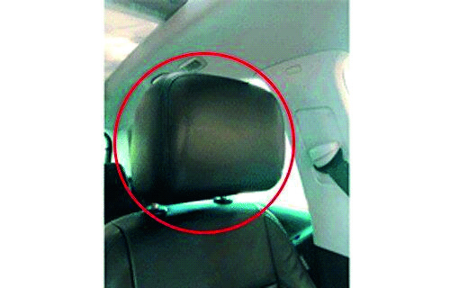

========== Question ==========  

### ¿Es obligatoria la utilización de este elemento en todos los asientos del automóvil?



A. Sí. Lo establece la normativa para evitar lesiones graves en la zona cervical.

B. No en todos, para los asientos traseros no cumplen ninguna función.

C. No, ya que no forma parte de la seguridad activa ni pasiva de los vehículos.  

========== Answer ==========  

A. Sí. Lo establece la normativa para evitar lesiones graves en la zona cervical.

========== Id ==========  
563

---

DECK INFO

TARGET DECK: Licencia::Preguntas::MLDCB - Licencia de conducir buenos aires - multi author::Part I - Introduccion::Chapter 1 - Bateria de preguntas

FILE TAGS: #Licencia::#MLDCB-Licencia-de-conducir-buenos-aires-multi-author::#Part-I-Introduccion::#Chapter-1-Bateria-de-preguntas::#563-Es-obligatoria-la-utilizaci-n-de-este-ele

Tags:

Reference:

Related:

```dataview
LIST
where file.name = this.file.name
```

QUESTION STATUS: Safe to store
