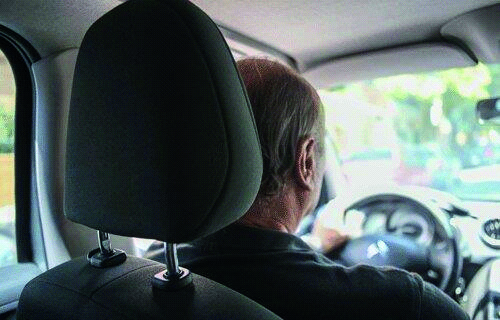

========== Question ==========  

### Frente a un siniestro, ¿qué puede evitar este elemento si está correctamente ubicado?



A. Nada en especial, dado que sólo es un elemento de confort.

B. Lesiones en la zona cervical.

C. Lesiones en el tórax.  

========== Answer ==========  

B. Lesiones en la zona cervical.

========== Id ==========  
564

---

DECK INFO

TARGET DECK: Licencia::Preguntas::MLDCB - Licencia de conducir buenos aires - multi author::Part I - Introduccion::Chapter 1 - Bateria de preguntas

FILE TAGS: #Licencia::#MLDCB-Licencia-de-conducir-buenos-aires-multi-author::#Part-I-Introduccion::#Chapter-1-Bateria-de-preguntas::#564-Frente-a-un-siniestro-qu-puede-evitar-e

Tags:

Reference:

Related:

```dataview
LIST
where file.name = this.file.name
```

QUESTION STATUS: Safe to store
