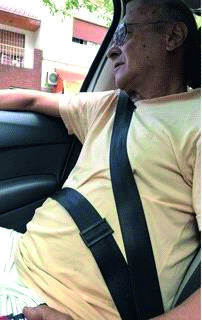

========== Question ==========  

### ¿Esta persona tiene el cinturón correctamente colocado?



A. No, porque pasa por el abdomen y debería hacerlo por los huesos de la cadera.

B. No, porque pasa por el abdomen y debería hacerlo por los muslos.

C. Sí, porque pasa por la clavícula y el abdomen.  

========== Answer ==========  

A. No, porque pasa por el abdomen y debería hacerlo por los huesos de la cadera.

========== Id ==========  
568

---

DECK INFO

TARGET DECK: Licencia::Preguntas::MLDCB - Licencia de conducir buenos aires - multi author::Part I - Introduccion::Chapter 1 - Bateria de preguntas

FILE TAGS: #Licencia::#MLDCB-Licencia-de-conducir-buenos-aires-multi-author::#Part-I-Introduccion::#Chapter-1-Bateria-de-preguntas::#568-Esta-persona-tiene-el-cintur-n-correctame

Tags:

Reference:

Related:

```dataview
LIST
where file.name = this.file.name
```

QUESTION STATUS: Safe to store
