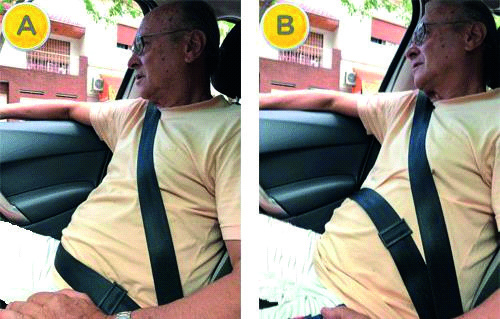

========== Question ==========  

### ¿Cuál es la correcta posición del uso de la banda inferior del cinturón de seguridad de tres puntas?



A. Opción A.

B. Opción B.

C. Ambas opciones, A y B, son correctas.  

========== Answer ==========  

A. Opción A.

========== Id ==========  
569

---

DECK INFO

TARGET DECK: Licencia::Preguntas::MLDCB - Licencia de conducir buenos aires - multi author::Part I - Introduccion::Chapter 1 - Bateria de preguntas

FILE TAGS: #Licencia::#MLDCB-Licencia-de-conducir-buenos-aires-multi-author::#Part-I-Introduccion::#Chapter-1-Bateria-de-preguntas::#569-Cu-l-es-la-correcta-posici-n-del-uso-de-l

Tags:

Reference:

Related:

```dataview
LIST
where file.name = this.file.name
```

QUESTION STATUS: Safe to store
