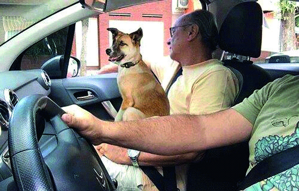

========== Question ==========  

### Los ocupantes de este vehículo ¿viajan de manera segura?



A. Sí, ya que las personas se encuentran con cinturón de seguridad.

B. No, ya que por normativa no está permitido trasladar mascotas en un automóvil particular.

C. No, ya que las mascotas deben ser transportadas en los asientos traseros sujetos con arnés o sistema de retención correspondiente.  

========== Answer ==========  

C. No, ya que las mascotas deben ser transportadas en los asientos traseros sujetos con arnés o sistema de retención correspondiente.

========== Id ==========  
570

---

DECK INFO

TARGET DECK: Licencia::Preguntas::MLDCB - Licencia de conducir buenos aires - multi author::Part I - Introduccion::Chapter 1 - Bateria de preguntas

FILE TAGS: #Licencia::#MLDCB-Licencia-de-conducir-buenos-aires-multi-author::#Part-I-Introduccion::#Chapter-1-Bateria-de-preguntas::#570-Los-ocupantes-de-este-veh-culo-viajan-de

Tags:

Reference:

Related:

```dataview
LIST
where file.name = this.file.name
```

QUESTION STATUS: Safe to store
