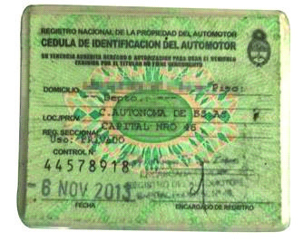

========== Question ==========  

### Con esta documentación, ¿quién está autorizado a conducir el vehículo?



A. Nadie, porque está vencida y debe renovarse.

B. Sólo el titular.

C. El titular y sus familiares directos, por tener el mismo apellido.  

========== Answer ==========  

A. Nadie, porque está vencida y debe renovarse.

========== Id ==========  
71

---

DECK INFO

TARGET DECK: Licencia::Preguntas::MLDCB - Licencia de conducir buenos aires - multi author::Part I - Introduccion::Chapter 1 - Bateria de preguntas

FILE TAGS: #Licencia::#MLDCB-Licencia-de-conducir-buenos-aires-multi-author::#Part-I-Introduccion::#Chapter-1-Bateria-de-preguntas::#71-Con-esta-documentaci-n-qui-n-est-autori

Tags:

Reference:

Related:

```dataview
LIST
where file.name = this.file.name
```

QUESTION STATUS: Safe to store
