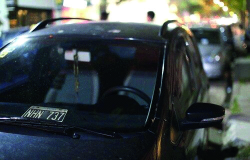

========== Question ==========  

### ¿Está permitido circular con la placa de dominio de este modo?



A. Sí, ya que exhibe una documentación provisoria.

B. No, ya que para poder cumplir su función como provisoria debe ampliarse.

C. No, ya que debe estar colocada en el lugar y de forma reglamentaria.  

========== Answer ==========  

C. No, ya que debe estar colocada en el lugar y de forma reglamentaria.

========== Id ==========  
76

---

DECK INFO

TARGET DECK: Licencia::Preguntas::MLDCB - Licencia de conducir buenos aires - multi author::Part I - Introduccion::Chapter 1 - Bateria de preguntas

FILE TAGS: #Licencia::#MLDCB-Licencia-de-conducir-buenos-aires-multi-author::#Part-I-Introduccion::#Chapter-1-Bateria-de-preguntas::#76-Est-permitido-circular-con-la-placa-de-d

Tags:

Reference:

Related:

```dataview
LIST
where file.name = this.file.name
```

QUESTION STATUS: Safe to store
