# MLDCB - Licencia de conducir buenos aires - multi author

## Questions

| ID | File name / path | Part | Chapter |
| --- | --- | --- | --- |
| **-** | **Introduccion** | **1** | **-** |
| **-** | **Introduccion > Bateria de preguntas** | **1** | **1** |
| [1](#id1) | [Seg n la organizaci n mundial de la salud](./MLDCB%20-%20Licencia%20de%20conducir%20buenos%20aires%20-%20multi%20author/Part%20I%20-%20Introduccion/Chapter%201%20-%20Bateria%20de%20preguntas/1%20-%20Seg%20n%20la%20organizaci%20n%20mundial%20de%20la%20salud.md) | 1 | 1 |
| [2](#id2) | [La organizaci n mundial de la salud manifi](./MLDCB%20-%20Licencia%20de%20conducir%20buenos%20aires%20-%20multi%20author/Part%20I%20-%20Introduccion/Chapter%201%20-%20Bateria%20de%20preguntas/2%20-%20La%20organizaci%20n%20mundial%20de%20la%20salud%20manifi.md) | 1 | 1 |
| [3](#id3) | [A qu factor se deben la mayor a de los s](./MLDCB%20-%20Licencia%20de%20conducir%20buenos%20aires%20-%20multi%20author/Part%20I%20-%20Introduccion/Chapter%201%20-%20Bateria%20de%20preguntas/3%20-%20A%20qu%20factor%20se%20deben%20la%20mayor%20a%20de%20los%20s.md) | 1 | 1 |
| [4](#id4) | [A fin de aumentar la propia seguridad y la](./MLDCB%20-%20Licencia%20de%20conducir%20buenos%20aires%20-%20multi%20author/Part%20I%20-%20Introduccion/Chapter%201%20-%20Bateria%20de%20preguntas/4%20-%20A%20fin%20de%20aumentar%20la%20propia%20seguridad%20y%20la.md) | 1 | 1 |
| [5](#id5) | [El factor ambiental es el principal factor](./MLDCB%20-%20Licencia%20de%20conducir%20buenos%20aires%20-%20multi%20author/Part%20I%20-%20Introduccion/Chapter%201%20-%20Bateria%20de%20preguntas/5%20-%20El%20factor%20ambiental%20es%20el%20principal%20factor.md) | 1 | 1 |
| [6](#id6) | [Por lo general las fallas mec nicas se de](./MLDCB%20-%20Licencia%20de%20conducir%20buenos%20aires%20-%20multi%20author/Part%20I%20-%20Introduccion/Chapter%201%20-%20Bateria%20de%20preguntas/6%20-%20Por%20lo%20general%20las%20fallas%20mec%20nicas%20se%20de.md) | 1 | 1 |
| [7](#id7) | [A qu se denomina incidente de tr nsito o](./MLDCB%20-%20Licencia%20de%20conducir%20buenos%20aires%20-%20multi%20author/Part%20I%20-%20Introduccion/Chapter%201%20-%20Bateria%20de%20preguntas/7%20-%20A%20qu%20se%20denomina%20incidente%20de%20tr%20nsito%20o.md) | 1 | 1 |
| [8](#id8) | [Cada usuario de la v a p blica es respons](./MLDCB%20-%20Licencia%20de%20conducir%20buenos%20aires%20-%20multi%20author/Part%20I%20-%20Introduccion/Chapter%201%20-%20Bateria%20de%20preguntas/8%20-%20Cada%20usuario%20de%20la%20v%20a%20p%20blica%20es%20respons.md) | 1 | 1 |
| [9](#id9) | [Como usuarios de la v a p blica estamos o](./MLDCB%20-%20Licencia%20de%20conducir%20buenos%20aires%20-%20multi%20author/Part%20I%20-%20Introduccion/Chapter%201%20-%20Bateria%20de%20preguntas/9%20-%20Como%20usuarios%20de%20la%20v%20a%20p%20blica%20estamos%20o.md) | 1 | 1 |
| [10](#id10) | [Adem s de provocar v ctimas fatales o lesi](./MLDCB%20-%20Licencia%20de%20conducir%20buenos%20aires%20-%20multi%20author/Part%20I%20-%20Introduccion/Chapter%201%20-%20Bateria%20de%20preguntas/10%20-%20Adem%20s%20de%20provocar%20v%20ctimas%20fatales%20o%20lesi.md) | 1 | 1 |
| [11](#id11) | [Todo usuario de la v a p blica debe como](./MLDCB%20-%20Licencia%20de%20conducir%20buenos%20aires%20-%20multi%20author/Part%20I%20-%20Introduccion/Chapter%201%20-%20Bateria%20de%20preguntas/11%20-%20Todo%20usuario%20de%20la%20v%20a%20p%20blica%20debe%20como.md) | 1 | 1 |
| [12](#id12) | [Cu les son los dos principios b sicos de](./MLDCB%20-%20Licencia%20de%20conducir%20buenos%20aires%20-%20multi%20author/Part%20I%20-%20Introduccion/Chapter%201%20-%20Bateria%20de%20preguntas/12%20-%20Cu%20les%20son%20los%20dos%20principios%20b%20sicos%20de.md) | 1 | 1 |
| [13](#id13) | [Indique cu l de las siguientes situaciones](./MLDCB%20-%20Licencia%20de%20conducir%20buenos%20aires%20-%20multi%20author/Part%20I%20-%20Introduccion/Chapter%201%20-%20Bateria%20de%20preguntas/13%20-%20Indique%20cu%20l%20de%20las%20siguientes%20situaciones.md) | 1 | 1 |
| [14](#id14) | [Indique cu l es la premisa correcta a a](./MLDCB%20-%20Licencia%20de%20conducir%20buenos%20aires%20-%20multi%20author/Part%20I%20-%20Introduccion/Chapter%201%20-%20Bateria%20de%20preguntas/14%20-%20Indique%20cu%20l%20es%20la%20premisa%20correcta%20a%20a.md) | 1 | 1 |
| [15](#id15) | [Cu l de las siguientes opciones represent](./MLDCB%20-%20Licencia%20de%20conducir%20buenos%20aires%20-%20multi%20author/Part%20I%20-%20Introduccion/Chapter%201%20-%20Bateria%20de%20preguntas/15%20-%20Cu%20l%20de%20las%20siguientes%20opciones%20represent.md) | 1 | 1 |
| [16](#id16) | [Usuarios de bicicleta qu se debe evitar](./MLDCB%20-%20Licencia%20de%20conducir%20buenos%20aires%20-%20multi%20author/Part%20I%20-%20Introduccion/Chapter%201%20-%20Bateria%20de%20preguntas/16%20-%20Usuarios%20de%20bicicleta%20qu%20se%20debe%20evitar.md) | 1 | 1 |
| [17](#id17) | [Est permitido llevar carga en una bicicl](./MLDCB%20-%20Licencia%20de%20conducir%20buenos%20aires%20-%20multi%20author/Part%20I%20-%20Introduccion/Chapter%201%20-%20Bateria%20de%20preguntas/17%20-%20Est%20permitido%20llevar%20carga%20en%20una%20bicicl.md) | 1 | 1 |
| [18](#id18) | [El usuario de bicicleta tiene permitido](./MLDCB%20-%20Licencia%20de%20conducir%20buenos%20aires%20-%20multi%20author/Part%20I%20-%20Introduccion/Chapter%201%20-%20Bateria%20de%20preguntas/18%20-%20El%20usuario%20de%20bicicleta%20tiene%20permitido.md) | 1 | 1 |
| [19](#id19) | [Un menor de 12 a os puede circular en bici](./MLDCB%20-%20Licencia%20de%20conducir%20buenos%20aires%20-%20multi%20author/Part%20I%20-%20Introduccion/Chapter%201%20-%20Bateria%20de%20preguntas/19%20-%20Un%20menor%20de%2012%20a%20os%20puede%20circular%20en%20bici.md) | 1 | 1 |
| [20](#id20) | [Cu l es la velocidad m xima permitida par](./MLDCB%20-%20Licencia%20de%20conducir%20buenos%20aires%20-%20multi%20author/Part%20I%20-%20Introduccion/Chapter%201%20-%20Bateria%20de%20preguntas/20%20-%20Cu%20l%20es%20la%20velocidad%20m%20xima%20permitida%20par.md) | 1 | 1 |
| [21](#id21) | [Qu indica una demarcaci n horizontal ve](./MLDCB%20-%20Licencia%20de%20conducir%20buenos%20aires%20-%20multi%20author/Part%20I%20-%20Introduccion/Chapter%201%20-%20Bateria%20de%20preguntas/21%20-%20Qu%20indica%20una%20demarcaci%20n%20horizontal%20ve.md) | 1 | 1 |
| [22](#id22) | [Qu es una ciclov a a sector se alizado](./MLDCB%20-%20Licencia%20de%20conducir%20buenos%20aires%20-%20multi%20author/Part%20I%20-%20Introduccion/Chapter%201%20-%20Bateria%20de%20preguntas/22%20-%20Qu%20es%20una%20ciclov%20a%20a%20sector%20se%20alizado.md) | 1 | 1 |
| [23](#id23) | [Cu l es la principal diferencia entre bic](./MLDCB%20-%20Licencia%20de%20conducir%20buenos%20aires%20-%20multi%20author/Part%20I%20-%20Introduccion/Chapter%201%20-%20Bateria%20de%20preguntas/23%20-%20Cu%20l%20es%20la%20principal%20diferencia%20entre%20bic.md) | 1 | 1 |
| [24](#id24) | [Los ciclistas no est n obligados a respeta](./MLDCB%20-%20Licencia%20de%20conducir%20buenos%20aires%20-%20multi%20author/Part%20I%20-%20Introduccion/Chapter%201%20-%20Bateria%20de%20preguntas/24%20-%20Los%20ciclistas%20no%20est%20n%20obligados%20a%20respeta.md) | 1 | 1 |
| [25](#id25) | [Qu distancia lateral debe dejar respecto](./MLDCB%20-%20Licencia%20de%20conducir%20buenos%20aires%20-%20multi%20author/Part%20I%20-%20Introduccion/Chapter%201%20-%20Bateria%20de%20preguntas/25%20-%20Qu%20distancia%20lateral%20debe%20dejar%20respecto.md) | 1 | 1 |
| [26](#id26) | [Es aconsejable circular en bicicleta de e](./MLDCB%20-%20Licencia%20de%20conducir%20buenos%20aires%20-%20multi%20author/Part%20I%20-%20Introduccion/Chapter%201%20-%20Bateria%20de%20preguntas/26%20-%20Es%20aconsejable%20circular%20en%20bicicleta%20de%20e.md) | 1 | 1 |
| [27](#id27) | [En cuanto a su indumentaria cu l de los](./MLDCB%20-%20Licencia%20de%20conducir%20buenos%20aires%20-%20multi%20author/Part%20I%20-%20Introduccion/Chapter%201%20-%20Bateria%20de%20preguntas/27%20-%20En%20cuanto%20a%20su%20indumentaria%20cu%20l%20de%20los.md) | 1 | 1 |
| [28](#id28) | [Se puede circular en bicicleta por esta v](./MLDCB%20-%20Licencia%20de%20conducir%20buenos%20aires%20-%20multi%20author/Part%20I%20-%20Introduccion/Chapter%201%20-%20Bateria%20de%20preguntas/28%20-%20Se%20puede%20circular%20en%20bicicleta%20por%20esta%20v.md) | 1 | 1 |
| [29](#id29) | [Qu se debe evitar al circular en bicicle](./MLDCB%20-%20Licencia%20de%20conducir%20buenos%20aires%20-%20multi%20author/Part%20I%20-%20Introduccion/Chapter%201%20-%20Bateria%20de%20preguntas/29%20-%20Qu%20se%20debe%20evitar%20al%20circular%20en%20bicicle.md) | 1 | 1 |
| [30](#id30) | [Est permitido llevar carga en una bicicl](./MLDCB%20-%20Licencia%20de%20conducir%20buenos%20aires%20-%20multi%20author/Part%20I%20-%20Introduccion/Chapter%201%20-%20Bateria%20de%20preguntas/30%20-%20Est%20permitido%20llevar%20carga%20en%20una%20bicicl.md) | 1 | 1 |
| [31](#id31) | [El ciclista tiene permitido llevar un pa](./MLDCB%20-%20Licencia%20de%20conducir%20buenos%20aires%20-%20multi%20author/Part%20I%20-%20Introduccion/Chapter%201%20-%20Bateria%20de%20preguntas/31%20-%20El%20ciclista%20tiene%20permitido%20llevar%20un%20pa.md) | 1 | 1 |
| [32](#id32) | [Qu indica esta se a img p9 15 -ima](./MLDCB%20-%20Licencia%20de%20conducir%20buenos%20aires%20-%20multi%20author/Part%20I%20-%20Introduccion/Chapter%201%20-%20Bateria%20de%20preguntas/32%20-%20Qu%20indica%20esta%20se%20a%20img%20p9%2015%20-ima.md) | 1 | 1 |
| [33](#id33) | [Qu indica esta se a img p10 3 -ima](./MLDCB%20-%20Licencia%20de%20conducir%20buenos%20aires%20-%20multi%20author/Part%20I%20-%20Introduccion/Chapter%201%20-%20Bateria%20de%20preguntas/33%20-%20Qu%20indica%20esta%20se%20a%20img%20p10%203%20-ima.md) | 1 | 1 |
| [34](#id34) | [Qu indica esta se a img p10 8 -ima](./MLDCB%20-%20Licencia%20de%20conducir%20buenos%20aires%20-%20multi%20author/Part%20I%20-%20Introduccion/Chapter%201%20-%20Bateria%20de%20preguntas/34%20-%20Qu%20indica%20esta%20se%20a%20img%20p10%208%20-ima.md) | 1 | 1 |
| [35](#id35) | [Si usted pretende cruzar esta intersecci n](./MLDCB%20-%20Licencia%20de%20conducir%20buenos%20aires%20-%20multi%20author/Part%20I%20-%20Introduccion/Chapter%201%20-%20Bateria%20de%20preguntas/35%20-%20Si%20usted%20pretende%20cruzar%20esta%20intersecci%20n.md) | 1 | 1 |
| [36](#id36) | [En esta situaci n es correcto que el veh](./MLDCB%20-%20Licencia%20de%20conducir%20buenos%20aires%20-%20multi%20author/Part%20I%20-%20Introduccion/Chapter%201%20-%20Bateria%20de%20preguntas/36%20-%20En%20esta%20situaci%20n%20es%20correcto%20que%20el%20veh.md) | 1 | 1 |
| [37](#id37) | [C mo debe proceder si al llegar a esta i](./MLDCB%20-%20Licencia%20de%20conducir%20buenos%20aires%20-%20multi%20author/Part%20I%20-%20Introduccion/Chapter%201%20-%20Bateria%20de%20preguntas/37%20-%20C%20mo%20debe%20proceder%20si%20al%20llegar%20a%20esta%20i.md) | 1 | 1 |
| [38](#id38) | [Desde el punto de vista del conductor fren](./MLDCB%20-%20Licencia%20de%20conducir%20buenos%20aires%20-%20multi%20author/Part%20I%20-%20Introduccion/Chapter%201%20-%20Bateria%20de%20preguntas/38%20-%20Desde%20el%20punto%20de%20vista%20del%20conductor%20fren.md) | 1 | 1 |
| [39](#id39) | [Dadas las caracter sticas de esta intersec](./MLDCB%20-%20Licencia%20de%20conducir%20buenos%20aires%20-%20multi%20author/Part%20I%20-%20Introduccion/Chapter%201%20-%20Bateria%20de%20preguntas/39%20-%20Dadas%20las%20caracter%20sticas%20de%20esta%20intersec.md) | 1 | 1 |
| [40](#id40) | [Frente a la siguiente situaci n qu acti](./MLDCB%20-%20Licencia%20de%20conducir%20buenos%20aires%20-%20multi%20author/Part%20I%20-%20Introduccion/Chapter%201%20-%20Bateria%20de%20preguntas/40%20-%20Frente%20a%20la%20siguiente%20situaci%20n%20qu%20acti.md) | 1 | 1 |
| [41](#id41) | [Si ud es el conductor del veh culo qu](./MLDCB%20-%20Licencia%20de%20conducir%20buenos%20aires%20-%20multi%20author/Part%20I%20-%20Introduccion/Chapter%201%20-%20Bateria%20de%20preguntas/41%20-%20Si%20ud%20es%20el%20conductor%20del%20veh%20culo%20qu.md) | 1 | 1 |
| [42](#id42) | [En esta intersecci n qui n tiene priorid](./MLDCB%20-%20Licencia%20de%20conducir%20buenos%20aires%20-%20multi%20author/Part%20I%20-%20Introduccion/Chapter%201%20-%20Bateria%20de%20preguntas/42%20-%20En%20esta%20intersecci%20n%20qui%20n%20tiene%20priorid.md) | 1 | 1 |
| [43](#id43) | [Cuando no hay demarcaci n de la senda peat](./MLDCB%20-%20Licencia%20de%20conducir%20buenos%20aires%20-%20multi%20author/Part%20I%20-%20Introduccion/Chapter%201%20-%20Bateria%20de%20preguntas/43%20-%20Cuando%20no%20hay%20demarcaci%20n%20de%20la%20senda%20peat.md) | 1 | 1 |
| [44](#id44) | [Como conductor observa que esta luz se en](./MLDCB%20-%20Licencia%20de%20conducir%20buenos%20aires%20-%20multi%20author/Part%20I%20-%20Introduccion/Chapter%201%20-%20Bateria%20de%20preguntas/44%20-%20Como%20conductor%20observa%20que%20esta%20luz%20se%20en.md) | 1 | 1 |
| [45](#id45) | [Qu indica la se al horizontal que se enc](./MLDCB%20-%20Licencia%20de%20conducir%20buenos%20aires%20-%20multi%20author/Part%20I%20-%20Introduccion/Chapter%201%20-%20Bateria%20de%20preguntas/45%20-%20Qu%20indica%20la%20se%20al%20horizontal%20que%20se%20enc.md) | 1 | 1 |
| [46](#id46) | [Qu son los carriles exclusivos a v as](./MLDCB%20-%20Licencia%20de%20conducir%20buenos%20aires%20-%20multi%20author/Part%20I%20-%20Introduccion/Chapter%201%20-%20Bateria%20de%20preguntas/46%20-%20Qu%20son%20los%20carriles%20exclusivos%20a%20v%20as.md) | 1 | 1 |
| [47](#id47) | [Qu indica la demarcaci n horizontal que](./MLDCB%20-%20Licencia%20de%20conducir%20buenos%20aires%20-%20multi%20author/Part%20I%20-%20Introduccion/Chapter%201%20-%20Bateria%20de%20preguntas/47%20-%20Qu%20indica%20la%20demarcaci%20n%20horizontal%20que.md) | 1 | 1 |
| [48](#id48) | [La siguiente imagen corresponde a img p](./MLDCB%20-%20Licencia%20de%20conducir%20buenos%20aires%20-%20multi%20author/Part%20I%20-%20Introduccion/Chapter%201%20-%20Bateria%20de%20preguntas/48%20-%20La%20siguiente%20imagen%20corresponde%20a%20img%20p.md) | 1 | 1 |
| [49](#id49) | [Para qu sirve la demarcaci n horizontal](./MLDCB%20-%20Licencia%20de%20conducir%20buenos%20aires%20-%20multi%20author/Part%20I%20-%20Introduccion/Chapter%201%20-%20Bateria%20de%20preguntas/49%20-%20Para%20qu%20sirve%20la%20demarcaci%20n%20horizontal.md) | 1 | 1 |
| [50](#id50) | [La se al que est presente en la imagen co](./MLDCB%20-%20Licencia%20de%20conducir%20buenos%20aires%20-%20multi%20author/Part%20I%20-%20Introduccion/Chapter%201%20-%20Bateria%20de%20preguntas/50%20-%20La%20se%20al%20que%20est%20presente%20en%20la%20imagen%20co.md) | 1 | 1 |
| [51](#id51) | [Preguntas para todas las clases seguridad](./MLDCB%20-%20Licencia%20de%20conducir%20buenos%20aires%20-%20multi%20author/Part%20I%20-%20Introduccion/Chapter%201%20-%20Bateria%20de%20preguntas/51%20-%20Preguntas%20para%20todas%20las%20clases%20seguridad.md) | 1 | 1 |
| [52](#id52) | [En caso de participar de un siniestro vial](./MLDCB%20-%20Licencia%20de%20conducir%20buenos%20aires%20-%20multi%20author/Part%20I%20-%20Introduccion/Chapter%201%20-%20Bateria%20de%20preguntas/52%20-%20En%20caso%20de%20participar%20de%20un%20siniestro%20vial.md) | 1 | 1 |
| [53](#id53) | [En caso de un siniestro vial en este tipo](./MLDCB%20-%20Licencia%20de%20conducir%20buenos%20aires%20-%20multi%20author/Part%20I%20-%20Introduccion/Chapter%201%20-%20Bateria%20de%20preguntas/53%20-%20En%20caso%20de%20un%20siniestro%20vial%20en%20este%20tipo.md) | 1 | 1 |
| [54](#id54) | [En el caso de que un veh culo quede inmovi](./MLDCB%20-%20Licencia%20de%20conducir%20buenos%20aires%20-%20multi%20author/Part%20I%20-%20Introduccion/Chapter%201%20-%20Bateria%20de%20preguntas/54%20-%20En%20el%20caso%20de%20que%20un%20veh%20culo%20quede%20inmovi.md) | 1 | 1 |
| [55](#id55) | [En caso de un siniestro vial o desperfecto](./MLDCB%20-%20Licencia%20de%20conducir%20buenos%20aires%20-%20multi%20author/Part%20I%20-%20Introduccion/Chapter%201%20-%20Bateria%20de%20preguntas/55%20-%20En%20caso%20de%20un%20siniestro%20vial%20o%20desperfecto.md) | 1 | 1 |
| [56](#id56) | [En un procedimiento judicial de un siniest](./MLDCB%20-%20Licencia%20de%20conducir%20buenos%20aires%20-%20multi%20author/Part%20I%20-%20Introduccion/Chapter%201%20-%20Bateria%20de%20preguntas/56%20-%20En%20un%20procedimiento%20judicial%20de%20un%20siniest.md) | 1 | 1 |
| [57](#id57) | [La persona que se da a la fuga en un sinie](./MLDCB%20-%20Licencia%20de%20conducir%20buenos%20aires%20-%20multi%20author/Part%20I%20-%20Introduccion/Chapter%201%20-%20Bateria%20de%20preguntas/57%20-%20La%20persona%20que%20se%20da%20a%20la%20fuga%20en%20un%20sinie.md) | 1 | 1 |
| [58](#id58) | [En caso de participar de un siniestro vial](./MLDCB%20-%20Licencia%20de%20conducir%20buenos%20aires%20-%20multi%20author/Part%20I%20-%20Introduccion/Chapter%201%20-%20Bateria%20de%20preguntas/58%20-%20En%20caso%20de%20participar%20de%20un%20siniestro%20vial.md) | 1 | 1 |
| [59](#id59) | [En caso de participar en un siniestro vial](./MLDCB%20-%20Licencia%20de%20conducir%20buenos%20aires%20-%20multi%20author/Part%20I%20-%20Introduccion/Chapter%201%20-%20Bateria%20de%20preguntas/59%20-%20En%20caso%20de%20participar%20en%20un%20siniestro%20vial.md) | 1 | 1 |
| [60](#id60) | [En caso de participar en un siniestro vial](./MLDCB%20-%20Licencia%20de%20conducir%20buenos%20aires%20-%20multi%20author/Part%20I%20-%20Introduccion/Chapter%201%20-%20Bateria%20de%20preguntas/60%20-%20En%20caso%20de%20participar%20en%20un%20siniestro%20vial.md) | 1 | 1 |
| [61](#id61) | [En caso de siniestro el orden de actuaci](./MLDCB%20-%20Licencia%20de%20conducir%20buenos%20aires%20-%20multi%20author/Part%20I%20-%20Introduccion/Chapter%201%20-%20Bateria%20de%20preguntas/61%20-%20En%20caso%20de%20siniestro%20el%20orden%20de%20actuaci.md) | 1 | 1 |
| [62](#id62) | [Qu obligaciones impone la ley a aquel co](./MLDCB%20-%20Licencia%20de%20conducir%20buenos%20aires%20-%20multi%20author/Part%20I%20-%20Introduccion/Chapter%201%20-%20Bateria%20de%20preguntas/62%20-%20Qu%20obligaciones%20impone%20la%20ley%20a%20aquel%20co.md) | 1 | 1 |
| [63](#id63) | [Qui n es el responsable civil por un inci](./MLDCB%20-%20Licencia%20de%20conducir%20buenos%20aires%20-%20multi%20author/Part%20I%20-%20Introduccion/Chapter%201%20-%20Bateria%20de%20preguntas/63%20-%20Qui%20n%20es%20el%20responsable%20civil%20por%20un%20inci.md) | 1 | 1 |
| [64](#id64) | [En materia de responsabilidad civil qu](./MLDCB%20-%20Licencia%20de%20conducir%20buenos%20aires%20-%20multi%20author/Part%20I%20-%20Introduccion/Chapter%201%20-%20Bateria%20de%20preguntas/64%20-%20En%20materia%20de%20responsabilidad%20civil%20qu.md) | 1 | 1 |
| [65](#id65) | [Frente a un incidente de tr nsito puede](./MLDCB%20-%20Licencia%20de%20conducir%20buenos%20aires%20-%20multi%20author/Part%20I%20-%20Introduccion/Chapter%201%20-%20Bateria%20de%20preguntas/65%20-%20Frente%20a%20un%20incidente%20de%20tr%20nsito%20puede.md) | 1 | 1 |
| [66](#id66) | [En un incidente de tr nsito qu signific](./MLDCB%20-%20Licencia%20de%20conducir%20buenos%20aires%20-%20multi%20author/Part%20I%20-%20Introduccion/Chapter%201%20-%20Bateria%20de%20preguntas/66%20-%20En%20un%20incidente%20de%20tr%20nsito%20qu%20signific.md) | 1 | 1 |
| [67](#id67) | [Preguntas para todas las clases documenta](./MLDCB%20-%20Licencia%20de%20conducir%20buenos%20aires%20-%20multi%20author/Part%20I%20-%20Introduccion/Chapter%201%20-%20Bateria%20de%20preguntas/67%20-%20Preguntas%20para%20todas%20las%20clases%20documenta.md) | 1 | 1 |
| [68](#id68) | [En caso de comprobar una falta puede un](./MLDCB%20-%20Licencia%20de%20conducir%20buenos%20aires%20-%20multi%20author/Part%20I%20-%20Introduccion/Chapter%201%20-%20Bateria%20de%20preguntas/68%20-%20En%20caso%20de%20comprobar%20una%20falta%20puede%20un.md) | 1 | 1 |
| [69](#id69) | [Cuando se vence la licencia de conducir](./MLDCB%20-%20Licencia%20de%20conducir%20buenos%20aires%20-%20multi%20author/Part%20I%20-%20Introduccion/Chapter%201%20-%20Bateria%20de%20preguntas/69%20-%20Cuando%20se%20vence%20la%20licencia%20de%20conducir.md) | 1 | 1 |
| [70](#id70) | [Cu nto dura en su totalidad la condici n](./MLDCB%20-%20Licencia%20de%20conducir%20buenos%20aires%20-%20multi%20author/Part%20I%20-%20Introduccion/Chapter%201%20-%20Bateria%20de%20preguntas/70%20-%20Cu%20nto%20dura%20en%20su%20totalidad%20la%20condici%20n.md) | 1 | 1 |
| [71](#id71) | [Con esta documentaci n qui n est autori](./MLDCB%20-%20Licencia%20de%20conducir%20buenos%20aires%20-%20multi%20author/Part%20I%20-%20Introduccion/Chapter%201%20-%20Bateria%20de%20preguntas/71%20-%20Con%20esta%20documentaci%20n%20qui%20n%20est%20autori.md) | 1 | 1 |
| [72](#id72) | [Cu ntas c dulas para autorizados a condu](./MLDCB%20-%20Licencia%20de%20conducir%20buenos%20aires%20-%20multi%20author/Part%20I%20-%20Introduccion/Chapter%201%20-%20Bateria%20de%20preguntas/72%20-%20Cu%20ntas%20c%20dulas%20para%20autorizados%20a%20condu.md) | 1 | 1 |
| [73](#id73) | [Se puede manejar un veh culo con c dula](./MLDCB%20-%20Licencia%20de%20conducir%20buenos%20aires%20-%20multi%20author/Part%20I%20-%20Introduccion/Chapter%201%20-%20Bateria%20de%20preguntas/73%20-%20Se%20puede%20manejar%20un%20veh%20culo%20con%20c%20dula.md) | 1 | 1 |
| [74](#id74) | [El certificado del seguro de responsabilid](./MLDCB%20-%20Licencia%20de%20conducir%20buenos%20aires%20-%20multi%20author/Part%20I%20-%20Introduccion/Chapter%201%20-%20Bateria%20de%20preguntas/74%20-%20El%20certificado%20del%20seguro%20de%20responsabilid.md) | 1 | 1 |
| [75](#id75) | [Todo veh culo debe estar cubierto por un s](./MLDCB%20-%20Licencia%20de%20conducir%20buenos%20aires%20-%20multi%20author/Part%20I%20-%20Introduccion/Chapter%201%20-%20Bateria%20de%20preguntas/75%20-%20Todo%20veh%20culo%20debe%20estar%20cubierto%20por%20un%20s.md) | 1 | 1 |
| [76](#id76) | [Est permitido circular con la placa de d](./MLDCB%20-%20Licencia%20de%20conducir%20buenos%20aires%20-%20multi%20author/Part%20I%20-%20Introduccion/Chapter%201%20-%20Bateria%20de%20preguntas/76%20-%20Est%20permitido%20circular%20con%20la%20placa%20de%20d.md) | 1 | 1 |
| [77](#id77) | [Al sufrir la p rdida de la placa de domini](./MLDCB%20-%20Licencia%20de%20conducir%20buenos%20aires%20-%20multi%20author/Part%20I%20-%20Introduccion/Chapter%201%20-%20Bateria%20de%20preguntas/77%20-%20Al%20sufrir%20la%20p%20rdida%20de%20la%20placa%20de%20domini.md) | 1 | 1 |
| [78](#id78) | [La ubicaci n y posici n de las placas de d](./MLDCB%20-%20Licencia%20de%20conducir%20buenos%20aires%20-%20multi%20author/Part%20I%20-%20Introduccion/Chapter%201%20-%20Bateria%20de%20preguntas/78%20-%20La%20ubicaci%20n%20y%20posici%20n%20de%20las%20placas%20de%20d.md) | 1 | 1 |
| [79](#id79) | [Cu l es el objetivo de la verificaci n t](./MLDCB%20-%20Licencia%20de%20conducir%20buenos%20aires%20-%20multi%20author/Part%20I%20-%20Introduccion/Chapter%201%20-%20Bateria%20de%20preguntas/79%20-%20Cu%20l%20es%20el%20objetivo%20de%20la%20verificaci%20n%20t.md) | 1 | 1 |
| [80](#id80) | [El titular de una licencia de conducir deb](./MLDCB%20-%20Licencia%20de%20conducir%20buenos%20aires%20-%20multi%20author/Part%20I%20-%20Introduccion/Chapter%201%20-%20Bateria%20de%20preguntas/80%20-%20El%20titular%20de%20una%20licencia%20de%20conducir%20deb.md) | 1 | 1 |
| [81](#id81) | [Marque la documentaci n obligatoria que de](./MLDCB%20-%20Licencia%20de%20conducir%20buenos%20aires%20-%20multi%20author/Part%20I%20-%20Introduccion/Chapter%201%20-%20Bateria%20de%20preguntas/81%20-%20Marque%20la%20documentaci%20n%20obligatoria%20que%20de.md) | 1 | 1 |
| [82](#id82) | [Si los datos de la licencia de conducir n](./MLDCB%20-%20Licencia%20de%20conducir%20buenos%20aires%20-%20multi%20author/Part%20I%20-%20Introduccion/Chapter%201%20-%20Bateria%20de%20preguntas/82%20-%20Si%20los%20datos%20de%20la%20licencia%20de%20conducir%20n.md) | 1 | 1 |
| [83](#id83) | [Al tener la licencia vencida por cu nto](./MLDCB%20-%20Licencia%20de%20conducir%20buenos%20aires%20-%20multi%20author/Part%20I%20-%20Introduccion/Chapter%201%20-%20Bateria%20de%20preguntas/83%20-%20Al%20tener%20la%20licencia%20vencida%20por%20cu%20nto.md) | 1 | 1 |
| [84](#id84) | [Cu ntas c dulas para autorizados a condu](./MLDCB%20-%20Licencia%20de%20conducir%20buenos%20aires%20-%20multi%20author/Part%20I%20-%20Introduccion/Chapter%201%20-%20Bateria%20de%20preguntas/84%20-%20Cu%20ntas%20c%20dulas%20para%20autorizados%20a%20condu.md) | 1 | 1 |
| [85](#id85) | [Se puede manejar un veh culo con c dula](./MLDCB%20-%20Licencia%20de%20conducir%20buenos%20aires%20-%20multi%20author/Part%20I%20-%20Introduccion/Chapter%201%20-%20Bateria%20de%20preguntas/85%20-%20Se%20puede%20manejar%20un%20veh%20culo%20con%20c%20dula.md) | 1 | 1 |
| [86](#id86) | [En caso de comprobar una falta puede un](./MLDCB%20-%20Licencia%20de%20conducir%20buenos%20aires%20-%20multi%20author/Part%20I%20-%20Introduccion/Chapter%201%20-%20Bateria%20de%20preguntas/86%20-%20En%20caso%20de%20comprobar%20una%20falta%20puede%20un.md) | 1 | 1 |
| [87](#id87) | [Preguntas para todas las clases intoxicac](./MLDCB%20-%20Licencia%20de%20conducir%20buenos%20aires%20-%20multi%20author/Part%20I%20-%20Introduccion/Chapter%201%20-%20Bateria%20de%20preguntas/87%20-%20Preguntas%20para%20todas%20las%20clases%20intoxicac.md) | 1 | 1 |
| [88](#id88) | [La persona que conduce bajo los efectos de](./MLDCB%20-%20Licencia%20de%20conducir%20buenos%20aires%20-%20multi%20author/Part%20I%20-%20Introduccion/Chapter%201%20-%20Bateria%20de%20preguntas/88%20-%20La%20persona%20que%20conduce%20bajo%20los%20efectos%20de.md) | 1 | 1 |
| [89](#id89) | [Cu l de estas sustancias pueden afectar n](./MLDCB%20-%20Licencia%20de%20conducir%20buenos%20aires%20-%20multi%20author/Part%20I%20-%20Introduccion/Chapter%201%20-%20Bateria%20de%20preguntas/89%20-%20Cu%20l%20de%20estas%20sustancias%20pueden%20afectar%20n.md) | 1 | 1 |
| [90](#id90) | [El consumo de medicamentos puede afectar](./MLDCB%20-%20Licencia%20de%20conducir%20buenos%20aires%20-%20multi%20author/Part%20I%20-%20Introduccion/Chapter%201%20-%20Bateria%20de%20preguntas/90%20-%20El%20consumo%20de%20medicamentos%20puede%20afectar.md) | 1 | 1 |
| [91](#id91) | [Por los efectos que provoca el consumo de](./MLDCB%20-%20Licencia%20de%20conducir%20buenos%20aires%20-%20multi%20author/Part%20I%20-%20Introduccion/Chapter%201%20-%20Bateria%20de%20preguntas/91%20-%20Por%20los%20efectos%20que%20provoca%20el%20consumo%20de.md) | 1 | 1 |
| [92](#id92) | [Cuando se consume alcohol se pueden prod](./MLDCB%20-%20Licencia%20de%20conducir%20buenos%20aires%20-%20multi%20author/Part%20I%20-%20Introduccion/Chapter%201%20-%20Bateria%20de%20preguntas/92%20-%20Cuando%20se%20consume%20alcohol%20se%20pueden%20prod.md) | 1 | 1 |
| [93](#id93) | [Una vez que dej de ingerir alcohol qu](./MLDCB%20-%20Licencia%20de%20conducir%20buenos%20aires%20-%20multi%20author/Part%20I%20-%20Introduccion/Chapter%201%20-%20Bateria%20de%20preguntas/93%20-%20Una%20vez%20que%20dej%20de%20ingerir%20alcohol%20qu.md) | 1 | 1 |
| [94](#id94) | [Consumir cerveza influye en la conducci n](./MLDCB%20-%20Licencia%20de%20conducir%20buenos%20aires%20-%20multi%20author/Part%20I%20-%20Introduccion/Chapter%201%20-%20Bateria%20de%20preguntas/94%20-%20Consumir%20cerveza%20influye%20en%20la%20conducci%20n.md) | 1 | 1 |
| [95](#id95) | [Conducir al d a siguiente de una noche de](./MLDCB%20-%20Licencia%20de%20conducir%20buenos%20aires%20-%20multi%20author/Part%20I%20-%20Introduccion/Chapter%201%20-%20Bateria%20de%20preguntas/95%20-%20Conducir%20al%20d%20a%20siguiente%20de%20una%20noche%20de.md) | 1 | 1 |
| [96](#id96) | [La resaca tiene efectos en el organismo q](./MLDCB%20-%20Licencia%20de%20conducir%20buenos%20aires%20-%20multi%20author/Part%20I%20-%20Introduccion/Chapter%201%20-%20Bateria%20de%20preguntas/96%20-%20La%20resaca%20tiene%20efectos%20en%20el%20organismo%20q.md) | 1 | 1 |
| [97](#id97) | [Es peligroso conducir con resaca a s](./MLDCB%20-%20Licencia%20de%20conducir%20buenos%20aires%20-%20multi%20author/Part%20I%20-%20Introduccion/Chapter%201%20-%20Bateria%20de%20preguntas/97%20-%20Es%20peligroso%20conducir%20con%20resaca%20a%20s.md) | 1 | 1 |
| [98](#id98) | [Si el conductor de un veh culo se niega a](./MLDCB%20-%20Licencia%20de%20conducir%20buenos%20aires%20-%20multi%20author/Part%20I%20-%20Introduccion/Chapter%201%20-%20Bateria%20de%20preguntas/98%20-%20Si%20el%20conductor%20de%20un%20veh%20culo%20se%20niega%20a.md) | 1 | 1 |
| [99](#id99) | [Frente a la negativa por parte del conduct](./MLDCB%20-%20Licencia%20de%20conducir%20buenos%20aires%20-%20multi%20author/Part%20I%20-%20Introduccion/Chapter%201%20-%20Bateria%20de%20preguntas/99%20-%20Frente%20a%20la%20negativa%20por%20parte%20del%20conduct.md) | 1 | 1 |
| [100](#id100) | [Cu l es el nivel m ximo de alcoholemia ad](./MLDCB%20-%20Licencia%20de%20conducir%20buenos%20aires%20-%20multi%20author/Part%20I%20-%20Introduccion/Chapter%201%20-%20Bateria%20de%20preguntas/100%20-%20Cu%20l%20es%20el%20nivel%20m%20ximo%20de%20alcoholemia%20ad.md) | 1 | 1 |
| [101](#id101) | [Cu l es el nivel m ximo de alcoholemia ad](./MLDCB%20-%20Licencia%20de%20conducir%20buenos%20aires%20-%20multi%20author/Part%20I%20-%20Introduccion/Chapter%201%20-%20Bateria%20de%20preguntas/101%20-%20Cu%20l%20es%20el%20nivel%20m%20ximo%20de%20alcoholemia%20ad.md) | 1 | 1 |
| [102](#id102) | [Cada cu nto tiempo es recomendable parar](./MLDCB%20-%20Licencia%20de%20conducir%20buenos%20aires%20-%20multi%20author/Part%20I%20-%20Introduccion/Chapter%201%20-%20Bateria%20de%20preguntas/102%20-%20Cada%20cu%20nto%20tiempo%20es%20recomendable%20parar.md) | 1 | 1 |
| [103](#id103) | [Si se va a conducir por un largo tiempo l](./MLDCB%20-%20Licencia%20de%20conducir%20buenos%20aires%20-%20multi%20author/Part%20I%20-%20Introduccion/Chapter%201%20-%20Bateria%20de%20preguntas/103%20-%20Si%20se%20va%20a%20conducir%20por%20un%20largo%20tiempo%20l.md) | 1 | 1 |
| [104](#id104) | [Estar 17 horas despierto provoca tener el](./MLDCB%20-%20Licencia%20de%20conducir%20buenos%20aires%20-%20multi%20author/Part%20I%20-%20Introduccion/Chapter%201%20-%20Bateria%20de%20preguntas/104%20-%20Estar%2017%20horas%20despierto%20provoca%20tener%20el.md) | 1 | 1 |
| [105](#id105) | [El cansancio puede verse inducido por inge](./MLDCB%20-%20Licencia%20de%20conducir%20buenos%20aires%20-%20multi%20author/Part%20I%20-%20Introduccion/Chapter%201%20-%20Bateria%20de%20preguntas/105%20-%20El%20cansancio%20puede%20verse%20inducido%20por%20inge.md) | 1 | 1 |
| [106](#id106) | [Cu les de stos son los s ntomas que advi](./MLDCB%20-%20Licencia%20de%20conducir%20buenos%20aires%20-%20multi%20author/Part%20I%20-%20Introduccion/Chapter%201%20-%20Bateria%20de%20preguntas/106%20-%20Cu%20les%20de%20stos%20son%20los%20s%20ntomas%20que%20advi.md) | 1 | 1 |
| [107](#id107) | [Un conductor principiante puede sentirse](./MLDCB%20-%20Licencia%20de%20conducir%20buenos%20aires%20-%20multi%20author/Part%20I%20-%20Introduccion/Chapter%201%20-%20Bateria%20de%20preguntas/107%20-%20Un%20conductor%20principiante%20puede%20sentirse.md) | 1 | 1 |
| [108](#id108) | [Por qu es peligroso conducir cansado a](./MLDCB%20-%20Licencia%20de%20conducir%20buenos%20aires%20-%20multi%20author/Part%20I%20-%20Introduccion/Chapter%201%20-%20Bateria%20de%20preguntas/108%20-%20Por%20qu%20es%20peligroso%20conducir%20cansado%20a.md) | 1 | 1 |
| [109](#id109) | [Qu consecuencias tiene conducir habiendo](./MLDCB%20-%20Licencia%20de%20conducir%20buenos%20aires%20-%20multi%20author/Part%20I%20-%20Introduccion/Chapter%201%20-%20Bateria%20de%20preguntas/109%20-%20Qu%20consecuencias%20tiene%20conducir%20habiendo.md) | 1 | 1 |
| [110](#id110) | [Para evitar o retrasar la aparici n de la](./MLDCB%20-%20Licencia%20de%20conducir%20buenos%20aires%20-%20multi%20author/Part%20I%20-%20Introduccion/Chapter%201%20-%20Bateria%20de%20preguntas/110%20-%20Para%20evitar%20o%20retrasar%20la%20aparici%20n%20de%20la.md) | 1 | 1 |
| [111](#id111) | [Puede afectar negativamente la conducci n](./MLDCB%20-%20Licencia%20de%20conducir%20buenos%20aires%20-%20multi%20author/Part%20I%20-%20Introduccion/Chapter%201%20-%20Bateria%20de%20preguntas/111%20-%20Puede%20afectar%20negativamente%20la%20conducci%20n.md) | 1 | 1 |
| [112](#id112) | [Bajo los efectos del estr s la conducci n](./MLDCB%20-%20Licencia%20de%20conducir%20buenos%20aires%20-%20multi%20author/Part%20I%20-%20Introduccion/Chapter%201%20-%20Bateria%20de%20preguntas/112%20-%20Bajo%20los%20efectos%20del%20estr%20s%20la%20conducci%20n.md) | 1 | 1 |
| [113](#id113) | [El estr s no necesariamente puede alterar](./MLDCB%20-%20Licencia%20de%20conducir%20buenos%20aires%20-%20multi%20author/Part%20I%20-%20Introduccion/Chapter%201%20-%20Bateria%20de%20preguntas/113%20-%20El%20estr%20s%20no%20necesariamente%20puede%20alterar.md) | 1 | 1 |
| [114](#id114) | [Cu l es el tiempo promedio de reacci n de](./MLDCB%20-%20Licencia%20de%20conducir%20buenos%20aires%20-%20multi%20author/Part%20I%20-%20Introduccion/Chapter%201%20-%20Bateria%20de%20preguntas/114%20-%20Cu%20l%20es%20el%20tiempo%20promedio%20de%20reacci%20n%20de.md) | 1 | 1 |
| [115](#id115) | [Durante esta situaci n es riesgoso que e](./MLDCB%20-%20Licencia%20de%20conducir%20buenos%20aires%20-%20multi%20author/Part%20I%20-%20Introduccion/Chapter%201%20-%20Bateria%20de%20preguntas/115%20-%20Durante%20esta%20situaci%20n%20es%20riesgoso%20que%20e.md) | 1 | 1 |
| [116](#id116) | [Cu l de estos sistemas de comunicaci n te](./MLDCB%20-%20Licencia%20de%20conducir%20buenos%20aires%20-%20multi%20author/Part%20I%20-%20Introduccion/Chapter%201%20-%20Bateria%20de%20preguntas/116%20-%20Cu%20l%20de%20estos%20sistemas%20de%20comunicaci%20n%20te.md) | 1 | 1 |
| [117](#id117) | [La siguiente acci n del conductor es con](./MLDCB%20-%20Licencia%20de%20conducir%20buenos%20aires%20-%20multi%20author/Part%20I%20-%20Introduccion/Chapter%201%20-%20Bateria%20de%20preguntas/117%20-%20La%20siguiente%20acci%20n%20del%20conductor%20es%20con.md) | 1 | 1 |
| [118](#id118) | [La siguiente acci n del conductor es riesg](./MLDCB%20-%20Licencia%20de%20conducir%20buenos%20aires%20-%20multi%20author/Part%20I%20-%20Introduccion/Chapter%201%20-%20Bateria%20de%20preguntas/118%20-%20La%20siguiente%20acci%20n%20del%20conductor%20es%20riesg.md) | 1 | 1 |
| [119](#id119) | [Se encuentra prohibida la acci n de la pe](./MLDCB%20-%20Licencia%20de%20conducir%20buenos%20aires%20-%20multi%20author/Part%20I%20-%20Introduccion/Chapter%201%20-%20Bateria%20de%20preguntas/119%20-%20Se%20encuentra%20prohibida%20la%20acci%20n%20de%20la%20pe.md) | 1 | 1 |
| [120](#id120) | [Si un conductor necesita realizar una llam](./MLDCB%20-%20Licencia%20de%20conducir%20buenos%20aires%20-%20multi%20author/Part%20I%20-%20Introduccion/Chapter%201%20-%20Bateria%20de%20preguntas/120%20-%20Si%20un%20conductor%20necesita%20realizar%20una%20llam.md) | 1 | 1 |
| [121](#id121) | [La presente conducta es riesgosa al mome](./MLDCB%20-%20Licencia%20de%20conducir%20buenos%20aires%20-%20multi%20author/Part%20I%20-%20Introduccion/Chapter%201%20-%20Bateria%20de%20preguntas/121%20-%20La%20presente%20conducta%20es%20riesgosa%20al%20mome.md) | 1 | 1 |
| [122](#id122) | [La acci n que se presenta en la imagen es](./MLDCB%20-%20Licencia%20de%20conducir%20buenos%20aires%20-%20multi%20author/Part%20I%20-%20Introduccion/Chapter%201%20-%20Bateria%20de%20preguntas/122%20-%20La%20acci%20n%20que%20se%20presenta%20en%20la%20imagen%20es.md) | 1 | 1 |
| [123](#id123) | [La acci n que realiza el conductor en la i](./MLDCB%20-%20Licencia%20de%20conducir%20buenos%20aires%20-%20multi%20author/Part%20I%20-%20Introduccion/Chapter%201%20-%20Bateria%20de%20preguntas/123%20-%20La%20acci%20n%20que%20realiza%20el%20conductor%20en%20la%20i.md) | 1 | 1 |
| [124](#id124) | [Cu les de las siguientes acciones son con](./MLDCB%20-%20Licencia%20de%20conducir%20buenos%20aires%20-%20multi%20author/Part%20I%20-%20Introduccion/Chapter%201%20-%20Bateria%20de%20preguntas/124%20-%20Cu%20les%20de%20las%20siguientes%20acciones%20son%20con.md) | 1 | 1 |
| [125](#id125) | [Preguntas para todas las clases varias 1](./MLDCB%20-%20Licencia%20de%20conducir%20buenos%20aires%20-%20multi%20author/Part%20I%20-%20Introduccion/Chapter%201%20-%20Bateria%20de%20preguntas/125%20-%20Preguntas%20para%20todas%20las%20clases%20varias%201.md) | 1 | 1 |
| [126](#id126) | [Cuales de los siguientes requisitos resul](./MLDCB%20-%20Licencia%20de%20conducir%20buenos%20aires%20-%20multi%20author/Part%20I%20-%20Introduccion/Chapter%201%20-%20Bateria%20de%20preguntas/126%20-%20Cuales%20de%20los%20siguientes%20requisitos%20resul.md) | 1 | 1 |
| [127](#id127) | [Indique cuales son los 5 factores que afe](./MLDCB%20-%20Licencia%20de%20conducir%20buenos%20aires%20-%20multi%20author/Part%20I%20-%20Introduccion/Chapter%201%20-%20Bateria%20de%20preguntas/127%20-%20Indique%20cuales%20son%20los%205%20factores%20que%20afe.md) | 1 | 1 |
| [128](#id128) | [Los datos en consignados en la licencia de](./MLDCB%20-%20Licencia%20de%20conducir%20buenos%20aires%20-%20multi%20author/Part%20I%20-%20Introduccion/Chapter%201%20-%20Bateria%20de%20preguntas/128%20-%20Los%20datos%20en%20consignados%20en%20la%20licencia%20de.md) | 1 | 1 |
| [129](#id129) | [Que funcion cumplen las se ales de preve](./MLDCB%20-%20Licencia%20de%20conducir%20buenos%20aires%20-%20multi%20author/Part%20I%20-%20Introduccion/Chapter%201%20-%20Bateria%20de%20preguntas/129%20-%20Que%20funcion%20cumplen%20las%20se%20ales%20de%20preve.md) | 1 | 1 |
| [130](#id130) | [A que grupo de se ales pertenecen las que](./MLDCB%20-%20Licencia%20de%20conducir%20buenos%20aires%20-%20multi%20author/Part%20I%20-%20Introduccion/Chapter%201%20-%20Bateria%20de%20preguntas/130%20-%20A%20que%20grupo%20de%20se%20ales%20pertenecen%20las%20que.md) | 1 | 1 |
| [131](#id131) | [Si desea girar a la izquierda desde una ca](./MLDCB%20-%20Licencia%20de%20conducir%20buenos%20aires%20-%20multi%20author/Part%20I%20-%20Introduccion/Chapter%201%20-%20Bateria%20de%20preguntas/131%20-%20Si%20desea%20girar%20a%20la%20izquierda%20desde%20una%20ca.md) | 1 | 1 |
| [132](#id132) | [En qu circunstancias est permitido circ](./MLDCB%20-%20Licencia%20de%20conducir%20buenos%20aires%20-%20multi%20author/Part%20I%20-%20Introduccion/Chapter%201%20-%20Bateria%20de%20preguntas/132%20-%20En%20qu%20circunstancias%20est%20permitido%20circ.md) | 1 | 1 |
| [133](#id133) | [En qu circunstancia est permitido circu](./MLDCB%20-%20Licencia%20de%20conducir%20buenos%20aires%20-%20multi%20author/Part%20I%20-%20Introduccion/Chapter%201%20-%20Bateria%20de%20preguntas/133%20-%20En%20qu%20circunstancia%20est%20permitido%20circu.md) | 1 | 1 |
| [134](#id134) | [Comprobante de seguro a es optativo circ](./MLDCB%20-%20Licencia%20de%20conducir%20buenos%20aires%20-%20multi%20author/Part%20I%20-%20Introduccion/Chapter%201%20-%20Bateria%20de%20preguntas/134%20-%20Comprobante%20de%20seguro%20a%20es%20optativo%20circ.md) | 1 | 1 |
| [135](#id135) | [Pregunta de car cter eliminatorio 11 me](./MLDCB%20-%20Licencia%20de%20conducir%20buenos%20aires%20-%20multi%20author/Part%20I%20-%20Introduccion/Chapter%201%20-%20Bateria%20de%20preguntas/135%20-%20Pregunta%20de%20car%20cter%20eliminatorio%2011%20me.md) | 1 | 1 |
| [136](#id136) | [Pregunta de car cter eliminatorio 12 ex](./MLDCB%20-%20Licencia%20de%20conducir%20buenos%20aires%20-%20multi%20author/Part%20I%20-%20Introduccion/Chapter%201%20-%20Bateria%20de%20preguntas/136%20-%20Pregunta%20de%20car%20cter%20eliminatorio%2012%20ex.md) | 1 | 1 |
| [137](#id137) | [Retenci n del vehiculo a el veh culo ser](./MLDCB%20-%20Licencia%20de%20conducir%20buenos%20aires%20-%20multi%20author/Part%20I%20-%20Introduccion/Chapter%201%20-%20Bateria%20de%20preguntas/137%20-%20Retenci%20n%20del%20vehiculo%20a%20el%20veh%20culo%20ser.md) | 1 | 1 |
| [138](#id138) | [Cual es la edad minima para adquirir cual](./MLDCB%20-%20Licencia%20de%20conducir%20buenos%20aires%20-%20multi%20author/Part%20I%20-%20Introduccion/Chapter%201%20-%20Bateria%20de%20preguntas/138%20-%20Cual%20es%20la%20edad%20minima%20para%20adquirir%20cual.md) | 1 | 1 |
| [139](#id139) | [Est permitido conducir en la v a p blica](./MLDCB%20-%20Licencia%20de%20conducir%20buenos%20aires%20-%20multi%20author/Part%20I%20-%20Introduccion/Chapter%201%20-%20Bateria%20de%20preguntas/139%20-%20Est%20permitido%20conducir%20en%20la%20v%20a%20p%20blica.md) | 1 | 1 |
| [140](#id140) | [C mo debe actuar el conductor ante la se](./MLDCB%20-%20Licencia%20de%20conducir%20buenos%20aires%20-%20multi%20author/Part%20I%20-%20Introduccion/Chapter%201%20-%20Bateria%20de%20preguntas/140%20-%20C%20mo%20debe%20actuar%20el%20conductor%20ante%20la%20se.md) | 1 | 1 |
| [141](#id141) | [Lim tase el expendio de bebidas alcoh lica](./MLDCB%20-%20Licencia%20de%20conducir%20buenos%20aires%20-%20multi%20author/Part%20I%20-%20Introduccion/Chapter%201%20-%20Bateria%20de%20preguntas/141%20-%20Lim%20tase%20el%20expendio%20de%20bebidas%20alcoh%20lica.md) | 1 | 1 |
| [142](#id142) | [Vencido el plazo para hacer la vtv se est](./MLDCB%20-%20Licencia%20de%20conducir%20buenos%20aires%20-%20multi%20author/Part%20I%20-%20Introduccion/Chapter%201%20-%20Bateria%20de%20preguntas/142%20-%20Vencido%20el%20plazo%20para%20hacer%20la%20vtv%20se%20est.md) | 1 | 1 |
| [143](#id143) | [Qu es el punto ciego a son las reas d](./MLDCB%20-%20Licencia%20de%20conducir%20buenos%20aires%20-%20multi%20author/Part%20I%20-%20Introduccion/Chapter%201%20-%20Bateria%20de%20preguntas/143%20-%20Qu%20es%20el%20punto%20ciego%20a%20son%20las%20reas%20d.md) | 1 | 1 |
| [144](#id144) | [Qu conductor tiene prioridad de paso en](./MLDCB%20-%20Licencia%20de%20conducir%20buenos%20aires%20-%20multi%20author/Part%20I%20-%20Introduccion/Chapter%201%20-%20Bateria%20de%20preguntas/144%20-%20Qu%20conductor%20tiene%20prioridad%20de%20paso%20en.md) | 1 | 1 |
| [145](#id145) | [En las v as con m s de dos carriles por ma](./MLDCB%20-%20Licencia%20de%20conducir%20buenos%20aires%20-%20multi%20author/Part%20I%20-%20Introduccion/Chapter%201%20-%20Bateria%20de%20preguntas/145%20-%20En%20las%20v%20as%20con%20m%20s%20de%20dos%20carriles%20por%20ma.md) | 1 | 1 |
| [146](#id146) | [En una subida estrecha qui n tiene prior](./MLDCB%20-%20Licencia%20de%20conducir%20buenos%20aires%20-%20multi%20author/Part%20I%20-%20Introduccion/Chapter%201%20-%20Bateria%20de%20preguntas/146%20-%20En%20una%20subida%20estrecha%20qui%20n%20tiene%20prior.md) | 1 | 1 |
| [147](#id147) | [Zona de camino todo espacio afectado a la](./MLDCB%20-%20Licencia%20de%20conducir%20buenos%20aires%20-%20multi%20author/Part%20I%20-%20Introduccion/Chapter%201%20-%20Bateria%20de%20preguntas/147%20-%20Zona%20de%20camino%20todo%20espacio%20afectado%20a%20la.md) | 1 | 1 |
| [148](#id148) | [Peatones y dicapacitados los peatones tra](./MLDCB%20-%20Licencia%20de%20conducir%20buenos%20aires%20-%20multi%20author/Part%20I%20-%20Introduccion/Chapter%201%20-%20Bateria%20de%20preguntas/148%20-%20Peatones%20y%20dicapacitados%20los%20peatones%20tra.md) | 1 | 1 |
| [149](#id149) | [Luces bajas mientras el veh culo transite](./MLDCB%20-%20Licencia%20de%20conducir%20buenos%20aires%20-%20multi%20author/Part%20I%20-%20Introduccion/Chapter%201%20-%20Bateria%20de%20preguntas/149%20-%20Luces%20bajas%20mientras%20el%20veh%20culo%20transite.md) | 1 | 1 |
| [150](#id150) | [En zona rural se estacionar lo m s lejos](./MLDCB%20-%20Licencia%20de%20conducir%20buenos%20aires%20-%20multi%20author/Part%20I%20-%20Introduccion/Chapter%201%20-%20Bateria%20de%20preguntas/150%20-%20En%20zona%20rural%20se%20estacionar%20lo%20m%20s%20lejos.md) | 1 | 1 |
| [151](#id151) | [Se presume responsable de un accidente al](./MLDCB%20-%20Licencia%20de%20conducir%20buenos%20aires%20-%20multi%20author/Part%20I%20-%20Introduccion/Chapter%201%20-%20Bateria%20de%20preguntas/151%20-%20Se%20presume%20responsable%20de%20un%20accidente%20al.md) | 1 | 1 |
| [152](#id152) | [Cu les son los factores que pueden afecta](./MLDCB%20-%20Licencia%20de%20conducir%20buenos%20aires%20-%20multi%20author/Part%20I%20-%20Introduccion/Chapter%201%20-%20Bateria%20de%20preguntas/152%20-%20Cu%20les%20son%20los%20factores%20que%20pueden%20afecta.md) | 1 | 1 |
| [153](#id153) | [En zona urbana qui n tiene prioridad par](./MLDCB%20-%20Licencia%20de%20conducir%20buenos%20aires%20-%20multi%20author/Part%20I%20-%20Introduccion/Chapter%201%20-%20Bateria%20de%20preguntas/153%20-%20En%20zona%20urbana%20qui%20n%20tiene%20prioridad%20par.md) | 1 | 1 |
| [154](#id154) | [Cuando se procede la retencion de la lice](./MLDCB%20-%20Licencia%20de%20conducir%20buenos%20aires%20-%20multi%20author/Part%20I%20-%20Introduccion/Chapter%201%20-%20Bateria%20de%20preguntas/154%20-%20Cuando%20se%20procede%20la%20retencion%20de%20la%20lice.md) | 1 | 1 |
| [155](#id155) | [Cuanto puede durar la retencion de una pe](./MLDCB%20-%20Licencia%20de%20conducir%20buenos%20aires%20-%20multi%20author/Part%20I%20-%20Introduccion/Chapter%201%20-%20Bateria%20de%20preguntas/155%20-%20Cuanto%20puede%20durar%20la%20retencion%20de%20una%20pe.md) | 1 | 1 |
| [156](#id156) | [Indique en que opci n u opciones se proced](./MLDCB%20-%20Licencia%20de%20conducir%20buenos%20aires%20-%20multi%20author/Part%20I%20-%20Introduccion/Chapter%201%20-%20Bateria%20de%20preguntas/156%20-%20Indique%20en%20que%20opci%20n%20u%20opciones%20se%20proced.md) | 1 | 1 |
| [157](#id157) | [Indique en que casos procede el retiro de](./MLDCB%20-%20Licencia%20de%20conducir%20buenos%20aires%20-%20multi%20author/Part%20I%20-%20Introduccion/Chapter%201%20-%20Bateria%20de%20preguntas/157%20-%20Indique%20en%20que%20casos%20procede%20el%20retiro%20de.md) | 1 | 1 |
| [158](#id158) | [Condiciones para conducir a los automotor](./MLDCB%20-%20Licencia%20de%20conducir%20buenos%20aires%20-%20multi%20author/Part%20I%20-%20Introduccion/Chapter%201%20-%20Bateria%20de%20preguntas/158%20-%20Condiciones%20para%20conducir%20a%20los%20automotor.md) | 1 | 1 |
| [159](#id159) | [Pregunta de car cter eliminatorio 36 q](./MLDCB%20-%20Licencia%20de%20conducir%20buenos%20aires%20-%20multi%20author/Part%20I%20-%20Introduccion/Chapter%201%20-%20Bateria%20de%20preguntas/159%20-%20Pregunta%20de%20car%20cter%20eliminatorio%2036%20q.md) | 1 | 1 |
| [160](#id160) | [Que es la multa a es la sanci n que se](./MLDCB%20-%20Licencia%20de%20conducir%20buenos%20aires%20-%20multi%20author/Part%20I%20-%20Introduccion/Chapter%201%20-%20Bateria%20de%20preguntas/160%20-%20Que%20es%20la%20multa%20a%20es%20la%20sanci%20n%20que%20se.md) | 1 | 1 |
| [161](#id161) | [Cuando se otorga la licencia de conducir](./MLDCB%20-%20Licencia%20de%20conducir%20buenos%20aires%20-%20multi%20author/Part%20I%20-%20Introduccion/Chapter%201%20-%20Bateria%20de%20preguntas/161%20-%20Cuando%20se%20otorga%20la%20licencia%20de%20conducir.md) | 1 | 1 |
| [162](#id162) | [Licencia de conducir duplicada cuando ser](./MLDCB%20-%20Licencia%20de%20conducir%20buenos%20aires%20-%20multi%20author/Part%20I%20-%20Introduccion/Chapter%201%20-%20Bateria%20de%20preguntas/162%20-%20Licencia%20de%20conducir%20duplicada%20cuando%20ser.md) | 1 | 1 |
| [163](#id163) | [Licencia de conducir renovada cuando sera](./MLDCB%20-%20Licencia%20de%20conducir%20buenos%20aires%20-%20multi%20author/Part%20I%20-%20Introduccion/Chapter%201%20-%20Bateria%20de%20preguntas/163%20-%20Licencia%20de%20conducir%20renovada%20cuando%20sera.md) | 1 | 1 |
| [164](#id164) | [Cuando no existiera senda peatonal habilit](./MLDCB%20-%20Licencia%20de%20conducir%20buenos%20aires%20-%20multi%20author/Part%20I%20-%20Introduccion/Chapter%201%20-%20Bateria%20de%20preguntas/164%20-%20Cuando%20no%20existiera%20senda%20peatonal%20habilit.md) | 1 | 1 |
| [165](#id165) | [Pregunta de car cter eliminatorio 42 pa](./MLDCB%20-%20Licencia%20de%20conducir%20buenos%20aires%20-%20multi%20author/Part%20I%20-%20Introduccion/Chapter%201%20-%20Bateria%20de%20preguntas/165%20-%20Pregunta%20de%20car%20cter%20eliminatorio%2042%20pa.md) | 1 | 1 |
| [166](#id166) | [En las v as reguladas por sem foros los ve](./MLDCB%20-%20Licencia%20de%20conducir%20buenos%20aires%20-%20multi%20author/Part%20I%20-%20Introduccion/Chapter%201%20-%20Bateria%20de%20preguntas/166%20-%20En%20las%20v%20as%20reguladas%20por%20sem%20foros%20los%20ve.md) | 1 | 1 |
| [167](#id167) | [En las v as reguladas por sem foros los pe](./MLDCB%20-%20Licencia%20de%20conducir%20buenos%20aires%20-%20multi%20author/Part%20I%20-%20Introduccion/Chapter%201%20-%20Bateria%20de%20preguntas/167%20-%20En%20las%20v%20as%20reguladas%20por%20sem%20foros%20los%20pe.md) | 1 | 1 |
| [168](#id168) | [Excepcionalmente se puede adelantar por la](./MLDCB%20-%20Licencia%20de%20conducir%20buenos%20aires%20-%20multi%20author/Part%20I%20-%20Introduccion/Chapter%201%20-%20Bateria%20de%20preguntas/168%20-%20Excepcionalmente%20se%20puede%20adelantar%20por%20la.md) | 1 | 1 |
| [169](#id169) | [Excepcionalmente se puede adelantar por la](./MLDCB%20-%20Licencia%20de%20conducir%20buenos%20aires%20-%20multi%20author/Part%20I%20-%20Introduccion/Chapter%201%20-%20Bateria%20de%20preguntas/169%20-%20Excepcionalmente%20se%20puede%20adelantar%20por%20la.md) | 1 | 1 |
| [170](#id170) | [Queda prohibido conducir con impedimentos](./MLDCB%20-%20Licencia%20de%20conducir%20buenos%20aires%20-%20multi%20author/Part%20I%20-%20Introduccion/Chapter%201%20-%20Bateria%20de%20preguntas/170%20-%20Queda%20prohibido%20conducir%20con%20impedimentos.md) | 1 | 1 |
| [171](#id171) | [Queda prohibido circular marcha atr s exc](./MLDCB%20-%20Licencia%20de%20conducir%20buenos%20aires%20-%20multi%20author/Part%20I%20-%20Introduccion/Chapter%201%20-%20Bateria%20de%20preguntas/171%20-%20Queda%20prohibido%20circular%20marcha%20atr%20s%20exc.md) | 1 | 1 |
| [172](#id172) | [Queda prohibido la detenci n irregular so](./MLDCB%20-%20Licencia%20de%20conducir%20buenos%20aires%20-%20multi%20author/Part%20I%20-%20Introduccion/Chapter%201%20-%20Bateria%20de%20preguntas/172%20-%20Queda%20prohibido%20la%20detenci%20n%20irregular%20so.md) | 1 | 1 |
| [173](#id173) | [Queda prohibido circular con cubiertas co](./MLDCB%20-%20Licencia%20de%20conducir%20buenos%20aires%20-%20multi%20author/Part%20I%20-%20Introduccion/Chapter%201%20-%20Bateria%20de%20preguntas/173%20-%20Queda%20prohibido%20circular%20con%20cubiertas%20co.md) | 1 | 1 |
| [174](#id174) | [Queda prohibido circular con un tren de ve](./MLDCB%20-%20Licencia%20de%20conducir%20buenos%20aires%20-%20multi%20author/Part%20I%20-%20Introduccion/Chapter%201%20-%20Bateria%20de%20preguntas/174%20-%20Queda%20prohibido%20circular%20con%20un%20tren%20de%20ve.md) | 1 | 1 |
| [175](#id175) | [Queda prohibido conducir utilizando auricu](./MLDCB%20-%20Licencia%20de%20conducir%20buenos%20aires%20-%20multi%20author/Part%20I%20-%20Introduccion/Chapter%201%20-%20Bateria%20de%20preguntas/175%20-%20Queda%20prohibido%20conducir%20utilizando%20auricu.md) | 1 | 1 |
| [176](#id176) | [En caso de retenci n de la licencia de con](./MLDCB%20-%20Licencia%20de%20conducir%20buenos%20aires%20-%20multi%20author/Part%20I%20-%20Introduccion/Chapter%201%20-%20Bateria%20de%20preguntas/176%20-%20En%20caso%20de%20retenci%20n%20de%20la%20licencia%20de%20con.md) | 1 | 1 |
| [177](#id177) | [S lo los conductores debe sujetarse a las](./MLDCB%20-%20Licencia%20de%20conducir%20buenos%20aires%20-%20multi%20author/Part%20I%20-%20Introduccion/Chapter%201%20-%20Bateria%20de%20preguntas/177%20-%20S%20lo%20los%20conductores%20debe%20sujetarse%20a%20las.md) | 1 | 1 |
| [178](#id178) | [La lluvia el hielo y la nieve a deben r](./MLDCB%20-%20Licencia%20de%20conducir%20buenos%20aires%20-%20multi%20author/Part%20I%20-%20Introduccion/Chapter%201%20-%20Bateria%20de%20preguntas/178%20-%20La%20lluvia%20el%20hielo%20y%20la%20nieve%20a%20deben%20r.md) | 1 | 1 |
| [179](#id179) | [Es recomendable frenar sobre zona resbalad](./MLDCB%20-%20Licencia%20de%20conducir%20buenos%20aires%20-%20multi%20author/Part%20I%20-%20Introduccion/Chapter%201%20-%20Bateria%20de%20preguntas/179%20-%20Es%20recomendable%20frenar%20sobre%20zona%20resbalad.md) | 1 | 1 |
| [180](#id180) | [Si siente sue o o somnolencia debe a aum](./MLDCB%20-%20Licencia%20de%20conducir%20buenos%20aires%20-%20multi%20author/Part%20I%20-%20Introduccion/Chapter%201%20-%20Bateria%20de%20preguntas/180%20-%20Si%20siente%20sue%20o%20o%20somnolencia%20debe%20a%20aum.md) | 1 | 1 |
| [181](#id181) | [El estacionamiento debe realizarse en no m](./MLDCB%20-%20Licencia%20de%20conducir%20buenos%20aires%20-%20multi%20author/Part%20I%20-%20Introduccion/Chapter%201%20-%20Bateria%20de%20preguntas/181%20-%20El%20estacionamiento%20debe%20realizarse%20en%20no%20m.md) | 1 | 1 |
| [182](#id182) | [En caso de siniestro en el que usted est](./MLDCB%20-%20Licencia%20de%20conducir%20buenos%20aires%20-%20multi%20author/Part%20I%20-%20Introduccion/Chapter%201%20-%20Bateria%20de%20preguntas/182%20-%20En%20caso%20de%20siniestro%20en%20el%20que%20usted%20est.md) | 1 | 1 |
| [183](#id183) | [La negativa a realizar test de alcoholemia](./MLDCB%20-%20Licencia%20de%20conducir%20buenos%20aires%20-%20multi%20author/Part%20I%20-%20Introduccion/Chapter%201%20-%20Bateria%20de%20preguntas/183%20-%20La%20negativa%20a%20realizar%20test%20de%20alcoholemia.md) | 1 | 1 |
| [184](#id184) | [En las v as reguladas por sem foros los ve](./MLDCB%20-%20Licencia%20de%20conducir%20buenos%20aires%20-%20multi%20author/Part%20I%20-%20Introduccion/Chapter%201%20-%20Bateria%20de%20preguntas/184%20-%20En%20las%20v%20as%20reguladas%20por%20sem%20foros%20los%20ve.md) | 1 | 1 |
| [185](#id185) | [S lo se admitir n en los vidrios los adita](./MLDCB%20-%20Licencia%20de%20conducir%20buenos%20aires%20-%20multi%20author/Part%20I%20-%20Introduccion/Chapter%201%20-%20Bateria%20de%20preguntas/185%20-%20S%20lo%20se%20admitir%20n%20en%20los%20vidrios%20los%20adita.md) | 1 | 1 |
| [186](#id186) | [Pregunta de car cter eliminatorio 63 la](./MLDCB%20-%20Licencia%20de%20conducir%20buenos%20aires%20-%20multi%20author/Part%20I%20-%20Introduccion/Chapter%201%20-%20Bateria%20de%20preguntas/186%20-%20Pregunta%20de%20car%20cter%20eliminatorio%2063%20la.md) | 1 | 1 |
| [187](#id187) | [La distancia de seguridad m nima requerida](./MLDCB%20-%20Licencia%20de%20conducir%20buenos%20aires%20-%20multi%20author/Part%20I%20-%20Introduccion/Chapter%201%20-%20Bateria%20de%20preguntas/187%20-%20La%20distancia%20de%20seguridad%20m%20nima%20requerida.md) | 1 | 1 |
| [188](#id188) | [Pregunta de car cter eliminatorio 65 se](./MLDCB%20-%20Licencia%20de%20conducir%20buenos%20aires%20-%20multi%20author/Part%20I%20-%20Introduccion/Chapter%201%20-%20Bateria%20de%20preguntas/188%20-%20Pregunta%20de%20car%20cter%20eliminatorio%2065%20se.md) | 1 | 1 |
| [189](#id189) | [Pregunta de car cter eliminatorio 66 a](./MLDCB%20-%20Licencia%20de%20conducir%20buenos%20aires%20-%20multi%20author/Part%20I%20-%20Introduccion/Chapter%201%20-%20Bateria%20de%20preguntas/189%20-%20Pregunta%20de%20car%20cter%20eliminatorio%2066%20a.md) | 1 | 1 |
| [190](#id190) | [Definici n de baliza la se al fija o m vi](./MLDCB%20-%20Licencia%20de%20conducir%20buenos%20aires%20-%20multi%20author/Part%20I%20-%20Introduccion/Chapter%201%20-%20Bateria%20de%20preguntas/190%20-%20Definici%20n%20de%20baliza%20la%20se%20al%20fija%20o%20m%20vi.md) | 1 | 1 |
| [191](#id191) | [Definici n de banquina zona de la v a des](./MLDCB%20-%20Licencia%20de%20conducir%20buenos%20aires%20-%20multi%20author/Part%20I%20-%20Introduccion/Chapter%201%20-%20Bateria%20de%20preguntas/191%20-%20Definici%20n%20de%20banquina%20zona%20de%20la%20v%20a%20des.md) | 1 | 1 |
| [192](#id192) | [Definici n de camino una v a rural de cir](./MLDCB%20-%20Licencia%20de%20conducir%20buenos%20aires%20-%20multi%20author/Part%20I%20-%20Introduccion/Chapter%201%20-%20Bateria%20de%20preguntas/192%20-%20Definici%20n%20de%20camino%20una%20v%20a%20rural%20de%20cir.md) | 1 | 1 |
| [193](#id193) | [Que es la responsabilidad a es la aptit](./MLDCB%20-%20Licencia%20de%20conducir%20buenos%20aires%20-%20multi%20author/Part%20I%20-%20Introduccion/Chapter%201%20-%20Bateria%20de%20preguntas/193%20-%20Que%20es%20la%20responsabilidad%20a%20es%20la%20aptit.md) | 1 | 1 |
| [194](#id194) | [Que es la responsabilidad penal a es la](./MLDCB%20-%20Licencia%20de%20conducir%20buenos%20aires%20-%20multi%20author/Part%20I%20-%20Introduccion/Chapter%201%20-%20Bateria%20de%20preguntas/194%20-%20Que%20es%20la%20responsabilidad%20penal%20a%20es%20la.md) | 1 | 1 |
| [195](#id195) | [Que es la responsabilidad civil a es la](./MLDCB%20-%20Licencia%20de%20conducir%20buenos%20aires%20-%20multi%20author/Part%20I%20-%20Introduccion/Chapter%201%20-%20Bateria%20de%20preguntas/195%20-%20Que%20es%20la%20responsabilidad%20civil%20a%20es%20la.md) | 1 | 1 |
| [196](#id196) | [Inhabilitados cumplida la pena pregunta](./MLDCB%20-%20Licencia%20de%20conducir%20buenos%20aires%20-%20multi%20author/Part%20I%20-%20Introduccion/Chapter%201%20-%20Bateria%20de%20preguntas/196%20-%20Inhabilitados%20cumplida%20la%20pena%20pregunta.md) | 1 | 1 |
| [197](#id197) | [Qu significa el t rmino culposo en mat](./MLDCB%20-%20Licencia%20de%20conducir%20buenos%20aires%20-%20multi%20author/Part%20I%20-%20Introduccion/Chapter%201%20-%20Bateria%20de%20preguntas/197%20-%20Qu%20significa%20el%20t%20rmino%20culposo%20en%20mat.md) | 1 | 1 |
| [198](#id198) | [Indique cuales de las siguientes situacion](./MLDCB%20-%20Licencia%20de%20conducir%20buenos%20aires%20-%20multi%20author/Part%20I%20-%20Introduccion/Chapter%201%20-%20Bateria%20de%20preguntas/198%20-%20Indique%20cuales%20de%20las%20siguientes%20situacion.md) | 1 | 1 |
| [199](#id199) | [Qu veh culo tiene prioridad de paso en u](./MLDCB%20-%20Licencia%20de%20conducir%20buenos%20aires%20-%20multi%20author/Part%20I%20-%20Introduccion/Chapter%201%20-%20Bateria%20de%20preguntas/199%20-%20Qu%20veh%20culo%20tiene%20prioridad%20de%20paso%20en%20u.md) | 1 | 1 |
| [200](#id200) | [Pregunta de car cter eliminatorio 77 q](./MLDCB%20-%20Licencia%20de%20conducir%20buenos%20aires%20-%20multi%20author/Part%20I%20-%20Introduccion/Chapter%201%20-%20Bateria%20de%20preguntas/200%20-%20Pregunta%20de%20car%20cter%20eliminatorio%2077%20q.md) | 1 | 1 |
| [201](#id201) | [7 8 cuando se ingresa a una rotonda qu](./MLDCB%20-%20Licencia%20de%20conducir%20buenos%20aires%20-%20multi%20author/Part%20I%20-%20Introduccion/Chapter%201%20-%20Bateria%20de%20preguntas/201%20-%207%208%20cuando%20se%20ingresa%20a%20una%20rotonda%20qu.md) | 1 | 1 |
| [202](#id202) | [En los caminos de tierra que exista una so](./MLDCB%20-%20Licencia%20de%20conducir%20buenos%20aires%20-%20multi%20author/Part%20I%20-%20Introduccion/Chapter%201%20-%20Bateria%20de%20preguntas/202%20-%20En%20los%20caminos%20de%20tierra%20que%20exista%20una%20so.md) | 1 | 1 |
| [203](#id203) | [Preguntas para todas las clases sem foro](./MLDCB%20-%20Licencia%20de%20conducir%20buenos%20aires%20-%20multi%20author/Part%20I%20-%20Introduccion/Chapter%201%20-%20Bateria%20de%20preguntas/203%20-%20Preguntas%20para%20todas%20las%20clases%20sem%20foro.md) | 1 | 1 |
| [204](#id204) | [C mo deber el conductor se alizar a los](./MLDCB%20-%20Licencia%20de%20conducir%20buenos%20aires%20-%20multi%20author/Part%20I%20-%20Introduccion/Chapter%201%20-%20Bateria%20de%20preguntas/204%20-%20C%20mo%20deber%20el%20conductor%20se%20alizar%20a%20los.md) | 1 | 1 |
| [205](#id205) | [Qu veh culos tienen siempre prioridad de](./MLDCB%20-%20Licencia%20de%20conducir%20buenos%20aires%20-%20multi%20author/Part%20I%20-%20Introduccion/Chapter%201%20-%20Bateria%20de%20preguntas/205%20-%20Qu%20veh%20culos%20tienen%20siempre%20prioridad%20de.md) | 1 | 1 |
| [206](#id206) | [Los conductores principiantes deben conduc](./MLDCB%20-%20Licencia%20de%20conducir%20buenos%20aires%20-%20multi%20author/Part%20I%20-%20Introduccion/Chapter%201%20-%20Bateria%20de%20preguntas/206%20-%20Los%20conductores%20principiantes%20deben%20conduc.md) | 1 | 1 |
| [207](#id207) | [La demarcaci n horizontal que se encuentra](./MLDCB%20-%20Licencia%20de%20conducir%20buenos%20aires%20-%20multi%20author/Part%20I%20-%20Introduccion/Chapter%201%20-%20Bateria%20de%20preguntas/207%20-%20La%20demarcaci%20n%20horizontal%20que%20se%20encuentra.md) | 1 | 1 |
| [208](#id208) | [C mo debe comportarse con luz amarilla a](./MLDCB%20-%20Licencia%20de%20conducir%20buenos%20aires%20-%20multi%20author/Part%20I%20-%20Introduccion/Chapter%201%20-%20Bateria%20de%20preguntas/208%20-%20C%20mo%20debe%20comportarse%20con%20luz%20amarilla%20a.md) | 1 | 1 |
| [209](#id209) | [Qu indica la luz roja intermitente a su](./MLDCB%20-%20Licencia%20de%20conducir%20buenos%20aires%20-%20multi%20author/Part%20I%20-%20Introduccion/Chapter%201%20-%20Bateria%20de%20preguntas/209%20-%20Qu%20indica%20la%20luz%20roja%20intermitente%20a%20su.md) | 1 | 1 |
| [210](#id210) | [Si se enciende la luz verde a su frente y](./MLDCB%20-%20Licencia%20de%20conducir%20buenos%20aires%20-%20multi%20author/Part%20I%20-%20Introduccion/Chapter%201%20-%20Bateria%20de%20preguntas/210%20-%20Si%20se%20enciende%20la%20luz%20verde%20a%20su%20frente%20y.md) | 1 | 1 |
| [211](#id211) | [Cu ndo est permitido doblar a la izquier](./MLDCB%20-%20Licencia%20de%20conducir%20buenos%20aires%20-%20multi%20author/Part%20I%20-%20Introduccion/Chapter%201%20-%20Bateria%20de%20preguntas/211%20-%20Cu%20ndo%20est%20permitido%20doblar%20a%20la%20izquier.md) | 1 | 1 |
| [212](#id212) | [Que indica la luz roja del sem faro a q](./MLDCB%20-%20Licencia%20de%20conducir%20buenos%20aires%20-%20multi%20author/Part%20I%20-%20Introduccion/Chapter%201%20-%20Bateria%20de%20preguntas/212%20-%20Que%20indica%20la%20luz%20roja%20del%20sem%20faro%20a%20q.md) | 1 | 1 |
| [213](#id213) | [Pregunta de car cter eliminatorio 89 c](./MLDCB%20-%20Licencia%20de%20conducir%20buenos%20aires%20-%20multi%20author/Part%20I%20-%20Introduccion/Chapter%201%20-%20Bateria%20de%20preguntas/213%20-%20Pregunta%20de%20car%20cter%20eliminatorio%2089%20c.md) | 1 | 1 |
| [214](#id214) | [C mo debe comportarse con luz roja interm](./MLDCB%20-%20Licencia%20de%20conducir%20buenos%20aires%20-%20multi%20author/Part%20I%20-%20Introduccion/Chapter%201%20-%20Bateria%20de%20preguntas/214%20-%20C%20mo%20debe%20comportarse%20con%20luz%20roja%20interm.md) | 1 | 1 |
| [215](#id215) | [Qu habilita el paso en v as p blicas sem](./MLDCB%20-%20Licencia%20de%20conducir%20buenos%20aires%20-%20multi%20author/Part%20I%20-%20Introduccion/Chapter%201%20-%20Bateria%20de%20preguntas/215%20-%20Qu%20habilita%20el%20paso%20en%20v%20as%20p%20blicas%20sem.md) | 1 | 1 |
| [216](#id216) | [Peguntas para todas las clases velocidade](./MLDCB%20-%20Licencia%20de%20conducir%20buenos%20aires%20-%20multi%20author/Part%20I%20-%20Introduccion/Chapter%201%20-%20Bateria%20de%20preguntas/216%20-%20Peguntas%20para%20todas%20las%20clases%20velocidade.md) | 1 | 1 |
| [217](#id217) | [Cu l es la velocidad m xima permitida en a](./MLDCB%20-%20Licencia%20de%20conducir%20buenos%20aires%20-%20multi%20author/Part%20I%20-%20Introduccion/Chapter%201%20-%20Bateria%20de%20preguntas/217%20-%20Cu%20l%20es%20la%20velocidad%20m%20xima%20permitida%20en%20a.md) | 1 | 1 |
| [218](#id218) | [Cu l es la distancia aproximada recorrida](./MLDCB%20-%20Licencia%20de%20conducir%20buenos%20aires%20-%20multi%20author/Part%20I%20-%20Introduccion/Chapter%201%20-%20Bateria%20de%20preguntas/218%20-%20Cu%20l%20es%20la%20distancia%20aproximada%20recorrida.md) | 1 | 1 |
| [219](#id219) | [Cual es la velocidad m nima y m xima para](./MLDCB%20-%20Licencia%20de%20conducir%20buenos%20aires%20-%20multi%20author/Part%20I%20-%20Introduccion/Chapter%201%20-%20Bateria%20de%20preguntas/219%20-%20Cual%20es%20la%20velocidad%20m%20nima%20y%20m%20xima%20para.md) | 1 | 1 |
| [220](#id220) | [A qu velocidad precautoria se debe cruza](./MLDCB%20-%20Licencia%20de%20conducir%20buenos%20aires%20-%20multi%20author/Part%20I%20-%20Introduccion/Chapter%201%20-%20Bateria%20de%20preguntas/220%20-%20A%20qu%20velocidad%20precautoria%20se%20debe%20cruza.md) | 1 | 1 |
| [221](#id221) | [Cual es la distancia de detenci n bahi](./MLDCB%20-%20Licencia%20de%20conducir%20buenos%20aires%20-%20multi%20author/Part%20I%20-%20Introduccion/Chapter%201%20-%20Bateria%20de%20preguntas/221%20-%20Cual%20es%20la%20distancia%20de%20detenci%20n%20bahi.md) | 1 | 1 |
| [222](#id222) | [Para quienes participan de un accidente es](./MLDCB%20-%20Licencia%20de%20conducir%20buenos%20aires%20-%20multi%20author/Part%20I%20-%20Introduccion/Chapter%201%20-%20Bateria%20de%20preguntas/222%20-%20Para%20quienes%20participan%20de%20un%20accidente%20es.md) | 1 | 1 |
| [223](#id223) | [En caso de accidente es obligatorio sumin](./MLDCB%20-%20Licencia%20de%20conducir%20buenos%20aires%20-%20multi%20author/Part%20I%20-%20Introduccion/Chapter%201%20-%20Bateria%20de%20preguntas/223%20-%20En%20caso%20de%20accidente%20es%20obligatorio%20sumin.md) | 1 | 1 |
| [224](#id224) | [Qu sistemas de comunicaci n operaci n ma](./MLDCB%20-%20Licencia%20de%20conducir%20buenos%20aires%20-%20multi%20author/Part%20I%20-%20Introduccion/Chapter%201%20-%20Bateria%20de%20preguntas/224%20-%20Qu%20sistemas%20de%20comunicaci%20n%20operaci%20n%20ma.md) | 1 | 1 |
| [225](#id225) | [La prohibici n de uso de celular rige para](./MLDCB%20-%20Licencia%20de%20conducir%20buenos%20aires%20-%20multi%20author/Part%20I%20-%20Introduccion/Chapter%201%20-%20Bateria%20de%20preguntas/225%20-%20La%20prohibici%20n%20de%20uso%20de%20celular%20rige%20para.md) | 1 | 1 |
| [226](#id226) | [La l nea blanca discontinua de trazos dema](./MLDCB%20-%20Licencia%20de%20conducir%20buenos%20aires%20-%20multi%20author/Part%20I%20-%20Introduccion/Chapter%201%20-%20Bateria%20de%20preguntas/226%20-%20La%20l%20nea%20blanca%20discontinua%20de%20trazos%20dema.md) | 1 | 1 |
| [227](#id227) | [El uso de luces durante la noche es optati](./MLDCB%20-%20Licencia%20de%20conducir%20buenos%20aires%20-%20multi%20author/Part%20I%20-%20Introduccion/Chapter%201%20-%20Bateria%20de%20preguntas/227%20-%20El%20uso%20de%20luces%20durante%20la%20noche%20es%20optati.md) | 1 | 1 |
| [228](#id228) | [La doble l nea amarilla pintada en el cent](./MLDCB%20-%20Licencia%20de%20conducir%20buenos%20aires%20-%20multi%20author/Part%20I%20-%20Introduccion/Chapter%201%20-%20Bateria%20de%20preguntas/228%20-%20La%20doble%20l%20nea%20amarilla%20pintada%20en%20el%20cent.md) | 1 | 1 |
| [229](#id229) | [Las rdenes de los agentes de tr nsito pue](./MLDCB%20-%20Licencia%20de%20conducir%20buenos%20aires%20-%20multi%20author/Part%20I%20-%20Introduccion/Chapter%201%20-%20Bateria%20de%20preguntas/229%20-%20Las%20rdenes%20de%20los%20agentes%20de%20tr%20nsito%20pue.md) | 1 | 1 |
| [230](#id230) | [Para poder circular es obligatorio portar](./MLDCB%20-%20Licencia%20de%20conducir%20buenos%20aires%20-%20multi%20author/Part%20I%20-%20Introduccion/Chapter%201%20-%20Bateria%20de%20preguntas/230%20-%20Para%20poder%20circular%20es%20obligatorio%20portar.md) | 1 | 1 |
| [231](#id231) | [En oportunidad de realizarse la vtv la aut](./MLDCB%20-%20Licencia%20de%20conducir%20buenos%20aires%20-%20multi%20author/Part%20I%20-%20Introduccion/Chapter%201%20-%20Bateria%20de%20preguntas/231%20-%20En%20oportunidad%20de%20realizarse%20la%20vtv%20la%20aut.md) | 1 | 1 |
| [232](#id232) | [Todo automotor destinado a circular debe](./MLDCB%20-%20Licencia%20de%20conducir%20buenos%20aires%20-%20multi%20author/Part%20I%20-%20Introduccion/Chapter%201%20-%20Bateria%20de%20preguntas/232%20-%20Todo%20automotor%20destinado%20a%20circular%20debe.md) | 1 | 1 |
| [233](#id233) | [La autoridad municipal podr disponer con](./MLDCB%20-%20Licencia%20de%20conducir%20buenos%20aires%20-%20multi%20author/Part%20I%20-%20Introduccion/Chapter%201%20-%20Bateria%20de%20preguntas/233%20-%20La%20autoridad%20municipal%20podr%20disponer%20con.md) | 1 | 1 |
| [234](#id234) | [El estacionamiento se debe realizar maniob](./MLDCB%20-%20Licencia%20de%20conducir%20buenos%20aires%20-%20multi%20author/Part%20I%20-%20Introduccion/Chapter%201%20-%20Bateria%20de%20preguntas/234%20-%20El%20estacionamiento%20se%20debe%20realizar%20maniob.md) | 1 | 1 |
| [235](#id235) | [Cuando no exista cord n se estacionar lo](./MLDCB%20-%20Licencia%20de%20conducir%20buenos%20aires%20-%20multi%20author/Part%20I%20-%20Introduccion/Chapter%201%20-%20Bateria%20de%20preguntas/235%20-%20Cuando%20no%20exista%20cord%20n%20se%20estacionar%20lo.md) | 1 | 1 |
| [236](#id236) | [El veh culo o cualquier otro objeto deja](./MLDCB%20-%20Licencia%20de%20conducir%20buenos%20aires%20-%20multi%20author/Part%20I%20-%20Introduccion/Chapter%201%20-%20Bateria%20de%20preguntas/236%20-%20El%20veh%20culo%20o%20cualquier%20otro%20objeto%20deja.md) | 1 | 1 |
| [237](#id237) | [Durante la circulaci n deben mantenerse li](./MLDCB%20-%20Licencia%20de%20conducir%20buenos%20aires%20-%20multi%20author/Part%20I%20-%20Introduccion/Chapter%201%20-%20Bateria%20de%20preguntas/237%20-%20Durante%20la%20circulaci%20n%20deben%20mantenerse%20li.md) | 1 | 1 |
| [238](#id238) | [La prohibici n de ceder o permitir la cond](./MLDCB%20-%20Licencia%20de%20conducir%20buenos%20aires%20-%20multi%20author/Part%20I%20-%20Introduccion/Chapter%201%20-%20Bateria%20de%20preguntas/238%20-%20La%20prohibici%20n%20de%20ceder%20o%20permitir%20la%20cond.md) | 1 | 1 |
| [239](#id239) | [Cualquier maniobra de retroceso en los ca](./MLDCB%20-%20Licencia%20de%20conducir%20buenos%20aires%20-%20multi%20author/Part%20I%20-%20Introduccion/Chapter%201%20-%20Bateria%20de%20preguntas/239%20-%20Cualquier%20maniobra%20de%20retroceso%20en%20los%20ca.md) | 1 | 1 |
| [240](#id240) | [Los correajes de seguridad que posean los](./MLDCB%20-%20Licencia%20de%20conducir%20buenos%20aires%20-%20multi%20author/Part%20I%20-%20Introduccion/Chapter%201%20-%20Bateria%20de%20preguntas/240%20-%20Los%20correajes%20de%20seguridad%20que%20posean%20los.md) | 1 | 1 |
| [241](#id241) | [Cuando hay que usar el cinturon de seguri](./MLDCB%20-%20Licencia%20de%20conducir%20buenos%20aires%20-%20multi%20author/Part%20I%20-%20Introduccion/Chapter%201%20-%20Bateria%20de%20preguntas/241%20-%20Cuando%20hay%20que%20usar%20el%20cinturon%20de%20seguri.md) | 1 | 1 |
| [242](#id242) | [Quienes deben utilizar el cintur n de segu](./MLDCB%20-%20Licencia%20de%20conducir%20buenos%20aires%20-%20multi%20author/Part%20I%20-%20Introduccion/Chapter%201%20-%20Bateria%20de%20preguntas/242%20-%20Quienes%20deben%20utilizar%20el%20cintur%20n%20de%20segu.md) | 1 | 1 |
| [243](#id243) | [En zonas sem forizadas cual es la velocida](./MLDCB%20-%20Licencia%20de%20conducir%20buenos%20aires%20-%20multi%20author/Part%20I%20-%20Introduccion/Chapter%201%20-%20Bateria%20de%20preguntas/243%20-%20En%20zonas%20sem%20forizadas%20cual%20es%20la%20velocida.md) | 1 | 1 |
| [244](#id244) | [Quien tiene la prioridad de paso a la t](./MLDCB%20-%20Licencia%20de%20conducir%20buenos%20aires%20-%20multi%20author/Part%20I%20-%20Introduccion/Chapter%201%20-%20Bateria%20de%20preguntas/244%20-%20Quien%20tiene%20la%20prioridad%20de%20paso%20a%20la%20t.md) | 1 | 1 |
| [245](#id245) | [En una interseccion entre una semi autopi](./MLDCB%20-%20Licencia%20de%20conducir%20buenos%20aires%20-%20multi%20author/Part%20I%20-%20Introduccion/Chapter%201%20-%20Bateria%20de%20preguntas/245%20-%20En%20una%20interseccion%20entre%20una%20semi%20autopi.md) | 1 | 1 |
| [246](#id246) | [Preguntas para todas las clases adelant](./MLDCB%20-%20Licencia%20de%20conducir%20buenos%20aires%20-%20multi%20author/Part%20I%20-%20Introduccion/Chapter%201%20-%20Bateria%20de%20preguntas/246%20-%20Preguntas%20para%20todas%20las%20clases%20adelant.md) | 1 | 1 |
| [247](#id247) | [Se puede realizar una maniobra de adelant](./MLDCB%20-%20Licencia%20de%20conducir%20buenos%20aires%20-%20multi%20author/Part%20I%20-%20Introduccion/Chapter%201%20-%20Bateria%20de%20preguntas/247%20-%20Se%20puede%20realizar%20una%20maniobra%20de%20adelant.md) | 1 | 1 |
| [248](#id248) | [Cuando puede producirse el adelantamiento](./MLDCB%20-%20Licencia%20de%20conducir%20buenos%20aires%20-%20multi%20author/Part%20I%20-%20Introduccion/Chapter%201%20-%20Bateria%20de%20preguntas/248%20-%20Cuando%20puede%20producirse%20el%20adelantamiento.md) | 1 | 1 |
| [249](#id249) | [Quien tiene prioridad de adelantamiento](./MLDCB%20-%20Licencia%20de%20conducir%20buenos%20aires%20-%20multi%20author/Part%20I%20-%20Introduccion/Chapter%201%20-%20Bateria%20de%20preguntas/249%20-%20Quien%20tiene%20prioridad%20de%20adelantamiento.md) | 1 | 1 |
| [250](#id250) | [Si tiene intenci n de sobrepasar a otro ve](./MLDCB%20-%20Licencia%20de%20conducir%20buenos%20aires%20-%20multi%20author/Part%20I%20-%20Introduccion/Chapter%201%20-%20Bateria%20de%20preguntas/250%20-%20Si%20tiene%20intenci%20n%20de%20sobrepasar%20a%20otro%20ve.md) | 1 | 1 |
| [251](#id251) | [En caso de adelantamiento c mo se debe a](./MLDCB%20-%20Licencia%20de%20conducir%20buenos%20aires%20-%20multi%20author/Part%20I%20-%20Introduccion/Chapter%201%20-%20Bateria%20de%20preguntas/251%20-%20En%20caso%20de%20adelantamiento%20c%20mo%20se%20debe%20a.md) | 1 | 1 |
| [252](#id252) | [Indique en cuales de las siguientes zonas](./MLDCB%20-%20Licencia%20de%20conducir%20buenos%20aires%20-%20multi%20author/Part%20I%20-%20Introduccion/Chapter%201%20-%20Bateria%20de%20preguntas/252%20-%20Indique%20en%20cuales%20de%20las%20siguientes%20zonas.md) | 1 | 1 |
| [253](#id253) | [Est permitido adelantarse en proximidade](./MLDCB%20-%20Licencia%20de%20conducir%20buenos%20aires%20-%20multi%20author/Part%20I%20-%20Introduccion/Chapter%201%20-%20Bateria%20de%20preguntas/253%20-%20Est%20permitido%20adelantarse%20en%20proximidade.md) | 1 | 1 |
| [254](#id254) | [C mo debe advertir al veh culo que march](./MLDCB%20-%20Licencia%20de%20conducir%20buenos%20aires%20-%20multi%20author/Part%20I%20-%20Introduccion/Chapter%201%20-%20Bateria%20de%20preguntas/254%20-%20C%20mo%20debe%20advertir%20al%20veh%20culo%20que%20march.md) | 1 | 1 |
| [255](#id255) | [Si va circulando en ruta y el veh culo que](./MLDCB%20-%20Licencia%20de%20conducir%20buenos%20aires%20-%20multi%20author/Part%20I%20-%20Introduccion/Chapter%201%20-%20Bateria%20de%20preguntas/255%20-%20Si%20va%20circulando%20en%20ruta%20y%20el%20veh%20culo%20que.md) | 1 | 1 |
| [256](#id256) | [Que indica la cruz de san andr s a cruc](./MLDCB%20-%20Licencia%20de%20conducir%20buenos%20aires%20-%20multi%20author/Part%20I%20-%20Introduccion/Chapter%201%20-%20Bateria%20de%20preguntas/256%20-%20Que%20indica%20la%20cruz%20de%20san%20andr%20s%20a%20cruc.md) | 1 | 1 |
| [257](#id257) | [Preguntas para todas las clases autopista](./MLDCB%20-%20Licencia%20de%20conducir%20buenos%20aires%20-%20multi%20author/Part%20I%20-%20Introduccion/Chapter%201%20-%20Bateria%20de%20preguntas/257%20-%20Preguntas%20para%20todas%20las%20clases%20autopista.md) | 1 | 1 |
| [258](#id258) | [En las intersecciones no controladas no s](./MLDCB%20-%20Licencia%20de%20conducir%20buenos%20aires%20-%20multi%20author/Part%20I%20-%20Introduccion/Chapter%201%20-%20Bateria%20de%20preguntas/258%20-%20En%20las%20intersecciones%20no%20controladas%20no%20s.md) | 1 | 1 |
| [259](#id259) | [En una autopista para que debe ser utiliz](./MLDCB%20-%20Licencia%20de%20conducir%20buenos%20aires%20-%20multi%20author/Part%20I%20-%20Introduccion/Chapter%201%20-%20Bateria%20de%20preguntas/259%20-%20En%20una%20autopista%20para%20que%20debe%20ser%20utiliz.md) | 1 | 1 |
| [260](#id260) | [Cuales de estas acciones est n permitidas](./MLDCB%20-%20Licencia%20de%20conducir%20buenos%20aires%20-%20multi%20author/Part%20I%20-%20Introduccion/Chapter%201%20-%20Bateria%20de%20preguntas/260%20-%20Cuales%20de%20estas%20acciones%20est%20n%20permitidas.md) | 1 | 1 |
| [261](#id261) | [Complete con numeros las velocidades permi](./MLDCB%20-%20Licencia%20de%20conducir%20buenos%20aires%20-%20multi%20author/Part%20I%20-%20Introduccion/Chapter%201%20-%20Bateria%20de%20preguntas/261%20-%20Complete%20con%20numeros%20las%20velocidades%20permi.md) | 1 | 1 |
| [262](#id262) | [Para atravesar un cruce de v as de circula](./MLDCB%20-%20Licencia%20de%20conducir%20buenos%20aires%20-%20multi%20author/Part%20I%20-%20Introduccion/Chapter%201%20-%20Bateria%20de%20preguntas/262%20-%20Para%20atravesar%20un%20cruce%20de%20v%20as%20de%20circula.md) | 1 | 1 |
| [263](#id263) | [Prioridad de la derecha a el que viene po](./MLDCB%20-%20Licencia%20de%20conducir%20buenos%20aires%20-%20multi%20author/Part%20I%20-%20Introduccion/Chapter%201%20-%20Bateria%20de%20preguntas/263%20-%20Prioridad%20de%20la%20derecha%20a%20el%20que%20viene%20po.md) | 1 | 1 |
| [264](#id264) | [Indique en cuales de las siguientes situac](./MLDCB%20-%20Licencia%20de%20conducir%20buenos%20aires%20-%20multi%20author/Part%20I%20-%20Introduccion/Chapter%201%20-%20Bateria%20de%20preguntas/264%20-%20Indique%20en%20cuales%20de%20las%20siguientes%20situac.md) | 1 | 1 |
| [265](#id265) | [La mejor garant a de seguridad para conduc](./MLDCB%20-%20Licencia%20de%20conducir%20buenos%20aires%20-%20multi%20author/Part%20I%20-%20Introduccion/Chapter%201%20-%20Bateria%20de%20preguntas/265%20-%20La%20mejor%20garant%20a%20de%20seguridad%20para%20conduc.md) | 1 | 1 |
| [266](#id266) | [En terreno de ripio a la superficie gener](./MLDCB%20-%20Licencia%20de%20conducir%20buenos%20aires%20-%20multi%20author/Part%20I%20-%20Introduccion/Chapter%201%20-%20Bateria%20de%20preguntas/266%20-%20En%20terreno%20de%20ripio%20a%20la%20superficie%20gener.md) | 1 | 1 |
| [267](#id267) | [En d as de lluvia y conduciendo por la ciu](./MLDCB%20-%20Licencia%20de%20conducir%20buenos%20aires%20-%20multi%20author/Part%20I%20-%20Introduccion/Chapter%201%20-%20Bateria%20de%20preguntas/267%20-%20En%20d%20as%20de%20lluvia%20y%20conduciendo%20por%20la%20ciu.md) | 1 | 1 |
| [268](#id268) | [Preguntas para traccion a sangre 144 com](./MLDCB%20-%20Licencia%20de%20conducir%20buenos%20aires%20-%20multi%20author/Part%20I%20-%20Introduccion/Chapter%201%20-%20Bateria%20de%20preguntas/268%20-%20Preguntas%20para%20traccion%20a%20sangre%20144%20com.md) | 1 | 1 |
| [269](#id269) | [Por donde pueden circular los vehiculos d](./MLDCB%20-%20Licencia%20de%20conducir%20buenos%20aires%20-%20multi%20author/Part%20I%20-%20Introduccion/Chapter%201%20-%20Bateria%20de%20preguntas/269%20-%20Por%20donde%20pueden%20circular%20los%20vehiculos%20d.md) | 1 | 1 |
| [270](#id270) | [En zonas rurales los animales de tiro no d](./MLDCB%20-%20Licencia%20de%20conducir%20buenos%20aires%20-%20multi%20author/Part%20I%20-%20Introduccion/Chapter%201%20-%20Bateria%20de%20preguntas/270%20-%20En%20zonas%20rurales%20los%20animales%20de%20tiro%20no%20d.md) | 1 | 1 |
| [271](#id271) | [Cual es la velocidad maxima de los jinete](./MLDCB%20-%20Licencia%20de%20conducir%20buenos%20aires%20-%20multi%20author/Part%20I%20-%20Introduccion/Chapter%201%20-%20Bateria%20de%20preguntas/271%20-%20Cual%20es%20la%20velocidad%20maxima%20de%20los%20jinete.md) | 1 | 1 |
| [272](#id272) | [En zona rural est permitido circular si](./MLDCB%20-%20Licencia%20de%20conducir%20buenos%20aires%20-%20multi%20author/Part%20I%20-%20Introduccion/Chapter%201%20-%20Bateria%20de%20preguntas/272%20-%20En%20zona%20rural%20est%20permitido%20circular%20si.md) | 1 | 1 |
| [273](#id273) | [Preguntas para todas las clases estaciona](./MLDCB%20-%20Licencia%20de%20conducir%20buenos%20aires%20-%20multi%20author/Part%20I%20-%20Introduccion/Chapter%201%20-%20Bateria%20de%20preguntas/273%20-%20Preguntas%20para%20todas%20las%20clases%20estaciona.md) | 1 | 1 |
| [274](#id274) | [En zona urbana y en estacionamiento parale](./MLDCB%20-%20Licencia%20de%20conducir%20buenos%20aires%20-%20multi%20author/Part%20I%20-%20Introduccion/Chapter%201%20-%20Bateria%20de%20preguntas/274%20-%20En%20zona%20urbana%20y%20en%20estacionamiento%20parale.md) | 1 | 1 |
| [275](#id275) | [Cu ndo puede detenerse y-o estacionar sob](./MLDCB%20-%20Licencia%20de%20conducir%20buenos%20aires%20-%20multi%20author/Part%20I%20-%20Introduccion/Chapter%201%20-%20Bateria%20de%20preguntas/275%20-%20Cu%20ndo%20puede%20detenerse%20y-o%20estacionar%20sob.md) | 1 | 1 |
| [276](#id276) | [Estacionar en doble fila est permitido n](./MLDCB%20-%20Licencia%20de%20conducir%20buenos%20aires%20-%20multi%20author/Part%20I%20-%20Introduccion/Chapter%201%20-%20Bateria%20de%20preguntas/276%20-%20Estacionar%20en%20doble%20fila%20est%20permitido%20n.md) | 1 | 1 |
| [277](#id277) | [Pregunta de car cter eliminatorio 153](./MLDCB%20-%20Licencia%20de%20conducir%20buenos%20aires%20-%20multi%20author/Part%20I%20-%20Introduccion/Chapter%201%20-%20Bateria%20de%20preguntas/277%20-%20Pregunta%20de%20car%20cter%20eliminatorio%20153.md) | 1 | 1 |
| [278](#id278) | [Cu ndo est permitido estacionar en espac](./MLDCB%20-%20Licencia%20de%20conducir%20buenos%20aires%20-%20multi%20author/Part%20I%20-%20Introduccion/Chapter%201%20-%20Bateria%20de%20preguntas/278%20-%20Cu%20ndo%20est%20permitido%20estacionar%20en%20espac.md) | 1 | 1 |
| [279](#id279) | [Est permitido estacionar en el acceso de](./MLDCB%20-%20Licencia%20de%20conducir%20buenos%20aires%20-%20multi%20author/Part%20I%20-%20Introduccion/Chapter%201%20-%20Bateria%20de%20preguntas/279%20-%20Est%20permitido%20estacionar%20en%20el%20acceso%20de.md) | 1 | 1 |
| [280](#id280) | [Cu ndo est permitido el estacionamiento](./MLDCB%20-%20Licencia%20de%20conducir%20buenos%20aires%20-%20multi%20author/Part%20I%20-%20Introduccion/Chapter%201%20-%20Bateria%20de%20preguntas/280%20-%20Cu%20ndo%20est%20permitido%20el%20estacionamiento.md) | 1 | 1 |
| [281](#id281) | [Pregunta de car cter eliminatorio 157](./MLDCB%20-%20Licencia%20de%20conducir%20buenos%20aires%20-%20multi%20author/Part%20I%20-%20Introduccion/Chapter%201%20-%20Bateria%20de%20preguntas/281%20-%20Pregunta%20de%20car%20cter%20eliminatorio%20157.md) | 1 | 1 |
| [282](#id282) | [Preguntas para todas las clases luces 158](./MLDCB%20-%20Licencia%20de%20conducir%20buenos%20aires%20-%20multi%20author/Part%20I%20-%20Introduccion/Chapter%201%20-%20Bateria%20de%20preguntas/282%20-%20Preguntas%20para%20todas%20las%20clases%20luces%20158.md) | 1 | 1 |
| [283](#id283) | [Si durante la circulaci n entra en un ban](./MLDCB%20-%20Licencia%20de%20conducir%20buenos%20aires%20-%20multi%20author/Part%20I%20-%20Introduccion/Chapter%201%20-%20Bateria%20de%20preguntas/283%20-%20Si%20durante%20la%20circulaci%20n%20entra%20en%20un%20ban.md) | 1 | 1 |
| [284](#id284) | [En una ruta nacional que juego de luces e](./MLDCB%20-%20Licencia%20de%20conducir%20buenos%20aires%20-%20multi%20author/Part%20I%20-%20Introduccion/Chapter%201%20-%20Bateria%20de%20preguntas/284%20-%20En%20una%20ruta%20nacional%20que%20juego%20de%20luces%20e.md) | 1 | 1 |
| [285](#id285) | [En casos de intensa niebla a es aconseja](./MLDCB%20-%20Licencia%20de%20conducir%20buenos%20aires%20-%20multi%20author/Part%20I%20-%20Introduccion/Chapter%201%20-%20Bateria%20de%20preguntas/285%20-%20En%20casos%20de%20intensa%20niebla%20a%20es%20aconseja.md) | 1 | 1 |
| [286](#id286) | [Si decide detenerse por intensa niebla de](./MLDCB%20-%20Licencia%20de%20conducir%20buenos%20aires%20-%20multi%20author/Part%20I%20-%20Introduccion/Chapter%201%20-%20Bateria%20de%20preguntas/286%20-%20Si%20decide%20detenerse%20por%20intensa%20niebla%20de.md) | 1 | 1 |
| [287](#id287) | [Cuando deben utilizarse las luces interio](./MLDCB%20-%20Licencia%20de%20conducir%20buenos%20aires%20-%20multi%20author/Part%20I%20-%20Introduccion/Chapter%201%20-%20Bateria%20de%20preguntas/287%20-%20Cuando%20deben%20utilizarse%20las%20luces%20interio.md) | 1 | 1 |
| [288](#id288) | [El cambio de luz de alta por baja a que](./MLDCB%20-%20Licencia%20de%20conducir%20buenos%20aires%20-%20multi%20author/Part%20I%20-%20Introduccion/Chapter%201%20-%20Bateria%20de%20preguntas/288%20-%20El%20cambio%20de%20luz%20de%20alta%20por%20baja%20a%20que.md) | 1 | 1 |
| [289](#id289) | [El uso de luces bajas o alcance medio es o](./MLDCB%20-%20Licencia%20de%20conducir%20buenos%20aires%20-%20multi%20author/Part%20I%20-%20Introduccion/Chapter%201%20-%20Bateria%20de%20preguntas/289%20-%20El%20uso%20de%20luces%20bajas%20o%20alcance%20medio%20es%20o.md) | 1 | 1 |
| [290](#id290) | [El destello de luces s lo debe usarse a](./MLDCB%20-%20Licencia%20de%20conducir%20buenos%20aires%20-%20multi%20author/Part%20I%20-%20Introduccion/Chapter%201%20-%20Bateria%20de%20preguntas/290%20-%20El%20destello%20de%20luces%20s%20lo%20debe%20usarse%20a.md) | 1 | 1 |
| [291](#id291) | [Las luces intermitentes de emergencias deb](./MLDCB%20-%20Licencia%20de%20conducir%20buenos%20aires%20-%20multi%20author/Part%20I%20-%20Introduccion/Chapter%201%20-%20Bateria%20de%20preguntas/291%20-%20Las%20luces%20intermitentes%20de%20emergencias%20deb.md) | 1 | 1 |
| [292](#id292) | [Las luces de giro deben encenderse confor](./MLDCB%20-%20Licencia%20de%20conducir%20buenos%20aires%20-%20multi%20author/Part%20I%20-%20Introduccion/Chapter%201%20-%20Bateria%20de%20preguntas/292%20-%20Las%20luces%20de%20giro%20deben%20encenderse%20confor.md) | 1 | 1 |
| [293](#id293) | [Cuando se produce un encandilamiento las](./MLDCB%20-%20Licencia%20de%20conducir%20buenos%20aires%20-%20multi%20author/Part%20I%20-%20Introduccion/Chapter%201%20-%20Bateria%20de%20preguntas/293%20-%20Cuando%20se%20produce%20un%20encandilamiento%20las.md) | 1 | 1 |
| [294](#id294) | [Preguntas para todas las clases giros y r](./MLDCB%20-%20Licencia%20de%20conducir%20buenos%20aires%20-%20multi%20author/Part%20I%20-%20Introduccion/Chapter%201%20-%20Bateria%20de%20preguntas/294%20-%20Preguntas%20para%20todas%20las%20clases%20giros%20y%20r.md) | 1 | 1 |
| [295](#id295) | [En las v as mano simple se puede girar a](./MLDCB%20-%20Licencia%20de%20conducir%20buenos%20aires%20-%20multi%20author/Part%20I%20-%20Introduccion/Chapter%201%20-%20Bateria%20de%20preguntas/295%20-%20En%20las%20v%20as%20mano%20simple%20se%20puede%20girar%20a.md) | 1 | 1 |
| [296](#id296) | [La maniobra de giro puede ser causante de](./MLDCB%20-%20Licencia%20de%20conducir%20buenos%20aires%20-%20multi%20author/Part%20I%20-%20Introduccion/Chapter%201%20-%20Bateria%20de%20preguntas/296%20-%20La%20maniobra%20de%20giro%20puede%20ser%20causante%20de.md) | 1 | 1 |
| [297](#id297) | [En las rotondas no se aplican reglas de tr](./MLDCB%20-%20Licencia%20de%20conducir%20buenos%20aires%20-%20multi%20author/Part%20I%20-%20Introduccion/Chapter%201%20-%20Bateria%20de%20preguntas/297%20-%20En%20las%20rotondas%20no%20se%20aplican%20reglas%20de%20tr.md) | 1 | 1 |
| [298](#id298) | [C mo debe advertir la maniobra de giro](./MLDCB%20-%20Licencia%20de%20conducir%20buenos%20aires%20-%20multi%20author/Part%20I%20-%20Introduccion/Chapter%201%20-%20Bateria%20de%20preguntas/298%20-%20C%20mo%20debe%20advertir%20la%20maniobra%20de%20giro.md) | 1 | 1 |
| [299](#id299) | [Puede detenerse durante la circulaci n en](./MLDCB%20-%20Licencia%20de%20conducir%20buenos%20aires%20-%20multi%20author/Part%20I%20-%20Introduccion/Chapter%201%20-%20Bateria%20de%20preguntas/299%20-%20Puede%20detenerse%20durante%20la%20circulaci%20n%20en.md) | 1 | 1 |
| [300](#id300) | [Para realizar un giro debe advertirse la](./MLDCB%20-%20Licencia%20de%20conducir%20buenos%20aires%20-%20multi%20author/Part%20I%20-%20Introduccion/Chapter%201%20-%20Bateria%20de%20preguntas/300%20-%20Para%20realizar%20un%20giro%20debe%20advertirse%20la.md) | 1 | 1 |
| [301](#id301) | [Si desea girar a la derecha desde una call](./MLDCB%20-%20Licencia%20de%20conducir%20buenos%20aires%20-%20multi%20author/Part%20I%20-%20Introduccion/Chapter%201%20-%20Bateria%20de%20preguntas/301%20-%20Si%20desea%20girar%20a%20la%20derecha%20desde%20una%20call.md) | 1 | 1 |
| [302](#id302) | [Cuando se debe encender la luz de giro en](./MLDCB%20-%20Licencia%20de%20conducir%20buenos%20aires%20-%20multi%20author/Part%20I%20-%20Introduccion/Chapter%201%20-%20Bateria%20de%20preguntas/302%20-%20Cuando%20se%20debe%20encender%20la%20luz%20de%20giro%20en.md) | 1 | 1 |
| [303](#id303) | [En rotonda tiene prioridad de paso el qu](./MLDCB%20-%20Licencia%20de%20conducir%20buenos%20aires%20-%20multi%20author/Part%20I%20-%20Introduccion/Chapter%201%20-%20Bateria%20de%20preguntas/303%20-%20En%20rotonda%20tiene%20prioridad%20de%20paso%20el%20qu.md) | 1 | 1 |
| [304](#id304) | [V as multicarriles a la advertencia sobr](./MLDCB%20-%20Licencia%20de%20conducir%20buenos%20aires%20-%20multi%20author/Part%20I%20-%20Introduccion/Chapter%201%20-%20Bateria%20de%20preguntas/304%20-%20V%20as%20multicarriles%20a%20la%20advertencia%20sobr.md) | 1 | 1 |
| [305](#id305) | [En el ingreso a una autopista a quien se](./MLDCB%20-%20Licencia%20de%20conducir%20buenos%20aires%20-%20multi%20author/Part%20I%20-%20Introduccion/Chapter%201%20-%20Bateria%20de%20preguntas/305%20-%20En%20el%20ingreso%20a%20una%20autopista%20a%20quien%20se.md) | 1 | 1 |
| [306](#id306) | [En una autopista para que debe ser utiliz](./MLDCB%20-%20Licencia%20de%20conducir%20buenos%20aires%20-%20multi%20author/Part%20I%20-%20Introduccion/Chapter%201%20-%20Bateria%20de%20preguntas/306%20-%20En%20una%20autopista%20para%20que%20debe%20ser%20utiliz.md) | 1 | 1 |
| [307](#id307) | [Los menores de edad pueden obtener licenc](./MLDCB%20-%20Licencia%20de%20conducir%20buenos%20aires%20-%20multi%20author/Part%20I%20-%20Introduccion/Chapter%201%20-%20Bateria%20de%20preguntas/307%20-%20Los%20menores%20de%20edad%20pueden%20obtener%20licenc.md) | 1 | 1 |
| [308](#id308) | [Preguntas para todas las clases se ales d](./MLDCB%20-%20Licencia%20de%20conducir%20buenos%20aires%20-%20multi%20author/Part%20I%20-%20Introduccion/Chapter%201%20-%20Bateria%20de%20preguntas/308%20-%20Preguntas%20para%20todas%20las%20clases%20se%20ales%20d.md) | 1 | 1 |
| [309](#id309) | [Que indica un sem foro con luz intermitent](./MLDCB%20-%20Licencia%20de%20conducir%20buenos%20aires%20-%20multi%20author/Part%20I%20-%20Introduccion/Chapter%201%20-%20Bateria%20de%20preguntas/309%20-%20Que%20indica%20un%20sem%20foro%20con%20luz%20intermitent.md) | 1 | 1 |
| [310](#id310) | [Indique el orden correcto de prioridad nor](./MLDCB%20-%20Licencia%20de%20conducir%20buenos%20aires%20-%20multi%20author/Part%20I%20-%20Introduccion/Chapter%201%20-%20Bateria%20de%20preguntas/310%20-%20Indique%20el%20orden%20correcto%20de%20prioridad%20nor.md) | 1 | 1 |
| [311](#id311) | [La demarcaci n horizontal tiene alcance r](./MLDCB%20-%20Licencia%20de%20conducir%20buenos%20aires%20-%20multi%20author/Part%20I%20-%20Introduccion/Chapter%201%20-%20Bateria%20de%20preguntas/311%20-%20La%20demarcaci%20n%20horizontal%20tiene%20alcance%20r.md) | 1 | 1 |
| [312](#id312) | [La se al de prevenci n de color anaranjado](./MLDCB%20-%20Licencia%20de%20conducir%20buenos%20aires%20-%20multi%20author/Part%20I%20-%20Introduccion/Chapter%201%20-%20Bateria%20de%20preguntas/312%20-%20La%20se%20al%20de%20prevenci%20n%20de%20color%20anaranjado.md) | 1 | 1 |
| [313](#id313) | [Una se al reglamentaria de prohibici n o r](./MLDCB%20-%20Licencia%20de%20conducir%20buenos%20aires%20-%20multi%20author/Part%20I%20-%20Introduccion/Chapter%201%20-%20Bateria%20de%20preguntas/313%20-%20Una%20se%20al%20reglamentaria%20de%20prohibici%20n%20o%20r.md) | 1 | 1 |
| [314](#id314) | [Que indica el se alamiento vertical de col](./MLDCB%20-%20Licencia%20de%20conducir%20buenos%20aires%20-%20multi%20author/Part%20I%20-%20Introduccion/Chapter%201%20-%20Bateria%20de%20preguntas/314%20-%20Que%20indica%20el%20se%20alamiento%20vertical%20de%20col.md) | 1 | 1 |
| [315](#id315) | [Los agentes de tr nsito pueden proceder a](./MLDCB%20-%20Licencia%20de%20conducir%20buenos%20aires%20-%20multi%20author/Part%20I%20-%20Introduccion/Chapter%201%20-%20Bateria%20de%20preguntas/315%20-%20Los%20agentes%20de%20tr%20nsito%20pueden%20proceder%20a.md) | 1 | 1 |
| [316](#id316) | [Si al circular por una v a y la persona se](./MLDCB%20-%20Licencia%20de%20conducir%20buenos%20aires%20-%20multi%20author/Part%20I%20-%20Introduccion/Chapter%201%20-%20Bateria%20de%20preguntas/316%20-%20Si%20al%20circular%20por%20una%20v%20a%20y%20la%20persona%20se.md) | 1 | 1 |
| [317](#id317) | [Si se encuentra en esta situaci n y el per](./MLDCB%20-%20Licencia%20de%20conducir%20buenos%20aires%20-%20multi%20author/Part%20I%20-%20Introduccion/Chapter%201%20-%20Bateria%20de%20preguntas/317%20-%20Si%20se%20encuentra%20en%20esta%20situaci%20n%20y%20el%20per.md) | 1 | 1 |
| [318](#id318) | [Qu indican las se ales transitorias nara](./MLDCB%20-%20Licencia%20de%20conducir%20buenos%20aires%20-%20multi%20author/Part%20I%20-%20Introduccion/Chapter%201%20-%20Bateria%20de%20preguntas/318%20-%20Qu%20indican%20las%20se%20ales%20transitorias%20nara.md) | 1 | 1 |
| [319](#id319) | [Las se ales transitorias se alizan la ejec](./MLDCB%20-%20Licencia%20de%20conducir%20buenos%20aires%20-%20multi%20author/Part%20I%20-%20Introduccion/Chapter%201%20-%20Bateria%20de%20preguntas/319%20-%20Las%20se%20ales%20transitorias%20se%20alizan%20la%20ejec.md) | 1 | 1 |
| [320](#id320) | [La se alizaci n transitoria se encuentra c](./MLDCB%20-%20Licencia%20de%20conducir%20buenos%20aires%20-%20multi%20author/Part%20I%20-%20Introduccion/Chapter%201%20-%20Bateria%20de%20preguntas/320%20-%20La%20se%20alizaci%20n%20transitoria%20se%20encuentra%20c.md) | 1 | 1 |
| [321](#id321) | [Qu tipo de se al es la siguiente imagen](./MLDCB%20-%20Licencia%20de%20conducir%20buenos%20aires%20-%20multi%20author/Part%20I%20-%20Introduccion/Chapter%201%20-%20Bateria%20de%20preguntas/321%20-%20Qu%20tipo%20de%20se%20al%20es%20la%20siguiente%20imagen.md) | 1 | 1 |
| [322](#id322) | [Si al conducir un veh culo se encuentra en](./MLDCB%20-%20Licencia%20de%20conducir%20buenos%20aires%20-%20multi%20author/Part%20I%20-%20Introduccion/Chapter%201%20-%20Bateria%20de%20preguntas/322%20-%20Si%20al%20conducir%20un%20veh%20culo%20se%20encuentra%20en.md) | 1 | 1 |
| [323](#id323) | [Si al conducir un veh culo se encuentra en](./MLDCB%20-%20Licencia%20de%20conducir%20buenos%20aires%20-%20multi%20author/Part%20I%20-%20Introduccion/Chapter%201%20-%20Bateria%20de%20preguntas/323%20-%20Si%20al%20conducir%20un%20veh%20culo%20se%20encuentra%20en.md) | 1 | 1 |
| [324](#id324) | [Frente a esta situaci n qu debe hacer e](./MLDCB%20-%20Licencia%20de%20conducir%20buenos%20aires%20-%20multi%20author/Part%20I%20-%20Introduccion/Chapter%201%20-%20Bateria%20de%20preguntas/324%20-%20Frente%20a%20esta%20situaci%20n%20qu%20debe%20hacer%20e.md) | 1 | 1 |
| [325](#id325) | [Cuando un sem foro cambia de luz roja a ve](./MLDCB%20-%20Licencia%20de%20conducir%20buenos%20aires%20-%20multi%20author/Part%20I%20-%20Introduccion/Chapter%201%20-%20Bateria%20de%20preguntas/325%20-%20Cuando%20un%20sem%20foro%20cambia%20de%20luz%20roja%20a%20ve.md) | 1 | 1 |
| [326](#id326) | [Una indicaci n puede estar expresada con u](./MLDCB%20-%20Licencia%20de%20conducir%20buenos%20aires%20-%20multi%20author/Part%20I%20-%20Introduccion/Chapter%201%20-%20Bateria%20de%20preguntas/326%20-%20Una%20indicaci%20n%20puede%20estar%20expresada%20con%20u.md) | 1 | 1 |
| [327](#id327) | [Qu indica esta demarcaci n amarilla en l](./MLDCB%20-%20Licencia%20de%20conducir%20buenos%20aires%20-%20multi%20author/Part%20I%20-%20Introduccion/Chapter%201%20-%20Bateria%20de%20preguntas/327%20-%20Qu%20indica%20esta%20demarcaci%20n%20amarilla%20en%20l.md) | 1 | 1 |
| [328](#id328) | [En materia de se alamiento horizontal qu](./MLDCB%20-%20Licencia%20de%20conducir%20buenos%20aires%20-%20multi%20author/Part%20I%20-%20Introduccion/Chapter%201%20-%20Bateria%20de%20preguntas/328%20-%20En%20materia%20de%20se%20alamiento%20horizontal%20qu.md) | 1 | 1 |
| [329](#id329) | [Qu significa esta demarcaci n amarilla e](./MLDCB%20-%20Licencia%20de%20conducir%20buenos%20aires%20-%20multi%20author/Part%20I%20-%20Introduccion/Chapter%201%20-%20Bateria%20de%20preguntas/329%20-%20Qu%20significa%20esta%20demarcaci%20n%20amarilla%20e.md) | 1 | 1 |
| [330](#id330) | [En la siguiente imagen qu indican las l](./MLDCB%20-%20Licencia%20de%20conducir%20buenos%20aires%20-%20multi%20author/Part%20I%20-%20Introduccion/Chapter%201%20-%20Bateria%20de%20preguntas/330%20-%20En%20la%20siguiente%20imagen%20qu%20indican%20las%20l.md) | 1 | 1 |
| [331](#id331) | [Cu l es la importancia del color de las s](./MLDCB%20-%20Licencia%20de%20conducir%20buenos%20aires%20-%20multi%20author/Part%20I%20-%20Introduccion/Chapter%201%20-%20Bateria%20de%20preguntas/331%20-%20Cu%20l%20es%20la%20importancia%20del%20color%20de%20las%20s.md) | 1 | 1 |
| [332](#id332) | [Cu les son las se ales preventivas a aq](./MLDCB%20-%20Licencia%20de%20conducir%20buenos%20aires%20-%20multi%20author/Part%20I%20-%20Introduccion/Chapter%201%20-%20Bateria%20de%20preguntas/332%20-%20Cu%20les%20son%20las%20se%20ales%20preventivas%20a%20aq.md) | 1 | 1 |
| [333](#id333) | [Qu indican las se ales reglamentarias a](./MLDCB%20-%20Licencia%20de%20conducir%20buenos%20aires%20-%20multi%20author/Part%20I%20-%20Introduccion/Chapter%201%20-%20Bateria%20de%20preguntas/333%20-%20Qu%20indican%20las%20se%20ales%20reglamentarias%20a.md) | 1 | 1 |
| [334](#id334) | [Cu l de estas se ales comunica prevenci](./MLDCB%20-%20Licencia%20de%20conducir%20buenos%20aires%20-%20multi%20author/Part%20I%20-%20Introduccion/Chapter%201%20-%20Bateria%20de%20preguntas/334%20-%20Cu%20l%20de%20estas%20se%20ales%20comunica%20prevenci.md) | 1 | 1 |
| [335](#id335) | [De qu color es la carteler a de permitid](./MLDCB%20-%20Licencia%20de%20conducir%20buenos%20aires%20-%20multi%20author/Part%20I%20-%20Introduccion/Chapter%201%20-%20Bateria%20de%20preguntas/335%20-%20De%20qu%20color%20es%20la%20carteler%20a%20de%20permitid.md) | 1 | 1 |
| [336](#id336) | [Cu l de estas se ales es reglamentaria](./MLDCB%20-%20Licencia%20de%20conducir%20buenos%20aires%20-%20multi%20author/Part%20I%20-%20Introduccion/Chapter%201%20-%20Bateria%20de%20preguntas/336%20-%20Cu%20l%20de%20estas%20se%20ales%20es%20reglamentaria.md) | 1 | 1 |
| [337](#id337) | [Cu l de estas se ales es una se al reglam](./MLDCB%20-%20Licencia%20de%20conducir%20buenos%20aires%20-%20multi%20author/Part%20I%20-%20Introduccion/Chapter%201%20-%20Bateria%20de%20preguntas/337%20-%20Cu%20l%20de%20estas%20se%20ales%20es%20una%20se%20al%20reglam.md) | 1 | 1 |
| [338](#id338) | [Cu l de estas se ales es informativa i](./MLDCB%20-%20Licencia%20de%20conducir%20buenos%20aires%20-%20multi%20author/Part%20I%20-%20Introduccion/Chapter%201%20-%20Bateria%20de%20preguntas/338%20-%20Cu%20l%20de%20estas%20se%20ales%20es%20informativa%20i.md) | 1 | 1 |
| [339](#id339) | [Indique qu tipo de se al es la que a cont](./MLDCB%20-%20Licencia%20de%20conducir%20buenos%20aires%20-%20multi%20author/Part%20I%20-%20Introduccion/Chapter%201%20-%20Bateria%20de%20preguntas/339%20-%20Indique%20qu%20tipo%20de%20se%20al%20es%20la%20que%20a%20cont.md) | 1 | 1 |
| [340](#id340) | [Cu l de las siguientes im genes por form](./MLDCB%20-%20Licencia%20de%20conducir%20buenos%20aires%20-%20multi%20author/Part%20I%20-%20Introduccion/Chapter%201%20-%20Bateria%20de%20preguntas/340%20-%20Cu%20l%20de%20las%20siguientes%20im%20genes%20por%20form.md) | 1 | 1 |
| [341](#id341) | [Cu l de las siguientes im genes por form](./MLDCB%20-%20Licencia%20de%20conducir%20buenos%20aires%20-%20multi%20author/Part%20I%20-%20Introduccion/Chapter%201%20-%20Bateria%20de%20preguntas/341%20-%20Cu%20l%20de%20las%20siguientes%20im%20genes%20por%20form.md) | 1 | 1 |
| [342](#id342) | [Frente a la siguiente situaci n de emergen](./MLDCB%20-%20Licencia%20de%20conducir%20buenos%20aires%20-%20multi%20author/Part%20I%20-%20Introduccion/Chapter%201%20-%20Bateria%20de%20preguntas/342%20-%20Frente%20a%20la%20siguiente%20situaci%20n%20de%20emergen.md) | 1 | 1 |
| [343](#id343) | [El siguiente s mbolo indica que se trata d](./MLDCB%20-%20Licencia%20de%20conducir%20buenos%20aires%20-%20multi%20author/Part%20I%20-%20Introduccion/Chapter%201%20-%20Bateria%20de%20preguntas/343%20-%20El%20siguiente%20s%20mbolo%20indica%20que%20se%20trata%20d.md) | 1 | 1 |
| [344](#id344) | [Frente a la siguiente situaci n de emergen](./MLDCB%20-%20Licencia%20de%20conducir%20buenos%20aires%20-%20multi%20author/Part%20I%20-%20Introduccion/Chapter%201%20-%20Bateria%20de%20preguntas/344%20-%20Frente%20a%20la%20siguiente%20situaci%20n%20de%20emergen.md) | 1 | 1 |
| [345](#id345) | [Frente a la siguiente situaci n de emergen](./MLDCB%20-%20Licencia%20de%20conducir%20buenos%20aires%20-%20multi%20author/Part%20I%20-%20Introduccion/Chapter%201%20-%20Bateria%20de%20preguntas/345%20-%20Frente%20a%20la%20siguiente%20situaci%20n%20de%20emergen.md) | 1 | 1 |
| [346](#id346) | [Frente a la siguiente situaci n de emergen](./MLDCB%20-%20Licencia%20de%20conducir%20buenos%20aires%20-%20multi%20author/Part%20I%20-%20Introduccion/Chapter%201%20-%20Bateria%20de%20preguntas/346%20-%20Frente%20a%20la%20siguiente%20situaci%20n%20de%20emergen.md) | 1 | 1 |
| [347](#id347) | [Ud se encuentra frente a la siguiente sit](./MLDCB%20-%20Licencia%20de%20conducir%20buenos%20aires%20-%20multi%20author/Part%20I%20-%20Introduccion/Chapter%201%20-%20Bateria%20de%20preguntas/347%20-%20Ud%20se%20encuentra%20frente%20a%20la%20siguiente%20sit.md) | 1 | 1 |
| [348](#id348) | [Indique cual es la correcta a puesto san](./MLDCB%20-%20Licencia%20de%20conducir%20buenos%20aires%20-%20multi%20author/Part%20I%20-%20Introduccion/Chapter%201%20-%20Bateria%20de%20preguntas/348%20-%20Indique%20cual%20es%20la%20correcta%20a%20puesto%20san.md) | 1 | 1 |
| [349](#id349) | [La siguiente se al indica a detenci n tr](./MLDCB%20-%20Licencia%20de%20conducir%20buenos%20aires%20-%20multi%20author/Part%20I%20-%20Introduccion/Chapter%201%20-%20Bateria%20de%20preguntas/349%20-%20La%20siguiente%20se%20al%20indica%20a%20detenci%20n%20tr.md) | 1 | 1 |
| [350](#id350) | [La siguiente se al indica a hotel b hos](./MLDCB%20-%20Licencia%20de%20conducir%20buenos%20aires%20-%20multi%20author/Part%20I%20-%20Introduccion/Chapter%201%20-%20Bateria%20de%20preguntas/350%20-%20La%20siguiente%20se%20al%20indica%20a%20hotel%20b%20hos.md) | 1 | 1 |
| [351](#id351) | [La siguiente se al indica a plaza b lug](./MLDCB%20-%20Licencia%20de%20conducir%20buenos%20aires%20-%20multi%20author/Part%20I%20-%20Introduccion/Chapter%201%20-%20Bateria%20de%20preguntas/351%20-%20La%20siguiente%20se%20al%20indica%20a%20plaza%20b%20lug.md) | 1 | 1 |
| [352](#id352) | [La siguiente se al indica a estaci n de](./MLDCB%20-%20Licencia%20de%20conducir%20buenos%20aires%20-%20multi%20author/Part%20I%20-%20Introduccion/Chapter%201%20-%20Bateria%20de%20preguntas/352%20-%20La%20siguiente%20se%20al%20indica%20a%20estaci%20n%20de.md) | 1 | 1 |
| [353](#id353) | [La siguiente se al indica a hotel b bar](./MLDCB%20-%20Licencia%20de%20conducir%20buenos%20aires%20-%20multi%20author/Part%20I%20-%20Introduccion/Chapter%201%20-%20Bateria%20de%20preguntas/353%20-%20La%20siguiente%20se%20al%20indica%20a%20hotel%20b%20bar.md) | 1 | 1 |
| [354](#id354) | [La siguiente se al indica img p88 20](./MLDCB%20-%20Licencia%20de%20conducir%20buenos%20aires%20-%20multi%20author/Part%20I%20-%20Introduccion/Chapter%201%20-%20Bateria%20de%20preguntas/354%20-%20La%20siguiente%20se%20al%20indica%20img%20p88%2020.md) | 1 | 1 |
| [355](#id355) | [La siguiente se al indica img p89 6](./MLDCB%20-%20Licencia%20de%20conducir%20buenos%20aires%20-%20multi%20author/Part%20I%20-%20Introduccion/Chapter%201%20-%20Bateria%20de%20preguntas/355%20-%20La%20siguiente%20se%20al%20indica%20img%20p89%206.md) | 1 | 1 |
| [356](#id356) | [La siguiente se al indica img p89 11](./MLDCB%20-%20Licencia%20de%20conducir%20buenos%20aires%20-%20multi%20author/Part%20I%20-%20Introduccion/Chapter%201%20-%20Bateria%20de%20preguntas/356%20-%20La%20siguiente%20se%20al%20indica%20img%20p89%2011.md) | 1 | 1 |
| [357](#id357) | [La siguiente se al indica img p89 16](./MLDCB%20-%20Licencia%20de%20conducir%20buenos%20aires%20-%20multi%20author/Part%20I%20-%20Introduccion/Chapter%201%20-%20Bateria%20de%20preguntas/357%20-%20La%20siguiente%20se%20al%20indica%20img%20p89%2016.md) | 1 | 1 |
| [358](#id358) | [La siguiente se al indica img p90 3](./MLDCB%20-%20Licencia%20de%20conducir%20buenos%20aires%20-%20multi%20author/Part%20I%20-%20Introduccion/Chapter%201%20-%20Bateria%20de%20preguntas/358%20-%20La%20siguiente%20se%20al%20indica%20img%20p90%203.md) | 1 | 1 |
| [359](#id359) | [La siguiente se al indica img p90 8](./MLDCB%20-%20Licencia%20de%20conducir%20buenos%20aires%20-%20multi%20author/Part%20I%20-%20Introduccion/Chapter%201%20-%20Bateria%20de%20preguntas/359%20-%20La%20siguiente%20se%20al%20indica%20img%20p90%208.md) | 1 | 1 |
| [360](#id360) | [La siguiente se al indica pregunta de ca](./MLDCB%20-%20Licencia%20de%20conducir%20buenos%20aires%20-%20multi%20author/Part%20I%20-%20Introduccion/Chapter%201%20-%20Bateria%20de%20preguntas/360%20-%20La%20siguiente%20se%20al%20indica%20pregunta%20de%20ca.md) | 1 | 1 |
| [361](#id361) | [La siguiente se al indica img p90 20](./MLDCB%20-%20Licencia%20de%20conducir%20buenos%20aires%20-%20multi%20author/Part%20I%20-%20Introduccion/Chapter%201%20-%20Bateria%20de%20preguntas/361%20-%20La%20siguiente%20se%20al%20indica%20img%20p90%2020.md) | 1 | 1 |
| [362](#id362) | [La siguiente se al indica img p91 7](./MLDCB%20-%20Licencia%20de%20conducir%20buenos%20aires%20-%20multi%20author/Part%20I%20-%20Introduccion/Chapter%201%20-%20Bateria%20de%20preguntas/362%20-%20La%20siguiente%20se%20al%20indica%20img%20p91%207.md) | 1 | 1 |
| [363](#id363) | [La siguiente se al indica img p91 13](./MLDCB%20-%20Licencia%20de%20conducir%20buenos%20aires%20-%20multi%20author/Part%20I%20-%20Introduccion/Chapter%201%20-%20Bateria%20de%20preguntas/363%20-%20La%20siguiente%20se%20al%20indica%20img%20p91%2013.md) | 1 | 1 |
| [364](#id364) | [La siguiente se al indica img p91 18](./MLDCB%20-%20Licencia%20de%20conducir%20buenos%20aires%20-%20multi%20author/Part%20I%20-%20Introduccion/Chapter%201%20-%20Bateria%20de%20preguntas/364%20-%20La%20siguiente%20se%20al%20indica%20img%20p91%2018.md) | 1 | 1 |
| [365](#id365) | [La siguiente se al indica img p92 3](./MLDCB%20-%20Licencia%20de%20conducir%20buenos%20aires%20-%20multi%20author/Part%20I%20-%20Introduccion/Chapter%201%20-%20Bateria%20de%20preguntas/365%20-%20La%20siguiente%20se%20al%20indica%20img%20p92%203.md) | 1 | 1 |
| [366](#id366) | [La siguiente se al indica img p92 9](./MLDCB%20-%20Licencia%20de%20conducir%20buenos%20aires%20-%20multi%20author/Part%20I%20-%20Introduccion/Chapter%201%20-%20Bateria%20de%20preguntas/366%20-%20La%20siguiente%20se%20al%20indica%20img%20p92%209.md) | 1 | 1 |
| [367](#id367) | [La siguiente se al indica a puesto sanit](./MLDCB%20-%20Licencia%20de%20conducir%20buenos%20aires%20-%20multi%20author/Part%20I%20-%20Introduccion/Chapter%201%20-%20Bateria%20de%20preguntas/367%20-%20La%20siguiente%20se%20al%20indica%20a%20puesto%20sanit.md) | 1 | 1 |
| [368](#id368) | [La siguiente se al indica img p92 19](./MLDCB%20-%20Licencia%20de%20conducir%20buenos%20aires%20-%20multi%20author/Part%20I%20-%20Introduccion/Chapter%201%20-%20Bateria%20de%20preguntas/368%20-%20La%20siguiente%20se%20al%20indica%20img%20p92%2019.md) | 1 | 1 |
| [369](#id369) | [La siguiente se al indica img p93 7](./MLDCB%20-%20Licencia%20de%20conducir%20buenos%20aires%20-%20multi%20author/Part%20I%20-%20Introduccion/Chapter%201%20-%20Bateria%20de%20preguntas/369%20-%20La%20siguiente%20se%20al%20indica%20img%20p93%207.md) | 1 | 1 |
| [370](#id370) | [La siguiente se al indica img p93 12](./MLDCB%20-%20Licencia%20de%20conducir%20buenos%20aires%20-%20multi%20author/Part%20I%20-%20Introduccion/Chapter%201%20-%20Bateria%20de%20preguntas/370%20-%20La%20siguiente%20se%20al%20indica%20img%20p93%2012.md) | 1 | 1 |
| [371](#id371) | [La siguiente se al indica img p93 17](./MLDCB%20-%20Licencia%20de%20conducir%20buenos%20aires%20-%20multi%20author/Part%20I%20-%20Introduccion/Chapter%201%20-%20Bateria%20de%20preguntas/371%20-%20La%20siguiente%20se%20al%20indica%20img%20p93%2017.md) | 1 | 1 |
| [372](#id372) | [La siguiente se al indica img p94 3](./MLDCB%20-%20Licencia%20de%20conducir%20buenos%20aires%20-%20multi%20author/Part%20I%20-%20Introduccion/Chapter%201%20-%20Bateria%20de%20preguntas/372%20-%20La%20siguiente%20se%20al%20indica%20img%20p94%203.md) | 1 | 1 |
| [373](#id373) | [La siguiente se al indica img p94 9](./MLDCB%20-%20Licencia%20de%20conducir%20buenos%20aires%20-%20multi%20author/Part%20I%20-%20Introduccion/Chapter%201%20-%20Bateria%20de%20preguntas/373%20-%20La%20siguiente%20se%20al%20indica%20img%20p94%209.md) | 1 | 1 |
| [374](#id374) | [La siguiente se al indica img p94 14](./MLDCB%20-%20Licencia%20de%20conducir%20buenos%20aires%20-%20multi%20author/Part%20I%20-%20Introduccion/Chapter%201%20-%20Bateria%20de%20preguntas/374%20-%20La%20siguiente%20se%20al%20indica%20img%20p94%2014.md) | 1 | 1 |
| [375](#id375) | [La siguiente se al indica img p94 20](./MLDCB%20-%20Licencia%20de%20conducir%20buenos%20aires%20-%20multi%20author/Part%20I%20-%20Introduccion/Chapter%201%20-%20Bateria%20de%20preguntas/375%20-%20La%20siguiente%20se%20al%20indica%20img%20p94%2020.md) | 1 | 1 |
| [376](#id376) | [La siguiente se al indica img p95 7](./MLDCB%20-%20Licencia%20de%20conducir%20buenos%20aires%20-%20multi%20author/Part%20I%20-%20Introduccion/Chapter%201%20-%20Bateria%20de%20preguntas/376%20-%20La%20siguiente%20se%20al%20indica%20img%20p95%207.md) | 1 | 1 |
| [377](#id377) | [La siguiente se al indica img p95 13](./MLDCB%20-%20Licencia%20de%20conducir%20buenos%20aires%20-%20multi%20author/Part%20I%20-%20Introduccion/Chapter%201%20-%20Bateria%20de%20preguntas/377%20-%20La%20siguiente%20se%20al%20indica%20img%20p95%2013.md) | 1 | 1 |
| [378](#id378) | [La siguiente se al indica img p95 19](./MLDCB%20-%20Licencia%20de%20conducir%20buenos%20aires%20-%20multi%20author/Part%20I%20-%20Introduccion/Chapter%201%20-%20Bateria%20de%20preguntas/378%20-%20La%20siguiente%20se%20al%20indica%20img%20p95%2019.md) | 1 | 1 |
| [379](#id379) | [La siguiente se al indica img p96 4](./MLDCB%20-%20Licencia%20de%20conducir%20buenos%20aires%20-%20multi%20author/Part%20I%20-%20Introduccion/Chapter%201%20-%20Bateria%20de%20preguntas/379%20-%20La%20siguiente%20se%20al%20indica%20img%20p96%204.md) | 1 | 1 |
| [380](#id380) | [La siguiente se al indica img p96 9](./MLDCB%20-%20Licencia%20de%20conducir%20buenos%20aires%20-%20multi%20author/Part%20I%20-%20Introduccion/Chapter%201%20-%20Bateria%20de%20preguntas/380%20-%20La%20siguiente%20se%20al%20indica%20img%20p96%209.md) | 1 | 1 |
| [381](#id381) | [La siguiente se al indica img p96 14](./MLDCB%20-%20Licencia%20de%20conducir%20buenos%20aires%20-%20multi%20author/Part%20I%20-%20Introduccion/Chapter%201%20-%20Bateria%20de%20preguntas/381%20-%20La%20siguiente%20se%20al%20indica%20img%20p96%2014.md) | 1 | 1 |
| [382](#id382) | [La siguiente se al indica img p96 19](./MLDCB%20-%20Licencia%20de%20conducir%20buenos%20aires%20-%20multi%20author/Part%20I%20-%20Introduccion/Chapter%201%20-%20Bateria%20de%20preguntas/382%20-%20La%20siguiente%20se%20al%20indica%20img%20p96%2019.md) | 1 | 1 |
| [383](#id383) | [Pregunta de car cter eliminatorio 220 l](./MLDCB%20-%20Licencia%20de%20conducir%20buenos%20aires%20-%20multi%20author/Part%20I%20-%20Introduccion/Chapter%201%20-%20Bateria%20de%20preguntas/383%20-%20Pregunta%20de%20car%20cter%20eliminatorio%20220%20l.md) | 1 | 1 |
| [384](#id384) | [La siguiente se al indica a vallas tipo](./MLDCB%20-%20Licencia%20de%20conducir%20buenos%20aires%20-%20multi%20author/Part%20I%20-%20Introduccion/Chapter%201%20-%20Bateria%20de%20preguntas/384%20-%20La%20siguiente%20se%20al%20indica%20a%20vallas%20tipo.md) | 1 | 1 |
| [385](#id385) | [La siguiente se al indica a vallas b ta](./MLDCB%20-%20Licencia%20de%20conducir%20buenos%20aires%20-%20multi%20author/Part%20I%20-%20Introduccion/Chapter%201%20-%20Bateria%20de%20preguntas/385%20-%20La%20siguiente%20se%20al%20indica%20a%20vallas%20b%20ta.md) | 1 | 1 |
| [386](#id386) | [La siguiente se al indica a vallas b ta](./MLDCB%20-%20Licencia%20de%20conducir%20buenos%20aires%20-%20multi%20author/Part%20I%20-%20Introduccion/Chapter%201%20-%20Bateria%20de%20preguntas/386%20-%20La%20siguiente%20se%20al%20indica%20a%20vallas%20b%20ta.md) | 1 | 1 |
| [387](#id387) | [La siguiente se al indica img p98 8](./MLDCB%20-%20Licencia%20de%20conducir%20buenos%20aires%20-%20multi%20author/Part%20I%20-%20Introduccion/Chapter%201%20-%20Bateria%20de%20preguntas/387%20-%20La%20siguiente%20se%20al%20indica%20img%20p98%208.md) | 1 | 1 |
| [388](#id388) | [La siguiente se al indica pregunta de ca](./MLDCB%20-%20Licencia%20de%20conducir%20buenos%20aires%20-%20multi%20author/Part%20I%20-%20Introduccion/Chapter%201%20-%20Bateria%20de%20preguntas/388%20-%20La%20siguiente%20se%20al%20indica%20pregunta%20de%20ca.md) | 1 | 1 |
| [389](#id389) | [La siguiente se al indica img p99 3](./MLDCB%20-%20Licencia%20de%20conducir%20buenos%20aires%20-%20multi%20author/Part%20I%20-%20Introduccion/Chapter%201%20-%20Bateria%20de%20preguntas/389%20-%20La%20siguiente%20se%20al%20indica%20img%20p99%203.md) | 1 | 1 |
| [390](#id390) | [La siguiente se al indica img p99 8](./MLDCB%20-%20Licencia%20de%20conducir%20buenos%20aires%20-%20multi%20author/Part%20I%20-%20Introduccion/Chapter%201%20-%20Bateria%20de%20preguntas/390%20-%20La%20siguiente%20se%20al%20indica%20img%20p99%208.md) | 1 | 1 |
| [391](#id391) | [La siguiente se al indica img p99 13](./MLDCB%20-%20Licencia%20de%20conducir%20buenos%20aires%20-%20multi%20author/Part%20I%20-%20Introduccion/Chapter%201%20-%20Bateria%20de%20preguntas/391%20-%20La%20siguiente%20se%20al%20indica%20img%20p99%2013.md) | 1 | 1 |
| [392](#id392) | [La siguiente se al indica img p99 18](./MLDCB%20-%20Licencia%20de%20conducir%20buenos%20aires%20-%20multi%20author/Part%20I%20-%20Introduccion/Chapter%201%20-%20Bateria%20de%20preguntas/392%20-%20La%20siguiente%20se%20al%20indica%20img%20p99%2018.md) | 1 | 1 |
| [393](#id393) | [La siguiente se al indica img p100 7](./MLDCB%20-%20Licencia%20de%20conducir%20buenos%20aires%20-%20multi%20author/Part%20I%20-%20Introduccion/Chapter%201%20-%20Bateria%20de%20preguntas/393%20-%20La%20siguiente%20se%20al%20indica%20img%20p100%207.md) | 1 | 1 |
| [394](#id394) | [La siguiente se al indica img p100 12](./MLDCB%20-%20Licencia%20de%20conducir%20buenos%20aires%20-%20multi%20author/Part%20I%20-%20Introduccion/Chapter%201%20-%20Bateria%20de%20preguntas/394%20-%20La%20siguiente%20se%20al%20indica%20img%20p100%2012.md) | 1 | 1 |
| [395](#id395) | [Las se ales reglamentarias son redondas b](./MLDCB%20-%20Licencia%20de%20conducir%20buenos%20aires%20-%20multi%20author/Part%20I%20-%20Introduccion/Chapter%201%20-%20Bateria%20de%20preguntas/395%20-%20Las%20se%20ales%20reglamentarias%20son%20redondas%20b.md) | 1 | 1 |
| [396](#id396) | [Si nos encontramos ante un cuadrado o rect](./MLDCB%20-%20Licencia%20de%20conducir%20buenos%20aires%20-%20multi%20author/Part%20I%20-%20Introduccion/Chapter%201%20-%20Bateria%20de%20preguntas/396%20-%20Si%20nos%20encontramos%20ante%20un%20cuadrado%20o%20rect.md) | 1 | 1 |
| [397](#id397) | [Las se ales redondas blancas y con bordes](./MLDCB%20-%20Licencia%20de%20conducir%20buenos%20aires%20-%20multi%20author/Part%20I%20-%20Introduccion/Chapter%201%20-%20Bateria%20de%20preguntas/397%20-%20Las%20se%20ales%20redondas%20blancas%20y%20con%20bordes.md) | 1 | 1 |
| [398](#id398) | [Violar o hacer caso omiso a una se al de p](./MLDCB%20-%20Licencia%20de%20conducir%20buenos%20aires%20-%20multi%20author/Part%20I%20-%20Introduccion/Chapter%201%20-%20Bateria%20de%20preguntas/398%20-%20Violar%20o%20hacer%20caso%20omiso%20a%20una%20se%20al%20de%20p.md) | 1 | 1 |
| [399](#id399) | [Violar o hacer caso omiso a una se al de i](./MLDCB%20-%20Licencia%20de%20conducir%20buenos%20aires%20-%20multi%20author/Part%20I%20-%20Introduccion/Chapter%201%20-%20Bateria%20de%20preguntas/399%20-%20Violar%20o%20hacer%20caso%20omiso%20a%20una%20se%20al%20de%20i.md) | 1 | 1 |
| [400](#id400) | [Las se ales reglamentarias son normas de c](./MLDCB%20-%20Licencia%20de%20conducir%20buenos%20aires%20-%20multi%20author/Part%20I%20-%20Introduccion/Chapter%201%20-%20Bateria%20de%20preguntas/400%20-%20Las%20se%20ales%20reglamentarias%20son%20normas%20de%20c.md) | 1 | 1 |
| [401](#id401) | [Las se ales informativas nos alertan o adv](./MLDCB%20-%20Licencia%20de%20conducir%20buenos%20aires%20-%20multi%20author/Part%20I%20-%20Introduccion/Chapter%201%20-%20Bateria%20de%20preguntas/401%20-%20Las%20se%20ales%20informativas%20nos%20alertan%20o%20adv.md) | 1 | 1 |
| [402](#id402) | [Todas las se ales salvo luces deben ser](./MLDCB%20-%20Licencia%20de%20conducir%20buenos%20aires%20-%20multi%20author/Part%20I%20-%20Introduccion/Chapter%201%20-%20Bateria%20de%20preguntas/402%20-%20Todas%20las%20se%20ales%20salvo%20luces%20deben%20ser.md) | 1 | 1 |
| [403](#id403) | [Las se ales reglamentarias son cuadradas c](./MLDCB%20-%20Licencia%20de%20conducir%20buenos%20aires%20-%20multi%20author/Part%20I%20-%20Introduccion/Chapter%201%20-%20Bateria%20de%20preguntas/403%20-%20Las%20se%20ales%20reglamentarias%20son%20cuadradas%20c.md) | 1 | 1 |
| [404](#id404) | [Preguntas para todas las clases conducci](./MLDCB%20-%20Licencia%20de%20conducir%20buenos%20aires%20-%20multi%20author/Part%20I%20-%20Introduccion/Chapter%201%20-%20Bateria%20de%20preguntas/404%20-%20Preguntas%20para%20todas%20las%20clases%20conducci.md) | 1 | 1 |
| [405](#id405) | [En un cruce de dos calles sin sem foro fr](./MLDCB%20-%20Licencia%20de%20conducir%20buenos%20aires%20-%20multi%20author/Part%20I%20-%20Introduccion/Chapter%201%20-%20Bateria%20de%20preguntas/405%20-%20En%20un%20cruce%20de%20dos%20calles%20sin%20sem%20foro%20fr.md) | 1 | 1 |
| [406](#id406) | [Qui n tiene prioridad de paso en el cruce](./MLDCB%20-%20Licencia%20de%20conducir%20buenos%20aires%20-%20multi%20author/Part%20I%20-%20Introduccion/Chapter%201%20-%20Bateria%20de%20preguntas/406%20-%20Qui%20n%20tiene%20prioridad%20de%20paso%20en%20el%20cruce.md) | 1 | 1 |
| [407](#id407) | [Qu veh culo tiene prioridad de paso en e](./MLDCB%20-%20Licencia%20de%20conducir%20buenos%20aires%20-%20multi%20author/Part%20I%20-%20Introduccion/Chapter%201%20-%20Bateria%20de%20preguntas/407%20-%20Qu%20veh%20culo%20tiene%20prioridad%20de%20paso%20en%20e.md) | 1 | 1 |
| [408](#id408) | [Al conducir un veh culo y llegar a esta in](./MLDCB%20-%20Licencia%20de%20conducir%20buenos%20aires%20-%20multi%20author/Part%20I%20-%20Introduccion/Chapter%201%20-%20Bateria%20de%20preguntas/408%20-%20Al%20conducir%20un%20veh%20culo%20y%20llegar%20a%20esta%20in.md) | 1 | 1 |
| [409](#id409) | [Como conductor de un veh culo c mo debe](./MLDCB%20-%20Licencia%20de%20conducir%20buenos%20aires%20-%20multi%20author/Part%20I%20-%20Introduccion/Chapter%201%20-%20Bateria%20de%20preguntas/409%20-%20Como%20conductor%20de%20un%20veh%20culo%20c%20mo%20debe.md) | 1 | 1 |
| [410](#id410) | [Estas se ales son las nicas que indican q](./MLDCB%20-%20Licencia%20de%20conducir%20buenos%20aires%20-%20multi%20author/Part%20I%20-%20Introduccion/Chapter%201%20-%20Bateria%20de%20preguntas/410%20-%20Estas%20se%20ales%20son%20las%20nicas%20que%20indican%20q.md) | 1 | 1 |
| [411](#id411) | [Como norma de car cter general qui n tie](./MLDCB%20-%20Licencia%20de%20conducir%20buenos%20aires%20-%20multi%20author/Part%20I%20-%20Introduccion/Chapter%201%20-%20Bateria%20de%20preguntas/411%20-%20Como%20norma%20de%20car%20cter%20general%20qui%20n%20tie.md) | 1 | 1 |
| [412](#id412) | [En la siguiente situaci n a qui n le cor](./MLDCB%20-%20Licencia%20de%20conducir%20buenos%20aires%20-%20multi%20author/Part%20I%20-%20Introduccion/Chapter%201%20-%20Bateria%20de%20preguntas/412%20-%20En%20la%20siguiente%20situaci%20n%20a%20qui%20n%20le%20cor.md) | 1 | 1 |
| [413](#id413) | [Frente a esta situaci n de obstrucci n de](./MLDCB%20-%20Licencia%20de%20conducir%20buenos%20aires%20-%20multi%20author/Part%20I%20-%20Introduccion/Chapter%201%20-%20Bateria%20de%20preguntas/413%20-%20Frente%20a%20esta%20situaci%20n%20de%20obstrucci%20n%20de.md) | 1 | 1 |
| [414](#id414) | [En la siguiente situaci n a qui n le cor](./MLDCB%20-%20Licencia%20de%20conducir%20buenos%20aires%20-%20multi%20author/Part%20I%20-%20Introduccion/Chapter%201%20-%20Bateria%20de%20preguntas/414%20-%20En%20la%20siguiente%20situaci%20n%20a%20qui%20n%20le%20cor.md) | 1 | 1 |
| [415](#id415) | [Qui n tiene prioridad de paso en una roto](./MLDCB%20-%20Licencia%20de%20conducir%20buenos%20aires%20-%20multi%20author/Part%20I%20-%20Introduccion/Chapter%201%20-%20Bateria%20de%20preguntas/415%20-%20Qui%20n%20tiene%20prioridad%20de%20paso%20en%20una%20roto.md) | 1 | 1 |
| [416](#id416) | [En esta situaci n donde hay una calzada c](./MLDCB%20-%20Licencia%20de%20conducir%20buenos%20aires%20-%20multi%20author/Part%20I%20-%20Introduccion/Chapter%201%20-%20Bateria%20de%20preguntas/416%20-%20En%20esta%20situaci%20n%20donde%20hay%20una%20calzada%20c.md) | 1 | 1 |
| [417](#id417) | [Como norma general en una arteria de dobl](./MLDCB%20-%20Licencia%20de%20conducir%20buenos%20aires%20-%20multi%20author/Part%20I%20-%20Introduccion/Chapter%201%20-%20Bateria%20de%20preguntas/417%20-%20Como%20norma%20general%20en%20una%20arteria%20de%20dobl.md) | 1 | 1 |
| [418](#id418) | [En esta pendiente estrecha cu l de los d](./MLDCB%20-%20Licencia%20de%20conducir%20buenos%20aires%20-%20multi%20author/Part%20I%20-%20Introduccion/Chapter%201%20-%20Bateria%20de%20preguntas/418%20-%20En%20esta%20pendiente%20estrecha%20cu%20l%20de%20los%20d.md) | 1 | 1 |
| [419](#id419) | [Cu ndo se debe ceder el paso a los veh cu](./MLDCB%20-%20Licencia%20de%20conducir%20buenos%20aires%20-%20multi%20author/Part%20I%20-%20Introduccion/Chapter%201%20-%20Bateria%20de%20preguntas/419%20-%20Cu%20ndo%20se%20debe%20ceder%20el%20paso%20a%20los%20veh%20cu.md) | 1 | 1 |
| [420](#id420) | [El veh culo se alizado quiere incorporarse](./MLDCB%20-%20Licencia%20de%20conducir%20buenos%20aires%20-%20multi%20author/Part%20I%20-%20Introduccion/Chapter%201%20-%20Bateria%20de%20preguntas/420%20-%20El%20veh%20culo%20se%20alizado%20quiere%20incorporarse.md) | 1 | 1 |
| [421](#id421) | [El veh culo se alizado quiere incorporarse](./MLDCB%20-%20Licencia%20de%20conducir%20buenos%20aires%20-%20multi%20author/Part%20I%20-%20Introduccion/Chapter%201%20-%20Bateria%20de%20preguntas/421%20-%20El%20veh%20culo%20se%20alizado%20quiere%20incorporarse.md) | 1 | 1 |
| [422](#id422) | [En la siguiente situaci n el veh culo b](./MLDCB%20-%20Licencia%20de%20conducir%20buenos%20aires%20-%20multi%20author/Part%20I%20-%20Introduccion/Chapter%201%20-%20Bateria%20de%20preguntas/422%20-%20En%20la%20siguiente%20situaci%20n%20el%20veh%20culo%20b.md) | 1 | 1 |
| [423](#id423) | [Cu les de los siguientes veh culos no se](./MLDCB%20-%20Licencia%20de%20conducir%20buenos%20aires%20-%20multi%20author/Part%20I%20-%20Introduccion/Chapter%201%20-%20Bateria%20de%20preguntas/423%20-%20Cu%20les%20de%20los%20siguientes%20veh%20culos%20no%20se.md) | 1 | 1 |
| [424](#id424) | [El veh culo a pretende cambiar de carril h](./MLDCB%20-%20Licencia%20de%20conducir%20buenos%20aires%20-%20multi%20author/Part%20I%20-%20Introduccion/Chapter%201%20-%20Bateria%20de%20preguntas/424%20-%20El%20veh%20culo%20a%20pretende%20cambiar%20de%20carril%20h.md) | 1 | 1 |
| [425](#id425) | [En este tipo de arteria qui n tiene prio](./MLDCB%20-%20Licencia%20de%20conducir%20buenos%20aires%20-%20multi%20author/Part%20I%20-%20Introduccion/Chapter%201%20-%20Bateria%20de%20preguntas/425%20-%20En%20este%20tipo%20de%20arteria%20qui%20n%20tiene%20prio.md) | 1 | 1 |
| [426](#id426) | [Es obligatorio al finalizar un adelantamie](./MLDCB%20-%20Licencia%20de%20conducir%20buenos%20aires%20-%20multi%20author/Part%20I%20-%20Introduccion/Chapter%201%20-%20Bateria%20de%20preguntas/426%20-%20Es%20obligatorio%20al%20finalizar%20un%20adelantamie.md) | 1 | 1 |
| [427](#id427) | [Cu l de estos carriles es el llamado ca](./MLDCB%20-%20Licencia%20de%20conducir%20buenos%20aires%20-%20multi%20author/Part%20I%20-%20Introduccion/Chapter%201%20-%20Bateria%20de%20preguntas/427%20-%20Cu%20l%20de%20estos%20carriles%20es%20el%20llamado%20ca.md) | 1 | 1 |
| [428](#id428) | [El veh culo que circula por el carril des](./MLDCB%20-%20Licencia%20de%20conducir%20buenos%20aires%20-%20multi%20author/Part%20I%20-%20Introduccion/Chapter%201%20-%20Bateria%20de%20preguntas/428%20-%20El%20veh%20culo%20que%20circula%20por%20el%20carril%20des.md) | 1 | 1 |
| [429](#id429) | [El conductor del veh culo a quiere volver](./MLDCB%20-%20Licencia%20de%20conducir%20buenos%20aires%20-%20multi%20author/Part%20I%20-%20Introduccion/Chapter%201%20-%20Bateria%20de%20preguntas/429%20-%20El%20conductor%20del%20veh%20culo%20a%20quiere%20volver.md) | 1 | 1 |
| [430](#id430) | [En este tramo de la v a no se puede realiz](./MLDCB%20-%20Licencia%20de%20conducir%20buenos%20aires%20-%20multi%20author/Part%20I%20-%20Introduccion/Chapter%201%20-%20Bateria%20de%20preguntas/430%20-%20En%20este%20tramo%20de%20la%20v%20a%20no%20se%20puede%20realiz.md) | 1 | 1 |
| [431](#id431) | [Al advertir que est por ser sobrepasado](./MLDCB%20-%20Licencia%20de%20conducir%20buenos%20aires%20-%20multi%20author/Part%20I%20-%20Introduccion/Chapter%201%20-%20Bateria%20de%20preguntas/431%20-%20Al%20advertir%20que%20est%20por%20ser%20sobrepasado.md) | 1 | 1 |
| [432](#id432) | [Est permitido sobrepasar a otro veh culo](./MLDCB%20-%20Licencia%20de%20conducir%20buenos%20aires%20-%20multi%20author/Part%20I%20-%20Introduccion/Chapter%201%20-%20Bateria%20de%20preguntas/432%20-%20Est%20permitido%20sobrepasar%20a%20otro%20veh%20culo.md) | 1 | 1 |
| [433](#id433) | [Cuando varios veh culos circulan encolumna](./MLDCB%20-%20Licencia%20de%20conducir%20buenos%20aires%20-%20multi%20author/Part%20I%20-%20Introduccion/Chapter%201%20-%20Bateria%20de%20preguntas/433%20-%20Cuando%20varios%20veh%20culos%20circulan%20encolumna.md) | 1 | 1 |
| [434](#id434) | [En esta situaci n qui n tiene prioridad](./MLDCB%20-%20Licencia%20de%20conducir%20buenos%20aires%20-%20multi%20author/Part%20I%20-%20Introduccion/Chapter%201%20-%20Bateria%20de%20preguntas/434%20-%20En%20esta%20situaci%20n%20qui%20n%20tiene%20prioridad.md) | 1 | 1 |
| [435](#id435) | [Si al llegar a una intersecci n sin sem fo](./MLDCB%20-%20Licencia%20de%20conducir%20buenos%20aires%20-%20multi%20author/Part%20I%20-%20Introduccion/Chapter%201%20-%20Bateria%20de%20preguntas/435%20-%20Si%20al%20llegar%20a%20una%20intersecci%20n%20sin%20sem%20fo.md) | 1 | 1 |
| [436](#id436) | [Se puede traspasar la siguiente se al hor](./MLDCB%20-%20Licencia%20de%20conducir%20buenos%20aires%20-%20multi%20author/Part%20I%20-%20Introduccion/Chapter%201%20-%20Bateria%20de%20preguntas/436%20-%20Se%20puede%20traspasar%20la%20siguiente%20se%20al%20hor.md) | 1 | 1 |
| [437](#id437) | [Como norma general d nde est prohibido](./MLDCB%20-%20Licencia%20de%20conducir%20buenos%20aires%20-%20multi%20author/Part%20I%20-%20Introduccion/Chapter%201%20-%20Bateria%20de%20preguntas/437%20-%20Como%20norma%20general%20d%20nde%20est%20prohibido.md) | 1 | 1 |
| [438](#id438) | [En un t nel con ambos sentidos de circula](./MLDCB%20-%20Licencia%20de%20conducir%20buenos%20aires%20-%20multi%20author/Part%20I%20-%20Introduccion/Chapter%201%20-%20Bateria%20de%20preguntas/438%20-%20En%20un%20t%20nel%20con%20ambos%20sentidos%20de%20circula.md) | 1 | 1 |
| [439](#id439) | [En una v a de doble sentido de circulaci n](./MLDCB%20-%20Licencia%20de%20conducir%20buenos%20aires%20-%20multi%20author/Part%20I%20-%20Introduccion/Chapter%201%20-%20Bateria%20de%20preguntas/439%20-%20En%20una%20v%20a%20de%20doble%20sentido%20de%20circulaci%20n.md) | 1 | 1 |
| [440](#id440) | [En este lugar est permitido sobrepasar](./MLDCB%20-%20Licencia%20de%20conducir%20buenos%20aires%20-%20multi%20author/Part%20I%20-%20Introduccion/Chapter%201%20-%20Bateria%20de%20preguntas/440%20-%20En%20este%20lugar%20est%20permitido%20sobrepasar.md) | 1 | 1 |
| [441](#id441) | [Frente a la demarcaci n central de la calz](./MLDCB%20-%20Licencia%20de%20conducir%20buenos%20aires%20-%20multi%20author/Part%20I%20-%20Introduccion/Chapter%201%20-%20Bateria%20de%20preguntas/441%20-%20Frente%20a%20la%20demarcaci%20n%20central%20de%20la%20calz.md) | 1 | 1 |
| [442](#id442) | [Qu indica esta demarcaci n amarilla en l](./MLDCB%20-%20Licencia%20de%20conducir%20buenos%20aires%20-%20multi%20author/Part%20I%20-%20Introduccion/Chapter%201%20-%20Bateria%20de%20preguntas/442%20-%20Qu%20indica%20esta%20demarcaci%20n%20amarilla%20en%20l.md) | 1 | 1 |
| [443](#id443) | [El carril de sobrepaso en una autopista si](./MLDCB%20-%20Licencia%20de%20conducir%20buenos%20aires%20-%20multi%20author/Part%20I%20-%20Introduccion/Chapter%201%20-%20Bateria%20de%20preguntas/443%20-%20El%20carril%20de%20sobrepaso%20en%20una%20autopista%20si.md) | 1 | 1 |
| [444](#id444) | [A qu se denomina carril de aceleraci n](./MLDCB%20-%20Licencia%20de%20conducir%20buenos%20aires%20-%20multi%20author/Part%20I%20-%20Introduccion/Chapter%201%20-%20Bateria%20de%20preguntas/444%20-%20A%20qu%20se%20denomina%20carril%20de%20aceleraci%20n.md) | 1 | 1 |
| [445](#id445) | [El veh culo se alado con un c rculo rojo](./MLDCB%20-%20Licencia%20de%20conducir%20buenos%20aires%20-%20multi%20author/Part%20I%20-%20Introduccion/Chapter%201%20-%20Bateria%20de%20preguntas/445%20-%20El%20veh%20culo%20se%20alado%20con%20un%20c%20rculo%20rojo.md) | 1 | 1 |
| [446](#id446) | [Un veh culo podr circular por la franja p](./MLDCB%20-%20Licencia%20de%20conducir%20buenos%20aires%20-%20multi%20author/Part%20I%20-%20Introduccion/Chapter%201%20-%20Bateria%20de%20preguntas/446%20-%20Un%20veh%20culo%20podr%20circular%20por%20la%20franja%20p.md) | 1 | 1 |
| [447](#id447) | [El veh culo se alizado tiene permitido gir](./MLDCB%20-%20Licencia%20de%20conducir%20buenos%20aires%20-%20multi%20author/Part%20I%20-%20Introduccion/Chapter%201%20-%20Bateria%20de%20preguntas/447%20-%20El%20veh%20culo%20se%20alizado%20tiene%20permitido%20gir.md) | 1 | 1 |
| [448](#id448) | [El veh culo con un c rculo de color rojo q](./MLDCB%20-%20Licencia%20de%20conducir%20buenos%20aires%20-%20multi%20author/Part%20I%20-%20Introduccion/Chapter%201%20-%20Bateria%20de%20preguntas/448%20-%20El%20veh%20culo%20con%20un%20c%20rculo%20de%20color%20rojo%20q.md) | 1 | 1 |
| [449](#id449) | [Seg n las normas generales cu l es la ve](./MLDCB%20-%20Licencia%20de%20conducir%20buenos%20aires%20-%20multi%20author/Part%20I%20-%20Introduccion/Chapter%201%20-%20Bateria%20de%20preguntas/449%20-%20Seg%20n%20las%20normas%20generales%20cu%20l%20es%20la%20ve.md) | 1 | 1 |
| [450](#id450) | [Seg n las normas generales cu l es la ve](./MLDCB%20-%20Licencia%20de%20conducir%20buenos%20aires%20-%20multi%20author/Part%20I%20-%20Introduccion/Chapter%201%20-%20Bateria%20de%20preguntas/450%20-%20Seg%20n%20las%20normas%20generales%20cu%20l%20es%20la%20ve.md) | 1 | 1 |
| [451](#id451) | [Cu l es la velocidad m xima permitida par](./MLDCB%20-%20Licencia%20de%20conducir%20buenos%20aires%20-%20multi%20author/Part%20I%20-%20Introduccion/Chapter%201%20-%20Bateria%20de%20preguntas/451%20-%20Cu%20l%20es%20la%20velocidad%20m%20xima%20permitida%20par.md) | 1 | 1 |
| [452](#id452) | [Al circular por una ruta a la velocidad m](./MLDCB%20-%20Licencia%20de%20conducir%20buenos%20aires%20-%20multi%20author/Part%20I%20-%20Introduccion/Chapter%201%20-%20Bateria%20de%20preguntas/452%20-%20Al%20circular%20por%20una%20ruta%20a%20la%20velocidad%20m.md) | 1 | 1 |
| [453](#id453) | [Cu l es la velocidad m xima permitida en](./MLDCB%20-%20Licencia%20de%20conducir%20buenos%20aires%20-%20multi%20author/Part%20I%20-%20Introduccion/Chapter%201%20-%20Bateria%20de%20preguntas/453%20-%20Cu%20l%20es%20la%20velocidad%20m%20xima%20permitida%20en.md) | 1 | 1 |
| [454](#id454) | [Al pretender abandonar una autopista o sem](./MLDCB%20-%20Licencia%20de%20conducir%20buenos%20aires%20-%20multi%20author/Part%20I%20-%20Introduccion/Chapter%201%20-%20Bateria%20de%20preguntas/454%20-%20Al%20pretender%20abandonar%20una%20autopista%20o%20sem.md) | 1 | 1 |
| [455](#id455) | [Seg n la ley nacional n 24 449 en car c](./MLDCB%20-%20Licencia%20de%20conducir%20buenos%20aires%20-%20multi%20author/Part%20I%20-%20Introduccion/Chapter%201%20-%20Bateria%20de%20preguntas/455%20-%20Seg%20n%20la%20ley%20nacional%20n%2024%20449%20en%20car%20c.md) | 1 | 1 |
| [456](#id456) | [Qu se conoce como velocidad precautoria](./MLDCB%20-%20Licencia%20de%20conducir%20buenos%20aires%20-%20multi%20author/Part%20I%20-%20Introduccion/Chapter%201%20-%20Bateria%20de%20preguntas/456%20-%20Qu%20se%20conoce%20como%20velocidad%20precautoria.md) | 1 | 1 |
| [457](#id457) | [Los veh culos que circulan por la siguient](./MLDCB%20-%20Licencia%20de%20conducir%20buenos%20aires%20-%20multi%20author/Part%20I%20-%20Introduccion/Chapter%201%20-%20Bateria%20de%20preguntas/457%20-%20Los%20veh%20culos%20que%20circulan%20por%20la%20siguient.md) | 1 | 1 |
| [458](#id458) | [A qu se denomina distancia de seguridad](./MLDCB%20-%20Licencia%20de%20conducir%20buenos%20aires%20-%20multi%20author/Part%20I%20-%20Introduccion/Chapter%201%20-%20Bateria%20de%20preguntas/458%20-%20A%20qu%20se%20denomina%20distancia%20de%20seguridad.md) | 1 | 1 |
| [459](#id459) | [Cu l es la distancia m nima de seguridad](./MLDCB%20-%20Licencia%20de%20conducir%20buenos%20aires%20-%20multi%20author/Part%20I%20-%20Introduccion/Chapter%201%20-%20Bateria%20de%20preguntas/459%20-%20Cu%20l%20es%20la%20distancia%20m%20nima%20de%20seguridad.md) | 1 | 1 |
| [460](#id460) | [A qu se denomina tiempo de reacci n a](./MLDCB%20-%20Licencia%20de%20conducir%20buenos%20aires%20-%20multi%20author/Part%20I%20-%20Introduccion/Chapter%201%20-%20Bateria%20de%20preguntas/460%20-%20A%20qu%20se%20denomina%20tiempo%20de%20reacci%20n%20a.md) | 1 | 1 |
| [461](#id461) | [A qu se denomina distancia de reacci n](./MLDCB%20-%20Licencia%20de%20conducir%20buenos%20aires%20-%20multi%20author/Part%20I%20-%20Introduccion/Chapter%201%20-%20Bateria%20de%20preguntas/461%20-%20A%20qu%20se%20denomina%20distancia%20de%20reacci%20n.md) | 1 | 1 |
| [462](#id462) | [Circular por debajo del l mite m nimo de v](./MLDCB%20-%20Licencia%20de%20conducir%20buenos%20aires%20-%20multi%20author/Part%20I%20-%20Introduccion/Chapter%201%20-%20Bateria%20de%20preguntas/462%20-%20Circular%20por%20debajo%20del%20l%20mite%20m%20nimo%20de%20v.md) | 1 | 1 |
| [463](#id463) | [Qu relaci n existe entre la velocidad y](./MLDCB%20-%20Licencia%20de%20conducir%20buenos%20aires%20-%20multi%20author/Part%20I%20-%20Introduccion/Chapter%201%20-%20Bateria%20de%20preguntas/463%20-%20Qu%20relaci%20n%20existe%20entre%20la%20velocidad%20y.md) | 1 | 1 |
| [464](#id464) | [Los excesos de velocidad a en la actua](./MLDCB%20-%20Licencia%20de%20conducir%20buenos%20aires%20-%20multi%20author/Part%20I%20-%20Introduccion/Chapter%201%20-%20Bateria%20de%20preguntas/464%20-%20Los%20excesos%20de%20velocidad%20a%20en%20la%20actua.md) | 1 | 1 |
| [465](#id465) | [Circular a velocidad constante y dentro de](./MLDCB%20-%20Licencia%20de%20conducir%20buenos%20aires%20-%20multi%20author/Part%20I%20-%20Introduccion/Chapter%201%20-%20Bateria%20de%20preguntas/465%20-%20Circular%20a%20velocidad%20constante%20y%20dentro%20de.md) | 1 | 1 |
| [466](#id466) | [Circular a mayor velocidad de la precautor](./MLDCB%20-%20Licencia%20de%20conducir%20buenos%20aires%20-%20multi%20author/Part%20I%20-%20Introduccion/Chapter%201%20-%20Bateria%20de%20preguntas/466%20-%20Circular%20a%20mayor%20velocidad%20de%20la%20precautor.md) | 1 | 1 |
| [467](#id467) | [Cu l es la manera m s adecuada de conduci](./MLDCB%20-%20Licencia%20de%20conducir%20buenos%20aires%20-%20multi%20author/Part%20I%20-%20Introduccion/Chapter%201%20-%20Bateria%20de%20preguntas/467%20-%20Cu%20l%20es%20la%20manera%20m%20s%20adecuada%20de%20conduci.md) | 1 | 1 |
| [468](#id468) | [Si al circular por ruta el veh culo sale](./MLDCB%20-%20Licencia%20de%20conducir%20buenos%20aires%20-%20multi%20author/Part%20I%20-%20Introduccion/Chapter%201%20-%20Bateria%20de%20preguntas/468%20-%20Si%20al%20circular%20por%20ruta%20el%20veh%20culo%20sale.md) | 1 | 1 |
| [469](#id469) | [Si ve esta se al mientras conduce usted d](./MLDCB%20-%20Licencia%20de%20conducir%20buenos%20aires%20-%20multi%20author/Part%20I%20-%20Introduccion/Chapter%201%20-%20Bateria%20de%20preguntas/469%20-%20Si%20ve%20esta%20se%20al%20mientras%20conduce%20usted%20d.md) | 1 | 1 |
| [470](#id470) | [Si al circular en ruta se encuentra con es](./MLDCB%20-%20Licencia%20de%20conducir%20buenos%20aires%20-%20multi%20author/Part%20I%20-%20Introduccion/Chapter%201%20-%20Bateria%20de%20preguntas/470%20-%20Si%20al%20circular%20en%20ruta%20se%20encuentra%20con%20es.md) | 1 | 1 |
| [471](#id471) | [El veh culo de la imagen se encuentra en](./MLDCB%20-%20Licencia%20de%20conducir%20buenos%20aires%20-%20multi%20author/Part%20I%20-%20Introduccion/Chapter%201%20-%20Bateria%20de%20preguntas/471%20-%20El%20veh%20culo%20de%20la%20imagen%20se%20encuentra%20en.md) | 1 | 1 |
| [472](#id472) | [El veh culo con la oblea universal de disc](./MLDCB%20-%20Licencia%20de%20conducir%20buenos%20aires%20-%20multi%20author/Part%20I%20-%20Introduccion/Chapter%201%20-%20Bateria%20de%20preguntas/472%20-%20El%20veh%20culo%20con%20la%20oblea%20universal%20de%20disc.md) | 1 | 1 |
| [473](#id473) | [Es correcta la detenci n del veh culo en](./MLDCB%20-%20Licencia%20de%20conducir%20buenos%20aires%20-%20multi%20author/Part%20I%20-%20Introduccion/Chapter%201%20-%20Bateria%20de%20preguntas/473%20-%20Es%20correcta%20la%20detenci%20n%20del%20veh%20culo%20en.md) | 1 | 1 |
| [474](#id474) | [Qu l nea debe tomarse de referencia cuan](./MLDCB%20-%20Licencia%20de%20conducir%20buenos%20aires%20-%20multi%20author/Part%20I%20-%20Introduccion/Chapter%201%20-%20Bateria%20de%20preguntas/474%20-%20Qu%20l%20nea%20debe%20tomarse%20de%20referencia%20cuan.md) | 1 | 1 |
| [475](#id475) | [Como norma general frente a esta se al](./MLDCB%20-%20Licencia%20de%20conducir%20buenos%20aires%20-%20multi%20author/Part%20I%20-%20Introduccion/Chapter%201%20-%20Bateria%20de%20preguntas/475%20-%20Como%20norma%20general%20frente%20a%20esta%20se%20al.md) | 1 | 1 |
| [476](#id476) | [Encender las balizas permite detenerse en](./MLDCB%20-%20Licencia%20de%20conducir%20buenos%20aires%20-%20multi%20author/Part%20I%20-%20Introduccion/Chapter%201%20-%20Bateria%20de%20preguntas/476%20-%20Encender%20las%20balizas%20permite%20detenerse%20en.md) | 1 | 1 |
| [477](#id477) | [Est permitida la acci n que se presenta](./MLDCB%20-%20Licencia%20de%20conducir%20buenos%20aires%20-%20multi%20author/Part%20I%20-%20Introduccion/Chapter%201%20-%20Bateria%20de%20preguntas/477%20-%20Est%20permitida%20la%20acci%20n%20que%20se%20presenta.md) | 1 | 1 |
| [478](#id478) | [Este veh culo se encuentra bien estaciona](./MLDCB%20-%20Licencia%20de%20conducir%20buenos%20aires%20-%20multi%20author/Part%20I%20-%20Introduccion/Chapter%201%20-%20Bateria%20de%20preguntas/478%20-%20Este%20veh%20culo%20se%20encuentra%20bien%20estaciona.md) | 1 | 1 |
| [479](#id479) | [Qu precauciones se deben tener al dejar](./MLDCB%20-%20Licencia%20de%20conducir%20buenos%20aires%20-%20multi%20author/Part%20I%20-%20Introduccion/Chapter%201%20-%20Bateria%20de%20preguntas/479%20-%20Qu%20precauciones%20se%20deben%20tener%20al%20dejar.md) | 1 | 1 |
| [480](#id480) | [Qu precauciones se deben tener al dejar](./MLDCB%20-%20Licencia%20de%20conducir%20buenos%20aires%20-%20multi%20author/Part%20I%20-%20Introduccion/Chapter%201%20-%20Bateria%20de%20preguntas/480%20-%20Qu%20precauciones%20se%20deben%20tener%20al%20dejar.md) | 1 | 1 |
| [481](#id481) | [Se est habilitado a detener un veh culo](./MLDCB%20-%20Licencia%20de%20conducir%20buenos%20aires%20-%20multi%20author/Part%20I%20-%20Introduccion/Chapter%201%20-%20Bateria%20de%20preguntas/481%20-%20Se%20est%20habilitado%20a%20detener%20un%20veh%20culo.md) | 1 | 1 |
| [482](#id482) | [Est permitido circular marcha atr s en](./MLDCB%20-%20Licencia%20de%20conducir%20buenos%20aires%20-%20multi%20author/Part%20I%20-%20Introduccion/Chapter%201%20-%20Bateria%20de%20preguntas/482%20-%20Est%20permitido%20circular%20marcha%20atr%20s%20en.md) | 1 | 1 |
| [483](#id483) | [Cuando un conductor realiza marcha atr s](./MLDCB%20-%20Licencia%20de%20conducir%20buenos%20aires%20-%20multi%20author/Part%20I%20-%20Introduccion/Chapter%201%20-%20Bateria%20de%20preguntas/483%20-%20Cuando%20un%20conductor%20realiza%20marcha%20atr%20s.md) | 1 | 1 |
| [484](#id484) | [Si el veh culo que lo precede circula con](./MLDCB%20-%20Licencia%20de%20conducir%20buenos%20aires%20-%20multi%20author/Part%20I%20-%20Introduccion/Chapter%201%20-%20Bateria%20de%20preguntas/484%20-%20Si%20el%20veh%20culo%20que%20lo%20precede%20circula%20con.md) | 1 | 1 |
| [485](#id485) | [Qu indica el uso de este tipo de luces](./MLDCB%20-%20Licencia%20de%20conducir%20buenos%20aires%20-%20multi%20author/Part%20I%20-%20Introduccion/Chapter%201%20-%20Bateria%20de%20preguntas/485%20-%20Qu%20indica%20el%20uso%20de%20este%20tipo%20de%20luces.md) | 1 | 1 |
| [486](#id486) | [Si el veh culo de la imagen se dispone a i](./MLDCB%20-%20Licencia%20de%20conducir%20buenos%20aires%20-%20multi%20author/Part%20I%20-%20Introduccion/Chapter%201%20-%20Bateria%20de%20preguntas/486%20-%20Si%20el%20veh%20culo%20de%20la%20imagen%20se%20dispone%20a%20i.md) | 1 | 1 |
| [487](#id487) | [Si el veh culo de la imagen se dispone a i](./MLDCB%20-%20Licencia%20de%20conducir%20buenos%20aires%20-%20multi%20author/Part%20I%20-%20Introduccion/Chapter%201%20-%20Bateria%20de%20preguntas/487%20-%20Si%20el%20veh%20culo%20de%20la%20imagen%20se%20dispone%20a%20i.md) | 1 | 1 |
| [488](#id488) | [El ingreso hacia un garaje o estacionamien](./MLDCB%20-%20Licencia%20de%20conducir%20buenos%20aires%20-%20multi%20author/Part%20I%20-%20Introduccion/Chapter%201%20-%20Bateria%20de%20preguntas/488%20-%20El%20ingreso%20hacia%20un%20garaje%20o%20estacionamien.md) | 1 | 1 |
| [489](#id489) | [Son v lidas este tipo de se as img p14](./MLDCB%20-%20Licencia%20de%20conducir%20buenos%20aires%20-%20multi%20author/Part%20I%20-%20Introduccion/Chapter%201%20-%20Bateria%20de%20preguntas/489%20-%20Son%20v%20lidas%20este%20tipo%20de%20se%20as%20img%20p14.md) | 1 | 1 |
| [490](#id490) | [Si usted est conduciendo y va a girar al](./MLDCB%20-%20Licencia%20de%20conducir%20buenos%20aires%20-%20multi%20author/Part%20I%20-%20Introduccion/Chapter%201%20-%20Bateria%20de%20preguntas/490%20-%20Si%20usted%20est%20conduciendo%20y%20va%20a%20girar%20al.md) | 1 | 1 |
| [491](#id491) | [Para realizar correctamente un giro en una](./MLDCB%20-%20Licencia%20de%20conducir%20buenos%20aires%20-%20multi%20author/Part%20I%20-%20Introduccion/Chapter%201%20-%20Bateria%20de%20preguntas/491%20-%20Para%20realizar%20correctamente%20un%20giro%20en%20una.md) | 1 | 1 |
| [492](#id492) | [Circular con la luz alta encendida est pr](./MLDCB%20-%20Licencia%20de%20conducir%20buenos%20aires%20-%20multi%20author/Part%20I%20-%20Introduccion/Chapter%201%20-%20Bateria%20de%20preguntas/492%20-%20Circular%20con%20la%20luz%20alta%20encendida%20est%20pr.md) | 1 | 1 |
| [493](#id493) | [El veh culo se alado con un c rculo rojo](./MLDCB%20-%20Licencia%20de%20conducir%20buenos%20aires%20-%20multi%20author/Part%20I%20-%20Introduccion/Chapter%201%20-%20Bateria%20de%20preguntas/493%20-%20El%20veh%20culo%20se%20alado%20con%20un%20c%20rculo%20rojo.md) | 1 | 1 |
| [494](#id494) | [Al observar las luces de este veh culo q](./MLDCB%20-%20Licencia%20de%20conducir%20buenos%20aires%20-%20multi%20author/Part%20I%20-%20Introduccion/Chapter%201%20-%20Bateria%20de%20preguntas/494%20-%20Al%20observar%20las%20luces%20de%20este%20veh%20culo%20q.md) | 1 | 1 |
| [495](#id495) | [Para qu sirven estas luces intermitentes](./MLDCB%20-%20Licencia%20de%20conducir%20buenos%20aires%20-%20multi%20author/Part%20I%20-%20Introduccion/Chapter%201%20-%20Bateria%20de%20preguntas/495%20-%20Para%20qu%20sirven%20estas%20luces%20intermitentes.md) | 1 | 1 |
| [496](#id496) | [Si al circular por la siguiente arteria s](./MLDCB%20-%20Licencia%20de%20conducir%20buenos%20aires%20-%20multi%20author/Part%20I%20-%20Introduccion/Chapter%201%20-%20Bateria%20de%20preguntas/496%20-%20Si%20al%20circular%20por%20la%20siguiente%20arteria%20s.md) | 1 | 1 |
| [497](#id497) | [Est permitido colocar a un autom vil par](./MLDCB%20-%20Licencia%20de%20conducir%20buenos%20aires%20-%20multi%20author/Part%20I%20-%20Introduccion/Chapter%201%20-%20Bateria%20de%20preguntas/497%20-%20Est%20permitido%20colocar%20a%20un%20autom%20vil%20par.md) | 1 | 1 |
| [498](#id498) | [Qu significado tiene el color de las luc](./MLDCB%20-%20Licencia%20de%20conducir%20buenos%20aires%20-%20multi%20author/Part%20I%20-%20Introduccion/Chapter%201%20-%20Bateria%20de%20preguntas/498%20-%20Qu%20significado%20tiene%20el%20color%20de%20las%20luc.md) | 1 | 1 |
| [499](#id499) | [El sistema de luces que posee un veh culo](./MLDCB%20-%20Licencia%20de%20conducir%20buenos%20aires%20-%20multi%20author/Part%20I%20-%20Introduccion/Chapter%201%20-%20Bateria%20de%20preguntas/499%20-%20El%20sistema%20de%20luces%20que%20posee%20un%20veh%20culo.md) | 1 | 1 |
| [500](#id500) | [A qu se denomina aquaplaning a cuand](./MLDCB%20-%20Licencia%20de%20conducir%20buenos%20aires%20-%20multi%20author/Part%20I%20-%20Introduccion/Chapter%201%20-%20Bateria%20de%20preguntas/500%20-%20A%20qu%20se%20denomina%20aquaplaning%20a%20cuand.md) | 1 | 1 |
| [501](#id501) | [En cuanto a la velocidad frente a esta sit](./MLDCB%20-%20Licencia%20de%20conducir%20buenos%20aires%20-%20multi%20author/Part%20I%20-%20Introduccion/Chapter%201%20-%20Bateria%20de%20preguntas/501%20-%20En%20cuanto%20a%20la%20velocidad%20frente%20a%20esta%20sit.md) | 1 | 1 |
| [502](#id502) | [C mo se define el efecto que ocurre en la](./MLDCB%20-%20Licencia%20de%20conducir%20buenos%20aires%20-%20multi%20author/Part%20I%20-%20Introduccion/Chapter%201%20-%20Bateria%20de%20preguntas/502%20-%20C%20mo%20se%20define%20el%20efecto%20que%20ocurre%20en%20la.md) | 1 | 1 |
| [503](#id503) | [Cuando hay agua en el camino debe reducir](./MLDCB%20-%20Licencia%20de%20conducir%20buenos%20aires%20-%20multi%20author/Part%20I%20-%20Introduccion/Chapter%201%20-%20Bateria%20de%20preguntas/503%20-%20Cuando%20hay%20agua%20en%20el%20camino%20debe%20reducir.md) | 1 | 1 |
| [504](#id504) | [Si la calzada est mojada y hay charcos](./MLDCB%20-%20Licencia%20de%20conducir%20buenos%20aires%20-%20multi%20author/Part%20I%20-%20Introduccion/Chapter%201%20-%20Bateria%20de%20preguntas/504%20-%20Si%20la%20calzada%20est%20mojada%20y%20hay%20charcos.md) | 1 | 1 |
| [505](#id505) | [Frente a esta condici n clim tica se deb](./MLDCB%20-%20Licencia%20de%20conducir%20buenos%20aires%20-%20multi%20author/Part%20I%20-%20Introduccion/Chapter%201%20-%20Bateria%20de%20preguntas/505%20-%20Frente%20a%20esta%20condici%20n%20clim%20tica%20se%20deb.md) | 1 | 1 |
| [506](#id506) | [Al conducir por un largo lapso de tiempo y](./MLDCB%20-%20Licencia%20de%20conducir%20buenos%20aires%20-%20multi%20author/Part%20I%20-%20Introduccion/Chapter%201%20-%20Bateria%20de%20preguntas/506%20-%20Al%20conducir%20por%20un%20largo%20lapso%20de%20tiempo%20y.md) | 1 | 1 |
| [507](#id507) | [Bajo esta condici n clim tica es recomen](./MLDCB%20-%20Licencia%20de%20conducir%20buenos%20aires%20-%20multi%20author/Part%20I%20-%20Introduccion/Chapter%201%20-%20Bateria%20de%20preguntas/507%20-%20Bajo%20esta%20condici%20n%20clim%20tica%20es%20recomen.md) | 1 | 1 |
| [508](#id508) | [Conducir de noche aumenta el riesgo de suf](./MLDCB%20-%20Licencia%20de%20conducir%20buenos%20aires%20-%20multi%20author/Part%20I%20-%20Introduccion/Chapter%201%20-%20Bateria%20de%20preguntas/508%20-%20Conducir%20de%20noche%20aumenta%20el%20riesgo%20de%20suf.md) | 1 | 1 |
| [509](#id509) | [Cuando conduce bajo esta condici n clim ti](./MLDCB%20-%20Licencia%20de%20conducir%20buenos%20aires%20-%20multi%20author/Part%20I%20-%20Introduccion/Chapter%201%20-%20Bateria%20de%20preguntas/509%20-%20Cuando%20conduce%20bajo%20esta%20condici%20n%20clim%20ti.md) | 1 | 1 |
| [510](#id510) | [Al conducir sobre una calzada en estas con](./MLDCB%20-%20Licencia%20de%20conducir%20buenos%20aires%20-%20multi%20author/Part%20I%20-%20Introduccion/Chapter%201%20-%20Bateria%20de%20preguntas/510%20-%20Al%20conducir%20sobre%20una%20calzada%20en%20estas%20con.md) | 1 | 1 |
| [511](#id511) | [En estas condiciones una incorrecta regu](./MLDCB%20-%20Licencia%20de%20conducir%20buenos%20aires%20-%20multi%20author/Part%20I%20-%20Introduccion/Chapter%201%20-%20Bateria%20de%20preguntas/511%20-%20En%20estas%20condiciones%20una%20incorrecta%20regu.md) | 1 | 1 |
| [512](#id512) | [Cu l es el l mite de velocidad m xima en](./MLDCB%20-%20Licencia%20de%20conducir%20buenos%20aires%20-%20multi%20author/Part%20I%20-%20Introduccion/Chapter%201%20-%20Bateria%20de%20preguntas/512%20-%20Cu%20l%20es%20el%20l%20mite%20de%20velocidad%20m%20xima%20en.md) | 1 | 1 |
| [513](#id513) | [Ante la siguiente situaci n qu es lo qu](./MLDCB%20-%20Licencia%20de%20conducir%20buenos%20aires%20-%20multi%20author/Part%20I%20-%20Introduccion/Chapter%201%20-%20Bateria%20de%20preguntas/513%20-%20Ante%20la%20siguiente%20situaci%20n%20qu%20es%20lo%20qu.md) | 1 | 1 |
| [514](#id514) | [Con estas condiciones clim ticas qu luc](./MLDCB%20-%20Licencia%20de%20conducir%20buenos%20aires%20-%20multi%20author/Part%20I%20-%20Introduccion/Chapter%201%20-%20Bateria%20de%20preguntas/514%20-%20Con%20estas%20condiciones%20clim%20ticas%20qu%20luc.md) | 1 | 1 |
| [515](#id515) | [En qu caso deber n utilizarse estas luce](./MLDCB%20-%20Licencia%20de%20conducir%20buenos%20aires%20-%20multi%20author/Part%20I%20-%20Introduccion/Chapter%201%20-%20Bateria%20de%20preguntas/515%20-%20En%20qu%20caso%20deber%20n%20utilizarse%20estas%20luce.md) | 1 | 1 |
| [516](#id516) | [Si se encuentra en esta v a bajo estas con](./MLDCB%20-%20Licencia%20de%20conducir%20buenos%20aires%20-%20multi%20author/Part%20I%20-%20Introduccion/Chapter%201%20-%20Bateria%20de%20preguntas/516%20-%20Si%20se%20encuentra%20en%20esta%20v%20a%20bajo%20estas%20con.md) | 1 | 1 |
| [517](#id517) | [La niebla como factor de riesgo produce](./MLDCB%20-%20Licencia%20de%20conducir%20buenos%20aires%20-%20multi%20author/Part%20I%20-%20Introduccion/Chapter%201%20-%20Bateria%20de%20preguntas/517%20-%20La%20niebla%20como%20factor%20de%20riesgo%20produce.md) | 1 | 1 |
| [518](#id518) | [Se deben utilizar balizas mientras se cond](./MLDCB%20-%20Licencia%20de%20conducir%20buenos%20aires%20-%20multi%20author/Part%20I%20-%20Introduccion/Chapter%201%20-%20Bateria%20de%20preguntas/518%20-%20Se%20deben%20utilizar%20balizas%20mientras%20se%20cond.md) | 1 | 1 |
| [519](#id519) | [En condiciones de viento fuerte es recome](./MLDCB%20-%20Licencia%20de%20conducir%20buenos%20aires%20-%20multi%20author/Part%20I%20-%20Introduccion/Chapter%201%20-%20Bateria%20de%20preguntas/519%20-%20En%20condiciones%20de%20viento%20fuerte%20es%20recome.md) | 1 | 1 |
| [520](#id520) | [Si ud circula por la ruta y observa esta](./MLDCB%20-%20Licencia%20de%20conducir%20buenos%20aires%20-%20multi%20author/Part%20I%20-%20Introduccion/Chapter%201%20-%20Bateria%20de%20preguntas/520%20-%20Si%20ud%20circula%20por%20la%20ruta%20y%20observa%20esta.md) | 1 | 1 |
| [521](#id521) | [Es seguro conducir con este tipo de calza](./MLDCB%20-%20Licencia%20de%20conducir%20buenos%20aires%20-%20multi%20author/Part%20I%20-%20Introduccion/Chapter%201%20-%20Bateria%20de%20preguntas/521%20-%20Es%20seguro%20conducir%20con%20este%20tipo%20de%20calza.md) | 1 | 1 |
| [522](#id522) | [Si el conductor de un veh culo circula con](./MLDCB%20-%20Licencia%20de%20conducir%20buenos%20aires%20-%20multi%20author/Part%20I%20-%20Introduccion/Chapter%201%20-%20Bateria%20de%20preguntas/522%20-%20Si%20el%20conductor%20de%20un%20veh%20culo%20circula%20con.md) | 1 | 1 |
| [523](#id523) | [Si al conducir por una autopista advierte](./MLDCB%20-%20Licencia%20de%20conducir%20buenos%20aires%20-%20multi%20author/Part%20I%20-%20Introduccion/Chapter%201%20-%20Bateria%20de%20preguntas/523%20-%20Si%20al%20conducir%20por%20una%20autopista%20advierte.md) | 1 | 1 |
| [524](#id524) | [En este tipo de v a est permitido remol](./MLDCB%20-%20Licencia%20de%20conducir%20buenos%20aires%20-%20multi%20author/Part%20I%20-%20Introduccion/Chapter%201%20-%20Bateria%20de%20preguntas/524%20-%20En%20este%20tipo%20de%20v%20a%20est%20permitido%20remol.md) | 1 | 1 |
| [525](#id525) | [A qu se denomina conducci n preventiva](./MLDCB%20-%20Licencia%20de%20conducir%20buenos%20aires%20-%20multi%20author/Part%20I%20-%20Introduccion/Chapter%201%20-%20Bateria%20de%20preguntas/525%20-%20A%20qu%20se%20denomina%20conducci%20n%20preventiva.md) | 1 | 1 |
| [526](#id526) | [Una conducci n preventiva o anticipada pre](./MLDCB%20-%20Licencia%20de%20conducir%20buenos%20aires%20-%20multi%20author/Part%20I%20-%20Introduccion/Chapter%201%20-%20Bateria%20de%20preguntas/526%20-%20Una%20conducci%20n%20preventiva%20o%20anticipada%20pre.md) | 1 | 1 |
| [527](#id527) | [A qu se denomina conducci n eficiente a](./MLDCB%20-%20Licencia%20de%20conducir%20buenos%20aires%20-%20multi%20author/Part%20I%20-%20Introduccion/Chapter%201%20-%20Bateria%20de%20preguntas/527%20-%20A%20qu%20se%20denomina%20conducci%20n%20eficiente%20a.md) | 1 | 1 |
| [528](#id528) | [Seguridad activa y pasiva 540 los disposi](./MLDCB%20-%20Licencia%20de%20conducir%20buenos%20aires%20-%20multi%20author/Part%20I%20-%20Introduccion/Chapter%201%20-%20Bateria%20de%20preguntas/528%20-%20Seguridad%20activa%20y%20pasiva%20540%20los%20disposi.md) | 1 | 1 |
| [529](#id529) | [Los dispositivos comprendidos en la seguri](./MLDCB%20-%20Licencia%20de%20conducir%20buenos%20aires%20-%20multi%20author/Part%20I%20-%20Introduccion/Chapter%201%20-%20Bateria%20de%20preguntas/529%20-%20Los%20dispositivos%20comprendidos%20en%20la%20seguri.md) | 1 | 1 |
| [530](#id530) | [Los cinturones de seguridad son un disposi](./MLDCB%20-%20Licencia%20de%20conducir%20buenos%20aires%20-%20multi%20author/Part%20I%20-%20Introduccion/Chapter%201%20-%20Bateria%20de%20preguntas/530%20-%20Los%20cinturones%20de%20seguridad%20son%20un%20disposi.md) | 1 | 1 |
| [531](#id531) | [El casco se incluye dentro de la denominad](./MLDCB%20-%20Licencia%20de%20conducir%20buenos%20aires%20-%20multi%20author/Part%20I%20-%20Introduccion/Chapter%201%20-%20Bateria%20de%20preguntas/531%20-%20El%20casco%20se%20incluye%20dentro%20de%20la%20denominad.md) | 1 | 1 |
| [532](#id532) | [Las partes elementales de una motocicleta](./MLDCB%20-%20Licencia%20de%20conducir%20buenos%20aires%20-%20multi%20author/Part%20I%20-%20Introduccion/Chapter%201%20-%20Bateria%20de%20preguntas/532%20-%20Las%20partes%20elementales%20de%20una%20motocicleta.md) | 1 | 1 |
| [533](#id533) | [Para circular en moto son aptos los casos](./MLDCB%20-%20Licencia%20de%20conducir%20buenos%20aires%20-%20multi%20author/Part%20I%20-%20Introduccion/Chapter%201%20-%20Bateria%20de%20preguntas/533%20-%20Para%20circular%20en%20moto%20son%20aptos%20los%20casos.md) | 1 | 1 |
| [534](#id534) | [Los ciclomotores pueden llevar carga y- o](./MLDCB%20-%20Licencia%20de%20conducir%20buenos%20aires%20-%20multi%20author/Part%20I%20-%20Introduccion/Chapter%201%20-%20Bateria%20de%20preguntas/534%20-%20Los%20ciclomotores%20pueden%20llevar%20carga%20y-%20o.md) | 1 | 1 |
| [535](#id535) | [Cuales de los siguientes elementos compren](./MLDCB%20-%20Licencia%20de%20conducir%20buenos%20aires%20-%20multi%20author/Part%20I%20-%20Introduccion/Chapter%201%20-%20Bateria%20de%20preguntas/535%20-%20Cuales%20de%20los%20siguientes%20elementos%20compren.md) | 1 | 1 |
| [536](#id536) | [Preguntas espec ficas seg n clase 1 pregu](./MLDCB%20-%20Licencia%20de%20conducir%20buenos%20aires%20-%20multi%20author/Part%20I%20-%20Introduccion/Chapter%201%20-%20Bateria%20de%20preguntas/536%20-%20Preguntas%20espec%20ficas%20seg%20n%20clase%201%20pregu.md) | 1 | 1 |
| [537](#id537) | [C mo se pueden reducir los puntos ciegos](./MLDCB%20-%20Licencia%20de%20conducir%20buenos%20aires%20-%20multi%20author/Part%20I%20-%20Introduccion/Chapter%201%20-%20Bateria%20de%20preguntas/537%20-%20C%20mo%20se%20pueden%20reducir%20los%20puntos%20ciegos.md) | 1 | 1 |
| [538](#id538) | [A qu se llama punto ciego a al rea](./MLDCB%20-%20Licencia%20de%20conducir%20buenos%20aires%20-%20multi%20author/Part%20I%20-%20Introduccion/Chapter%201%20-%20Bateria%20de%20preguntas/538%20-%20A%20qu%20se%20llama%20punto%20ciego%20a%20al%20rea.md) | 1 | 1 |
| [539](#id539) | [Para realizar una conducci n segura cu n](./MLDCB%20-%20Licencia%20de%20conducir%20buenos%20aires%20-%20multi%20author/Part%20I%20-%20Introduccion/Chapter%201%20-%20Bateria%20de%20preguntas/539%20-%20Para%20realizar%20una%20conducci%20n%20segura%20cu%20n.md) | 1 | 1 |
| [540](#id540) | [Indique cu l de estas im genes muestra la](./MLDCB%20-%20Licencia%20de%20conducir%20buenos%20aires%20-%20multi%20author/Part%20I%20-%20Introduccion/Chapter%201%20-%20Bateria%20de%20preguntas/540%20-%20Indique%20cu%20l%20de%20estas%20im%20genes%20muestra%20la.md) | 1 | 1 |
| [541](#id541) | [Todos los cristales de un veh culo deben g](./MLDCB%20-%20Licencia%20de%20conducir%20buenos%20aires%20-%20multi%20author/Part%20I%20-%20Introduccion/Chapter%201%20-%20Bateria%20de%20preguntas/541%20-%20Todos%20los%20cristales%20de%20un%20veh%20culo%20deben%20g.md) | 1 | 1 |
| [542](#id542) | [Qu se entiende por habit culo a al esp](./MLDCB%20-%20Licencia%20de%20conducir%20buenos%20aires%20-%20multi%20author/Part%20I%20-%20Introduccion/Chapter%201%20-%20Bateria%20de%20preguntas/542%20-%20Qu%20se%20entiende%20por%20habit%20culo%20a%20al%20esp.md) | 1 | 1 |
| [543](#id543) | [C mo deben encontrarse los neum ticos par](./MLDCB%20-%20Licencia%20de%20conducir%20buenos%20aires%20-%20multi%20author/Part%20I%20-%20Introduccion/Chapter%201%20-%20Bateria%20de%20preguntas/543%20-%20C%20mo%20deben%20encontrarse%20los%20neum%20ticos%20par.md) | 1 | 1 |
| [544](#id544) | [En qu momento es necesario renovar el si](./MLDCB%20-%20Licencia%20de%20conducir%20buenos%20aires%20-%20multi%20author/Part%20I%20-%20Introduccion/Chapter%201%20-%20Bateria%20de%20preguntas/544%20-%20En%20qu%20momento%20es%20necesario%20renovar%20el%20si.md) | 1 | 1 |
| [545](#id545) | [Cu l es la correcta presi n de los neum t](./MLDCB%20-%20Licencia%20de%20conducir%20buenos%20aires%20-%20multi%20author/Part%20I%20-%20Introduccion/Chapter%201%20-%20Bateria%20de%20preguntas/545%20-%20Cu%20l%20es%20la%20correcta%20presi%20n%20de%20los%20neum%20t.md) | 1 | 1 |
| [546](#id546) | [Si al circular se presenta la siguiente si](./MLDCB%20-%20Licencia%20de%20conducir%20buenos%20aires%20-%20multi%20author/Part%20I%20-%20Introduccion/Chapter%201%20-%20Bateria%20de%20preguntas/546%20-%20Si%20al%20circular%20se%20presenta%20la%20siguiente%20si.md) | 1 | 1 |
| [547](#id547) | [Si el sistema de amortiguaci n delantero d](./MLDCB%20-%20Licencia%20de%20conducir%20buenos%20aires%20-%20multi%20author/Part%20I%20-%20Introduccion/Chapter%201%20-%20Bateria%20de%20preguntas/547%20-%20Si%20el%20sistema%20de%20amortiguaci%20n%20delantero%20d.md) | 1 | 1 |
| [548](#id548) | [Seg n la ley n 24 449 qu tem enumera](./MLDCB%20-%20Licencia%20de%20conducir%20buenos%20aires%20-%20multi%20author/Part%20I%20-%20Introduccion/Chapter%201%20-%20Bateria%20de%20preguntas/548%20-%20Seg%20n%20la%20ley%20n%2024%20449%20qu%20tem%20enumera.md) | 1 | 1 |
| [549](#id549) | [El siguiente elemento de seguridad est c](./MLDCB%20-%20Licencia%20de%20conducir%20buenos%20aires%20-%20multi%20author/Part%20I%20-%20Introduccion/Chapter%201%20-%20Bateria%20de%20preguntas/549%20-%20El%20siguiente%20elemento%20de%20seguridad%20est%20c.md) | 1 | 1 |
| [550](#id550) | [El siguiente elemento de seguridad est c](./MLDCB%20-%20Licencia%20de%20conducir%20buenos%20aires%20-%20multi%20author/Part%20I%20-%20Introduccion/Chapter%201%20-%20Bateria%20de%20preguntas/550%20-%20El%20siguiente%20elemento%20de%20seguridad%20est%20c.md) | 1 | 1 |
| [551](#id551) | [En qu ocasiones se permite el uso de la](./MLDCB%20-%20Licencia%20de%20conducir%20buenos%20aires%20-%20multi%20author/Part%20I%20-%20Introduccion/Chapter%201%20-%20Bateria%20de%20preguntas/551%20-%20En%20qu%20ocasiones%20se%20permite%20el%20uso%20de%20la.md) | 1 | 1 |
| [552](#id552) | [Los objetos sueltos como lentes celular](./MLDCB%20-%20Licencia%20de%20conducir%20buenos%20aires%20-%20multi%20author/Part%20I%20-%20Introduccion/Chapter%201%20-%20Bateria%20de%20preguntas/552%20-%20Los%20objetos%20sueltos%20como%20lentes%20celular.md) | 1 | 1 |
| [553](#id553) | [Al transportar cualquier elemento ste de](./MLDCB%20-%20Licencia%20de%20conducir%20buenos%20aires%20-%20multi%20author/Part%20I%20-%20Introduccion/Chapter%201%20-%20Bateria%20de%20preguntas/553%20-%20Al%20transportar%20cualquier%20elemento%20ste%20de.md) | 1 | 1 |
| [554](#id554) | [En qu parte del veh culo es conveniente](./MLDCB%20-%20Licencia%20de%20conducir%20buenos%20aires%20-%20multi%20author/Part%20I%20-%20Introduccion/Chapter%201%20-%20Bateria%20de%20preguntas/554%20-%20En%20qu%20parte%20del%20veh%20culo%20es%20conveniente.md) | 1 | 1 |
| [555](#id555) | [Eso ayuda a la estabilidad direccional q](./MLDCB%20-%20Licencia%20de%20conducir%20buenos%20aires%20-%20multi%20author/Part%20I%20-%20Introduccion/Chapter%201%20-%20Bateria%20de%20preguntas/555%20-%20Eso%20ayuda%20a%20la%20estabilidad%20direccional%20q.md) | 1 | 1 |
| [556](#id556) | [Este elemento de seguridad pasiva sirve pa](./MLDCB%20-%20Licencia%20de%20conducir%20buenos%20aires%20-%20multi%20author/Part%20I%20-%20Introduccion/Chapter%201%20-%20Bateria%20de%20preguntas/556%20-%20Este%20elemento%20de%20seguridad%20pasiva%20sirve%20pa.md) | 1 | 1 |
| [557](#id557) | [Este elemento de seguridad img p164 8](./MLDCB%20-%20Licencia%20de%20conducir%20buenos%20aires%20-%20multi%20author/Part%20I%20-%20Introduccion/Chapter%201%20-%20Bateria%20de%20preguntas/557%20-%20Este%20elemento%20de%20seguridad%20img%20p164%208.md) | 1 | 1 |
| [558](#id558) | [Durante un siniestro si el conductor del](./MLDCB%20-%20Licencia%20de%20conducir%20buenos%20aires%20-%20multi%20author/Part%20I%20-%20Introduccion/Chapter%201%20-%20Bateria%20de%20preguntas/558%20-%20Durante%20un%20siniestro%20si%20el%20conductor%20del.md) | 1 | 1 |
| [559](#id559) | [Es correcta la colocaci n del dispositivo](./MLDCB%20-%20Licencia%20de%20conducir%20buenos%20aires%20-%20multi%20author/Part%20I%20-%20Introduccion/Chapter%201%20-%20Bateria%20de%20preguntas/559%20-%20Es%20correcta%20la%20colocaci%20n%20del%20dispositivo.md) | 1 | 1 |
| [560](#id560) | [En la siguiente imagen es correcta la co](./MLDCB%20-%20Licencia%20de%20conducir%20buenos%20aires%20-%20multi%20author/Part%20I%20-%20Introduccion/Chapter%201%20-%20Bateria%20de%20preguntas/560%20-%20En%20la%20siguiente%20imagen%20es%20correcta%20la%20co.md) | 1 | 1 |
| [561](#id561) | [Es correcta la manera en que utiliza el s](./MLDCB%20-%20Licencia%20de%20conducir%20buenos%20aires%20-%20multi%20author/Part%20I%20-%20Introduccion/Chapter%201%20-%20Bateria%20de%20preguntas/561%20-%20Es%20correcta%20la%20manera%20en%20que%20utiliza%20el%20s.md) | 1 | 1 |
| [562](#id562) | [El apoyacabeza est correctamente ubicado](./MLDCB%20-%20Licencia%20de%20conducir%20buenos%20aires%20-%20multi%20author/Part%20I%20-%20Introduccion/Chapter%201%20-%20Bateria%20de%20preguntas/562%20-%20El%20apoyacabeza%20est%20correctamente%20ubicado.md) | 1 | 1 |
| [563](#id563) | [Es obligatoria la utilizaci n de este ele](./MLDCB%20-%20Licencia%20de%20conducir%20buenos%20aires%20-%20multi%20author/Part%20I%20-%20Introduccion/Chapter%201%20-%20Bateria%20de%20preguntas/563%20-%20Es%20obligatoria%20la%20utilizaci%20n%20de%20este%20ele.md) | 1 | 1 |
| [564](#id564) | [Frente a un siniestro qu puede evitar e](./MLDCB%20-%20Licencia%20de%20conducir%20buenos%20aires%20-%20multi%20author/Part%20I%20-%20Introduccion/Chapter%201%20-%20Bateria%20de%20preguntas/564%20-%20Frente%20a%20un%20siniestro%20qu%20puede%20evitar%20e.md) | 1 | 1 |
| [565](#id565) | [Todos los ocupantes del veh culo viajan d](./MLDCB%20-%20Licencia%20de%20conducir%20buenos%20aires%20-%20multi%20author/Part%20I%20-%20Introduccion/Chapter%201%20-%20Bateria%20de%20preguntas/565%20-%20Todos%20los%20ocupantes%20del%20veh%20culo%20viajan%20d.md) | 1 | 1 |
| [566](#id566) | [Luego de un largo viaje en ruta realiz u](./MLDCB%20-%20Licencia%20de%20conducir%20buenos%20aires%20-%20multi%20author/Part%20I%20-%20Introduccion/Chapter%201%20-%20Bateria%20de%20preguntas/566%20-%20Luego%20de%20un%20largo%20viaje%20en%20ruta%20realiz%20u.md) | 1 | 1 |
| [567](#id567) | [Cu l de estas im genes muestra el uso ade](./MLDCB%20-%20Licencia%20de%20conducir%20buenos%20aires%20-%20multi%20author/Part%20I%20-%20Introduccion/Chapter%201%20-%20Bateria%20de%20preguntas/567%20-%20Cu%20l%20de%20estas%20im%20genes%20muestra%20el%20uso%20ade.md) | 1 | 1 |
| [568](#id568) | [Esta persona tiene el cintur n correctame](./MLDCB%20-%20Licencia%20de%20conducir%20buenos%20aires%20-%20multi%20author/Part%20I%20-%20Introduccion/Chapter%201%20-%20Bateria%20de%20preguntas/568%20-%20Esta%20persona%20tiene%20el%20cintur%20n%20correctame.md) | 1 | 1 |
| [569](#id569) | [Cu l es la correcta posici n del uso de l](./MLDCB%20-%20Licencia%20de%20conducir%20buenos%20aires%20-%20multi%20author/Part%20I%20-%20Introduccion/Chapter%201%20-%20Bateria%20de%20preguntas/569%20-%20Cu%20l%20es%20la%20correcta%20posici%20n%20del%20uso%20de%20l.md) | 1 | 1 |
| [570](#id570) | [Los ocupantes de este veh culo viajan de](./MLDCB%20-%20Licencia%20de%20conducir%20buenos%20aires%20-%20multi%20author/Part%20I%20-%20Introduccion/Chapter%201%20-%20Bateria%20de%20preguntas/570%20-%20Los%20ocupantes%20de%20este%20veh%20culo%20viajan%20de.md) | 1 | 1 |
| [571](#id571) | [Requisitos para automotores el dispositivo](./MLDCB%20-%20Licencia%20de%20conducir%20buenos%20aires%20-%20multi%20author/Part%20I%20-%20Introduccion/Chapter%201%20-%20Bateria%20de%20preguntas/571%20-%20Requisitos%20para%20automotores%20el%20dispositivo.md) | 1 | 1 |
| [572](#id572) | [La seguridad activa consiste a reducir al](./MLDCB%20-%20Licencia%20de%20conducir%20buenos%20aires%20-%20multi%20author/Part%20I%20-%20Introduccion/Chapter%201%20-%20Bateria%20de%20preguntas/572%20-%20La%20seguridad%20activa%20consiste%20a%20reducir%20al.md) | 1 | 1 |
| [573](#id573) | [La seguridad pasiva consiste a reducir al](./MLDCB%20-%20Licencia%20de%20conducir%20buenos%20aires%20-%20multi%20author/Part%20I%20-%20Introduccion/Chapter%201%20-%20Bateria%20de%20preguntas/573%20-%20La%20seguridad%20pasiva%20consiste%20a%20reducir%20al.md) | 1 | 1 |
| [574](#id574) | [La seguridad preventiva consiste a reduci](./MLDCB%20-%20Licencia%20de%20conducir%20buenos%20aires%20-%20multi%20author/Part%20I%20-%20Introduccion/Chapter%201%20-%20Bateria%20de%20preguntas/574%20-%20La%20seguridad%20preventiva%20consiste%20a%20reduci.md) | 1 | 1 |
| [575](#id575) | [Marque con una cruz los elementos de segur](./MLDCB%20-%20Licencia%20de%20conducir%20buenos%20aires%20-%20multi%20author/Part%20I%20-%20Introduccion/Chapter%201%20-%20Bateria%20de%20preguntas/575%20-%20Marque%20con%20una%20cruz%20los%20elementos%20de%20segur.md) | 1 | 1 |
| [576](#id576) | [Definici n de autom vil el automotor para](./MLDCB%20-%20Licencia%20de%20conducir%20buenos%20aires%20-%20multi%20author/Part%20I%20-%20Introduccion/Chapter%201%20-%20Bateria%20de%20preguntas/576%20-%20Definici%20n%20de%20autom%20vil%20el%20automotor%20para.md) | 1 | 1 |
| [577](#id577) | [Adem s de ser trasladados en el asiento tr](./MLDCB%20-%20Licencia%20de%20conducir%20buenos%20aires%20-%20multi%20author/Part%20I%20-%20Introduccion/Chapter%201%20-%20Bateria%20de%20preguntas/577%20-%20Adem%20s%20de%20ser%20trasladados%20en%20el%20asiento%20tr.md) | 1 | 1 |
| [578](#id578) | [Sistema de iluminaci n 247 los faros dela](./MLDCB%20-%20Licencia%20de%20conducir%20buenos%20aires%20-%20multi%20author/Part%20I%20-%20Introduccion/Chapter%201%20-%20Bateria%20de%20preguntas/578%20-%20Sistema%20de%20iluminaci%20n%20247%20los%20faros%20dela.md) | 1 | 1 |
| [579](#id579) | [Los faros delanteros a no indican sentid](./MLDCB%20-%20Licencia%20de%20conducir%20buenos%20aires%20-%20multi%20author/Part%20I%20-%20Introduccion/Chapter%201%20-%20Bateria%20de%20preguntas/579%20-%20Los%20faros%20delanteros%20a%20no%20indican%20sentid.md) | 1 | 1 |
| [580](#id580) | [Las luces de posici n traseras deben ser](./MLDCB%20-%20Licencia%20de%20conducir%20buenos%20aires%20-%20multi%20author/Part%20I%20-%20Introduccion/Chapter%201%20-%20Bateria%20de%20preguntas/580%20-%20Las%20luces%20de%20posici%20n%20traseras%20deben%20ser.md) | 1 | 1 |
| [581](#id581) | [La luz de retroceso debe ser a de color](./MLDCB%20-%20Licencia%20de%20conducir%20buenos%20aires%20-%20multi%20author/Part%20I%20-%20Introduccion/Chapter%201%20-%20Bateria%20de%20preguntas/581%20-%20La%20luz%20de%20retroceso%20debe%20ser%20a%20de%20color.md) | 1 | 1 |
| [582](#id582) | [Marque con una cruz los elementos de segur](./MLDCB%20-%20Licencia%20de%20conducir%20buenos%20aires%20-%20multi%20author/Part%20I%20-%20Introduccion/Chapter%201%20-%20Bateria%20de%20preguntas/582%20-%20Marque%20con%20una%20cruz%20los%20elementos%20de%20segur.md) | 1 | 1 |
| [583](#id583) | [La profundidad del dibujo del neum tico de](./MLDCB%20-%20Licencia%20de%20conducir%20buenos%20aires%20-%20multi%20author/Part%20I%20-%20Introduccion/Chapter%201%20-%20Bateria%20de%20preguntas/583%20-%20La%20profundidad%20del%20dibujo%20del%20neum%20tico%20de.md) | 1 | 1 |
| [584](#id584) | [Que es el aquaplanning a es una pel cula](./MLDCB%20-%20Licencia%20de%20conducir%20buenos%20aires%20-%20multi%20author/Part%20I%20-%20Introduccion/Chapter%201%20-%20Bateria%20de%20preguntas/584%20-%20Que%20es%20el%20aquaplanning%20a%20es%20una%20pel%20cula.md) | 1 | 1 |
| [585](#id585) | [Las se ales de demarcaci n horizontal long](./MLDCB%20-%20Licencia%20de%20conducir%20buenos%20aires%20-%20multi%20author/Part%20I%20-%20Introduccion/Chapter%201%20-%20Bateria%20de%20preguntas/585%20-%20Las%20se%20ales%20de%20demarcaci%20n%20horizontal%20long.md) | 1 | 1 |
| [586](#id586) | [Las se ales de demarcaci n horizontal long](./MLDCB%20-%20Licencia%20de%20conducir%20buenos%20aires%20-%20multi%20author/Part%20I%20-%20Introduccion/Chapter%201%20-%20Bateria%20de%20preguntas/586%20-%20Las%20se%20ales%20de%20demarcaci%20n%20horizontal%20long.md) | 1 | 1 |
| [587](#id587) | [Las se ales de demarcaci n horizontal blan](./MLDCB%20-%20Licencia%20de%20conducir%20buenos%20aires%20-%20multi%20author/Part%20I%20-%20Introduccion/Chapter%201%20-%20Bateria%20de%20preguntas/587%20-%20Las%20se%20ales%20de%20demarcaci%20n%20horizontal%20blan.md) | 1 | 1 |
| [588](#id588) | [Otro de los dispositivos de seguridad que](./MLDCB%20-%20Licencia%20de%20conducir%20buenos%20aires%20-%20multi%20author/Part%20I%20-%20Introduccion/Chapter%201%20-%20Bateria%20de%20preguntas/588%20-%20Otro%20de%20los%20dispositivos%20de%20seguridad%20que.md) | 1 | 1 |
| [589](#id589) | [Existen tres 3 tipos de desgastes de los](./MLDCB%20-%20Licencia%20de%20conducir%20buenos%20aires%20-%20multi%20author/Part%20I%20-%20Introduccion/Chapter%201%20-%20Bateria%20de%20preguntas/589%20-%20Existen%20tres%203%20tipos%20de%20desgastes%20de%20los.md) | 1 | 1 |
| [590](#id590) | [El airbag debe estar ubicado entre el cond](./MLDCB%20-%20Licencia%20de%20conducir%20buenos%20aires%20-%20multi%20author/Part%20I%20-%20Introduccion/Chapter%201%20-%20Bateria%20de%20preguntas/590%20-%20El%20airbag%20debe%20estar%20ubicado%20entre%20el%20cond.md) | 1 | 1 |
| [591](#id591) | [En las v as reguladas por sem foros los v](./MLDCB%20-%20Licencia%20de%20conducir%20buenos%20aires%20-%20multi%20author/Part%20I%20-%20Introduccion/Chapter%201%20-%20Bateria%20de%20preguntas/591%20-%20En%20las%20v%20as%20reguladas%20por%20sem%20foros%20los%20v.md) | 1 | 1 |
| [592](#id592) | [Uno de los dispositivos de seguridad que c](./MLDCB%20-%20Licencia%20de%20conducir%20buenos%20aires%20-%20multi%20author/Part%20I%20-%20Introduccion/Chapter%201%20-%20Bateria%20de%20preguntas/592%20-%20Uno%20de%20los%20dispositivos%20de%20seguridad%20que%20c.md) | 1 | 1 |
| [593](#id593) | [Los amortiguadores tienen como funci n pro](./MLDCB%20-%20Licencia%20de%20conducir%20buenos%20aires%20-%20multi%20author/Part%20I%20-%20Introduccion/Chapter%201%20-%20Bateria%20de%20preguntas/593%20-%20Los%20amortiguadores%20tienen%20como%20funci%20n%20pro.md) | 1 | 1 |
| [594](#id594) | [Otro de los dispositivos de seguridad que](./MLDCB%20-%20Licencia%20de%20conducir%20buenos%20aires%20-%20multi%20author/Part%20I%20-%20Introduccion/Chapter%201%20-%20Bateria%20de%20preguntas/594%20-%20Otro%20de%20los%20dispositivos%20de%20seguridad%20que.md) | 1 | 1 |
| [595](#id595) | [El uso correcto del apoya cabezas en un ve](./MLDCB%20-%20Licencia%20de%20conducir%20buenos%20aires%20-%20multi%20author/Part%20I%20-%20Introduccion/Chapter%201%20-%20Bateria%20de%20preguntas/595%20-%20El%20uso%20correcto%20del%20apoya%20cabezas%20en%20un%20ve.md) | 1 | 1 |
| [596](#id596) | [El tiempo apr ximado de recuperaci n por l](./MLDCB%20-%20Licencia%20de%20conducir%20buenos%20aires%20-%20multi%20author/Part%20I%20-%20Introduccion/Chapter%201%20-%20Bateria%20de%20preguntas/596%20-%20El%20tiempo%20apr%20ximado%20de%20recuperaci%20n%20por%20l.md) | 1 | 1 |
| [597](#id597) | [Con una cantidad mayor a 1 gr-l de alcohol](./MLDCB%20-%20Licencia%20de%20conducir%20buenos%20aires%20-%20multi%20author/Part%20I%20-%20Introduccion/Chapter%201%20-%20Bateria%20de%20preguntas/597%20-%20Con%20una%20cantidad%20mayor%20a%201%20gr-l%20de%20alcohol.md) | 1 | 1 |
| [598](#id598) | [El mal estado de los amortiguadores de un](./MLDCB%20-%20Licencia%20de%20conducir%20buenos%20aires%20-%20multi%20author/Part%20I%20-%20Introduccion/Chapter%201%20-%20Bateria%20de%20preguntas/598%20-%20El%20mal%20estado%20de%20los%20amortiguadores%20de%20un.md) | 1 | 1 |
| [599](#id599) | [El cintur n de seguridad en los veh culos](./MLDCB%20-%20Licencia%20de%20conducir%20buenos%20aires%20-%20multi%20author/Part%20I%20-%20Introduccion/Chapter%201%20-%20Bateria%20de%20preguntas/599%20-%20El%20cintur%20n%20de%20seguridad%20en%20los%20veh%20culos.md) | 1 | 1 |
| [600](#id600) | [Cual es la distancia de seguridad que deb](./MLDCB%20-%20Licencia%20de%20conducir%20buenos%20aires%20-%20multi%20author/Part%20I%20-%20Introduccion/Chapter%201%20-%20Bateria%20de%20preguntas/600%20-%20Cual%20es%20la%20distancia%20de%20seguridad%20que%20deb.md) | 1 | 1 |
| [601](#id601) | [Cu ndo un veh culo est detenido ba](./MLDCB%20-%20Licencia%20de%20conducir%20buenos%20aires%20-%20multi%20author/Part%20I%20-%20Introduccion/Chapter%201%20-%20Bateria%20de%20preguntas/601%20-%20Cu%20ndo%20un%20veh%20culo%20est%20detenido%20ba.md) | 1 | 1 |
| [602](#id602) | [Al momento de producirse un sisniestro via](./MLDCB%20-%20Licencia%20de%20conducir%20buenos%20aires%20-%20multi%20author/Part%20I%20-%20Introduccion/Chapter%201%20-%20Bateria%20de%20preguntas/602%20-%20Al%20momento%20de%20producirse%20un%20sisniestro%20via.md) | 1 | 1 |
| [603](#id603) | [Marque cual de los siguientes motivos son](./MLDCB%20-%20Licencia%20de%20conducir%20buenos%20aires%20-%20multi%20author/Part%20I%20-%20Introduccion/Chapter%201%20-%20Bateria%20de%20preguntas/603%20-%20Marque%20cual%20de%20los%20siguientes%20motivos%20son.md) | 1 | 1 |
| [604](#id604) | [Puede un veh culo no destinado a remolque](./MLDCB%20-%20Licencia%20de%20conducir%20buenos%20aires%20-%20multi%20author/Part%20I%20-%20Introduccion/Chapter%201%20-%20Bateria%20de%20preguntas/604%20-%20Puede%20un%20veh%20culo%20no%20destinado%20a%20remolque.md) | 1 | 1 |
| [605](#id605) | [La prioridad de paso de un veh culo se pie](./MLDCB%20-%20Licencia%20de%20conducir%20buenos%20aires%20-%20multi%20author/Part%20I%20-%20Introduccion/Chapter%201%20-%20Bateria%20de%20preguntas/605%20-%20La%20prioridad%20de%20paso%20de%20un%20veh%20culo%20se%20pie.md) | 1 | 1 |
| [606](#id606) | [El titular de una licencia de conducir tie](./MLDCB%20-%20Licencia%20de%20conducir%20buenos%20aires%20-%20multi%20author/Part%20I%20-%20Introduccion/Chapter%201%20-%20Bateria%20de%20preguntas/606%20-%20El%20titular%20de%20una%20licencia%20de%20conducir%20tie.md) | 1 | 1 |
| [607](#id607) | [Cuando un autom vil es conducido por un ca](./MLDCB%20-%20Licencia%20de%20conducir%20buenos%20aires%20-%20multi%20author/Part%20I%20-%20Introduccion/Chapter%201%20-%20Bateria%20de%20preguntas/607%20-%20Cuando%20un%20autom%20vil%20es%20conducido%20por%20un%20ca.md) | 1 | 1 |
| [608](#id608) | [Cu l es el grado m ximo de alcoholemia pe](./MLDCB%20-%20Licencia%20de%20conducir%20buenos%20aires%20-%20multi%20author/Part%20I%20-%20Introduccion/Chapter%201%20-%20Bateria%20de%20preguntas/608%20-%20Cu%20l%20es%20el%20grado%20m%20ximo%20de%20alcoholemia%20pe.md) | 1 | 1 |
| [609](#id609) | [El uso de enganches sobresalientes a est](./MLDCB%20-%20Licencia%20de%20conducir%20buenos%20aires%20-%20multi%20author/Part%20I%20-%20Introduccion/Chapter%201%20-%20Bateria%20de%20preguntas/609%20-%20El%20uso%20de%20enganches%20sobresalientes%20a%20est.md) | 1 | 1 |
| [610](#id610) | [En qu circunstancia est permitido circu](./MLDCB%20-%20Licencia%20de%20conducir%20buenos%20aires%20-%20multi%20author/Part%20I%20-%20Introduccion/Chapter%201%20-%20Bateria%20de%20preguntas/610%20-%20En%20qu%20circunstancia%20est%20permitido%20circu.md) | 1 | 1 |
| [611](#id611) | [Preguntas para camionetas y veh culos de c](./MLDCB%20-%20Licencia%20de%20conducir%20buenos%20aires%20-%20multi%20author/Part%20I%20-%20Introduccion/Chapter%201%20-%20Bateria%20de%20preguntas/611%20-%20Preguntas%20para%20camionetas%20y%20veh%20culos%20de%20c.md) | 1 | 1 |
| [612](#id612) | [Cual es la longitud m xima de un cami n so](./MLDCB%20-%20Licencia%20de%20conducir%20buenos%20aires%20-%20multi%20author/Part%20I%20-%20Introduccion/Chapter%201%20-%20Bateria%20de%20preguntas/612%20-%20Cual%20es%20la%20longitud%20m%20xima%20de%20un%20cami%20n%20so.md) | 1 | 1 |
| [613](#id613) | [Cu nto pueden sobresalir de cada lado del](./MLDCB%20-%20Licencia%20de%20conducir%20buenos%20aires%20-%20multi%20author/Part%20I%20-%20Introduccion/Chapter%201%20-%20Bateria%20de%20preguntas/613%20-%20Cu%20nto%20pueden%20sobresalir%20de%20cada%20lado%20del.md) | 1 | 1 |
| [614](#id614) | [En zona rural cu nto pueden sobresalir](./MLDCB%20-%20Licencia%20de%20conducir%20buenos%20aires%20-%20multi%20author/Part%20I%20-%20Introduccion/Chapter%201%20-%20Bateria%20de%20preguntas/614%20-%20En%20zona%20rural%20cu%20nto%20pueden%20sobresalir.md) | 1 | 1 |
| [615](#id615) | [Cu nto pueden exceder de la parte posterio](./MLDCB%20-%20Licencia%20de%20conducir%20buenos%20aires%20-%20multi%20author/Part%20I%20-%20Introduccion/Chapter%201%20-%20Bateria%20de%20preguntas/615%20-%20Cu%20nto%20pueden%20exceder%20de%20la%20parte%20posterio.md) | 1 | 1 |
| [616](#id616) | [Definici n de cami n veh culo automotor p](./MLDCB%20-%20Licencia%20de%20conducir%20buenos%20aires%20-%20multi%20author/Part%20I%20-%20Introduccion/Chapter%201%20-%20Bateria%20de%20preguntas/616%20-%20Definici%20n%20de%20cami%20n%20veh%20culo%20automotor%20p.md) | 1 | 1 |
| [617](#id617) | [Conducir con un acoplado altera sensibleme](./MLDCB%20-%20Licencia%20de%20conducir%20buenos%20aires%20-%20multi%20author/Part%20I%20-%20Introduccion/Chapter%201%20-%20Bateria%20de%20preguntas/617%20-%20Conducir%20con%20un%20acoplado%20altera%20sensibleme.md) | 1 | 1 |
| [618](#id618) | [No es necesario que el acoplado tenga luce](./MLDCB%20-%20Licencia%20de%20conducir%20buenos%20aires%20-%20multi%20author/Part%20I%20-%20Introduccion/Chapter%201%20-%20Bateria%20de%20preguntas/618%20-%20No%20es%20necesario%20que%20el%20acoplado%20tenga%20luce.md) | 1 | 1 |
| [619](#id619) | [Pregunta de car cter eliminatorio 288 d](./MLDCB%20-%20Licencia%20de%20conducir%20buenos%20aires%20-%20multi%20author/Part%20I%20-%20Introduccion/Chapter%201%20-%20Bateria%20de%20preguntas/619%20-%20Pregunta%20de%20car%20cter%20eliminatorio%20288%20d.md) | 1 | 1 |
| [620](#id620) | [Cu l es la velocidad m xima permitida en](./MLDCB%20-%20Licencia%20de%20conducir%20buenos%20aires%20-%20multi%20author/Part%20I%20-%20Introduccion/Chapter%201%20-%20Bateria%20de%20preguntas/620%20-%20Cu%20l%20es%20la%20velocidad%20m%20xima%20permitida%20en.md) | 1 | 1 |
| [621](#id621) | [Conductores profesionales pregunta de ca](./MLDCB%20-%20Licencia%20de%20conducir%20buenos%20aires%20-%20multi%20author/Part%20I%20-%20Introduccion/Chapter%201%20-%20Bateria%20de%20preguntas/621%20-%20Conductores%20profesionales%20pregunta%20de%20ca.md) | 1 | 1 |
| [622](#id622) | [En autopista cu l es la velocidad m xima](./MLDCB%20-%20Licencia%20de%20conducir%20buenos%20aires%20-%20multi%20author/Part%20I%20-%20Introduccion/Chapter%201%20-%20Bateria%20de%20preguntas/622%20-%20En%20autopista%20cu%20l%20es%20la%20velocidad%20m%20xima.md) | 1 | 1 |
| [623](#id623) | [En un acoplado pueden viajar a un m ximo](./MLDCB%20-%20Licencia%20de%20conducir%20buenos%20aires%20-%20multi%20author/Part%20I%20-%20Introduccion/Chapter%201%20-%20Bateria%20de%20preguntas/623%20-%20En%20un%20acoplado%20pueden%20viajar%20a%20un%20m%20ximo.md) | 1 | 1 |
| [624](#id624) | [El l mite de kilogramos permitidos para un](./MLDCB%20-%20Licencia%20de%20conducir%20buenos%20aires%20-%20multi%20author/Part%20I%20-%20Introduccion/Chapter%201%20-%20Bateria%20de%20preguntas/624%20-%20El%20l%20mite%20de%20kilogramos%20permitidos%20para%20un.md) | 1 | 1 |
| [625](#id625) | [En v as de menos de tres carriles por mano](./MLDCB%20-%20Licencia%20de%20conducir%20buenos%20aires%20-%20multi%20author/Part%20I%20-%20Introduccion/Chapter%201%20-%20Bateria%20de%20preguntas/625%20-%20En%20v%20as%20de%20menos%20de%20tres%20carriles%20por%20mano.md) | 1 | 1 |
| [626](#id626) | [Los l mites de velocidad son los mismos pa](./MLDCB%20-%20Licencia%20de%20conducir%20buenos%20aires%20-%20multi%20author/Part%20I%20-%20Introduccion/Chapter%201%20-%20Bateria%20de%20preguntas/626%20-%20Los%20l%20mites%20de%20velocidad%20son%20los%20mismos%20pa.md) | 1 | 1 |
| [627](#id627) | [La tara es el peso del veh culo m s la car](./MLDCB%20-%20Licencia%20de%20conducir%20buenos%20aires%20-%20multi%20author/Part%20I%20-%20Introduccion/Chapter%201%20-%20Bateria%20de%20preguntas/627%20-%20La%20tara%20es%20el%20peso%20del%20veh%20culo%20m%20s%20la%20car.md) | 1 | 1 |
| [628](#id628) | [Qu se define como peso a al peso de](./MLDCB%20-%20Licencia%20de%20conducir%20buenos%20aires%20-%20multi%20author/Part%20I%20-%20Introduccion/Chapter%201%20-%20Bateria%20de%20preguntas/628%20-%20Qu%20se%20define%20como%20peso%20a%20al%20peso%20de.md) | 1 | 1 |
| [629](#id629) | [Un conductor con clases profesionales es i](./MLDCB%20-%20Licencia%20de%20conducir%20buenos%20aires%20-%20multi%20author/Part%20I%20-%20Introduccion/Chapter%201%20-%20Bateria%20de%20preguntas/629%20-%20Un%20conductor%20con%20clases%20profesionales%20es%20i.md) | 1 | 1 |
| [630](#id630) | [Cual es la tolerancia de alcohol para lo](./MLDCB%20-%20Licencia%20de%20conducir%20buenos%20aires%20-%20multi%20author/Part%20I%20-%20Introduccion/Chapter%201%20-%20Bateria%20de%20preguntas/630%20-%20Cual%20es%20la%20tolerancia%20de%20alcohol%20para%20lo.md) | 1 | 1 |
| [631](#id631) | [Pregunta de car cter eliminatorio 300 l](./MLDCB%20-%20Licencia%20de%20conducir%20buenos%20aires%20-%20multi%20author/Part%20I%20-%20Introduccion/Chapter%201%20-%20Bateria%20de%20preguntas/631%20-%20Pregunta%20de%20car%20cter%20eliminatorio%20300%20l.md) | 1 | 1 |
| [632](#id632) | [La velocidad m nima para camiones con acop](./MLDCB%20-%20Licencia%20de%20conducir%20buenos%20aires%20-%20multi%20author/Part%20I%20-%20Introduccion/Chapter%201%20-%20Bateria%20de%20preguntas/632%20-%20La%20velocidad%20m%20nima%20para%20camiones%20con%20acop.md) | 1 | 1 |
| [633](#id633) | [La lanza que une un acoplado debe ser r gi](./MLDCB%20-%20Licencia%20de%20conducir%20buenos%20aires%20-%20multi%20author/Part%20I%20-%20Introduccion/Chapter%201%20-%20Bateria%20de%20preguntas/633%20-%20La%20lanza%20que%20une%20un%20acoplado%20debe%20ser%20r%20gi.md) | 1 | 1 |
| [634](#id634) | [En principio el acople no debe sobresalir](./MLDCB%20-%20Licencia%20de%20conducir%20buenos%20aires%20-%20multi%20author/Part%20I%20-%20Introduccion/Chapter%201%20-%20Bateria%20de%20preguntas/634%20-%20En%20principio%20el%20acople%20no%20debe%20sobresalir.md) | 1 | 1 |
| [635](#id635) | [En semi autopista cual es la velocidad m](./MLDCB%20-%20Licencia%20de%20conducir%20buenos%20aires%20-%20multi%20author/Part%20I%20-%20Introduccion/Chapter%201%20-%20Bateria%20de%20preguntas/635%20-%20En%20semi%20autopista%20cual%20es%20la%20velocidad%20m.md) | 1 | 1 |
| [636](#id636) | [Preguntas para la clase de motos 305 a l](./MLDCB%20-%20Licencia%20de%20conducir%20buenos%20aires%20-%20multi%20author/Part%20I%20-%20Introduccion/Chapter%201%20-%20Bateria%20de%20preguntas/636%20-%20Preguntas%20para%20la%20clase%20de%20motos%20305%20a%20l.md) | 1 | 1 |
| [637](#id637) | [Para conducir motocicletas de hasta ciento](./MLDCB%20-%20Licencia%20de%20conducir%20buenos%20aires%20-%20multi%20author/Part%20I%20-%20Introduccion/Chapter%201%20-%20Bateria%20de%20preguntas/637%20-%20Para%20conducir%20motocicletas%20de%20hasta%20ciento.md) | 1 | 1 |
| [638](#id638) | [Para conducir motocicletas de m s de cient](./MLDCB%20-%20Licencia%20de%20conducir%20buenos%20aires%20-%20multi%20author/Part%20I%20-%20Introduccion/Chapter%201%20-%20Bateria%20de%20preguntas/638%20-%20Para%20conducir%20motocicletas%20de%20m%20s%20de%20cient.md) | 1 | 1 |
| [639](#id639) | [Que constituye el casco a el principal](./MLDCB%20-%20Licencia%20de%20conducir%20buenos%20aires%20-%20multi%20author/Part%20I%20-%20Introduccion/Chapter%201%20-%20Bateria%20de%20preguntas/639%20-%20Que%20constituye%20el%20casco%20a%20el%20principal.md) | 1 | 1 |
| [640](#id640) | [Durante la circulaci n en ciclomotores mo](./MLDCB%20-%20Licencia%20de%20conducir%20buenos%20aires%20-%20multi%20author/Part%20I%20-%20Introduccion/Chapter%201%20-%20Bateria%20de%20preguntas/640%20-%20Durante%20la%20circulaci%20n%20en%20ciclomotores%20mo.md) | 1 | 1 |
| [641](#id641) | [Cascos cuando es obligatorio a el uso d](./MLDCB%20-%20Licencia%20de%20conducir%20buenos%20aires%20-%20multi%20author/Part%20I%20-%20Introduccion/Chapter%201%20-%20Bateria%20de%20preguntas/641%20-%20Cascos%20cuando%20es%20obligatorio%20a%20el%20uso%20d.md) | 1 | 1 |
| [642](#id642) | [La funci n del casco es a proteger la ca](./MLDCB%20-%20Licencia%20de%20conducir%20buenos%20aires%20-%20multi%20author/Part%20I%20-%20Introduccion/Chapter%201%20-%20Bateria%20de%20preguntas/642%20-%20La%20funci%20n%20del%20casco%20es%20a%20proteger%20la%20ca.md) | 1 | 1 |
| [643](#id643) | [1- el uso de casco para circular en moto e](./MLDCB%20-%20Licencia%20de%20conducir%20buenos%20aires%20-%20multi%20author/Part%20I%20-%20Introduccion/Chapter%201%20-%20Bateria%20de%20preguntas/643%20-%201-%20el%20uso%20de%20casco%20para%20circular%20en%20moto%20e.md) | 1 | 1 |
| [644](#id644) | [El casco se incluye dentro de la denominad](./MLDCB%20-%20Licencia%20de%20conducir%20buenos%20aires%20-%20multi%20author/Part%20I%20-%20Introduccion/Chapter%201%20-%20Bateria%20de%20preguntas/644%20-%20El%20casco%20se%20incluye%20dentro%20de%20la%20denominad.md) | 1 | 1 |
| [645](#id645) | [Cu l es la velocidad m xima permitida en](./MLDCB%20-%20Licencia%20de%20conducir%20buenos%20aires%20-%20multi%20author/Part%20I%20-%20Introduccion/Chapter%201%20-%20Bateria%20de%20preguntas/645%20-%20Cu%20l%20es%20la%20velocidad%20m%20xima%20permitida%20en.md) | 1 | 1 |
| [646](#id646) | [Pregunta de car cter eliminatorio 315 a](./MLDCB%20-%20Licencia%20de%20conducir%20buenos%20aires%20-%20multi%20author/Part%20I%20-%20Introduccion/Chapter%201%20-%20Bateria%20de%20preguntas/646%20-%20Pregunta%20de%20car%20cter%20eliminatorio%20315%20a.md) | 1 | 1 |
| [647](#id647) | [Toda persona mayor de 21 a os de edad pued](./MLDCB%20-%20Licencia%20de%20conducir%20buenos%20aires%20-%20multi%20author/Part%20I%20-%20Introduccion/Chapter%201%20-%20Bateria%20de%20preguntas/647%20-%20Toda%20persona%20mayor%20de%2021%20a%20os%20de%20edad%20pued.md) | 1 | 1 |
| [648](#id648) | [Las motos y ciclomotores cuantos acompa a](./MLDCB%20-%20Licencia%20de%20conducir%20buenos%20aires%20-%20multi%20author/Part%20I%20-%20Introduccion/Chapter%201%20-%20Bateria%20de%20preguntas/648%20-%20Las%20motos%20y%20ciclomotores%20cuantos%20acompa%20a.md) | 1 | 1 |
| [649](#id649) | [La velocidad m xima permitida para circula](./MLDCB%20-%20Licencia%20de%20conducir%20buenos%20aires%20-%20multi%20author/Part%20I%20-%20Introduccion/Chapter%201%20-%20Bateria%20de%20preguntas/649%20-%20La%20velocidad%20m%20xima%20permitida%20para%20circula.md) | 1 | 1 |
| [650](#id650) | [La velocidad m xima permitida para circula](./MLDCB%20-%20Licencia%20de%20conducir%20buenos%20aires%20-%20multi%20author/Part%20I%20-%20Introduccion/Chapter%201%20-%20Bateria%20de%20preguntas/650%20-%20La%20velocidad%20m%20xima%20permitida%20para%20circula.md) | 1 | 1 |
| [651](#id651) | [Cuanto peso adicional puede transportar u](./MLDCB%20-%20Licencia%20de%20conducir%20buenos%20aires%20-%20multi%20author/Part%20I%20-%20Introduccion/Chapter%201%20-%20Bateria%20de%20preguntas/651%20-%20Cuanto%20peso%20adicional%20puede%20transportar%20u.md) | 1 | 1 |
| [652](#id652) | [La siguiente se al indica img p186 17](./MLDCB%20-%20Licencia%20de%20conducir%20buenos%20aires%20-%20multi%20author/Part%20I%20-%20Introduccion/Chapter%201%20-%20Bateria%20de%20preguntas/652%20-%20La%20siguiente%20se%20al%20indica%20img%20p186%2017.md) | 1 | 1 |
| [653](#id653) | [En lluvia la moto se adhiere mejor a la ca](./MLDCB%20-%20Licencia%20de%20conducir%20buenos%20aires%20-%20multi%20author/Part%20I%20-%20Introduccion/Chapter%201%20-%20Bateria%20de%20preguntas/653%20-%20En%20lluvia%20la%20moto%20se%20adhiere%20mejor%20a%20la%20ca.md) | 1 | 1 |
| [654](#id654) | [Esta permitido realizar la maniobra conoci](./MLDCB%20-%20Licencia%20de%20conducir%20buenos%20aires%20-%20multi%20author/Part%20I%20-%20Introduccion/Chapter%201%20-%20Bateria%20de%20preguntas/654%20-%20Esta%20permitido%20realizar%20la%20maniobra%20conoci.md) | 1 | 1 |
| [655](#id655) | [Pregunta de car cter eliminatorio 324](./MLDCB%20-%20Licencia%20de%20conducir%20buenos%20aires%20-%20multi%20author/Part%20I%20-%20Introduccion/Chapter%201%20-%20Bateria%20de%20preguntas/655%20-%20Pregunta%20de%20car%20cter%20eliminatorio%20324.md) | 1 | 1 |
| [656](#id656) | [No es obligatorio que las motocicletas lle](./MLDCB%20-%20Licencia%20de%20conducir%20buenos%20aires%20-%20multi%20author/Part%20I%20-%20Introduccion/Chapter%201%20-%20Bateria%20de%20preguntas/656%20-%20No%20es%20obligatorio%20que%20las%20motocicletas%20lle.md) | 1 | 1 |
| [657](#id657) | [El dibujo de los neum ticos debe ser igual](./MLDCB%20-%20Licencia%20de%20conducir%20buenos%20aires%20-%20multi%20author/Part%20I%20-%20Introduccion/Chapter%201%20-%20Bateria%20de%20preguntas/657%20-%20El%20dibujo%20de%20los%20neum%20ticos%20debe%20ser%20igual.md) | 1 | 1 |
| [658](#id658) | [Esta permitido estacionar motocicletas o m](./MLDCB%20-%20Licencia%20de%20conducir%20buenos%20aires%20-%20multi%20author/Part%20I%20-%20Introduccion/Chapter%201%20-%20Bateria%20de%20preguntas/658%20-%20Esta%20permitido%20estacionar%20motocicletas%20o%20m.md) | 1 | 1 |
| [659](#id659) | [En la motocicleta la rueda motriz es gener](./MLDCB%20-%20Licencia%20de%20conducir%20buenos%20aires%20-%20multi%20author/Part%20I%20-%20Introduccion/Chapter%201%20-%20Bateria%20de%20preguntas/659%20-%20En%20la%20motocicleta%20la%20rueda%20motriz%20es%20gener.md) | 1 | 1 |
| [660](#id660) | [Una motocicleta puede llevar carga la cua](./MLDCB%20-%20Licencia%20de%20conducir%20buenos%20aires%20-%20multi%20author/Part%20I%20-%20Introduccion/Chapter%201%20-%20Bateria%20de%20preguntas/660%20-%20Una%20motocicleta%20puede%20llevar%20carga%20la%20cua.md) | 1 | 1 |
| [661](#id661) | [Cuando el viento desv e la trayectoria de](./MLDCB%20-%20Licencia%20de%20conducir%20buenos%20aires%20-%20multi%20author/Part%20I%20-%20Introduccion/Chapter%201%20-%20Bateria%20de%20preguntas/661%20-%20Cuando%20el%20viento%20desv%20e%20la%20trayectoria%20de.md) | 1 | 1 |
| [662](#id662) | [Los conductores y acompa antes de motocicl](./MLDCB%20-%20Licencia%20de%20conducir%20buenos%20aires%20-%20multi%20author/Part%20I%20-%20Introduccion/Chapter%201%20-%20Bateria%20de%20preguntas/662%20-%20Los%20conductores%20y%20acompa%20antes%20de%20motocicl.md) | 1 | 1 |
| [663](#id663) | [Cuales son los juegos de luces que deben](./MLDCB%20-%20Licencia%20de%20conducir%20buenos%20aires%20-%20multi%20author/Part%20I%20-%20Introduccion/Chapter%201%20-%20Bateria%20de%20preguntas/663%20-%20Cuales%20son%20los%20juegos%20de%20luces%20que%20deben.md) | 1 | 1 |
| [664](#id664) | [Cuales de estos elementos de seguridad so](./MLDCB%20-%20Licencia%20de%20conducir%20buenos%20aires%20-%20multi%20author/Part%20I%20-%20Introduccion/Chapter%201%20-%20Bateria%20de%20preguntas/664%20-%20Cuales%20de%20estos%20elementos%20de%20seguridad%20so.md) | 1 | 1 |
| [665](#id665) | [Un ciclomotor es a motocicleta hasta 50c](./MLDCB%20-%20Licencia%20de%20conducir%20buenos%20aires%20-%20multi%20author/Part%20I%20-%20Introduccion/Chapter%201%20-%20Bateria%20de%20preguntas/665%20-%20Un%20ciclomotor%20es%20a%20motocicleta%20hasta%2050c.md) | 1 | 1 |
| [666](#id666) | [Para circular en moto son aptos los cascos](./MLDCB%20-%20Licencia%20de%20conducir%20buenos%20aires%20-%20multi%20author/Part%20I%20-%20Introduccion/Chapter%201%20-%20Bateria%20de%20preguntas/666%20-%20Para%20circular%20en%20moto%20son%20aptos%20los%20cascos.md) | 1 | 1 |
| [667](#id667) | [Los ciclomotores pueden llevar carga y-o](./MLDCB%20-%20Licencia%20de%20conducir%20buenos%20aires%20-%20multi%20author/Part%20I%20-%20Introduccion/Chapter%201%20-%20Bateria%20de%20preguntas/667%20-%20Los%20ciclomotores%20pueden%20llevar%20carga%20y-o.md) | 1 | 1 |
| [668](#id668) | [El dibujo de los neum ticos para una moto](./MLDCB%20-%20Licencia%20de%20conducir%20buenos%20aires%20-%20multi%20author/Part%20I%20-%20Introduccion/Chapter%201%20-%20Bateria%20de%20preguntas/668%20-%20El%20dibujo%20de%20los%20neum%20ticos%20para%20una%20moto.md) | 1 | 1 |
| [669](#id669) | [El dibujo de los neum ticos para un ciclom](./MLDCB%20-%20Licencia%20de%20conducir%20buenos%20aires%20-%20multi%20author/Part%20I%20-%20Introduccion/Chapter%201%20-%20Bateria%20de%20preguntas/669%20-%20El%20dibujo%20de%20los%20neum%20ticos%20para%20un%20ciclom.md) | 1 | 1 |
| [670](#id670) | [2- cu l es el dosaje m ximo de alcohol en](./MLDCB%20-%20Licencia%20de%20conducir%20buenos%20aires%20-%20multi%20author/Part%20I%20-%20Introduccion/Chapter%201%20-%20Bateria%20de%20preguntas/670%20-%202-%20cu%20l%20es%20el%20dosaje%20m%20ximo%20de%20alcohol%20en.md) | 1 | 1 |
| [671](#id671) | [3- cu l es la cantidad m xima de pasajeros](./MLDCB%20-%20Licencia%20de%20conducir%20buenos%20aires%20-%20multi%20author/Part%20I%20-%20Introduccion/Chapter%201%20-%20Bateria%20de%20preguntas/671%20-%203-%20cu%20l%20es%20la%20cantidad%20m%20xima%20de%20pasajeros.md) | 1 | 1 |
| [672](#id672) | [4- la circulaci n de una motocicleta por l](./MLDCB%20-%20Licencia%20de%20conducir%20buenos%20aires%20-%20multi%20author/Part%20I%20-%20Introduccion/Chapter%201%20-%20Bateria%20de%20preguntas/672%20-%204-%20la%20circulaci%20n%20de%20una%20motocicleta%20por%20l.md) | 1 | 1 |
| [673](#id673) | [5- ante la presencia de un sem foro con lu](./MLDCB%20-%20Licencia%20de%20conducir%20buenos%20aires%20-%20multi%20author/Part%20I%20-%20Introduccion/Chapter%201%20-%20Bateria%20de%20preguntas/673%20-%205-%20ante%20la%20presencia%20de%20un%20sem%20foro%20con%20lu.md) | 1 | 1 |
| [674](#id674) | [6- que elementos de seguridad son esencial](./MLDCB%20-%20Licencia%20de%20conducir%20buenos%20aires%20-%20multi%20author/Part%20I%20-%20Introduccion/Chapter%201%20-%20Bateria%20de%20preguntas/674%20-%206-%20que%20elementos%20de%20seguridad%20son%20esencial.md) | 1 | 1 |
| [675](#id675) | [7- cu l es la vestimenta adecuada para cir](./MLDCB%20-%20Licencia%20de%20conducir%20buenos%20aires%20-%20multi%20author/Part%20I%20-%20Introduccion/Chapter%201%20-%20Bateria%20de%20preguntas/675%20-%207-%20cu%20l%20es%20la%20vestimenta%20adecuada%20para%20cir.md) | 1 | 1 |
| [676](#id676) | [8- seg n las ltimas estad sticas del obse](./MLDCB%20-%20Licencia%20de%20conducir%20buenos%20aires%20-%20multi%20author/Part%20I%20-%20Introduccion/Chapter%201%20-%20Bateria%20de%20preguntas/676%20-%208-%20seg%20n%20las%20ltimas%20estad%20sticas%20del%20obse.md) | 1 | 1 |
| [677](#id677) | [9- a que factor se deben la mayor a de los](./MLDCB%20-%20Licencia%20de%20conducir%20buenos%20aires%20-%20multi%20author/Part%20I%20-%20Introduccion/Chapter%201%20-%20Bateria%20de%20preguntas/677%20-%209-%20a%20que%20factor%20se%20deben%20la%20mayor%20a%20de%20los.md) | 1 | 1 |
| [678](#id678) | [10- que distancia m nima debe mantener un](./MLDCB%20-%20Licencia%20de%20conducir%20buenos%20aires%20-%20multi%20author/Part%20I%20-%20Introduccion/Chapter%201%20-%20Bateria%20de%20preguntas/678%20-%2010-%20que%20distancia%20m%20nima%20debe%20mantener%20un.md) | 1 | 1 |
| [679](#id679) | [A que distancia como m nimo se debe estaci](./MLDCB%20-%20Licencia%20de%20conducir%20buenos%20aires%20-%20multi%20author/Part%20I%20-%20Introduccion/Chapter%201%20-%20Bateria%20de%20preguntas/679%20-%20A%20que%20distancia%20como%20m%20nimo%20se%20debe%20estaci.md) | 1 | 1 |
| [680](#id680) | [Qu tipo de cobertura de seguro de moto es](./MLDCB%20-%20Licencia%20de%20conducir%20buenos%20aires%20-%20multi%20author/Part%20I%20-%20Introduccion/Chapter%201%20-%20Bateria%20de%20preguntas/680%20-%20Qu%20tipo%20de%20cobertura%20de%20seguro%20de%20moto%20es.md) | 1 | 1 |
| [681](#id681) | [En rotonda quien tiene prioridad de paso](./MLDCB%20-%20Licencia%20de%20conducir%20buenos%20aires%20-%20multi%20author/Part%20I%20-%20Introduccion/Chapter%201%20-%20Bateria%20de%20preguntas/681%20-%20En%20rotonda%20quien%20tiene%20prioridad%20de%20paso.md) | 1 | 1 |
| [682](#id682) | [La chapa patente de la moto veh culo deb](./MLDCB%20-%20Licencia%20de%20conducir%20buenos%20aires%20-%20multi%20author/Part%20I%20-%20Introduccion/Chapter%201%20-%20Bateria%20de%20preguntas/682%20-%20La%20chapa%20patente%20de%20la%20moto%20veh%20culo%20deb.md) | 1 | 1 |
| [683](#id683) | [Que ley rige en la provincia de buenos air](./MLDCB%20-%20Licencia%20de%20conducir%20buenos%20aires%20-%20multi%20author/Part%20I%20-%20Introduccion/Chapter%201%20-%20Bateria%20de%20preguntas/683%20-%20Que%20ley%20rige%20en%20la%20provincia%20de%20buenos%20air.md) | 1 | 1 |
| [684](#id684) | [Est permitido estacionar moto veh culos s](./MLDCB%20-%20Licencia%20de%20conducir%20buenos%20aires%20-%20multi%20author/Part%20I%20-%20Introduccion/Chapter%201%20-%20Bateria%20de%20preguntas/684%20-%20Est%20permitido%20estacionar%20moto%20veh%20culos%20s.md) | 1 | 1 |
| [685](#id685) | [Que significa la doble l nea continua amar](./MLDCB%20-%20Licencia%20de%20conducir%20buenos%20aires%20-%20multi%20author/Part%20I%20-%20Introduccion/Chapter%201%20-%20Bateria%20de%20preguntas/685%20-%20Que%20significa%20la%20doble%20l%20nea%20continua%20amar.md) | 1 | 1 |
| [686](#id686) | [En t neles puentes o intersecciones est](./MLDCB%20-%20Licencia%20de%20conducir%20buenos%20aires%20-%20multi%20author/Part%20I%20-%20Introduccion/Chapter%201%20-%20Bateria%20de%20preguntas/686%20-%20En%20t%20neles%20puentes%20o%20intersecciones%20est.md) | 1 | 1 |
| [687](#id687) | [Si circula con su motocicleta bajo una int](./MLDCB%20-%20Licencia%20de%20conducir%20buenos%20aires%20-%20multi%20author/Part%20I%20-%20Introduccion/Chapter%201%20-%20Bateria%20de%20preguntas/687%20-%20Si%20circula%20con%20su%20motocicleta%20bajo%20una%20int.md) | 1 | 1 |
| [688](#id688) | [Preguntas para servicios de urgencia emer](./MLDCB%20-%20Licencia%20de%20conducir%20buenos%20aires%20-%20multi%20author/Part%20I%20-%20Introduccion/Chapter%201%20-%20Bateria%20de%20preguntas/688%20-%20Preguntas%20para%20servicios%20de%20urgencia%20emer.md) | 1 | 1 |
| [689](#id689) | [Ning n veh culo no autorizado puede usar n](./MLDCB%20-%20Licencia%20de%20conducir%20buenos%20aires%20-%20multi%20author/Part%20I%20-%20Introduccion/Chapter%201%20-%20Bateria%20de%20preguntas/689%20-%20Ning%20n%20veh%20culo%20no%20autorizado%20puede%20usar%20n.md) | 1 | 1 |
| [690](#id690) | [La sirena debe usarse simult neamente con](./MLDCB%20-%20Licencia%20de%20conducir%20buenos%20aires%20-%20multi%20author/Part%20I%20-%20Introduccion/Chapter%201%20-%20Bateria%20de%20preguntas/690%20-%20La%20sirena%20debe%20usarse%20simult%20neamente%20con.md) | 1 | 1 |
| [691](#id691) | [Los dem s usuarios de la v a p blica tiene](./MLDCB%20-%20Licencia%20de%20conducir%20buenos%20aires%20-%20multi%20author/Part%20I%20-%20Introduccion/Chapter%201%20-%20Bateria%20de%20preguntas/691%20-%20Los%20dem%20s%20usuarios%20de%20la%20v%20a%20p%20blica%20tiene.md) | 1 | 1 |
| [692](#id692) | [Los veh culos de los servicios de emergenc](./MLDCB%20-%20Licencia%20de%20conducir%20buenos%20aires%20-%20multi%20author/Part%20I%20-%20Introduccion/Chapter%201%20-%20Bateria%20de%20preguntas/692%20-%20Los%20veh%20culos%20de%20los%20servicios%20de%20emergenc.md) | 1 | 1 |
| [693](#id693) | [Los veh culos de emergencia tendr n habili](./MLDCB%20-%20Licencia%20de%20conducir%20buenos%20aires%20-%20multi%20author/Part%20I%20-%20Introduccion/Chapter%201%20-%20Bateria%20de%20preguntas/693%20-%20Los%20veh%20culos%20de%20emergencia%20tendr%20n%20habili.md) | 1 | 1 |
| [694](#id694) | [Conductores profesionales pregunta de ca](./MLDCB%20-%20Licencia%20de%20conducir%20buenos%20aires%20-%20multi%20author/Part%20I%20-%20Introduccion/Chapter%201%20-%20Bateria%20de%20preguntas/694%20-%20Conductores%20profesionales%20pregunta%20de%20ca.md) | 1 | 1 |
| [695](#id695) | [Los limites de velocidades m ximas a rig](./MLDCB%20-%20Licencia%20de%20conducir%20buenos%20aires%20-%20multi%20author/Part%20I%20-%20Introduccion/Chapter%201%20-%20Bateria%20de%20preguntas/695%20-%20Los%20limites%20de%20velocidades%20m%20ximas%20a%20rig.md) | 1 | 1 |
| [696](#id696) | [Qu veh culos tienen siempre prioridad de](./MLDCB%20-%20Licencia%20de%20conducir%20buenos%20aires%20-%20multi%20author/Part%20I%20-%20Introduccion/Chapter%201%20-%20Bateria%20de%20preguntas/696%20-%20Qu%20veh%20culos%20tienen%20siempre%20prioridad%20de.md) | 1 | 1 |
| [697](#id697) | [En un cruce de calles la prioridad le corr](./MLDCB%20-%20Licencia%20de%20conducir%20buenos%20aires%20-%20multi%20author/Part%20I%20-%20Introduccion/Chapter%201%20-%20Bateria%20de%20preguntas/697%20-%20En%20un%20cruce%20de%20calles%20la%20prioridad%20le%20corr.md) | 1 | 1 |
| [698](#id698) | [El conductor de un veh culo de emergencia](./MLDCB%20-%20Licencia%20de%20conducir%20buenos%20aires%20-%20multi%20author/Part%20I%20-%20Introduccion/Chapter%201%20-%20Bateria%20de%20preguntas/698%20-%20El%20conductor%20de%20un%20veh%20culo%20de%20emergencia.md) | 1 | 1 |
| [699](#id699) | [Las sirenas no pueden utilizarse conjuntam](./MLDCB%20-%20Licencia%20de%20conducir%20buenos%20aires%20-%20multi%20author/Part%20I%20-%20Introduccion/Chapter%201%20-%20Bateria%20de%20preguntas/699%20-%20Las%20sirenas%20no%20pueden%20utilizarse%20conjuntam.md) | 1 | 1 |
| [700](#id700) | [Las balizas no pueden utilizarse conjuntam](./MLDCB%20-%20Licencia%20de%20conducir%20buenos%20aires%20-%20multi%20author/Part%20I%20-%20Introduccion/Chapter%201%20-%20Bateria%20de%20preguntas/700%20-%20Las%20balizas%20no%20pueden%20utilizarse%20conjuntam.md) | 1 | 1 |
| [701](#id701) | [Maque con una cruz las disposiciones corre](./MLDCB%20-%20Licencia%20de%20conducir%20buenos%20aires%20-%20multi%20author/Part%20I%20-%20Introduccion/Chapter%201%20-%20Bateria%20de%20preguntas/701%20-%20Maque%20con%20una%20cruz%20las%20disposiciones%20corre.md) | 1 | 1 |
| [702](#id702) | [Pregunta de car cter eliminatorio 352 p](./MLDCB%20-%20Licencia%20de%20conducir%20buenos%20aires%20-%20multi%20author/Part%20I%20-%20Introduccion/Chapter%201%20-%20Bateria%20de%20preguntas/702%20-%20Pregunta%20de%20car%20cter%20eliminatorio%20352%20p.md) | 1 | 1 |
| [703](#id703) | [Pregunta de car cter eliminatorio 353 e](./MLDCB%20-%20Licencia%20de%20conducir%20buenos%20aires%20-%20multi%20author/Part%20I%20-%20Introduccion/Chapter%201%20-%20Bateria%20de%20preguntas/703%20-%20Pregunta%20de%20car%20cter%20eliminatorio%20353%20e.md) | 1 | 1 |
| [704](#id704) | [En qu circunstancia est permitido circu](./MLDCB%20-%20Licencia%20de%20conducir%20buenos%20aires%20-%20multi%20author/Part%20I%20-%20Introduccion/Chapter%201%20-%20Bateria%20de%20preguntas/704%20-%20En%20qu%20circunstancia%20est%20permitido%20circu.md) | 1 | 1 |
| [705](#id705) | [Toda persona aspirante a ser un conductor](./MLDCB%20-%20Licencia%20de%20conducir%20buenos%20aires%20-%20multi%20author/Part%20I%20-%20Introduccion/Chapter%201%20-%20Bateria%20de%20preguntas/705%20-%20Toda%20persona%20aspirante%20a%20ser%20un%20conductor.md) | 1 | 1 |
| [706](#id706) | [La edad m nima para acceder a una licencia](./MLDCB%20-%20Licencia%20de%20conducir%20buenos%20aires%20-%20multi%20author/Part%20I%20-%20Introduccion/Chapter%201%20-%20Bateria%20de%20preguntas/706%20-%20La%20edad%20m%20nima%20para%20acceder%20a%20una%20licencia.md) | 1 | 1 |
| [707](#id707) | [En autopistas adem s de lo establecido pa](./MLDCB%20-%20Licencia%20de%20conducir%20buenos%20aires%20-%20multi%20author/Part%20I%20-%20Introduccion/Chapter%201%20-%20Bateria%20de%20preguntas/707%20-%20En%20autopistas%20adem%20s%20de%20lo%20establecido%20pa.md) | 1 | 1 |
| [708](#id708) | [Que es la velocidad precautoria a es la q](./MLDCB%20-%20Licencia%20de%20conducir%20buenos%20aires%20-%20multi%20author/Part%20I%20-%20Introduccion/Chapter%201%20-%20Bateria%20de%20preguntas/708%20-%20Que%20es%20la%20velocidad%20precautoria%20a%20es%20la%20q.md) | 1 | 1 |
| [709](#id709) | [Cu l es la velocidad m xima permitida par](./MLDCB%20-%20Licencia%20de%20conducir%20buenos%20aires%20-%20multi%20author/Part%20I%20-%20Introduccion/Chapter%201%20-%20Bateria%20de%20preguntas/709%20-%20Cu%20l%20es%20la%20velocidad%20m%20xima%20permitida%20par.md) | 1 | 1 |
| [710](#id710) | [En el servicio de transporte urbano regir](./MLDCB%20-%20Licencia%20de%20conducir%20buenos%20aires%20-%20multi%20author/Part%20I%20-%20Introduccion/Chapter%201%20-%20Bateria%20de%20preguntas/710%20-%20En%20el%20servicio%20de%20transporte%20urbano%20regir.md) | 1 | 1 |
| [711](#id711) | [Los veh culos de emergencias tendr n habil](./MLDCB%20-%20Licencia%20de%20conducir%20buenos%20aires%20-%20multi%20author/Part%20I%20-%20Introduccion/Chapter%201%20-%20Bateria%20de%20preguntas/711%20-%20Los%20veh%20culos%20de%20emergencias%20tendr%20n%20habil.md) | 1 | 1 |
| [712](#id712) | [Todo conductor que conduzca con una alcoho](./MLDCB%20-%20Licencia%20de%20conducir%20buenos%20aires%20-%20multi%20author/Part%20I%20-%20Introduccion/Chapter%201%20-%20Bateria%20de%20preguntas/712%20-%20Todo%20conductor%20que%20conduzca%20con%20una%20alcoho.md) | 1 | 1 |
| [713](#id713) | [La negativa del conductor a realizar la pr](./MLDCB%20-%20Licencia%20de%20conducir%20buenos%20aires%20-%20multi%20author/Part%20I%20-%20Introduccion/Chapter%201%20-%20Bateria%20de%20preguntas/713%20-%20La%20negativa%20del%20conductor%20a%20realizar%20la%20pr.md) | 1 | 1 |
| [714](#id714) | [Taxis y remises 364 c mo deben ubicarse e](./MLDCB%20-%20Licencia%20de%20conducir%20buenos%20aires%20-%20multi%20author/Part%20I%20-%20Introduccion/Chapter%201%20-%20Bateria%20de%20preguntas/714%20-%20Taxis%20y%20remises%20364%20c%20mo%20deben%20ubicarse%20e.md) | 1 | 1 |
| [715](#id715) | [El conductor de un remise puede levantar p](./MLDCB%20-%20Licencia%20de%20conducir%20buenos%20aires%20-%20multi%20author/Part%20I%20-%20Introduccion/Chapter%201%20-%20Bateria%20de%20preguntas/715%20-%20El%20conductor%20de%20un%20remise%20puede%20levantar%20p.md) | 1 | 1 |
| [716](#id716) | [La siguiente se al indica img p198 5](./MLDCB%20-%20Licencia%20de%20conducir%20buenos%20aires%20-%20multi%20author/Part%20I%20-%20Introduccion/Chapter%201%20-%20Bateria%20de%20preguntas/716%20-%20La%20siguiente%20se%20al%20indica%20img%20p198%205.md) | 1 | 1 |
| [717](#id717) | [Los taxis tienen paradas especiales donde](./MLDCB%20-%20Licencia%20de%20conducir%20buenos%20aires%20-%20multi%20author/Part%20I%20-%20Introduccion/Chapter%201%20-%20Bateria%20de%20preguntas/717%20-%20Los%20taxis%20tienen%20paradas%20especiales%20donde.md) | 1 | 1 |
| [718](#id718) | [La desinfecci n del veh culo a no debe re](./MLDCB%20-%20Licencia%20de%20conducir%20buenos%20aires%20-%20multi%20author/Part%20I%20-%20Introduccion/Chapter%201%20-%20Bateria%20de%20preguntas/718%20-%20La%20desinfecci%20n%20del%20veh%20culo%20a%20no%20debe%20re.md) | 1 | 1 |
| [719](#id719) | [El conductor de un taxi o remise puede lle](./MLDCB%20-%20Licencia%20de%20conducir%20buenos%20aires%20-%20multi%20author/Part%20I%20-%20Introduccion/Chapter%201%20-%20Bateria%20de%20preguntas/719%20-%20El%20conductor%20de%20un%20taxi%20o%20remise%20puede%20lle.md) | 1 | 1 |
| [720](#id720) | [En cada viaje solicitado a se debe reali](./MLDCB%20-%20Licencia%20de%20conducir%20buenos%20aires%20-%20multi%20author/Part%20I%20-%20Introduccion/Chapter%201%20-%20Bateria%20de%20preguntas/720%20-%20En%20cada%20viaje%20solicitado%20a%20se%20debe%20reali.md) | 1 | 1 |
| [721](#id721) | [El n mero de pasajeros a transportar es a](./MLDCB%20-%20Licencia%20de%20conducir%20buenos%20aires%20-%20multi%20author/Part%20I%20-%20Introduccion/Chapter%201%20-%20Bateria%20de%20preguntas/721%20-%20El%20n%20mero%20de%20pasajeros%20a%20transportar%20es%20a.md) | 1 | 1 |
| [722](#id722) | [El reloj tax metro debe ponerse en funcion](./MLDCB%20-%20Licencia%20de%20conducir%20buenos%20aires%20-%20multi%20author/Part%20I%20-%20Introduccion/Chapter%201%20-%20Bateria%20de%20preguntas/722%20-%20El%20reloj%20tax%20metro%20debe%20ponerse%20en%20funcion.md) | 1 | 1 |
| [723](#id723) | [Todo veh culo destinado a la actividad de](./MLDCB%20-%20Licencia%20de%20conducir%20buenos%20aires%20-%20multi%20author/Part%20I%20-%20Introduccion/Chapter%201%20-%20Bateria%20de%20preguntas/723%20-%20Todo%20veh%20culo%20destinado%20a%20la%20actividad%20de.md) | 1 | 1 |
| [724](#id724) | [Los taxis y remises deben contar con segur](./MLDCB%20-%20Licencia%20de%20conducir%20buenos%20aires%20-%20multi%20author/Part%20I%20-%20Introduccion/Chapter%201%20-%20Bateria%20de%20preguntas/724%20-%20Los%20taxis%20y%20remises%20deben%20contar%20con%20segur.md) | 1 | 1 |
| [725](#id725) | [Para ayudar a una eventual v ctima de un p](./MLDCB%20-%20Licencia%20de%20conducir%20buenos%20aires%20-%20multi%20author/Part%20I%20-%20Introduccion/Chapter%201%20-%20Bateria%20de%20preguntas/725%20-%20Para%20ayudar%20a%20una%20eventual%20v%20ctima%20de%20un%20p.md) | 1 | 1 |
| [726](#id726) | [Marque con una cruz cual de las siguientes](./MLDCB%20-%20Licencia%20de%20conducir%20buenos%20aires%20-%20multi%20author/Part%20I%20-%20Introduccion/Chapter%201%20-%20Bateria%20de%20preguntas/726%20-%20Marque%20con%20una%20cruz%20cual%20de%20las%20siguientes.md) | 1 | 1 |
| [727](#id727) | [Todo veh culo de destinado al transporte d](./MLDCB%20-%20Licencia%20de%20conducir%20buenos%20aires%20-%20multi%20author/Part%20I%20-%20Introduccion/Chapter%201%20-%20Bateria%20de%20preguntas/727%20-%20Todo%20veh%20culo%20de%20destinado%20al%20transporte%20d.md) | 1 | 1 |
| [728](#id728) | [No se puede bajo ning n concepto subir a u](./MLDCB%20-%20Licencia%20de%20conducir%20buenos%20aires%20-%20multi%20author/Part%20I%20-%20Introduccion/Chapter%201%20-%20Bateria%20de%20preguntas/728%20-%20No%20se%20puede%20bajo%20ning%20n%20concepto%20subir%20a%20u.md) | 1 | 1 |
| [729](#id729) | [Pregunta de car cter eliminatorio 6 veh](./MLDCB%20-%20Licencia%20de%20conducir%20buenos%20aires%20-%20multi%20author/Part%20I%20-%20Introduccion/Chapter%201%20-%20Bateria%20de%20preguntas/729%20-%20Pregunta%20de%20car%20cter%20eliminatorio%206%20veh.md) | 1 | 1 |
| [730](#id730) | [La antguedad m xima permitida por ley de u](./MLDCB%20-%20Licencia%20de%20conducir%20buenos%20aires%20-%20multi%20author/Part%20I%20-%20Introduccion/Chapter%201%20-%20Bateria%20de%20preguntas/730%20-%20La%20antguedad%20m%20xima%20permitida%20por%20ley%20de%20u.md) | 1 | 1 |
| [731](#id731) | [Cu l es el largo m ximo permitido para un](./MLDCB%20-%20Licencia%20de%20conducir%20buenos%20aires%20-%20multi%20author/Part%20I%20-%20Introduccion/Chapter%201%20-%20Bateria%20de%20preguntas/731%20-%20Cu%20l%20es%20el%20largo%20m%20ximo%20permitido%20para%20un.md) | 1 | 1 |
| [732](#id732) | [Cual es el largo m ximo permitido para un](./MLDCB%20-%20Licencia%20de%20conducir%20buenos%20aires%20-%20multi%20author/Part%20I%20-%20Introduccion/Chapter%201%20-%20Bateria%20de%20preguntas/732%20-%20Cual%20es%20el%20largo%20m%20ximo%20permitido%20para%20un.md) | 1 | 1 |
| [733](#id733) | [Cu l es el largo m ximo permitido al tren](./MLDCB%20-%20Licencia%20de%20conducir%20buenos%20aires%20-%20multi%20author/Part%20I%20-%20Introduccion/Chapter%201%20-%20Bateria%20de%20preguntas/733%20-%20Cu%20l%20es%20el%20largo%20m%20ximo%20permitido%20al%20tren.md) | 1 | 1 |
| [734](#id734) | [Cu l es el l mite m ximo de peso total tr](./MLDCB%20-%20Licencia%20de%20conducir%20buenos%20aires%20-%20multi%20author/Part%20I%20-%20Introduccion/Chapter%201%20-%20Bateria%20de%20preguntas/734%20-%20Cu%20l%20es%20el%20l%20mite%20m%20ximo%20de%20peso%20total%20tr.md) | 1 | 1 |
| [735](#id735) | [Los veh culos especiales para el transport](./MLDCB%20-%20Licencia%20de%20conducir%20buenos%20aires%20-%20multi%20author/Part%20I%20-%20Introduccion/Chapter%201%20-%20Bateria%20de%20preguntas/735%20-%20Los%20veh%20culos%20especiales%20para%20el%20transport.md) | 1 | 1 |
| [736](#id736) | [Los veh culos especiales para el transport](./MLDCB%20-%20Licencia%20de%20conducir%20buenos%20aires%20-%20multi%20author/Part%20I%20-%20Introduccion/Chapter%201%20-%20Bateria%20de%20preguntas/736%20-%20Los%20veh%20culos%20especiales%20para%20el%20transport.md) | 1 | 1 |
| [737](#id737) | [Los veh culos que posean cargas invisibles](./MLDCB%20-%20Licencia%20de%20conducir%20buenos%20aires%20-%20multi%20author/Part%20I%20-%20Introduccion/Chapter%201%20-%20Bateria%20de%20preguntas/737%20-%20Los%20veh%20culos%20que%20posean%20cargas%20invisibles.md) | 1 | 1 |
| [738](#id738) | [C mo deben se alizarse las cargas saliente](./MLDCB%20-%20Licencia%20de%20conducir%20buenos%20aires%20-%20multi%20author/Part%20I%20-%20Introduccion/Chapter%201%20-%20Bateria%20de%20preguntas/738%20-%20C%20mo%20deben%20se%20alizarse%20las%20cargas%20saliente.md) | 1 | 1 |
| [739](#id739) | [En qu condiciones de visibilidad se pued](./MLDCB%20-%20Licencia%20de%20conducir%20buenos%20aires%20-%20multi%20author/Part%20I%20-%20Introduccion/Chapter%201%20-%20Bateria%20de%20preguntas/739%20-%20En%20qu%20condiciones%20de%20visibilidad%20se%20pued.md) | 1 | 1 |
| [740](#id740) | [Cu nto pueden exceder de la parte posterio](./MLDCB%20-%20Licencia%20de%20conducir%20buenos%20aires%20-%20multi%20author/Part%20I%20-%20Introduccion/Chapter%201%20-%20Bateria%20de%20preguntas/740%20-%20Cu%20nto%20pueden%20exceder%20de%20la%20parte%20posterio.md) | 1 | 1 |
| [741](#id741) | [El transporte de mercanc as peligrosas pre](./MLDCB%20-%20Licencia%20de%20conducir%20buenos%20aires%20-%20multi%20author/Part%20I%20-%20Introduccion/Chapter%201%20-%20Bateria%20de%20preguntas/741%20-%20El%20transporte%20de%20mercanc%20as%20peligrosas%20pre.md) | 1 | 1 |
| [742](#id742) | [El conductor que transporte carga peligros](./MLDCB%20-%20Licencia%20de%20conducir%20buenos%20aires%20-%20multi%20author/Part%20I%20-%20Introduccion/Chapter%201%20-%20Bateria%20de%20preguntas/742%20-%20El%20conductor%20que%20transporte%20carga%20peligros.md) | 1 | 1 |
| [743](#id743) | [Se entiende por mercanc a peligrosa aquell](./MLDCB%20-%20Licencia%20de%20conducir%20buenos%20aires%20-%20multi%20author/Part%20I%20-%20Introduccion/Chapter%201%20-%20Bateria%20de%20preguntas/743%20-%20Se%20entiende%20por%20mercanc%20a%20peligrosa%20aquell.md) | 1 | 1 |
| [744](#id744) | [No ser aceptado el ingreso o egreso de me](./MLDCB%20-%20Licencia%20de%20conducir%20buenos%20aires%20-%20multi%20author/Part%20I%20-%20Introduccion/Chapter%201%20-%20Bateria%20de%20preguntas/744%20-%20No%20ser%20aceptado%20el%20ingreso%20o%20egreso%20de%20me.md) | 1 | 1 |
| [745](#id745) | [A los fines del transporte las mercanc as](./MLDCB%20-%20Licencia%20de%20conducir%20buenos%20aires%20-%20multi%20author/Part%20I%20-%20Introduccion/Chapter%201%20-%20Bateria%20de%20preguntas/745%20-%20A%20los%20fines%20del%20transporte%20las%20mercanc%20as.md) | 1 | 1 |
| [746](#id746) | [El transporte de mercanc as peligrosas s l](./MLDCB%20-%20Licencia%20de%20conducir%20buenos%20aires%20-%20multi%20author/Part%20I%20-%20Introduccion/Chapter%201%20-%20Bateria%20de%20preguntas/746%20-%20El%20transporte%20de%20mercanc%20as%20peligrosas%20s%20l.md) | 1 | 1 |
| [747](#id747) | [Los veh culos utilizados en el transporte](./MLDCB%20-%20Licencia%20de%20conducir%20buenos%20aires%20-%20multi%20author/Part%20I%20-%20Introduccion/Chapter%201%20-%20Bateria%20de%20preguntas/747%20-%20Los%20veh%20culos%20utilizados%20en%20el%20transporte.md) | 1 | 1 |
| [748](#id748) | [Una unidad de transporte cargada con merca](./MLDCB%20-%20Licencia%20de%20conducir%20buenos%20aires%20-%20multi%20author/Part%20I%20-%20Introduccion/Chapter%201%20-%20Bateria%20de%20preguntas/748%20-%20Una%20unidad%20de%20transporte%20cargada%20con%20merca.md) | 1 | 1 |
| [749](#id749) | [Est prohibido el transporte en el mismo v](./MLDCB%20-%20Licencia%20de%20conducir%20buenos%20aires%20-%20multi%20author/Part%20I%20-%20Introduccion/Chapter%201%20-%20Bateria%20de%20preguntas/749%20-%20Est%20prohibido%20el%20transporte%20en%20el%20mismo%20v.md) | 1 | 1 |
| [750](#id750) | [Veh culo que transporta mercanc as peligro](./MLDCB%20-%20Licencia%20de%20conducir%20buenos%20aires%20-%20multi%20author/Part%20I%20-%20Introduccion/Chapter%201%20-%20Bateria%20de%20preguntas/750%20-%20Veh%20culo%20que%20transporta%20mercanc%20as%20peligro.md) | 1 | 1 |
| [751](#id751) | [Los conductores de veh culos que transport](./MLDCB%20-%20Licencia%20de%20conducir%20buenos%20aires%20-%20multi%20author/Part%20I%20-%20Introduccion/Chapter%201%20-%20Bateria%20de%20preguntas/751%20-%20Los%20conductores%20de%20veh%20culos%20que%20transport.md) | 1 | 1 |
| [752](#id752) | [El conductor durante el viaje es respons](./MLDCB%20-%20Licencia%20de%20conducir%20buenos%20aires%20-%20multi%20author/Part%20I%20-%20Introduccion/Chapter%201%20-%20Bateria%20de%20preguntas/752%20-%20El%20conductor%20durante%20el%20viaje%20es%20respons.md) | 1 | 1 |
| [753](#id753) | [S lo se puede transporrtar hasta un viaje](./MLDCB%20-%20Licencia%20de%20conducir%20buenos%20aires%20-%20multi%20author/Part%20I%20-%20Introduccion/Chapter%201%20-%20Bateria%20de%20preguntas/753%20-%20S%20lo%20se%20puede%20transporrtar%20hasta%20un%20viaje.md) | 1 | 1 |
| [754](#id754) | [La siguiente se al indica img p204 12](./MLDCB%20-%20Licencia%20de%20conducir%20buenos%20aires%20-%20multi%20author/Part%20I%20-%20Introduccion/Chapter%201%20-%20Bateria%20de%20preguntas/754%20-%20La%20siguiente%20se%20al%20indica%20img%20p204%2012.md) | 1 | 1 |
| [755](#id755) | [Pregunta de car cter eliminatorio 406 l](./MLDCB%20-%20Licencia%20de%20conducir%20buenos%20aires%20-%20multi%20author/Part%20I%20-%20Introduccion/Chapter%201%20-%20Bateria%20de%20preguntas/755%20-%20Pregunta%20de%20car%20cter%20eliminatorio%20406%20l.md) | 1 | 1 |
| [756](#id756) | [La siguiente se al indica img p205 8](./MLDCB%20-%20Licencia%20de%20conducir%20buenos%20aires%20-%20multi%20author/Part%20I%20-%20Introduccion/Chapter%201%20-%20Bateria%20de%20preguntas/756%20-%20La%20siguiente%20se%20al%20indica%20img%20p205%208.md) | 1 | 1 |
| [757](#id757) | [La siguiente se al indica img p205 13](./MLDCB%20-%20Licencia%20de%20conducir%20buenos%20aires%20-%20multi%20author/Part%20I%20-%20Introduccion/Chapter%201%20-%20Bateria%20de%20preguntas/757%20-%20La%20siguiente%20se%20al%20indica%20img%20p205%2013.md) | 1 | 1 |
| [758](#id758) | [La siguiente se al indica img p206 3](./MLDCB%20-%20Licencia%20de%20conducir%20buenos%20aires%20-%20multi%20author/Part%20I%20-%20Introduccion/Chapter%201%20-%20Bateria%20de%20preguntas/758%20-%20La%20siguiente%20se%20al%20indica%20img%20p206%203.md) | 1 | 1 |
| [759](#id759) | [Tractores y maquinaria especial agr cola](./MLDCB%20-%20Licencia%20de%20conducir%20buenos%20aires%20-%20multi%20author/Part%20I%20-%20Introduccion/Chapter%201%20-%20Bateria%20de%20preguntas/759%20-%20Tractores%20y%20maquinaria%20especial%20agr%20cola.md) | 1 | 1 |
| [760](#id760) | [Qu se entiende por unidad tractora a](./MLDCB%20-%20Licencia%20de%20conducir%20buenos%20aires%20-%20multi%20author/Part%20I%20-%20Introduccion/Chapter%201%20-%20Bateria%20de%20preguntas/760%20-%20Qu%20se%20entiende%20por%20unidad%20tractora%20a.md) | 1 | 1 |
| [761](#id761) | [Pregunta de car cter eliminatorio 421 q](./MLDCB%20-%20Licencia%20de%20conducir%20buenos%20aires%20-%20multi%20author/Part%20I%20-%20Introduccion/Chapter%201%20-%20Bateria%20de%20preguntas/761%20-%20Pregunta%20de%20car%20cter%20eliminatorio%20421%20q.md) | 1 | 1 |
| [762](#id762) | [Condiciones para la circulaci n 422 la maq](./MLDCB%20-%20Licencia%20de%20conducir%20buenos%20aires%20-%20multi%20author/Part%20I%20-%20Introduccion/Chapter%201%20-%20Bateria%20de%20preguntas/762%20-%20Condiciones%20para%20la%20circulaci%20n%20422%20la%20maq.md) | 1 | 1 |
| [763](#id763) | [Qu carril deben ocupar durante la circul](./MLDCB%20-%20Licencia%20de%20conducir%20buenos%20aires%20-%20multi%20author/Part%20I%20-%20Introduccion/Chapter%201%20-%20Bateria%20de%20preguntas/763%20-%20Qu%20carril%20deben%20ocupar%20durante%20la%20circul.md) | 1 | 1 |
| [764](#id764) | [Durante la circulaci n dos trenes qu di](./MLDCB%20-%20Licencia%20de%20conducir%20buenos%20aires%20-%20multi%20author/Part%20I%20-%20Introduccion/Chapter%201%20-%20Bateria%20de%20preguntas/764%20-%20Durante%20la%20circulaci%20n%20dos%20trenes%20qu%20di.md) | 1 | 1 |
| [765](#id765) | [Prohibiciones 425 cuando las condiciones m](./MLDCB%20-%20Licencia%20de%20conducir%20buenos%20aires%20-%20multi%20author/Part%20I%20-%20Introduccion/Chapter%201%20-%20Bateria%20de%20preguntas/765%20-%20Prohibiciones%20425%20cuando%20las%20condiciones%20m.md) | 1 | 1 |
| [766](#id766) | [D nde est permitido estacionar este tipo](./MLDCB%20-%20Licencia%20de%20conducir%20buenos%20aires%20-%20multi%20author/Part%20I%20-%20Introduccion/Chapter%201%20-%20Bateria%20de%20preguntas/766%20-%20D%20nde%20est%20permitido%20estacionar%20este%20tipo.md) | 1 | 1 |
| [767](#id767) | [En qu circunstancia les est permitido e](./MLDCB%20-%20Licencia%20de%20conducir%20buenos%20aires%20-%20multi%20author/Part%20I%20-%20Introduccion/Chapter%201%20-%20Bateria%20de%20preguntas/767%20-%20En%20qu%20circunstancia%20les%20est%20permitido%20e.md) | 1 | 1 |
| [768](#id768) | [Requisitos para los equipo durante la circ](./MLDCB%20-%20Licencia%20de%20conducir%20buenos%20aires%20-%20multi%20author/Part%20I%20-%20Introduccion/Chapter%201%20-%20Bateria%20de%20preguntas/768%20-%20Requisitos%20para%20los%20equipo%20durante%20la%20circ.md) | 1 | 1 |
| [769](#id769) | [La fuerza de arrastre de la unidad tractor](./MLDCB%20-%20Licencia%20de%20conducir%20buenos%20aires%20-%20multi%20author/Part%20I%20-%20Introduccion/Chapter%201%20-%20Bateria%20de%20preguntas/769%20-%20La%20fuerza%20de%20arrastre%20de%20la%20unidad%20tractor.md) | 1 | 1 |
| [770](#id770) | [Cu ntos espejos retrovisores debe poseer](./MLDCB%20-%20Licencia%20de%20conducir%20buenos%20aires%20-%20multi%20author/Part%20I%20-%20Introduccion/Chapter%201%20-%20Bateria%20de%20preguntas/770%20-%20Cu%20ntos%20espejos%20retrovisores%20debe%20poseer.md) | 1 | 1 |
| [771](#id771) | [La parte posterior del tren debe contar](./MLDCB%20-%20Licencia%20de%20conducir%20buenos%20aires%20-%20multi%20author/Part%20I%20-%20Introduccion/Chapter%201%20-%20Bateria%20de%20preguntas/771%20-%20La%20parte%20posterior%20del%20tren%20debe%20contar.md) | 1 | 1 |
| [772](#id772) | [C mo se debe circular y se alizarse cuan](./MLDCB%20-%20Licencia%20de%20conducir%20buenos%20aires%20-%20multi%20author/Part%20I%20-%20Introduccion/Chapter%201%20-%20Bateria%20de%20preguntas/772%20-%20C%20mo%20se%20debe%20circular%20y%20se%20alizarse%20cuan.md) | 1 | 1 |
| [773](#id773) | [Para evitar desacoples qu tipo de engan](./MLDCB%20-%20Licencia%20de%20conducir%20buenos%20aires%20-%20multi%20author/Part%20I%20-%20Introduccion/Chapter%201%20-%20Bateria%20de%20preguntas/773%20-%20Para%20evitar%20desacoples%20qu%20tipo%20de%20engan.md) | 1 | 1 |
| [774](#id774) | [Se alamiento 433 el tractor debe contar a](./MLDCB%20-%20Licencia%20de%20conducir%20buenos%20aires%20-%20multi%20author/Part%20I%20-%20Introduccion/Chapter%201%20-%20Bateria%20de%20preguntas/774%20-%20Se%20alamiento%20433%20el%20tractor%20debe%20contar%20a.md) | 1 | 1 |
| [775](#id775) | [La baliza intermitente debe colocarse par](./MLDCB%20-%20Licencia%20de%20conducir%20buenos%20aires%20-%20multi%20author/Part%20I%20-%20Introduccion/Chapter%201%20-%20Bateria%20de%20preguntas/775%20-%20La%20baliza%20intermitente%20debe%20colocarse%20par.md) | 1 | 1 |
| [776](#id776) | [Con cu ntas banderas debe se alizarse el](./MLDCB%20-%20Licencia%20de%20conducir%20buenos%20aires%20-%20multi%20author/Part%20I%20-%20Introduccion/Chapter%201%20-%20Bateria%20de%20preguntas/776%20-%20Con%20cu%20ntas%20banderas%20debe%20se%20alizarse%20el.md) | 1 | 1 |
| [777](#id777) | [De qu color y medidas deben ser las band](./MLDCB%20-%20Licencia%20de%20conducir%20buenos%20aires%20-%20multi%20author/Part%20I%20-%20Introduccion/Chapter%201%20-%20Bateria%20de%20preguntas/777%20-%20De%20qu%20color%20y%20medidas%20deben%20ser%20las%20band.md) | 1 | 1 |
| [778](#id778) | [Con qu carteler a espec fica debe se aliz](./MLDCB%20-%20Licencia%20de%20conducir%20buenos%20aires%20-%20multi%20author/Part%20I%20-%20Introduccion/Chapter%201%20-%20Bateria%20de%20preguntas/778%20-%20Con%20qu%20carteler%20a%20espec%20fica%20debe%20se%20aliz.md) | 1 | 1 |
| [779](#id779) | [En caso que el ltimo acoplado no permita](./MLDCB%20-%20Licencia%20de%20conducir%20buenos%20aires%20-%20multi%20author/Part%20I%20-%20Introduccion/Chapter%201%20-%20Bateria%20de%20preguntas/779%20-%20En%20caso%20que%20el%20ltimo%20acoplado%20no%20permita.md) | 1 | 1 |
| [780](#id780) | [Dimensiones 439 cu l es el ancho m ximo p](./MLDCB%20-%20Licencia%20de%20conducir%20buenos%20aires%20-%20multi%20author/Part%20I%20-%20Introduccion/Chapter%201%20-%20Bateria%20de%20preguntas/780%20-%20Dimensiones%20439%20cu%20l%20es%20el%20ancho%20m%20ximo%20p.md) | 1 | 1 |
| [781](#id781) | [Cu l es el largo m ximo establecido para](./MLDCB%20-%20Licencia%20de%20conducir%20buenos%20aires%20-%20multi%20author/Part%20I%20-%20Introduccion/Chapter%201%20-%20Bateria%20de%20preguntas/781%20-%20Cu%20l%20es%20el%20largo%20m%20ximo%20establecido%20para.md) | 1 | 1 |
| [782](#id782) | [Cu l es la altura m xima establecida para](./MLDCB%20-%20Licencia%20de%20conducir%20buenos%20aires%20-%20multi%20author/Part%20I%20-%20Introduccion/Chapter%201%20-%20Bateria%20de%20preguntas/782%20-%20Cu%20l%20es%20la%20altura%20m%20xima%20establecida%20para.md) | 1 | 1 |
| [783](#id783) | [Permisos- circulaci n de maquinaria especi](./MLDCB%20-%20Licencia%20de%20conducir%20buenos%20aires%20-%20multi%20author/Part%20I%20-%20Introduccion/Chapter%201%20-%20Bateria%20de%20preguntas/783%20-%20Permisos-%20circulaci%20n%20de%20maquinaria%20especi.md) | 1 | 1 |
| [784](#id784) | [Cu l es la velocidad m xima permitida par](./MLDCB%20-%20Licencia%20de%20conducir%20buenos%20aires%20-%20multi%20author/Part%20I%20-%20Introduccion/Chapter%201%20-%20Bateria%20de%20preguntas/784%20-%20Cu%20l%20es%20la%20velocidad%20m%20xima%20permitida%20par.md) | 1 | 1 |
| [785](#id785) | [Los carretones o veh culos especiales pu](./MLDCB%20-%20Licencia%20de%20conducir%20buenos%20aires%20-%20multi%20author/Part%20I%20-%20Introduccion/Chapter%201%20-%20Bateria%20de%20preguntas/785%20-%20Los%20carretones%20o%20veh%20culos%20especiales%20pu.md) | 1 | 1 |
| [786](#id786) | [El veh culo especial debe circular acompa](./MLDCB%20-%20Licencia%20de%20conducir%20buenos%20aires%20-%20multi%20author/Part%20I%20-%20Introduccion/Chapter%201%20-%20Bateria%20de%20preguntas/786%20-%20El%20veh%20culo%20especial%20debe%20circular%20acompa.md) | 1 | 1 |
| [787](#id787) | [En caso de circular un veh culo especial y](./MLDCB%20-%20Licencia%20de%20conducir%20buenos%20aires%20-%20multi%20author/Part%20I%20-%20Introduccion/Chapter%201%20-%20Bateria%20de%20preguntas/787%20-%20En%20caso%20de%20circular%20un%20veh%20culo%20especial%20y.md) | 1 | 1 |
| [788](#id788) | [Durante la circulaci n deben mantenerse](./MLDCB%20-%20Licencia%20de%20conducir%20buenos%20aires%20-%20multi%20author/Part%20I%20-%20Introduccion/Chapter%201%20-%20Bateria%20de%20preguntas/788%20-%20Durante%20la%20circulaci%20n%20deben%20mantenerse.md) | 1 | 1 |
| [789](#id789) | [La circulaci n debe realizarse con luz sol](./MLDCB%20-%20Licencia%20de%20conducir%20buenos%20aires%20-%20multi%20author/Part%20I%20-%20Introduccion/Chapter%201%20-%20Bateria%20de%20preguntas/789%20-%20La%20circulaci%20n%20debe%20realizarse%20con%20luz%20sol.md) | 1 | 1 |
| [790](#id790) | [Est prohibido circular con lluvia neblin](./MLDCB%20-%20Licencia%20de%20conducir%20buenos%20aires%20-%20multi%20author/Part%20I%20-%20Introduccion/Chapter%201%20-%20Bateria%20de%20preguntas/790%20-%20Est%20prohibido%20circular%20con%20lluvia%20neblin.md) | 1 | 1 |
| [791](#id791) | [El tractor no debe poseer luces reglamenta](./MLDCB%20-%20Licencia%20de%20conducir%20buenos%20aires%20-%20multi%20author/Part%20I%20-%20Introduccion/Chapter%201%20-%20Bateria%20de%20preguntas/791%20-%20El%20tractor%20no%20debe%20poseer%20luces%20reglamenta.md) | 1 | 1 |
| [792](#id792) | [La circulaci n debe realizarse por el lado](./MLDCB%20-%20Licencia%20de%20conducir%20buenos%20aires%20-%20multi%20author/Part%20I%20-%20Introduccion/Chapter%201%20-%20Bateria%20de%20preguntas/792%20-%20La%20circulaci%20n%20debe%20realizarse%20por%20el%20lado.md) | 1 | 1 |
| [793](#id793) | [Est prohibido efectuar sobrepasos verd](./MLDCB%20-%20Licencia%20de%20conducir%20buenos%20aires%20-%20multi%20author/Part%20I%20-%20Introduccion/Chapter%201%20-%20Bateria%20de%20preguntas/793%20-%20Est%20prohibido%20efectuar%20sobrepasos%20verd.md) | 1 | 1 |
| [794](#id794) | [La maquinaria especial agr cola podr agre](./MLDCB%20-%20Licencia%20de%20conducir%20buenos%20aires%20-%20multi%20author/Part%20I%20-%20Introduccion/Chapter%201%20-%20Bateria%20de%20preguntas/794%20-%20La%20maquinaria%20especial%20agr%20cola%20podr%20agre.md) | 1 | 1 |
| [795](#id795) | [Se entiende por unidad tractora al tractor](./MLDCB%20-%20Licencia%20de%20conducir%20buenos%20aires%20-%20multi%20author/Part%20I%20-%20Introduccion/Chapter%201%20-%20Bateria%20de%20preguntas/795%20-%20Se%20entiende%20por%20unidad%20tractora%20al%20tractor.md) | 1 | 1 |
| [796](#id796) | [La velocidad m xima de circulaci n es de](./MLDCB%20-%20Licencia%20de%20conducir%20buenos%20aires%20-%20multi%20author/Part%20I%20-%20Introduccion/Chapter%201%20-%20Bateria%20de%20preguntas/796%20-%20La%20velocidad%20m%20xima%20de%20circulaci%20n%20es%20de.md) | 1 | 1 |
| [797](#id797) | [La velocidad m nima de circulaci n es de](./MLDCB%20-%20Licencia%20de%20conducir%20buenos%20aires%20-%20multi%20author/Part%20I%20-%20Introduccion/Chapter%201%20-%20Bateria%20de%20preguntas/797%20-%20La%20velocidad%20m%20nima%20de%20circulaci%20n%20es%20de.md) | 1 | 1 |
| [798](#id798) | [El tractor debe contar adem s de las luce](./MLDCB%20-%20Licencia%20de%20conducir%20buenos%20aires%20-%20multi%20author/Part%20I%20-%20Introduccion/Chapter%201%20-%20Bateria%20de%20preguntas/798%20-%20El%20tractor%20debe%20contar%20adem%20s%20de%20las%20luce.md) | 1 | 1 |
| [799](#id799) | [La maquinaria agr cola no debe cumplir con](./MLDCB%20-%20Licencia%20de%20conducir%20buenos%20aires%20-%20multi%20author/Part%20I%20-%20Introduccion/Chapter%201%20-%20Bateria%20de%20preguntas/799%20-%20La%20maquinaria%20agr%20cola%20no%20debe%20cumplir%20con.md) | 1 | 1 |
| [800](#id800) | [Preguntas para camion sin acoplado y casas](./MLDCB%20-%20Licencia%20de%20conducir%20buenos%20aires%20-%20multi%20author/Part%20I%20-%20Introduccion/Chapter%201%20-%20Bateria%20de%20preguntas/800%20-%20Preguntas%20para%20camion%20sin%20acoplado%20y%20casas.md) | 1 | 1 |
| [801](#id801) | [Los veh culos con cargas indivisibles que](./MLDCB%20-%20Licencia%20de%20conducir%20buenos%20aires%20-%20multi%20author/Part%20I%20-%20Introduccion/Chapter%201%20-%20Bateria%20de%20preguntas/801%20-%20Los%20veh%20culos%20con%20cargas%20indivisibles%20que.md) | 1 | 1 |
| [802](#id802) | [Se entiende por cami n al veh culo automot](./MLDCB%20-%20Licencia%20de%20conducir%20buenos%20aires%20-%20multi%20author/Part%20I%20-%20Introduccion/Chapter%201%20-%20Bateria%20de%20preguntas/802%20-%20Se%20entiende%20por%20cami%20n%20al%20veh%20culo%20automot.md) | 1 | 1 |
| [803](#id803) | [La tolerancia de alcohol en sangre para co](./MLDCB%20-%20Licencia%20de%20conducir%20buenos%20aires%20-%20multi%20author/Part%20I%20-%20Introduccion/Chapter%201%20-%20Bateria%20de%20preguntas/803%20-%20La%20tolerancia%20de%20alcohol%20en%20sangre%20para%20co.md) | 1 | 1 |
| [804](#id804) | [En autopista cu l es la velocidad m xima](./MLDCB%20-%20Licencia%20de%20conducir%20buenos%20aires%20-%20multi%20author/Part%20I%20-%20Introduccion/Chapter%201%20-%20Bateria%20de%20preguntas/804%20-%20En%20autopista%20cu%20l%20es%20la%20velocidad%20m%20xima.md) | 1 | 1 |
| [805](#id805) | [Conductores profesionales pregunta de ca](./MLDCB%20-%20Licencia%20de%20conducir%20buenos%20aires%20-%20multi%20author/Part%20I%20-%20Introduccion/Chapter%201%20-%20Bateria%20de%20preguntas/805%20-%20Conductores%20profesionales%20pregunta%20de%20ca.md) | 1 | 1 |
| [806](#id806) | [En v as de menos de tres carriles por mano](./MLDCB%20-%20Licencia%20de%20conducir%20buenos%20aires%20-%20multi%20author/Part%20I%20-%20Introduccion/Chapter%201%20-%20Bateria%20de%20preguntas/806%20-%20En%20v%20as%20de%20menos%20de%20tres%20carriles%20por%20mano.md) | 1 | 1 |
| [807](#id807) | [Cual es la tolerancia de alcohol para lo](./MLDCB%20-%20Licencia%20de%20conducir%20buenos%20aires%20-%20multi%20author/Part%20I%20-%20Introduccion/Chapter%201%20-%20Bateria%20de%20preguntas/807%20-%20Cual%20es%20la%20tolerancia%20de%20alcohol%20para%20lo.md) | 1 | 1 |
| [808](#id808) | [La descarga del veh culo puede hacerse en](./MLDCB%20-%20Licencia%20de%20conducir%20buenos%20aires%20-%20multi%20author/Part%20I%20-%20Introduccion/Chapter%201%20-%20Bateria%20de%20preguntas/808%20-%20La%20descarga%20del%20veh%20culo%20puede%20hacerse%20en.md) | 1 | 1 |
| [809](#id809) | [La presi n de los neum ticos var a si el c](./MLDCB%20-%20Licencia%20de%20conducir%20buenos%20aires%20-%20multi%20author/Part%20I%20-%20Introduccion/Chapter%201%20-%20Bateria%20de%20preguntas/809%20-%20La%20presi%20n%20de%20los%20neum%20ticos%20var%20a%20si%20el%20c.md) | 1 | 1 |
| [810](#id810) | [La velocidad m xima para transporte de car](./MLDCB%20-%20Licencia%20de%20conducir%20buenos%20aires%20-%20multi%20author/Part%20I%20-%20Introduccion/Chapter%201%20-%20Bateria%20de%20preguntas/810%20-%20La%20velocidad%20m%20xima%20para%20transporte%20de%20car.md) | 1 | 1 |
| [811](#id811) | [Los veh culos con cargas indivisibles que](./MLDCB%20-%20Licencia%20de%20conducir%20buenos%20aires%20-%20multi%20author/Part%20I%20-%20Introduccion/Chapter%201%20-%20Bateria%20de%20preguntas/811%20-%20Los%20veh%20culos%20con%20cargas%20indivisibles%20que.md) | 1 | 1 |
| [812](#id812) | [Cu l es la velocidad m xima permitida en](./MLDCB%20-%20Licencia%20de%20conducir%20buenos%20aires%20-%20multi%20author/Part%20I%20-%20Introduccion/Chapter%201%20-%20Bateria%20de%20preguntas/812%20-%20Cu%20l%20es%20la%20velocidad%20m%20xima%20permitida%20en.md) | 1 | 1 |
| [813](#id813) | [La siguiente se al indica img p215 19](./MLDCB%20-%20Licencia%20de%20conducir%20buenos%20aires%20-%20multi%20author/Part%20I%20-%20Introduccion/Chapter%201%20-%20Bateria%20de%20preguntas/813%20-%20La%20siguiente%20se%20al%20indica%20img%20p215%2019.md) | 1 | 1 |
| [814](#id814) | [Los conductores del transporte terrestre d](./MLDCB%20-%20Licencia%20de%20conducir%20buenos%20aires%20-%20multi%20author/Part%20I%20-%20Introduccion/Chapter%201%20-%20Bateria%20de%20preguntas/814%20-%20Los%20conductores%20del%20transporte%20terrestre%20d.md) | 1 | 1 |
| [815](#id815) | [Las casas rodantes remolcadas no deben ten](./MLDCB%20-%20Licencia%20de%20conducir%20buenos%20aires%20-%20multi%20author/Part%20I%20-%20Introduccion/Chapter%201%20-%20Bateria%20de%20preguntas/815%20-%20Las%20casas%20rodantes%20remolcadas%20no%20deben%20ten.md) | 1 | 1 |
| [816](#id816) | [Los veh culos y su carga no deben superar](./MLDCB%20-%20Licencia%20de%20conducir%20buenos%20aires%20-%20multi%20author/Part%20I%20-%20Introduccion/Chapter%201%20-%20Bateria%20de%20preguntas/816%20-%20Los%20veh%20culos%20y%20su%20carga%20no%20deben%20superar.md) | 1 | 1 |
| [817](#id817) | [Los camiones no pueden tener un largo mayo](./MLDCB%20-%20Licencia%20de%20conducir%20buenos%20aires%20-%20multi%20author/Part%20I%20-%20Introduccion/Chapter%201%20-%20Bateria%20de%20preguntas/817%20-%20Los%20camiones%20no%20pueden%20tener%20un%20largo%20mayo.md) | 1 | 1 |
| [818](#id818) | [Sobre cami n simple y sobre semirremolque](./MLDCB%20-%20Licencia%20de%20conducir%20buenos%20aires%20-%20multi%20author/Part%20I%20-%20Introduccion/Chapter%201%20-%20Bateria%20de%20preguntas/818%20-%20Sobre%20cami%20n%20simple%20y%20sobre%20semirremolque.md) | 1 | 1 |
| [819](#id819) | [Los veh culos que tengan saliente podr n c](./MLDCB%20-%20Licencia%20de%20conducir%20buenos%20aires%20-%20multi%20author/Part%20I%20-%20Introduccion/Chapter%201%20-%20Bateria%20de%20preguntas/819%20-%20Los%20veh%20culos%20que%20tengan%20saliente%20podr%20n%20c.md) | 1 | 1 |
| [820](#id820) | [Preguntas para camiones con acoplado 479](./MLDCB%20-%20Licencia%20de%20conducir%20buenos%20aires%20-%20multi%20author/Part%20I%20-%20Introduccion/Chapter%201%20-%20Bateria%20de%20preguntas/820%20-%20Preguntas%20para%20camiones%20con%20acoplado%20479.md) | 1 | 1 |
| [821](#id821) | [Los veh culos con cargas indivisibles que](./MLDCB%20-%20Licencia%20de%20conducir%20buenos%20aires%20-%20multi%20author/Part%20I%20-%20Introduccion/Chapter%201%20-%20Bateria%20de%20preguntas/821%20-%20Los%20veh%20culos%20con%20cargas%20indivisibles%20que.md) | 1 | 1 |
| [822](#id822) | [Se entiende por cami n al veh culo automot](./MLDCB%20-%20Licencia%20de%20conducir%20buenos%20aires%20-%20multi%20author/Part%20I%20-%20Introduccion/Chapter%201%20-%20Bateria%20de%20preguntas/822%20-%20Se%20entiende%20por%20cami%20n%20al%20veh%20culo%20automot.md) | 1 | 1 |
| [823](#id823) | [La descarga del veh culo puede hacerse en](./MLDCB%20-%20Licencia%20de%20conducir%20buenos%20aires%20-%20multi%20author/Part%20I%20-%20Introduccion/Chapter%201%20-%20Bateria%20de%20preguntas/823%20-%20La%20descarga%20del%20veh%20culo%20puede%20hacerse%20en.md) | 1 | 1 |
| [824](#id824) | [La presi n de los neum ticos var a si el c](./MLDCB%20-%20Licencia%20de%20conducir%20buenos%20aires%20-%20multi%20author/Part%20I%20-%20Introduccion/Chapter%201%20-%20Bateria%20de%20preguntas/824%20-%20La%20presi%20n%20de%20los%20neum%20ticos%20var%20a%20si%20el%20c.md) | 1 | 1 |
| [825](#id825) | [Los camiones con acoplado no pueden tener](./MLDCB%20-%20Licencia%20de%20conducir%20buenos%20aires%20-%20multi%20author/Part%20I%20-%20Introduccion/Chapter%201%20-%20Bateria%20de%20preguntas/825%20-%20Los%20camiones%20con%20acoplado%20no%20pueden%20tener.md) | 1 | 1 |
| [826](#id826) | [Los acoplados deben tener un sistema de ac](./MLDCB%20-%20Licencia%20de%20conducir%20buenos%20aires%20-%20multi%20author/Part%20I%20-%20Introduccion/Chapter%201%20-%20Bateria%20de%20preguntas/826%20-%20Los%20acoplados%20deben%20tener%20un%20sistema%20de%20ac.md) | 1 | 1 |
| [827](#id827) | [En v as de menos de tres carriles por mano](./MLDCB%20-%20Licencia%20de%20conducir%20buenos%20aires%20-%20multi%20author/Part%20I%20-%20Introduccion/Chapter%201%20-%20Bateria%20de%20preguntas/827%20-%20En%20v%20as%20de%20menos%20de%20tres%20carriles%20por%20mano.md) | 1 | 1 |
| [828](#id828) | [Conductores profesionales a son los titu](./MLDCB%20-%20Licencia%20de%20conducir%20buenos%20aires%20-%20multi%20author/Part%20I%20-%20Introduccion/Chapter%201%20-%20Bateria%20de%20preguntas/828%20-%20Conductores%20profesionales%20a%20son%20los%20titu.md) | 1 | 1 |
| [829](#id829) | [N un acoplado pueden viajar d un m ximo](./MLDCB%20-%20Licencia%20de%20conducir%20buenos%20aires%20-%20multi%20author/Part%20I%20-%20Introduccion/Chapter%201%20-%20Bateria%20de%20preguntas/829%20-%20N%20un%20acoplado%20pueden%20viajar%20d%20un%20m%20ximo.md) | 1 | 1 |
| [830](#id830) | [La siguiente se al indica img p218 18](./MLDCB%20-%20Licencia%20de%20conducir%20buenos%20aires%20-%20multi%20author/Part%20I%20-%20Introduccion/Chapter%201%20-%20Bateria%20de%20preguntas/830%20-%20La%20siguiente%20se%20al%20indica%20img%20p218%2018.md) | 1 | 1 |
| [831](#id831) | [La siguiente se al indica img p219 3](./MLDCB%20-%20Licencia%20de%20conducir%20buenos%20aires%20-%20multi%20author/Part%20I%20-%20Introduccion/Chapter%201%20-%20Bateria%20de%20preguntas/831%20-%20La%20siguiente%20se%20al%20indica%20img%20p219%203.md) | 1 | 1 |
| [832](#id832) | [Conducir con un acoplado altera sensibleme](./MLDCB%20-%20Licencia%20de%20conducir%20buenos%20aires%20-%20multi%20author/Part%20I%20-%20Introduccion/Chapter%201%20-%20Bateria%20de%20preguntas/832%20-%20Conducir%20con%20un%20acoplado%20altera%20sensibleme.md) | 1 | 1 |
| [833](#id833) | [No es necesario que el acoplado tenga luce](./MLDCB%20-%20Licencia%20de%20conducir%20buenos%20aires%20-%20multi%20author/Part%20I%20-%20Introduccion/Chapter%201%20-%20Bateria%20de%20preguntas/833%20-%20No%20es%20necesario%20que%20el%20acoplado%20tenga%20luce.md) | 1 | 1 |
| [834](#id834) | [El veh culo est estacionado bahia bla](./MLDCB%20-%20Licencia%20de%20conducir%20buenos%20aires%20-%20multi%20author/Part%20I%20-%20Introduccion/Chapter%201%20-%20Bateria%20de%20preguntas/834%20-%20El%20veh%20culo%20est%20estacionado%20bahia%20bla.md) | 1 | 1 |
| [835](#id835) | [Sistema de iluminaci n 495 los faros delan](./MLDCB%20-%20Licencia%20de%20conducir%20buenos%20aires%20-%20multi%20author/Part%20I%20-%20Introduccion/Chapter%201%20-%20Bateria%20de%20preguntas/835%20-%20Sistema%20de%20iluminaci%20n%20495%20los%20faros%20delan.md) | 1 | 1 |
| [836](#id836) | [Los faros delanteros son obligatorios a](./MLDCB%20-%20Licencia%20de%20conducir%20buenos%20aires%20-%20multi%20author/Part%20I%20-%20Introduccion/Chapter%201%20-%20Bateria%20de%20preguntas/836%20-%20Los%20faros%20delanteros%20son%20obligatorios%20a.md) | 1 | 1 |
| [837](#id837) | [Las luces de posici n delanteras deben ser](./MLDCB%20-%20Licencia%20de%20conducir%20buenos%20aires%20-%20multi%20author/Part%20I%20-%20Introduccion/Chapter%201%20-%20Bateria%20de%20preguntas/837%20-%20Las%20luces%20de%20posici%20n%20delanteras%20deben%20ser.md) | 1 | 1 |
| [838](#id838) | [Las luces de posici n traseras deben ser](./MLDCB%20-%20Licencia%20de%20conducir%20buenos%20aires%20-%20multi%20author/Part%20I%20-%20Introduccion/Chapter%201%20-%20Bateria%20de%20preguntas/838%20-%20Las%20luces%20de%20posici%20n%20traseras%20deben%20ser.md) | 1 | 1 |
| [839](#id839) | [Las luces de giro deben ser a intermiten](./MLDCB%20-%20Licencia%20de%20conducir%20buenos%20aires%20-%20multi%20author/Part%20I%20-%20Introduccion/Chapter%201%20-%20Bateria%20de%20preguntas/839%20-%20Las%20luces%20de%20giro%20deben%20ser%20a%20intermiten.md) | 1 | 1 |
| [840](#id840) | [Las luces de freno traseras deben ser a](./MLDCB%20-%20Licencia%20de%20conducir%20buenos%20aires%20-%20multi%20author/Part%20I%20-%20Introduccion/Chapter%201%20-%20Bateria%20de%20preguntas/840%20-%20Las%20luces%20de%20freno%20traseras%20deben%20ser%20a.md) | 1 | 1 |
| [841](#id841) | [La luz de retroceso debe ser a de color](./MLDCB%20-%20Licencia%20de%20conducir%20buenos%20aires%20-%20multi%20author/Part%20I%20-%20Introduccion/Chapter%201%20-%20Bateria%20de%20preguntas/841%20-%20La%20luz%20de%20retroceso%20debe%20ser%20a%20de%20color.md) | 1 | 1 |
| [842](#id842) | [Luces adicionales bahia blanca los camio](./MLDCB%20-%20Licencia%20de%20conducir%20buenos%20aires%20-%20multi%20author/Part%20I%20-%20Introduccion/Chapter%201%20-%20Bateria%20de%20preguntas/842%20-%20Luces%20adicionales%20bahia%20blanca%20los%20camio.md) | 1 | 1 |
| [843](#id843) | [Los camiones articulados o con acoplado de](./MLDCB%20-%20Licencia%20de%20conducir%20buenos%20aires%20-%20multi%20author/Part%20I%20-%20Introduccion/Chapter%201%20-%20Bateria%20de%20preguntas/843%20-%20Los%20camiones%20articulados%20o%20con%20acoplado%20de.md) | 1 | 1 |
| [844](#id844) | [Uso de luces bahia blanca 504 el uso de](./MLDCB%20-%20Licencia%20de%20conducir%20buenos%20aires%20-%20multi%20author/Part%20I%20-%20Introduccion/Chapter%201%20-%20Bateria%20de%20preguntas/844%20-%20Uso%20de%20luces%20bahia%20blanca%20504%20el%20uso%20de.md) | 1 | 1 |
| [845](#id845) | [El uso de luces altas es obligatorio en zo](./MLDCB%20-%20Licencia%20de%20conducir%20buenos%20aires%20-%20multi%20author/Part%20I%20-%20Introduccion/Chapter%201%20-%20Bateria%20de%20preguntas/845%20-%20El%20uso%20de%20luces%20altas%20es%20obligatorio%20en%20zo.md) | 1 | 1 |
| [846](#id846) | [Las luces de posici n deben permanecer a](./MLDCB%20-%20Licencia%20de%20conducir%20buenos%20aires%20-%20multi%20author/Part%20I%20-%20Introduccion/Chapter%201%20-%20Bateria%20de%20preguntas/846%20-%20Las%20luces%20de%20posici%20n%20deben%20permanecer%20a.md) | 1 | 1 |
| [847](#id847) | [El destello debe usarse a para advertir](./MLDCB%20-%20Licencia%20de%20conducir%20buenos%20aires%20-%20multi%20author/Part%20I%20-%20Introduccion/Chapter%201%20-%20Bateria%20de%20preguntas/847%20-%20El%20destello%20debe%20usarse%20a%20para%20advertir.md) | 1 | 1 |
| [848](#id848) | [Las luces intermitentes de emergencias deb](./MLDCB%20-%20Licencia%20de%20conducir%20buenos%20aires%20-%20multi%20author/Part%20I%20-%20Introduccion/Chapter%201%20-%20Bateria%20de%20preguntas/848%20-%20Las%20luces%20intermitentes%20de%20emergencias%20deb.md) | 1 | 1 |
| [849](#id849) | [Las luces de freno deben encenderse confo](./MLDCB%20-%20Licencia%20de%20conducir%20buenos%20aires%20-%20multi%20author/Part%20I%20-%20Introduccion/Chapter%201%20-%20Bateria%20de%20preguntas/849%20-%20Las%20luces%20de%20freno%20deben%20encenderse%20confo.md) | 1 | 1 |
| [850](#id850) | [Las luces de giro deben encenderse confor](./MLDCB%20-%20Licencia%20de%20conducir%20buenos%20aires%20-%20multi%20author/Part%20I%20-%20Introduccion/Chapter%201%20-%20Bateria%20de%20preguntas/850%20-%20Las%20luces%20de%20giro%20deben%20encenderse%20confor.md) | 1 | 1 |
| [851](#id851) | [Requisitos para circular en la v a p blica](./MLDCB%20-%20Licencia%20de%20conducir%20buenos%20aires%20-%20multi%20author/Part%20I%20-%20Introduccion/Chapter%201%20-%20Bateria%20de%20preguntas/851%20-%20Requisitos%20para%20circular%20en%20la%20v%20a%20p%20blica.md) | 1 | 1 |
| [852](#id852) | [Prioridades 512 c mo debe actuar el condu](./MLDCB%20-%20Licencia%20de%20conducir%20buenos%20aires%20-%20multi%20author/Part%20I%20-%20Introduccion/Chapter%201%20-%20Bateria%20de%20preguntas/852%20-%20Prioridades%20512%20c%20mo%20debe%20actuar%20el%20condu.md) | 1 | 1 |
| [853](#id853) | [El tiempo de reacci n es a el que transc](./MLDCB%20-%20Licencia%20de%20conducir%20buenos%20aires%20-%20multi%20author/Part%20I%20-%20Introduccion/Chapter%201%20-%20Bateria%20de%20preguntas/853%20-%20El%20tiempo%20de%20reacci%20n%20es%20a%20el%20que%20transc.md) | 1 | 1 |
| [854](#id854) | [La distancia de frenado es a la distanci](./MLDCB%20-%20Licencia%20de%20conducir%20buenos%20aires%20-%20multi%20author/Part%20I%20-%20Introduccion/Chapter%201%20-%20Bateria%20de%20preguntas/854%20-%20La%20distancia%20de%20frenado%20es%20a%20la%20distanci.md) | 1 | 1 |
| [855](#id855) | [Vehiculos de servicio de transporte de mas](./MLDCB%20-%20Licencia%20de%20conducir%20buenos%20aires%20-%20multi%20author/Part%20I%20-%20Introduccion/Chapter%201%20-%20Bateria%20de%20preguntas/855%20-%20Vehiculos%20de%20servicio%20de%20transporte%20de%20mas.md) | 1 | 1 |
| [856](#id856) | [Las unidades de transporte urbano de pasaj](./MLDCB%20-%20Licencia%20de%20conducir%20buenos%20aires%20-%20multi%20author/Part%20I%20-%20Introduccion/Chapter%201%20-%20Bateria%20de%20preguntas/856%20-%20Las%20unidades%20de%20transporte%20urbano%20de%20pasaj.md) | 1 | 1 |
| [857](#id857) | [Los conductores de transporte de pasajeros](./MLDCB%20-%20Licencia%20de%20conducir%20buenos%20aires%20-%20multi%20author/Part%20I%20-%20Introduccion/Chapter%201%20-%20Bateria%20de%20preguntas/857%20-%20Los%20conductores%20de%20transporte%20de%20pasajeros.md) | 1 | 1 |
| [858](#id858) | [Los servicios de transporte intercomunal d](./MLDCB%20-%20Licencia%20de%20conducir%20buenos%20aires%20-%20multi%20author/Part%20I%20-%20Introduccion/Chapter%201%20-%20Bateria%20de%20preguntas/858%20-%20Los%20servicios%20de%20transporte%20intercomunal%20d.md) | 1 | 1 |
| [859](#id859) | [En v as de menos de tres carriles por mano](./MLDCB%20-%20Licencia%20de%20conducir%20buenos%20aires%20-%20multi%20author/Part%20I%20-%20Introduccion/Chapter%201%20-%20Bateria%20de%20preguntas/859%20-%20En%20v%20as%20de%20menos%20de%20tres%20carriles%20por%20mano.md) | 1 | 1 |
| [860](#id860) | [Conductores profesionales a son los titu](./MLDCB%20-%20Licencia%20de%20conducir%20buenos%20aires%20-%20multi%20author/Part%20I%20-%20Introduccion/Chapter%201%20-%20Bateria%20de%20preguntas/860%20-%20Conductores%20profesionales%20a%20son%20los%20titu.md) | 1 | 1 |
| [861](#id861) | [El l mite de largo de los mnibus es de a](./MLDCB%20-%20Licencia%20de%20conducir%20buenos%20aires%20-%20multi%20author/Part%20I%20-%20Introduccion/Chapter%201%20-%20Bateria%20de%20preguntas/861%20-%20El%20l%20mite%20de%20largo%20de%20los%20mnibus%20es%20de%20a.md) | 1 | 1 |
| [862](#id862) | [En el servicio de transporte de pasajeros](./MLDCB%20-%20Licencia%20de%20conducir%20buenos%20aires%20-%20multi%20author/Part%20I%20-%20Introduccion/Chapter%201%20-%20Bateria%20de%20preguntas/862%20-%20En%20el%20servicio%20de%20transporte%20de%20pasajeros.md) | 1 | 1 |
| [863](#id863) | [La tolerancia de alcohol en sangre para co](./MLDCB%20-%20Licencia%20de%20conducir%20buenos%20aires%20-%20multi%20author/Part%20I%20-%20Introduccion/Chapter%201%20-%20Bateria%20de%20preguntas/863%20-%20La%20tolerancia%20de%20alcohol%20en%20sangre%20para%20co.md) | 1 | 1 |
| [864](#id864) | [Los conductores de veh culos de transporte](./MLDCB%20-%20Licencia%20de%20conducir%20buenos%20aires%20-%20multi%20author/Part%20I%20-%20Introduccion/Chapter%201%20-%20Bateria%20de%20preguntas/864%20-%20Los%20conductores%20de%20veh%20culos%20de%20transporte.md) | 1 | 1 |
| [865](#id865) | [La velocidad m nima en avenidas para veh c](./MLDCB%20-%20Licencia%20de%20conducir%20buenos%20aires%20-%20multi%20author/Part%20I%20-%20Introduccion/Chapter%201%20-%20Bateria%20de%20preguntas/865%20-%20La%20velocidad%20m%20nima%20en%20avenidas%20para%20veh%20c.md) | 1 | 1 |
| [866](#id866) | [La velocidad m xima en calles para veh cul](./MLDCB%20-%20Licencia%20de%20conducir%20buenos%20aires%20-%20multi%20author/Part%20I%20-%20Introduccion/Chapter%201%20-%20Bateria%20de%20preguntas/866%20-%20La%20velocidad%20m%20xima%20en%20calles%20para%20veh%20cul.md) | 1 | 1 |
| [867](#id867) | [El ascenso y descenso de pasajeros debe ha](./MLDCB%20-%20Licencia%20de%20conducir%20buenos%20aires%20-%20multi%20author/Part%20I%20-%20Introduccion/Chapter%201%20-%20Bateria%20de%20preguntas/867%20-%20El%20ascenso%20y%20descenso%20de%20pasajeros%20debe%20ha.md) | 1 | 1 |
| [868](#id868) | [La siguiente se al indica img p225 15](./MLDCB%20-%20Licencia%20de%20conducir%20buenos%20aires%20-%20multi%20author/Part%20I%20-%20Introduccion/Chapter%201%20-%20Bateria%20de%20preguntas/868%20-%20La%20siguiente%20se%20al%20indica%20img%20p225%2015.md) | 1 | 1 |
| [869](#id869) | [La siguiente se al indica img p226 3](./MLDCB%20-%20Licencia%20de%20conducir%20buenos%20aires%20-%20multi%20author/Part%20I%20-%20Introduccion/Chapter%201%20-%20Bateria%20de%20preguntas/869%20-%20La%20siguiente%20se%20al%20indica%20img%20p226%203.md) | 1 | 1 |
| [870](#id870) | [En zona rural el servicio de transporte de](./MLDCB%20-%20Licencia%20de%20conducir%20buenos%20aires%20-%20multi%20author/Part%20I%20-%20Introduccion/Chapter%201%20-%20Bateria%20de%20preguntas/870%20-%20En%20zona%20rural%20el%20servicio%20de%20transporte%20de.md) | 1 | 1 |
| [871](#id871) | [Luces adicionales 531 los veh culos de tr](./MLDCB%20-%20Licencia%20de%20conducir%20buenos%20aires%20-%20multi%20author/Part%20I%20-%20Introduccion/Chapter%201%20-%20Bateria%20de%20preguntas/871%20-%20Luces%20adicionales%20531%20los%20veh%20culos%20de%20tr.md) | 1 | 1 |
| [872](#id872) | [Los veh culos de transporte de pasajeros d](./MLDCB%20-%20Licencia%20de%20conducir%20buenos%20aires%20-%20multi%20author/Part%20I%20-%20Introduccion/Chapter%201%20-%20Bateria%20de%20preguntas/872%20-%20Los%20veh%20culos%20de%20transporte%20de%20pasajeros%20d.md) | 1 | 1 |
| [873](#id873) | [Los veh culos para transporte de menores d](./MLDCB%20-%20Licencia%20de%20conducir%20buenos%20aires%20-%20multi%20author/Part%20I%20-%20Introduccion/Chapter%201%20-%20Bateria%20de%20preguntas/873%20-%20Los%20veh%20culos%20para%20transporte%20de%20menores%20d.md) | 1 | 1 |
| [874](#id874) | [Los veh culos para transporte de menores d](./MLDCB%20-%20Licencia%20de%20conducir%20buenos%20aires%20-%20multi%20author/Part%20I%20-%20Introduccion/Chapter%201%20-%20Bateria%20de%20preguntas/874%20-%20Los%20veh%20culos%20para%20transporte%20de%20menores%20d.md) | 1 | 1 |
| [875](#id875) | [Cuando no haya parada establecida d nde](./MLDCB%20-%20Licencia%20de%20conducir%20buenos%20aires%20-%20multi%20author/Part%20I%20-%20Introduccion/Chapter%201%20-%20Bateria%20de%20preguntas/875%20-%20Cuando%20no%20haya%20parada%20establecida%20d%20nde.md) | 1 | 1 |
| [876](#id876) | [En qu circunstancias el pasajero puede](./MLDCB%20-%20Licencia%20de%20conducir%20buenos%20aires%20-%20multi%20author/Part%20I%20-%20Introduccion/Chapter%201%20-%20Bateria%20de%20preguntas/876%20-%20En%20qu%20circunstancias%20el%20pasajero%20puede.md) | 1 | 1 |
| [877](#id877) | [El conductor del transporte de escolares e](./MLDCB%20-%20Licencia%20de%20conducir%20buenos%20aires%20-%20multi%20author/Part%20I%20-%20Introduccion/Chapter%201%20-%20Bateria%20de%20preguntas/877%20-%20El%20conductor%20del%20transporte%20de%20escolares%20e.md) | 1 | 1 |
| [878](#id878) | [Qu cantidad de asientos m viles o provis](./MLDCB%20-%20Licencia%20de%20conducir%20buenos%20aires%20-%20multi%20author/Part%20I%20-%20Introduccion/Chapter%201%20-%20Bateria%20de%20preguntas/878%20-%20Qu%20cantidad%20de%20asientos%20m%20viles%20o%20provis.md) | 1 | 1 |
| [879](#id879) | [Los veh culos destinados al transporte de](./MLDCB%20-%20Licencia%20de%20conducir%20buenos%20aires%20-%20multi%20author/Part%20I%20-%20Introduccion/Chapter%201%20-%20Bateria%20de%20preguntas/879%20-%20Los%20veh%20culos%20destinados%20al%20transporte%20de.md) | 1 | 1 |

### Part I - Introduccion

#### Chapter 1 - Bateria de preguntas

Q:: =============================================  

##### Según la Organización Mundial de la Salud, la siguiente problemática es categorizada como “pandemia” ya que constituye la décima causa de muerte en todo el mundo.

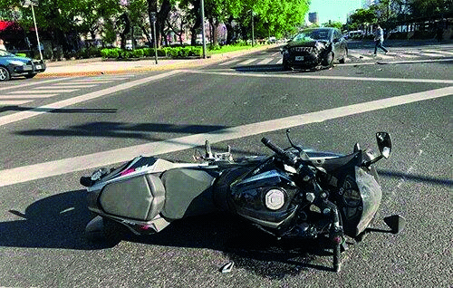

• Verdadero.

• Falso.
###### ID1

A:: =============================================  
Verdadero.

Q:: =============================================  

##### La Organización Mundial de la Salud manifiesta que el riesgo en la vía pública surge como resultado de diversos factores, ¿cuáles son?

A. Vehicular y Ambiental.
B. Humano y Vehicular.
C. Humano, Vehicular y Ambiental.
###### ID2

A:: =============================================  
C. Humano, Vehicular y Ambiental.

Q:: =============================================  

##### ¿A qué factor se deben la mayoría de los siniestros viales?

A. Al humano.
B. Al vehicular.
C. Al ambiental.
###### ID3

A:: =============================================  
A. Al humano.

Q:: =============================================  

##### A fin de aumentar la propia seguridad y la de los demás, ¿a qué se debería poner atención durante la circulación?

A. Al estado del pavimento y al clima, en especial.
B. A las condiciones en que se encuentran: el automóvil, la infraestructura vial, las condi- ciones climáticas y el conductor.
C. Ninguna de las anteriores.
###### ID4

A:: =============================================  
B. A las condiciones en que se encuentran: el automóvil, la infraestructura vial, las condi- ciones climáticas y el conductor.

Q:: =============================================  

##### El factor ambiental es el principal factor de riesgo ya que las colisiones, en su mayoría, se deben a las condiciones meteorológicas o del camino

• Verdadero.

• Falso.
###### ID5

A:: =============================================  
Falso.

Q:: =============================================  

##### Por lo general, las fallas mecánicas se deben a conductas negligentes por parte de los pro- pietarios de los vehículos, que no se ocupan de la verificación del estado de su automóvil

• Verdadero.

• Falso.
###### ID6

A:: =============================================  
Verdadero.

Q:: =============================================  

##### ¿A qué se denomina incidente de tránsito o incidente vial?

A. Hecho que puede ser evitado, en el cual se produce daño a persona o cosa, en ocasión de circulación en la vía pública.
B. Hecho impredecible e inevitable en ocasión de circulación en la vía pública.
C. Hecho, evitable o no, que involucra daños a terceros.
###### ID7

A:: =============================================  
A. Hecho que puede ser evitado, en el cual se produce daño a persona o cosa, en ocasión de circulación en la vía pública.

Q:: =============================================  

##### “Cada usuario de la vía pública es responsable de una parte del tránsito.” ¿Es correcta ésta premisa?

A. No, porque los que tienen responsabilidad son aquellos que conducen cualquier tipo de vehículo.
B. No, la responsabilidad la asumen aquellos que obtienen una licencia de conducir.
C. Sí, porque se está obligado a no causar peligro ni entorpecer la circulación.
###### ID8

A:: =============================================  
C. Sí, porque se está obligado a no causar peligro ni entorpecer la circulación.

Q:: =============================================  

##### “Como usuarios de la vía pública estamos obligados a no entorpecer injustificadamente la circulación y a no causar peligro, perjuicios o molestias innecesarias a las personas o daños a los bienes.” ¿Es correcta esta premisa?

A. Sí, independientemente del tipo de movilidad elegido.
B. No, los peatones son usuarios de la vía pública y no están obligados.
C. Sí pero sólo si estamos conduciendo un vehículo.
###### ID9

A:: =============================================  
A. Sí, independientemente del tipo de movilidad elegido.

Q:: =============================================  

##### Además de provocar víctimas fatales o lesionados graves, ¿qué otras consecuencias puede generar un siniestro de tránsito?

A. Daños materiales, costos sanitarios y administrativos.
B. Daños materiales y costos sanitarios.
C. Sólo daños materiales.
###### ID10

A:: =============================================  
A. Daños materiales, costos sanitarios y administrativos.

Q:: =============================================  

##### Todo usuario de la vía pública debe, como premisa básica…

A. Asumir la obligación de no entorpecer la circulación y no causar peligro, perjuicios o molestias innecesarias a las personas o daños a los bienes.
B. Acreditar experiencia de manejo en vehículos por más de un año.
C. Concurrir a cursos de actualización en temática vial, con una frecuencia no mayor a seis meses.
###### ID11

A:: =============================================  
A. Asumir la obligación de no entorpecer la circulación y no causar peligro, perjuicios o molestias innecesarias a las personas o daños a los bienes.

Q:: =============================================  

##### ¿Cuáles son los dos principios básicos de todo sistema de tránsito en el mundo?

A. Velocidad y confort.
B. Fluidez y seguridad.
C. Comodidad y agilidad.
###### ID12

A:: =============================================  
B. Fluidez y seguridad.

Q:: =============================================  

##### Indique cuál de las siguientes situaciones conlleva mayor probabilidad de siniestralidad


A. Opción A.
B. Opción B.
C. Ambas respuestas, A y B, son correctas.
###### ID13

A:: =============================================  
B. Opción B.

Q:: =============================================  

##### Indique cuál es la premisa correcta:

A. A menor cantidad de vehículos, mayor probabilidad de siniestralidad.
B. A mayor cantidad de vehículos, menor probabilidad de siniestralidad.
C. A menor cantidad de vehículos, menor probabilidad de siniestralidad.
###### ID14

A:: =============================================  
C. A menor cantidad de vehículos, menor probabilidad de siniestralidad.

Q:: =============================================  

##### ¿Cuál de las siguientes opciones representa a los usuarios de la vía, ordenados de más a menos vulnerable?

A. Camión - Colectivo - Moto - Ciclista - Peatón - Taxi/Automóvil.
B. Peatón - Ciclista - Moto - Colectivo - Taxi/Automóvil - Camión.
C. Peatón - Ciclista - Colectivo - Moto - Taxi/Automóvil - Camión.
###### ID15

A:: =============================================  
B. Peatón - Ciclista - Moto - Colectivo - Taxi/Automóvil - Camión.

Q:: =============================================  

##### USUARIOS DE BICICLETA ¿Qué se debe evitar al circular en bicicleta?

A. Usar auriculares y dispositivos electrónicos, que afecten la concentración.
B. Usar ropa oscura y suelta.
C. Ambas respuestas, A y B, son correctas.
###### ID16

A:: =============================================  
C. Ambas respuestas, A y B, son correctas.

Q:: =============================================  

##### ¿Está permitido llevar carga en una bicicleta?

A  Sí, lo único que se debe tener en cuenta es que no comprometa la visibilidad.
B. No, está prohibido ya que puede desestabilizar la bicicleta.
C. Sí, debe estar firmemente asegurada, permitiendo maniobrar y no perder la estabilidad
###### ID17

A:: =============================================  
C. Sí, debe estar firmemente asegurada, permitiendo maniobrar y no perder la estabilidad

Q:: =============================================  

##### El usuario de bicicleta, ¿tiene permitido llevar un pasajero?

A. Sí, únicamente si no compromete la visibilidad.
B. Sí, mientras que esté ubicado en un asiento adicional detrás del conductor.
C. Ambas respuestas, A y B, son incorrectas.
###### ID18

A:: =============================================  
B. Sí, mientras que esté ubicado en un asiento adicional detrás del conductor.

Q:: =============================================  

##### Un menor de 12 años puede circular en bicicleta por la calle

A. acompañado de un adulto mayor de 18 años.
B. Por la vereda, a la menor velocidad posible.
C. Ambas respuestas, A y B, son correctas.
###### ID19

A:: =============================================  
C. Ambas respuestas, A y B, son correctas.

Q:: =============================================  

##### ¿Cuál es la velocidad máxima permitida para circular con una bicicleta con asistencia eléc- trica ?

A. Debe cumplir con las mismas normas de velocidades que el resto de los vehículos.
B. 60 km/h.
C. 30 km/h.
###### ID20

A:: =============================================  
A. Debe cumplir con las mismas normas de velocidades que el resto de los vehículos.

Q:: =============================================  

##### ¿Qué indica una  demarcación horizontal verde?

A. Que en esa intersección hay una ciclovía o bicisenda.
B. Que se aproxima a un cruce ferroviario.
C. Que es un cruce exclusivo de peatones
###### ID21

A:: =============================================  
A. Que en esa intersección hay una ciclovía o bicisenda.

Q:: =============================================  

##### ¿Qué es una ciclovía

A. Sector señalizado especialmente en la calzada para la circulación con carácter prefe- rente de ciclorodados (bicicletas) y dispositivos de movilidad personal.
B. Sector de la calzada señalizado especialmente con una separación física o demarcación horizontal para la circulación exclusiva de ciclorodados (bicicletas) y dispositivos de movilidad personal.
C. Sector señalizado y especialmente acondicionado en aceras y espacios verdes para la circulación de ciclorodados (bicicletas) y dispositivos de movilidad personal.
###### ID22

A:: =============================================  
B. Sector de la calzada señalizado especialmente con una separación física o demarcación horizontal para la circulación exclusiva de ciclorodados (bicicletas) y dispositivos de movilidad personal.

Q:: =============================================  

##### ¿Cuál es la principal diferencia entre bicisendas y ciclovías?

A. La bicisenda es de uso exclusivo de bicicletas y la ciclovía de uso preferencial.
B. La bicisenda se encuentra sobre la calzada y la ciclovía sobre la vereda.
C. La bicisenda se encuentra sobre la vereda y la ciclovía sobre la calzada.
###### ID23

A:: =============================================  
C. La bicisenda se encuentra sobre la vereda y la ciclovía sobre la calzada.

Q:: =============================================  

##### Los ciclistas no están obligados a respetar todas las normas de tránsito, ya que no utilizan un vehículo que genera altas velocidades.

A. Verdadero.
B. Falso.
###### ID24

A:: =============================================  
B. Falso.

Q:: =============================================  

##### ¿Qué distancia lateral debe dejar respecto de este ciclista en caso de querer sobrepasarlo

A. Al menos, un metro y medio.
B. Al menos, medio metro.
C. Lo suficiente para no tocarlo.
###### ID25

A:: =============================================  
A. Al menos, un metro y medio.

Q:: =============================================  

##### ¿Es aconsejable circular en bicicleta de esta manera?

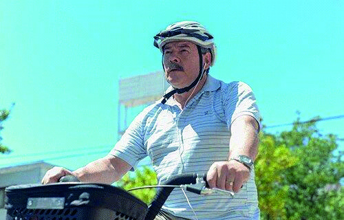

A. Sí, porque está conduciendo correctamente.
B. No, ya que utilizar auriculares es un factor de distracción que impide conectarse con lo que sucede alrededor.
C. Sí, ya que tiene las medidas de seguridad necesarias y el uso de los auriculares permite mejorar la calidad del viaje.
###### ID26

A:: =============================================  
B. No, ya que utilizar auriculares es un factor de distracción que impide conectarse con lo que sucede alrededor.

Q:: =============================================  

##### En cuanto a su indumentaria, ¿cuál de los dos ciclistas presenta menor riesgo de sufrir un siniestro vial?


A. La opción A, ya que al tener ropa clara es más visible.
B. Opción B, ya que al tener ropa oscura no genera distracciones en los demás conductores.
C. Ambas opciones presentan el mismo riesgo por igual.
###### ID27

A:: =============================================  
A. La opción A, ya que al tener ropa clara es más visible.

Q:: =============================================  

##### ¿Se puede circular en bicicleta por esta vía?


A. Sí, siempre que se mantenga en el carril derecho.
B. No, está prohibido.
C. Sí, mientras se respete la velocidad mínima de la arteria.
###### ID28

A:: =============================================  
B. No, está prohibido.

Q:: =============================================  

##### ¿Qué se debe evitar al circular en bicicleta?

A. Usar auriculares y dispositivos electrónicos, que afecten la concentración.
B. Usar ropa oscura y suelta.
C. Ambas respuestas, A y B, son correctas.
###### ID29

A:: =============================================  
C. Ambas respuestas, A y B, son correctas.

Q:: =============================================  

##### ¿Está permitido llevar carga en una bicicleta?

A. Sí, lo único que se debe tener en cuenta es que no comprometa la visibilidad.
B. No, está prohibido ya que puede desestabilizar la bicicleta.
C. Sí, debe estar firmemente asegurada, permitiendo maniobrar y no perder la estabilidad.
###### ID30

A:: =============================================  
C. Sí, debe estar firmemente asegurada, permitiendo maniobrar y no perder la estabilidad.

Q:: =============================================  

##### El ciclista, ¿tiene permitido llevar un pasajero?

A. Sí, únicamente si no compromete la visibilidad.
B. Sí, mientras que esté ubicado en un asiento adicional detrás del conductor.
C. Ambas respuestas, A y B, son incorrectas.
###### ID31

A:: =============================================  
B. Sí, mientras que esté ubicado en un asiento adicional detrás del conductor.

Q:: =============================================  

##### ¿Qué indica esta seña?


A. Giro a la izquierda.
B. Adelantamiento por la izquierda.
C. Detenerse.
###### ID32

A:: =============================================  
A. Giro a la izquierda.

Q:: =============================================  

##### ¿Qué indica esta seña?


A. Adelantamiento por la derecha.
B. Giro a la derecha.
C. Detenerse.
###### ID33

A:: =============================================  
B. Giro a la derecha.

Q:: =============================================  

##### ¿Qué indica esta seña?

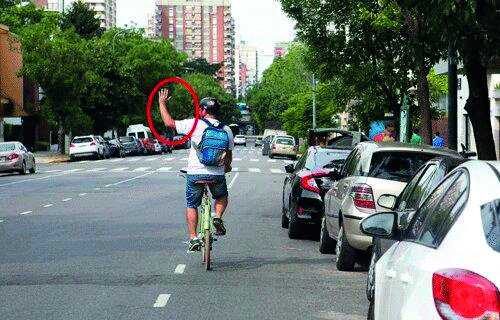

A. Giro a la izquierda.
B. Adelantamiento por la izquierda.
C. Detenerse.
###### ID34

A:: =============================================  
C. Detenerse.

Q:: =============================================  

##### Si usted pretende cruzar esta intersección, ¿hacia qué lado debe mirar?

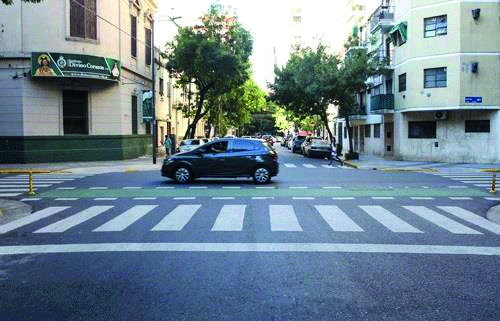

A. Hacia la derecha.
B. Hacia la izquierda.
C. Hacia ambos lados.
###### ID35

A:: =============================================  
C. Hacia ambos lados.

Q:: =============================================  

##### En esta situación, ¿es correcto que el vehículo avance?

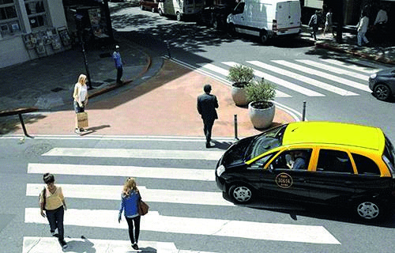

A. Sí, porque por allí no circulan peatones y no hay peligro.
B. No, porque aún hay peatones cruzando de un lado al otro de la arteria.
C. Sí, aunque haya peatones cruzando tiene el espacio suficiente para avanzar.
###### ID36

A:: =============================================  
B. No, porque aún hay peatones cruzando de un lado al otro de la arteria.

Q:: =============================================  

##### ¿Cómo debe proceder, si al llegar a esta intersección, se desea continuar en línea recta?

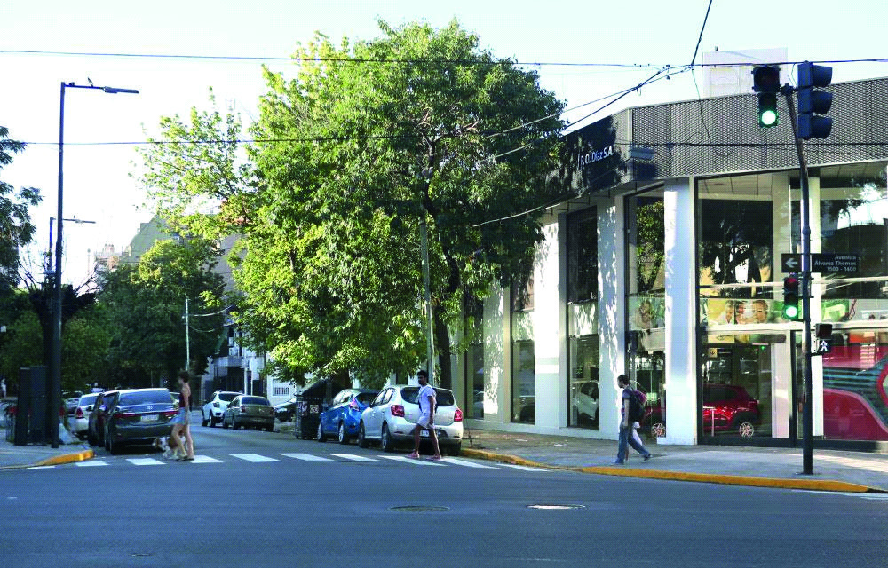

A. Detener el vehículo para que el peatón termine de cruzar y, antes de avanzar, hacer contacto visual con los peatones que aún no comenzaron a cruzar, aun sabiendo que obstruiré por un momento la bocacalle.
B. Avanzar porque la luz verde del semáforo me habilita pero tocando bocina para que los peatones no se distraigan. Es importante no obstruir la bocacalle.
###### ID37

A:: =============================================  
A. Detener el vehículo para que el peatón termine de cruzar y, antes de avanzar, hacer contacto visual con los peatones que aún no comenzaron a cruzar, aun sabiendo que obstruiré por un momento la bocacalle.

Q:: =============================================  

##### Desde el punto de vista del conductor frente a esta situación, ¿cuál es la acción adecuada?

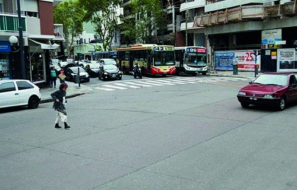

A. Esquivar a la peatona y tocarle bocina para que no se distraiga.
B. Frenar y esperar a que termine de cruzar la peatona, aun sabiendo que el vehículo pueda obstaculizar el flujo vehicular.
###### ID38

A:: =============================================  
B. Frenar y esperar a que termine de cruzar la peatona, aun sabiendo que el vehículo pueda obstaculizar el flujo vehicular.

Q:: =============================================  

##### Dadas las características de esta intersección, ¿el peatón también tiene prioridad?


A. No, pero si el peatón se encuentra cruzando, el conductor debe dejarlo pasar para no producir un siniestro vial.
B. Sí, siempre.
###### ID39

A:: =============================================  
B. Sí, siempre.

Q:: =============================================  

##### Frente a la siguiente situación, ¿qué actitud debe tomar usted como conductor?


A. Hacer contacto visual con la peatona y en el caso de que comience a cruzar cederle el paso.
B. Avanzar ya que se tiene prioridad sobre la peatona por circular desde la derecha.
C. Ambas respuestas, la A y la B, son incorrectas.
###### ID40

A:: =============================================  
A. Hacer contacto visual con la peatona y en el caso de que comience a cruzar cederle el paso.

Q:: =============================================  

##### Si ud. es el conductor del vehículo, ¿qué conducta debe adoptar en la siguiente situación?


A. Priorizar la circulación del peatón, indefectiblemente.
B. Realizar una guiñada para advertir su preferencia de avance.
C. Completar la maniobra como sea posible, para disminuir su tiempo de permanencia sobre la vereda.
###### ID41

A:: =============================================  
A. Priorizar la circulación del peatón, indefectiblemente.

Q:: =============================================  

##### En esta intersección, ¿quién tiene prioridad de paso?


A. El peatón.
B. El conductor.
C. Es indistinto.
###### ID42

A:: =============================================  
A. El peatón.

Q:: =============================================  

##### Cuando no hay demarcación de la senda peatonal, ¿por dónde deben cruzar los peatones?

A. Es indistinto, siempre que miren a ambos lados antes de hacerlo.
B. En coincidencia con las paradas de transporte.
C Por la esquina, por la prolongación longitudinal de la vereda sobre la calle.
###### ID43

A:: =============================================  
C Por la esquina, por la prolongación longitudinal de la vereda sobre la calle.

Q:: =============================================  

##### Como conductor, observa que esta luz se encuentra intermitente, ¿qué debería esperar que haga el peatón?


A. Que no comience a cruzar la calzada.
B. Si inició el cruce, que lo finalice con mucha precaución.
C. Ambas respuestas, la A y la B son correctas.
###### ID44

A:: =============================================  
C. Ambas respuestas, la A y la B son correctas.

Q:: =============================================  

##### ¿Qué indica la señal horizontal que se encuentra demarcada sobre la calzada?

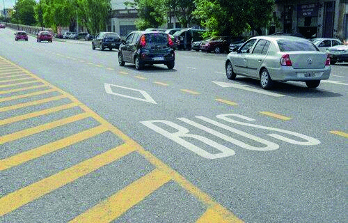

A. Carril exclusivo de colectivo de pasajeros.
B. Cruce exclusivo de vehículos de emergencia.
C. Ceda el paso.
###### ID45

A:: =============================================  
A. Carril exclusivo de colectivo de pasajeros.

Q:: =============================================  

##### ¿Qué son los carriles exclusivos?

A. Vías con un único sentido de circulación.
B. Bandas longitudinales demarcadas en la calzada, destinadas a la circulación de deter- minados vehículos.
C. Lugar por donde circulan ambulancias, bomberos y/o vehículos policiales, en cumpli- miento o no de sus funciones.
###### ID46

A:: =============================================  
B. Bandas longitudinales demarcadas en la calzada, destinadas a la circulación de deter- minados vehículos.

Q:: =============================================  

##### ¿Qué indica la demarcación horizontal que se visualiza en la imagen?

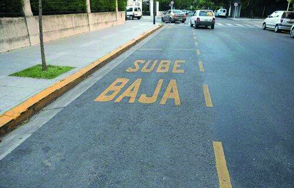

A. Estacionamiento para micros escolares.
B. Carril de detención para el ascenso y descenso de escolares.
C. Zona de ascenso y descenso de pasajeros de transporte público.
###### ID47

A:: =============================================  
B. Carril de detención para el ascenso y descenso de escolares.

Q:: =============================================  

##### La siguiente imagen corresponde a:


A. Calle Prioridad Peatón.
B. Calle con Intervención Peatonal.
C. Calle con Bicisenda.}
###### ID48

A:: =============================================  
A. Calle Prioridad Peatón.

Q:: =============================================  

##### ¿Para qué sirve la demarcación horizontal de color amarillo que se visualiza en la imagen?

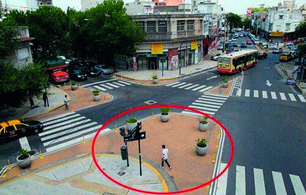

A. Ampliar la zona permitida de estacionamiento para motos.
B. Reducir la velocidad y radio de giro de los vehículos.
C. Ampliar la zona permitida de estacionamiento para vehículos de emergencia.
###### ID49

A:: =============================================  
B. Reducir la velocidad y radio de giro de los vehículos.

Q:: =============================================  

##### La señal que está presente en la imagen corresponde a las informativas que orientan al peatón.

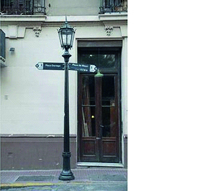

• Verdadero.

• Falso.
###### ID50

A:: =============================================  
Verdadero.

Q:: =============================================  

##### Preguntas para todas las clases: Seguridad ¿Qué debe hacer usted si su vehículo queda inmovilizado en un túnel?

A. Dejar el vehículo cerrado y salir del túnel cuanto antes.
B. Apagar todas las luces si el túnel está iluminado y solicitar auxilio a través del teléfono móvil.
C. Apagar el motor, colocar las balizas portátiles, mantener encendidas las luces de posi- ción e intermitentes y llamar al número de asistencia.
###### ID51

A:: =============================================  
C. Apagar el motor, colocar las balizas portátiles, mantener encendidas las luces de posi- ción e intermitentes y llamar al número de asistencia.

Q:: =============================================  

##### En caso de participar de un siniestro vial en una avenida, es recomendable señalizar la zona para que no se produzcan más incidentes viales.

• Verdadero.

• Falso.
###### ID52

A:: =============================================  
Verdadero.

Q:: =============================================  

##### En caso de un siniestro vial en este tipo de calle, ¿cómo es recomendable señalizar la zona del vehículo inmovilizado?


A. Se deben encender las luces bajas y, en lo posible, colocar balizas portátiles delante y detrás del mismo.
B. Se deben encender las luces altas y, en lo posible, colocar balizas portátiles detrás del mismo.
C. Se deben encender las balizas y, en lo posible, colocar balizas portátiles del lado de don- de provienen los vehículos a una distancia adecuada del vehículo.
###### ID53

A:: =============================================  
C. Se deben encender las balizas y, en lo posible, colocar balizas portátiles del lado de don- de provienen los vehículos a una distancia adecuada del vehículo.

Q:: =============================================  

##### En el caso de que un vehículo quede inmovilizado por un siniestro vial o desperfecto mecánico en los carriles marcados de esta vía, ¿qué es recomendable hacer?

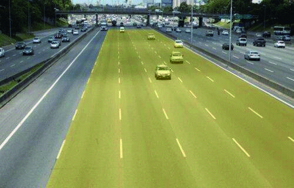

A. Colocar las balizas portátiles, ponerse a resguardo detrás de una defensa si las hubiere y llamar al número de emergencia de la Autopista.
B. Descender del vehículo usando un chaleco reflectante para hacer señas al resto de los vehículos y llamar al número de emergencia de la Autopista.
C. Permanecer dentro del vehículo con el cinturón de seguridad abrochado, encender las balizas y llamar al número de emergencia de la Autopista.
###### ID54

A:: =============================================  
C. Permanecer dentro del vehículo con el cinturón de seguridad abrochado, encender las balizas y llamar al número de emergencia de la Autopista.

Q:: =============================================  

##### En caso de un siniestro vial o desperfecto mecánico, ¿qué es recomendable hacer cuando el vehículo queda inmovilizado en el sector señalado?

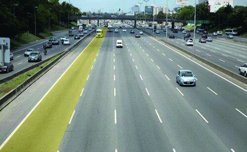

A. Encender las luces intermitentes, colocar las balizas portátiles y llamar al número de emergencia de la Autopista.
B. Descender del vehículo usando un chaleco reflectante y ponerse a resguardo detrás de una defensa si las hubiere.
C. Ambas respuestas, la A y la B, son correctas.
###### ID55

A:: =============================================  
C. Ambas respuestas, la A y la B, son correctas.

Q:: =============================================  

##### En un procedimiento judicial de un siniestro vial, al ser convocados en carácter de testigo, no es obligatorio presentarse a declarar en la Fiscalía correspondiente.

• Verdadero.

• Falso.
###### ID56

A:: =============================================  
Falso.

Q:: =============================================  

##### La persona que se da a la fuga en un siniestro vial, dejando a alguien herido, puede ser juzgada por el delito de abandono de persona.

• Verdadero.

• Falso.
###### ID57

A:: =============================================  
Verdadero.

Q:: =============================================  

##### En caso de participar de un siniestro vial, ¿de cuánto tiempo se dispone para dar aviso sobre el hecho a la compañía aseguradora del vehículo?

A. 24 horas.
B. 48 horas.
C. 72 horas.
###### ID58

A:: =============================================  
C. 72 horas.

Q:: =============================================  

##### En caso de participar en un siniestro vial, en el que resultaron personas heridas, el personal policial que acuda al lugar se encargará de preservar la escena del hecho, brindando los medios para que los servicios de emergencia atiendan a los heridos y resguardando los vehículos y otras pruebas del incidente para una adecuada resolución del caso.

• Verdadero.

• Falso.
###### ID59

A:: =============================================  
Verdadero.

Q:: =============================================  

##### En caso de participar en un siniestro vial, ¿qué es recomendable hacer como primer paso?

A. Detenerse inmediatamente y permanecer en el lugar del hecho.
B. Conducir hasta la comisaría más cercana.
C. Llamar al 911 y continuar el viaje.
###### ID60

A:: =============================================  
A. Detenerse inmediatamente y permanecer en el lugar del hecho.

Q:: =============================================  

##### En caso de siniestro, el orden de actuación recomendado es…

A. Alertar - Socorrer - Proteger.
B. Proteger - Alertar - Socorrer.
C. Socorrer - Proteger - Alertar.
###### ID61

A:: =============================================  
B. Proteger - Alertar - Socorrer.

Q:: =============================================  

##### ¿Qué obligaciones impone la ley a aquel conductor que participe de un siniestro?

A. Detenerse inmediatamente, solicitar auxilio para atender a las víctimas si las hubiera y brindar su colaboración para evitar mayores daños para la circulación.
B. Suministrar sus datos personales, del vehículo, de la licencia de conducir y del seguro obligatorio a los demás siniestrados y a la autoridad interviniente.
C. Ambas respuestas, A y B, son correctas.
###### ID62

A:: =============================================  
C. Ambas respuestas, A y B, son correctas.

Q:: =============================================  

##### ¿Quién es el responsable civil por un incidente de tránsito producido por un menor de edad poseedor de una licencia de conducir?

A. El que firmó la autorización para obtener la licencia.
B. El que lo acompaña.
C. El que le autorizó el uso del vehículo.
###### ID63

A:: =============================================  
A. El que firmó la autorización para obtener la licencia.

Q:: =============================================  

##### En materia de Responsabilidad Civil, ¿qué es lo que se considera como factor determinante para dar inicio a una demanda?

A. La intención de la conducta dañosa.
B. La existencia de un daño real, que afecte a algún particular, provocado como consecuen- cia del incidente
C. Los antecedentes de la persona que provoca el daño.
###### ID64

A:: =============================================  
B. La existencia de un daño real, que afecte a algún particular, provocado como consecuen- cia del incidente

Q:: =============================================  

##### Frente a un incidente de tránsito, ¿puede transferirse la Responsabilidad Penal del conductor de un vehículo al dueño del mismo?

A. No, porque la responsabilidad penal es intransferible.
B. Sí. Además, del dueño también puede transferirse a la Compañía de Seguros.
C. Lo resolverá el Juez, en función de la gravedad del incidente y sus consecuencias.
###### ID65

A:: =============================================  
A. No, porque la responsabilidad penal es intransferible.

Q:: =============================================  

##### En un incidente de tránsito, ¿qué significa que el conductor sea considerado responsable por negligencia?

A. Que no ha respondido adecuadamente a una circunstancia del tránsito por falta de prác- tica en la conducción.
B. Que ha realizado un acto con su vehículo que las reglas de prudencia indican no hacer, o sea, que ha actuado peligrosamente.
C. Que ha actuado no conforme a las exigencias de la Ley.
###### ID66

A:: =============================================  
C. Que ha actuado no conforme a las exigencias de la Ley.

Q:: =============================================  

##### Preguntas para todas las clases: Documentación Al tener la licencia vencida, ¿por cuánto tiempo puede seguir conduciendo sin estar en infracción?

A. 30 días corridos desde su vencimiento.
B. Hasta las 00 horas del día de cumpleaños.
C. No está permitido conducir con la licencia vencida.
###### ID67

A:: =============================================  
C. No está permitido conducir con la licencia vencida.

Q:: =============================================  

##### En caso de comprobar una falta, ¿puede un agente de tránsito retener la licencia de conducir?

A. No, porque es un documento personal.
B. Sólo en los casos que la normativa vigente así lo indique.
C. Sólo en casos de incidentes que involucren a terceros.
###### ID68

A:: =============================================  
B. Sólo en los casos que la normativa vigente así lo indique.

Q:: =============================================  

##### Cuando se vence la licencia de conducir, ¿cuánto tiempo puede transcurrir para su renovación antes de que se necesite tramitarla como si fuese un otorgamiento?

A. 30 días corridos desde su vencimiento.
B. Para que se la pueda renovar, siempre debe hacerse antes de su vencimiento. Una vez vencida se la debe tramitar como licencia nueva.
C. 90 días corridos desde su vencimiento.
###### ID69

A:: =============================================  
C. 90 días corridos desde su vencimiento.

Q:: =============================================  

##### ¿Cuánto dura en su totalidad la condición de principiante?

A. 2 años, sólo en el caso de los menores de 21 años de edad.
B. 6 meses, sólo para quien la tramita por primera vez.
C. 1 año, independientemente de la edad.
###### ID70

A:: =============================================  
B. 6 meses, sólo para quien la tramita por primera vez.

Q:: =============================================  

##### Con esta documentación, ¿quién está autorizado a conducir el vehículo?


A. Nadie, porque está vencida y debe renovarse.
B. Sólo el titular.
C. El titular y sus familiares directos, por tener el mismo apellido.
###### ID71

A:: =============================================  
A. Nadie, porque está vencida y debe renovarse.

Q:: =============================================  

##### ¿Cuántas “cédulas para autorizados a conducir” podrán otorgarse para un mismo vehículo?

A. Sólo una.
B. La cantidad que solicite el titular del vehículo.
C. Hasta cinco.
###### ID72

A:: =============================================  
B. La cantidad que solicite el titular del vehículo.

Q:: =============================================  

##### ¿Se puede manejar un vehículo con “cédula para autorizado a conducir” a nombre de otra persona?

A. Siempre y cuando se encuentre vigente.
B. Sólo si es un familiar directo o tiene una relación laboral.
C. En ningún caso.
###### ID73

A:: =============================================  
C. En ningún caso.

Q:: =============================================  

##### El certificado del seguro de responsabilidad civil es obligatorio llevarlo ÚNICAMENTE cuando se conduce por vías interurbanas.

• Verdadero.

• Falso.
###### ID74

A:: =============================================  
Falso.

Q:: =============================================  

##### Todo vehículo debe estar cubierto por un seguro, ¿qué daños mínimamente debe cubrir?

A. Eventuales daños causados a terceros transportados únicamente.
B. Eventuales daños causados a terceros transportados o no.
C. Daños causados a los vehículos únicamente.
###### ID75

A:: =============================================  
B. Eventuales daños causados a terceros transportados o no.

Q:: =============================================  

##### ¿Está permitido circular con la placa de dominio de este modo?


A. Sí, ya que exhibe una documentación provisoria.
B. No, ya que para poder cumplir su función como provisoria debe ampliarse.
C. No, ya que debe estar colocada en el lugar y de forma reglamentaria.
###### ID76

A:: =============================================  
C. No, ya que debe estar colocada en el lugar y de forma reglamentaria.

Q:: =============================================  

##### Al sufrir la pérdida de la placa de dominio de un vehículo, ¿dónde se puede solicitar su reposición?

A. Se la puede solicitar en cualquier establecimiento comercial que la realice.
B. Se la debe solicitar en el Registro Nacional de la Propiedad del Automotor que corres- ponde al vehículo.
C. Ambas respuestas, la A y la B, son correctas.
###### ID77

A:: =============================================  
B. Se la debe solicitar en el Registro Nacional de la Propiedad del Automotor que corres- ponde al vehículo.

Q:: =============================================  

##### La ubicación y posición de las placas de dominio del vehículo, ¿puede sufrir algún tipo de modificación?

A. Sólo pueden, eventualmente, ampliarse para mejorar su visibilidad.
B. No, deben estar colocadas en el lugar y de forma reglamentaria.
C. Sólo está prohibido modificar la placa de dominio trasera, no así la delantera.
###### ID78

A:: =============================================  
B. No, deben estar colocadas en el lugar y de forma reglamentaria.

Q:: =============================================  

##### ¿Cuál es el objetivo de la Verificación Técnica Vehicular?

A. Reducir la contaminación y mejorar la calidad del medio ambiente.
B. Garantizar el cumplimiento de las normas de seguridad de los vehículos.
C. Ambas respuestas, la A y la B, son correctas.
###### ID79

A:: =============================================  
C. Ambas respuestas, la A y la B, son correctas.

Q:: =============================================  

##### El titular de una licencia de conducir debe informar todo cambio de datos consignados en la misma, en especial si realiza cambio de domicilio, tiene un plazo máximo de:

A. 90 días de producido el cambio
B. 30 días de producido el cambio
C. 60 días de producido el cambio
###### ID80

A:: =============================================  
A. 90 días de producido el cambio

Q:: =============================================  

##### Marque la documentación obligatoria que debe portar el conductor de un vehículo

A. Título de propiedad del vehículo, D.N.I, comprobante de verificación técnica.
B. Carnet de manejar, botiquín de primeros auxilios, comprobante de patentes pagas.
C. Póliza de seguro vigente, tarjeta verde, licencia de conducir habilitante, DNI, Grabado de autopartes y vtv.
###### ID81

A:: =============================================  
C. Póliza de seguro vigente, tarjeta verde, licencia de conducir habilitante, DNI, Grabado de autopartes y vtv.

Q:: =============================================  

##### Si los datos de  la licencia de conducir no coinciden con los datos del DNI…

A. No ocurre absolutamente nada.
B. La licencia está vigente de todos modos.
C. La licencia se encuentra caduca. Salvo que no aun este vigente el plazo de gracias de los 90 dias.
###### ID82

A:: =============================================  
C. La licencia se encuentra caduca. Salvo que no aun este vigente el plazo de gracias de los 90 dias.

Q:: =============================================  

##### Al tener la licencia vencida, ¿por cuánto tiempo puede seguir conduciendo sin estar en infracción

A. 30 días corridos desde su vencimiento.
B. Hasta las 00 horas del día de cumpleaños.
C. No está permitido conducir con la licencia vencida, excepto que el vencimiento fuese un día inhábil, en cuyo caso se traslada al día hábil siguiente.
###### ID83

A:: =============================================  
C. No está permitido conducir con la licencia vencida, excepto que el vencimiento fuese un día inhábil, en cuyo caso se traslada al día hábil siguiente.

Q:: =============================================  

##### ¿Cuántas “cédulas para autorizados a conducir” podrán otorgarse para un mismo vehículo?

A. Sólo una.
B. La cantidad que solicite el titular del vehículo.
C. Hasta cinco.
###### ID84

A:: =============================================  
B. La cantidad que solicite el titular del vehículo.

Q:: =============================================  

##### ¿Se puede manejar un vehículo con “cédula azul ” a nombre de otra persona?

A. Siempre y cuando se encuentre vigente.
B. Sólo si es un familiar directo o tiene una relación laboral.
C. En ningún caso.
###### ID85

A:: =============================================  
C. En ningún caso.

Q:: =============================================  

##### En caso de comprobar una falta, ¿puede un agente de tránsito retener la licencia de conducir?

A. No, porque es un documento personal.
B. Sólo en los casos que la normativa vigente así lo indique.
C. Sólo en casos de incidentes que involucren a terceros.
###### ID86

A:: =============================================  
B. Sólo en los casos que la normativa vigente así lo indique.

Q:: =============================================  

##### Preguntas para todas las clases: intoxicación y otros factores de riesgo en la  conducción ¿Consumir cuál de estas sustancias pueden afectar la capacidad para conducir?

A. Las drogas ilegales y algunas legales (como el alcohol y algunos medicamentos).
B. Sólo las drogas ilegales.
C. Todo tipo de drogas (las legales e ilegales).
###### ID87

A:: =============================================  
A. Las drogas ilegales y algunas legales (como el alcohol y algunos medicamentos).

Q:: =============================================  

##### La persona que conduce bajo los efectos de estupefacientes…

A. Se pone en grave riesgo a sí mismo y a todos los que lo rodean.
B. Sólo pone en riesgo su propia vida.
C. Al estar desinhibido, asume menos riesgos.
###### ID88

A:: =============================================  
A. Se pone en grave riesgo a sí mismo y a todos los que lo rodean.

Q:: =============================================  

##### ¿Cuál de estas sustancias pueden afectar negativamente la capacidad de conducir?

A. Todos los medicamentos, de venta libre, que no necesitan receta.
B. Todos los medicamentos con efectos sedantes.
C. Ambas respuestas, la A y la B, son correctas.
###### ID89

A:: =============================================  
B. Todos los medicamentos con efectos sedantes.

Q:: =============================================  

##### El consumo de medicamentos, ¿puede afectar la capacidad de conducir?

• Siempre.

• Nunca.

• Depende del tipo de medicamento.
###### ID90

A:: =============================================  
Depende del tipo de medicamento.

Q:: =============================================  

##### Por los efectos que provoca, el consumo de drogas ilegales no está permitido al momento de conducir; mientras que las drogas legales nunca afectan negativamente la capacidad de conducir.

• Verdadero.

• Falso.
###### ID91

A:: =============================================  
Falso.

Q:: =============================================  

##### Cuando se consume alcohol, ¿se pueden producir alteraciones en la visión?

• Sí.

• No, solamente afecta a la capacidad motora.

• Sólo cuando se tiene más de 1 gramo de alcohol por litro de sangre.
###### ID92

A:: =============================================  
Sí.

Q:: =============================================  

##### Una vez que dejó de ingerir alcohol, ¿qué sucede con la concentración de alcohol que tiene en su organismo?

A. Comienza a disminuir de forma inmediata.
B. Continúa subiendo durante 1 hora y luego comienza a descender paulatinamente.
C. Se mantiene en el mismo valor durante 1 hora y luego comienza a descender.
###### ID93

A:: =============================================  
B. Continúa subiendo durante 1 hora y luego comienza a descender paulatinamente.

Q:: =============================================  

##### Consumir cerveza influye en la conducción de un vehículo, haciendo que el conductor reduzca su capacidad de reacción y aumentando el tiempo necesario para responder ante un estímulo.

• Verdadero.

• Falso.
###### ID94

A:: =============================================  
Verdadero.

Q:: =============================================  

##### Conducir al día siguiente de una noche de consumo excesivo de alcohol es riesgoso porque:

A. Los efectos del alcohol no terminan con la ingesta, sino que se extienden hasta haberlo eliminado del organismo.
B. Conducir con resaca es equiparable, por sus efectos en el organismo, a conducir alco- holizado.
C. Ambas respuestas, la A y la B, son correctas.
###### ID95

A:: =============================================  
C. Ambas respuestas, la A y la B, son correctas.

Q:: =============================================  

##### ¿La resaca tiene efectos en el organismo que puedan afectar la conducción?

A. Sí, pero sólo cuando la bebida alcohólica que se ingirió tiene un alto grado de concen- tración.
B. No, el nivel de alcohol se ve reducido en cuestión de horas, por ello conducir con resaca no altera las percepciones.
C. Sí, puede afectar la coordinación, la atención y el tiempo de reacción.
###### ID96

A:: =============================================  
C. Sí, puede afectar la coordinación, la atención y el tiempo de reacción.

Q:: =============================================  

##### ¿Es peligroso conducir con resaca?

A. Sí, es peligroso porque tiene efectos en el organismo.
B. No, ya que los efectos del alcohol aparecen durante las primeras horas de su ingesta.
C. No, ya que los efectos de la resaca no intervienen en la conducción.
###### ID97

A:: =============================================  
A. Sí, es peligroso porque tiene efectos en el organismo.

Q:: =============================================  

##### Si el conductor de un vehículo se niega a realizar este test, ¿constituye ésto una falta?

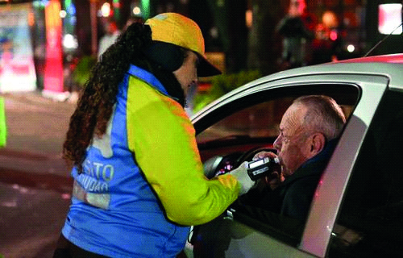

A. Sólo si se ha participado de un siniestro vial.
B. No. Sólo la prueba positiva, efectivamente realizada, se considera una falta.
C. Sí, la misma se toma como una presunción de alcoholemia positiva.
###### ID98

A:: =============================================  
C. Sí, la misma se toma como una presunción de alcoholemia positiva.

Q:: =============================================  

##### Frente a la negativa por parte del conductor a realizar una prueba de alcoholemia, ¿el agente de control podrá prohibirle continuar conduciendo?

A. Sí, ya que se presume el estado de alcoholemia positiva.
B. Sí, deberá ordenar la remoción del vehículo.
C. Ambas respuestas, la A y la B, son correctas.
###### ID99

A:: =============================================  
C. Ambas respuestas, la A y la B, son correctas.

Q:: =============================================  

##### ¿cuál es el nivel máximo de alcoholemia admitido para un conductor profesional?

A. 0,5 gramos de alcohol por litro de sangre.
B. 0,0 gramos de alcohol por litro de sangre.
C. 0,2 gramos de alcohol por litro de sangre.
###### ID100

A:: =============================================  
B. 0,0 gramos de alcohol por litro de sangre.

Q:: =============================================  

##### ¿Cuál es el nivel máximo de alcoholemia admitido para el conductor del vehículo que se visualiza en la imagen?

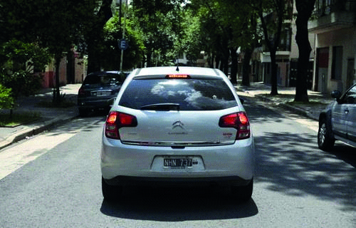

A. 0,5 gramos de alcohol por litro de sangre.
B. 0,0 gramos de alcohol por litro de sangre.
C. 0,2 gramos de alcohol por litro de sangre.
###### ID101

A:: =============================================  
A. 0,5 gramos de alcohol por litro de sangre.

Q:: =============================================  

##### ¿Cada cuánto tiempo es recomendable parar si se realiza un viaje largo?

A. Cada 2 horas aproximadamente.
B. Cada 4 horas aproximadamente.
C. Cada 1 hora aproximadamente.
###### ID102

A:: =============================================  
A. Cada 2 horas aproximadamente.

Q:: =============================================  

##### Si se va a conducir por un largo tiempo, lo recomendable es dormir la noche anterior...

A. Aproximadamente 8 horas.
B. Al menos 4 horas.
C. Algunas horas, su cantidad no influye en la conducción ya que lo importante es realizar paradas de descanso.
###### ID103

A:: =============================================  
A. Aproximadamente 8 horas.

Q:: =============================================  

##### ¿Estar 17 horas despierto provoca tener el mismo nivel de reacción que una persona con un nivel de alcohol en sangre mayor al permitido por Ley?

A. Sí, ya que ambas condiciones aumentan el tiempo de reacción.
B. No, ya que sólo tener alcoholemia positiva aumenta el tiempo de reacción.
C. No, el descanso no tiene nada que ver con el consumo de alcohol.
###### ID104

A:: =============================================  
A. Sí, ya que ambas condiciones aumentan el tiempo de reacción.

Q:: =============================================  

##### El cansancio puede verse inducido por ingerir:

A. Bebidas alcohólicas.
B. Comidas abundantes.
C. Ambas respuestas, la A y la B, son correctas.
###### ID105

A:: =============================================  
C. Ambas respuestas, la A y la B, son correctas.

Q:: =============================================  

##### ¿Cuáles de éstos son los síntomas que advierten sobre la fatiga en la conducción?

A. La sensación de euforia.
B. La visión borrosa y el aumento del número y duración de parpadeos.
C. No realizar movimientos en el asiento, ni cambios de postura.
###### ID106

A:: =============================================  
B. La visión borrosa y el aumento del número y duración de parpadeos.

Q:: =============================================  

##### Un conductor principiante, ¿puede sentirse más fácilmente fatigado?

A. Sí, por la falta de experiencia en la conducción.
B. No, porque todos somos iguales ante la Ley.
C. Únicamente cuando se trata de una persona que padece de fatiga crónica.
###### ID107

A:: =============================================  
A. Sí, por la falta de experiencia en la conducción.

Q:: =============================================  

##### ¿Por qué es peligroso conducir cansado?

A. Porque reduce la capacidad de reacción y aumenta el tiempo necesario para responder ante un estímulo.
B. Porque se circula más rápido.
C. Porque el viaje dura más.
###### ID108

A:: =============================================  
A. Porque reduce la capacidad de reacción y aumenta el tiempo necesario para responder ante un estímulo.

Q:: =============================================  

##### ¿Qué consecuencias tiene conducir habiendo dormido pocas horas previamente?

A. Reduce la capacidad de reacción y el estado de alerta.
B. Predispone a tomar malas decisiones, poniendo en riesgo la vida.
C. Ambas respuestas, la A y la B, son correctas.
###### ID109

A:: =============================================  
C. Ambas respuestas, la A y la B, son correctas.

Q:: =============================================  

##### Para evitar o retrasar la aparición de la fatiga, es aconsejable que el conductor:

A. Escuche música a alto volúmen.
B. Mantenga el interior del vehículo a una temperatura superior a 25 °C.
C. Mantenga bien ventilado el interior del vehículo.
###### ID110

A:: =============================================  
C. Mantenga bien ventilado el interior del vehículo.

Q:: =============================================  

##### ¿Puede afectar negativamente la conducción, si el acompañante comienza una discusión con el conductor o con otra persona de la vía pública?

A. Sólo si es con el conductor. Si la discusión es con otra persona, lo mantiene en alerta ya que la tensión evita la somnolencia.
B. Sí, puede entorpecer su capacidad de atención al contexto, ya que las discusiones gene- ran un estado de estrés.
C. No genera ningún efecto, siempre y cuando el conductor esté en condiciones legales para conducir.
###### ID111

A:: =============================================  
B. Sí, puede entorpecer su capacidad de atención al contexto, ya que las discusiones gene- ran un estado de estrés.

Q:: =============================================  

##### Bajo los efectos del estrés, la conducción se vuelve:

A. Más temeraria.
B. Menos segura.
C. Ambas respuestas, A y B, son correctas.
###### ID112

A:: =============================================  
C. Ambas respuestas, A y B, son correctas.

Q:: =============================================  

##### El estrés no necesariamente puede alterar las capacidades para conducir de manera segura.

• Verdadero.

• Falso.
###### ID113

A:: =============================================  
Falso.

Q:: =============================================  

##### ¿Cuál es el tiempo promedio de reacción de un conductor desde que percibe un peligro hasta que acciona el freno?

A. Aproximadamente 1 segundo.
B. Entre 2 y 3 segundos.
C. Es inmediato, no transcurre tiempo entre estas acciones.
###### ID114

A:: =============================================  
A. Aproximadamente 1 segundo.

Q:: =============================================  

##### Durante esta situación, ¿es riesgoso que el conductor utilice el teléfono celular?


A. No, ya que no hay otros vehículos junto a él.
B. Sí, ya que a pesar de estar detenido, está en la vía de circulación y su atención no está dirigida al contexto.
C. No, ya que el vehículo no está en movimiento.
###### ID115

A:: =============================================  
B. Sí, ya que a pesar de estar detenido, está en la vía de circulación y su atención no está dirigida al contexto.

Q:: =============================================  

##### ¿Cuál de estos sistemas de comunicación telefónica no es considerado riesgoso al momento de conducir un vehículo?

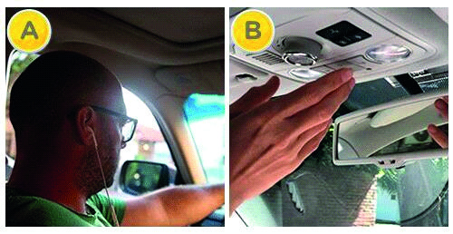

A. Opción A. Ya que al utilizar un sólo auricular la audición no se encuentra afectada.
B. Opción B. Ya que al activar el manos libres las manos quedan disponibles para la con- ducción.
C. Ambos sistemas son riesgosos.
###### ID116

A:: =============================================  
C. Ambos sistemas son riesgosos.

Q:: =============================================  

##### La siguiente acción del conductor, ¿es considerada un factor de riesgo?

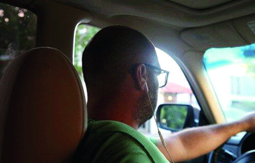

A. No, ya que el conductor no está utilizando sus manos para mantener una comunicación telefónica.
B. Sí, sólo cuando circula a altas velocidades.
C. Sí, porque interfiere en su atención al contexto.
###### ID117

A:: =============================================  
C. Sí, porque interfiere en su atención al contexto.

Q:: =============================================  

##### La siguiente acción del conductor es riesgosa porque:


A. Disminuye su capacidad atencional, limita el sentido de la audición, reduce la capacidad de reacción y aumenta el tiempo necesario para responder ante un estímulo.
B. El conductor debe mantener ambas manos comprometidas en la acción de conducir y al manipularlo, reduciría su capacidad para maniobrar.
C. Ambas respuestas, la A y la B, son correctas.
###### ID118

A:: =============================================  
C. Ambas respuestas, la A y la B, son correctas.

Q:: =============================================  

##### ¿Se encuentra prohibida la acción de la persona señalada con el círculo rojo?

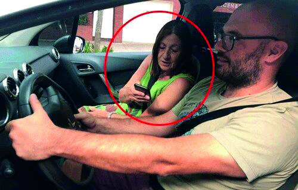

A. Sí, porque se encuentra en el asiento delantero.
B. No, porque la prohibición del uso de telefonía celular alcanza sólo al conductor del ve- hículo.
C. Sí, su uso se encuentra prohibido para todos los ocupantes del vehículo.
###### ID119

A:: =============================================  
B. No, porque la prohibición del uso de telefonía celular alcanza sólo al conductor del ve- hículo.

Q:: =============================================  

##### Si un conductor necesita realizar una llamada de urgencia con el teléfono celular, ¿qué debe hacer para no generar una situación de riesgo en la vía pública?

A. Colocar balizas y detenerse en un lugar donde esté permitido.
B. Ocupar el carril derecho, para circular a baja velocidad, y utilizar las balizas.
C. Al tratarse de una llamada de urgencia, no importa donde se realice.
###### ID120

A:: =============================================  
A. Colocar balizas y detenerse en un lugar donde esté permitido.

Q:: =============================================  

##### La presente conducta, ¿es riesgosa al momento de conducir?

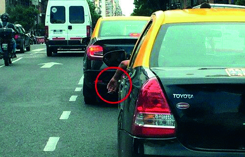

A. Sí, porque es considerado un factor de distracción.
B. Únicamente si se circula a altas velocidades.
C. Al contrario, ayuda a mantener la atención en la conducción.
###### ID121

A:: =============================================  
A. Sí, porque es considerado un factor de distracción.

Q:: =============================================  

##### La acción que se presenta en la imagen es considerada riesgosa para la conducción de un vehículo.


• Verdadero.

• Falso.
###### ID122

A:: =============================================  
Verdadero.

Q:: =============================================  

##### La acción que realiza el conductor en la imagen es riesgosa para la conducción.

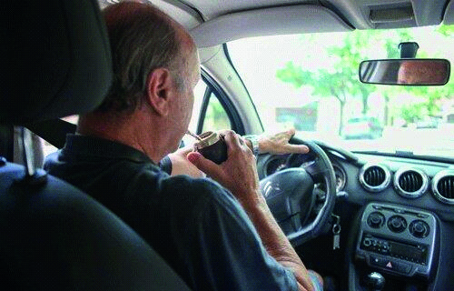

• Verdadero.

• Falso.
###### ID123

A:: =============================================  
Verdadero.

Q:: =============================================  

##### ¿Cuáles de las siguientes acciones son consideradas factores de distracción cuando se conduce un vehículo?

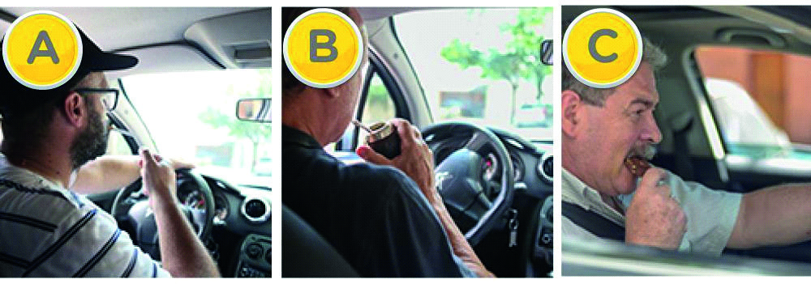

A. Las opciones A, B y C.
B. Las opciones A y C.
C. Las opciones B y C.
###### ID124

A:: =============================================  
A. Las opciones A, B y C.

Q:: =============================================  

##### Preguntas para todas las Clases: varias 1) La Verificación Técnica vehicular:

A. Es obligatoria para todos los vehículos.
B. Solamente para los destinados a transporte
C. Para todos los vehículos, excepto las motos, triciclos y cuatriciclos.
###### ID125

A:: =============================================  
A. Es obligatoria para todos los vehículos.

Q:: =============================================  

##### ¿Cuales de los siguientes requisitos resultan obligatorios para circular?

A. Cedula de identificacion del vehiculo.
B. Titulo de propiedad del vehiculo.
C. Comprobante de poliza del seguro vigente .
D. Revision tecnica obligatoria/ verificacion tecnica obligatoria.
E. Licencia de Conducir.
F. Libreta sanitaria.
G. Comprobante de la última patente del vehículo pago.
###### ID126

A:: =============================================  
E. Licencia de Conducir.

Q:: =============================================  

##### Indique cuales son  los 5 factores que afectan las condiciones fisicas al conducir:

A. Cansancio.
B. Uso de calzado inapropiado.
C. Uso del celular.
D. El sol.
E. Bebidas alcoholicas.
F. Drogas.
G. Medicamentos.
H. El frio.
###### ID127

A:: =============================================  
G. Medicamentos.

Q:: =============================================  

##### Los datos en consignados en la licencia de Conducir:

A. Todo dato del conductor que se encuentra en la Licencia debe estar actualizado.
B. Sólo los datos referentes a nombre y domicilio del conductor.
C. Sólo deben actualizar los datos los conductores profesionales.
###### ID128

A:: =============================================  
A. Todo dato del conductor que se encuentra en la Licencia debe estar actualizado.

Q:: =============================================  

##### ¿ Que funcion cumplen las señales de prevencion?

A. Indican lo que se puede hacer o lo que esta prohibido hacer durante la circulacion.
B. Avisan sobre riesgos eventuales al circular por la calle.
C. Informan sobre destinos y servicios.
###### ID129

A:: =============================================  
B. Avisan sobre riesgos eventuales al circular por la calle.

Q:: =============================================  

##### ¿A que grupo de señales pertenecen las que son (en su mayoria) de forma redonda, de colores rojas y blancas y figura negra? (Pregunta de carácter eliminatorio)

A. De informacion.
B. De reglamentacion.
C. De prevencion.
###### ID130

A:: =============================================  
B. De reglamentacion.

Q:: =============================================  

##### Si desea girar a la izquierda desde una calle de sentido único, ¿qué maniobra debe realizar?

A. Debo acercar el automóvil al centro de la calle y luego girar.
B. Debo acercarme al cordón de la misma mano para luego girar.
C. Debo acercar el automóvil a la derecha y luego girar.
###### ID131

A:: =============================================  
B. Debo acercarme al cordón de la misma mano para luego girar.

Q:: =============================================  

##### ¿En qué circunstancias está permitido circular sin respetar distancias prudentes con el vehículo que va adelante? (Bahia Blanca)

A. Transitando vías multicarriles.
B. En toda circunstancia, si no se trata de vehículos de carga.
C. Está prohibido en toda circunstancia.
###### ID132

A:: =============================================  
C. Está prohibido en toda circunstancia.

Q:: =============================================  

##### ¿En qué circunstancia está permitido circular marcha atrás?:( Bahia Blanca) (para todas las clases menos para moto)

A. Al salir de garajes.
B. En calles de tierra.
C. En garajes y calles de tierra.
###### ID133

A:: =============================================  
A. Al salir de garajes.

Q:: =============================================  

##### Comprobante de Seguro:

A. Es optativo circular con el comprobante de seguro
B. Es obligatorio circular con el comprobante de seguro.
C. Es obligatorio circular con el comprobante de seguro sólo en caso de conductores pro- fesionales.
###### ID134

A:: =============================================  
B. Es obligatorio circular con el comprobante de seguro.

Q:: =============================================  

##### (Pregunta de carácter eliminatorio) 11) Menores de edad:

A. Los menores de hasta DIEZ (10) años deben viajar sujetos al asiento trasero con el co- rreaje correspondiente.
B. Los menores de hasta OCHO (8) años deben viajar sujetos al asiento trasero con el co- rreaje correspondiente.
C. Los menores de hasta SEIS (6) años deben viajar sujetos al asiento trasero con el co- rreaje correspondiente.
###### ID135

A:: =============================================  
A. Los menores de hasta DIEZ (10) años deben viajar sujetos al asiento trasero con el co- rreaje correspondiente.

Q:: =============================================  

##### (Pregunta de carácter eliminatorio) 12) Exceso de velocidad:

A. Se encuentra prohibido conducir con exceso de velocidad compitiendo con otros u otros vehículos.
B. Se encuentra prohibido conducir con exceso de velocidad compitiendo con otros u otros vehículos o animales.
C. Se encuentra prohibido conducir con exceso de velocidad compitiendo con otros vehí- culos preparados para carrera.
###### ID136

A:: =============================================  
B. Se encuentra prohibido conducir con exceso de velocidad compitiendo con otros u otros vehículos o animales.

Q:: =============================================  

##### Retención del vehiculo

A. El vehículo será secuestrado y retenido por 10 días si el infractor fuere el propietario.
B. El vehículo será secuestrado y retenido por 30 días si el infractor fuere el propietario
C. No es posible secuestrar el vehículo porque está prohibido legalmente.
###### ID137

A:: =============================================  
B. El vehículo será secuestrado y retenido por 30 días si el infractor fuere el propietario

Q:: =============================================  

##### ¿Cual es la edad minima para adquirir cualquier tipo de licencia según lo establecido en la Ley?

A. La edad mínima para adquirir cualquier tipo de licencia es 16 años.
B. La edad mínima para adquirir cualquier tipo de licencia es 18 años.
C. La edad mínima para adquirir determinada categoría de licencias es 16 años.
###### ID138

A:: =============================================  
C. La edad mínima para adquirir determinada categoría de licencias es 16 años.

Q:: =============================================  

##### ¿Está permitido conducir en la vía pública con auriculares puestos?

A. Si, ya que no genera impedimento visual ni físico.
B. No, está expresamente prohibido por la ley.
C. Depende la edad del conductor.
###### ID139

A:: =============================================  
B. No, está expresamente prohibido por la ley.

Q:: =============================================  

##### ¿Cómo debe actuar el conductor ante la señal de “PARE”?:

A. Debe detener por completo la marcha, reanudarla una vez que sea seguro.
B. Debe aminorar la marcha y continuar sólo si es seguro.
C. Debe detener la marcha sólo si cruzan peatones.
###### ID140

A:: =============================================  
A. Debe detener por completo la marcha, reanudarla una vez que sea seguro.

Q:: =============================================  

##### Limítase el expendio de bebidas alcohólicas, cualquiera sea su graduación, para su consumo, en establecimientos comerciales que tengan acceso directo desde caminos, rutas, semiautopistas o autopistas conforme lo establezca la reglamentación.

• Verdadero.

• Falso.
###### ID141

A:: =============================================  
Verdadero.

Q:: =============================================  

##### Vencido el plazo para hacer la VTV se está en infracción pero podemos seguir circulando. (Pregunta de carácter eliminatorio)

• Verdadero.

• Falso.
###### ID142

A:: =============================================  
Falso.

Q:: =============================================  

##### ¿Qué es el punto ciego?

A. Son las áreas de visión no cubiertas por los tres espejos retrovisores.
B. Son las áreas de visión cubiertas por los tres espejos retrovisores y no por la vista del conductor.
C. Son las áreas de visión no cubiertas por el parabrisas.
###### ID143

A:: =============================================  
A. Son las áreas de visión no cubiertas por los tres espejos retrovisores.

Q:: =============================================  

##### ¿Qué conductor tiene prioridad de paso en las encrucijadas?:

A. El que cruza desde su derecha.
B. El que cruza desde su izquierda.
C. Cualquiera de los dos.
###### ID144

A:: =============================================  
A. El que cruza desde su derecha.

Q:: =============================================  

##### En las vías con más de dos carriles por mano, el tránsito debe ajustarse a lo siguiente:

A. Se debe circular permaneciendo en un mismo carril y por el centro de éste.
B. Se debe circular siempre por el carril de la izquierda.
C. Se debe circular por cualquier carril lo más a la derecha posible.
D. Se debe circular por el carril de la derecha, por el centro de éste y utilizar el de la iz- quierda sólo para realizar adelantamientos.
###### ID145

A:: =============================================  
D. Se debe circular por el carril de la derecha, por el centro de éste y utilizar el de la iz- quierda sólo para realizar adelantamientos.

Q:: =============================================  

##### En una subida estrecha, ¿quién tiene prioridad de paso?

A. Quien asciende por la misma.
B. Quien desciende por la misma.
C. Quien desciende salvo que éste lleve acoplado y el que asciende no.
###### ID146

A:: =============================================  
C. Quien desciende salvo que éste lleve acoplado y el que asciende no.

Q:: =============================================  

##### Zona de camino: todo espacio afectado a la vía de circulación y sus instalaciones paralelas, comprendido entre las propiedades contiguas;

• Verdadero.

• Falso.
###### ID147

A:: =============================================  
Falso.

Q:: =============================================  

##### PEATONES Y DICAPACITADOS. Los peatones transitarán: En zona urbana: Únicamente por la acera u otros espacios habilitados a ese fin.

• Verdadero.

• Falso.
###### ID148

A:: =============================================  
Verdadero.

Q:: =============================================  

##### Luces bajas: mientras el vehículo transite por rutas nacionales, las luces bajas permanecerán encendidas de noche, independientemente del grado de luz natural, o de las condiciones de visibilidad que se registren, excepto cuando corresponda la alta y en cruces ferroviales;

• Verdadero.

• Falso.
###### ID149

A:: =============================================  
Falso.

Q:: =============================================  

##### En zona rural se estacionará lo más lejos posible de la calzada y banquina, en las zonas adyacentes y siempre que no se afecte la visibilidad.

• Verdadero.

• Falso.
###### ID150

A:: =============================================  
Falso.

Q:: =============================================  

##### Se presume responsable de un accidente al que carecía de prioridad de paso o cometió una infracción relacionada con la causa del mismo, sin perjuicio de la responsabilidad que pueda corresponderles a los que, aun respetando las disposiciones, pudiendo haberlo evitado voluntariamente, no lo hicieron.

• Verdadero.

• Falso.
###### ID151

A:: =============================================  
Verdadero.

Q:: =============================================  

##### ¿Cuáles son los factores que pueden afectar al campo visua l?

A. Condiciones climáticas.
B. Tamaño del vehículo.
C. Iluminación propia del vehículo.
###### ID152

A:: =============================================  
A. Condiciones climáticas.

Q:: =============================================  

##### En zona urbana, ¿quién tiene prioridad para atravesar la calzada por la senda peatonal, (esté o no marcada)?: (Bahia Blanca)

A. El vehículo.
B. El peatón.
C. El ciclista.
###### ID153

A:: =============================================  
B. El peatón.

Q:: =============================================  

##### ¿Cuando se procede la retencion de la licencia?

A. Procede cuando estén en estado de intoxicación alcohólica
B. Procede cuando estén en estado de intoxicación por estupe facientes
C. Procede cuando estén en estado de intoxicación alcohólica y/o por estupefacientes.
###### ID154

A:: =============================================  
C. Procede cuando estén en estado de intoxicación alcohólica y/o por estupefacientes.

Q:: =============================================  

##### ¿Cuanto puede durar la retencion de una persona?

A. la retención no puede ser mayor a 4 hs
B. la retención no puede ser mayor a 6 hs.
C. la retención no puede ser mayor a 12 hs.
###### ID155

A:: =============================================  
C. la retención no puede ser mayor a 12 hs.

Q:: =============================================  

##### Indique en que opción u opciones se procede a retener la licencia

A. Procede cuando estén vencidas.
B. Procede cuando existan deudas por patente.
C. Procede cuando estén vencidas sólo en caso de conductores profesionales.
D. Procede cuando no supere el control de alcoholemia.
E. Porcede cuando el conductor carezca de alguna de los documentos escenciales para circular.
###### ID156

A:: =============================================  
D. Procede cuando no supere el control de alcoholemia.

Q:: =============================================  

##### Indique en que casos procede el retiro de licencias causales:

A. Procede cuando sea notable la disminución de las condiciones psicofísicas  del titular de la misma.
B. Procede cuando el conductor utilice anteojos.
C. Procede cuando sea notable la disminución de las condiciones psicofísicas  del titular de la misma (con excepción a los discapacitados debidamente habilitados).
D. Procede cuando el titular se encuentre inhabilitado o suspendido para conducir.
E. Procede cuando el titular tenga multas.
F. Procede cuando el titular circule no respetando las velocidades máximas permitidas.
###### ID157

A:: =============================================  
D. Procede cuando el titular se encuentre inhabilitado o suspendido para conducir.

Q:: =============================================  

##### Condiciones para conducir

A. Los automotores serán conducidos con ambas manos sobre el volante de dirección.
B. Los automotores serán conducidos con ambas manos sobre el volante de dirección, ex- cepto cuando sea necesario accionar otros comandos.
C. Los automotores serán conducidos con al menos una mano sobre el volante de direc- ción.
###### ID158

A:: =============================================  
B. Los automotores serán conducidos con ambas manos sobre el volante de dirección, ex- cepto cuando sea necesario accionar otros comandos.

Q:: =============================================  

##### (Pregunta de carácter eliminatorio) 36) ¿Que es una Amonestacion?

A. Consiste en una advertencia, reprimenda, llamado de atención, con miras a evitar que se procure su repetición.
B. Es la pérdida del privilegio de conducir
C. Consiste en una sanción pecuniaria.
###### ID159

A:: =============================================  
A. Consiste en una advertencia, reprimenda, llamado de atención, con miras a evitar que se procure su repetición.

Q:: =============================================  

##### ¿Que es la multa?

A. Es la sanción que se aplica con mayor asiduidad en materia de de infracciones, pero presenta el inconveniente de no resultar igualitaria.
B. Es la pérdida del privilegio de conducir
C. Consiste en una advertencia, reprimenda, llamado de atención, con miras a evitar que se procure su repetición.
###### ID160

A:: =============================================  
A. Es la sanción que se aplica con mayor asiduidad en materia de de infracciones, pero presenta el inconveniente de no resultar igualitaria.

Q:: =============================================  

##### ¿Cuando se otorga la licencia de conducir reemplazada?

A. Se otorga en caso de vencimiento del plazo de vigencia de la licencia habilitante.
B. Corresponde al cambio de jurisdicción de un conductor.
C. Será otorgada en caso de pérdida, destrucción, o deterioro que haga imposible la iden- tificación del titular.
###### ID161

A:: =============================================  
B. Corresponde al cambio de jurisdicción de un conductor.

Q:: =============================================  

##### Licencia de conducir duplicada ¿cuando sera otorgada?

A. Será otorgada en caso de pérdida, destrucción, o deterioro que haga imposible la iden- tificación del titular.
B. Se otorga en caso de vencimiento del plazo de vigencia de la licencia habilitante.
C. Corresponde al cambio de jurisdicción de un conductor.
###### ID162

A:: =============================================  
A. Será otorgada en caso de pérdida, destrucción, o deterioro que haga imposible la iden- tificación del titular.

Q:: =============================================  

##### Licencia de conducir renovada ¿cuando sera otorgada?

A. Corresponde al cambio de jurisdicción de un conductor.
B. Se otorga en caso de vencimiento del plazo de vigencia de la licencia habilitante.
C. Será otorgada en caso de pérdida, destrucción, o deterioro que haga imposible la iden- tificación del titular.
###### ID163

A:: =============================================  
B. Se otorga en caso de vencimiento del plazo de vigencia de la licencia habilitante.

Q:: =============================================  

##### Cuando no existiera senda peatonal habilitada exclusivamente para personas con discapacidad se considera tal a la franja imaginaria sobre la calzada, inmediata al cordón, que comunica la rampa con la senda peatonal

• Verdadero.

• Falso.
###### ID164

A:: =============================================  
Verdadero.

Q:: =============================================  

##### (Pregunta de carácter eliminatorio) 42) Para poder circular es indispensable poseer matafuego y balizas portátiles normalizados, incluso las motocicletas.

• Verdadero.

• Falso.
###### ID165

A:: =============================================  
Falso.

Q:: =============================================  

##### En las vías reguladas por semáforos los vehículos deben: con luz intermitente roja, que advierte la presencia de cruce peligroso, detener la marcha y sólo reiniciarla cuando se observe que no existe riesgo alguno.

• Verdadero.

• Falso.
###### ID166

A:: =============================================  
Verdadero.

Q:: =============================================  

##### En las vías reguladas por semáforos los peatones deberán cruzar la calzada cuando: tengan a su frente semáforo peatonal con luz verde o blanca habilitante

• Verdadero.

• Falso.
###### ID167

A:: =============================================  
Verdadero.

Q:: =============================================  

##### Excepcionalmente se puede adelantar por la derecha cuando: El anterior ha indicado su intención de girar o de detenerse a su derecha.

• Verdadero.

• Falso.
###### ID168

A:: =============================================  
Falso.

Q:: =============================================  

##### Excepcionalmente se puede adelantar por la derecha cuando: En un embotellamiento la fila de la izquierda no avanza o es más lenta.

• Verdadero.

• Falso.
###### ID169

A:: =============================================  
Verdadero.

Q:: =============================================  

##### Queda prohibido conducir con impedimentos físicos o psíquicos, sin la licencia especial correspondiente.

• Verdadero.

• Falso.
###### ID170

A:: =============================================  
Verdadero.

Q:: =============================================  

##### Queda prohibido circular marcha atrás, excepto para estacionar, egresar de un garage o de una calle sin salida.

• Verdadero.

• Falso.
###### ID171

A:: =============================================  
Verdadero.

Q:: =============================================  

##### Queda prohibido: La detención irregular sobre la calzada, el estacionamiento sobre la banquina y la detención en ella sin ocurrir emergencia

• Verdadero.

• Falso.
###### ID172

A:: =============================================  
Verdadero.

Q:: =============================================  

##### Queda prohibido: Circular con cubiertas con fallas o sin la profundidad legal de los canales en su banda de rodamiento, salvo que no sean conductores profesionales.

• Verdadero.

• Falso.
###### ID173

A:: =============================================  
Falso.

Q:: =============================================  

##### Queda prohibido circular con un tren de vehículos integrado con más de un acoplado, salvo lo dispuesto para la maquinaria especial y agrícola

• Verdadero.

• Falso.
###### ID174

A:: =============================================  
Verdadero.

Q:: =============================================  

##### Queda prohibido conducir utilizando auriculares y sistemas de comunicación de operación manual continua. .

• Verdadero.

• Falso.
###### ID175

A:: =============================================  
Respuesta no identificada.

Q:: =============================================  

##### En caso de retención de la licencia de conducir por la autoridad competente ante una falta de tránsito grave, la licencia será reemplazada por la boleta de citación del inculpado, que lo habilitará para conducir por un plazo de 30 días.

• Verdadero.

• Falso.
###### ID176

A:: =============================================  
Verdadero.

Q:: =============================================  

##### Sólo los conductores debe sujetarse a las pruebas expresamente autorizadas, destinadas a determinar su estado de intoxicación alcohólica o por drogas, para conducir.

• Verdadero.

• Falso.
###### ID177

A:: =============================================  
Falso.

Q:: =============================================  

##### La lluvia, el hielo y la nieve:

A. Deben resultar indiferentes en relación a la conducción.
B. facilitan la conducción.
C. incrementan la perdida de control del vehículo y la siniestralidad.
###### ID178

A:: =============================================  
C. incrementan la perdida de control del vehículo y la siniestralidad.

Q:: =============================================  

##### Es recomendable frenar sobre zona resbaladiza

• Verdadero.

• Falso.
###### ID179

A:: =============================================  
Falso.

Q:: =============================================  

##### Si siente sueño o somnolencia debe:

A. Aumentar la velocidad para llegar más rápido a destino
B. Buscar un lugar seguro, lejos de la calzada y dormir una siesta.
C. Detenerse ante el primer síntoma de sueño sobre la banquina y dormir una siesta.
###### ID180

A:: =============================================  
B. Buscar un lugar seguro, lejos de la calzada y dormir una siesta.

Q:: =============================================  

##### El estacionamiento debe realizarse en no más de tres maniobras y sin tocar otros vehículos

• Verdadero.

• Falso.
###### ID181

A:: =============================================  
Verdadero.

Q:: =============================================  

##### En caso de siniestro en el que usted esté involucrado debe:

A. continuar la marcha.
B. detenerse en forma inmediata.
C. detenerse despacio de forma gradual inmediata.
###### ID182

A:: =============================================  
C. detenerse despacio de forma gradual inmediata.

Q:: =============================================  

##### La negativa a realizar test de alcoholemia constituye infracción grave y se sanciona como tal

• Verdadero.

• Falso.
###### ID183

A:: =============================================  
Verdadero.

Q:: =============================================  

##### En las vías reguladas por semáforos los vehículos deben: con luz intermitente amarilla, que advierte la presencia de cruce riesgoso, efectuar el mismo con precaución.

• Verdadero.

• Falso.
###### ID184

A:: =============================================  
Verdadero.

Q:: =============================================  

##### Sólo se admitirán en los vidrios los aditamentos que tengan fines de identificación (oficiales o privados)

• Verdadero.

• Falso.
###### ID185

A:: =============================================  
Verdadero.

Q:: =============================================  

##### (Pregunta de carácter eliminatorio) 63) La ingesta de drogas (legales o no) impide conducir cuando altera los parámetros normales para la conducción segura

• Verdadero.

• Falso.
###### ID186

A:: =============================================  
Verdadero.

Q:: =============================================  

##### La distancia de seguridad mínima requerida entre vehículos, de todo tipo, que circulan por un mismo carril, es aquélla que resulte prudente teniendo en cuenta la velocidad de marcha y las condiciones de la calzada y del clima, y que resulte de una separación en tiempo de por lo menos 5 (cinco) segundos

• Verdadero.

• Falso.
###### ID187

A:: =============================================  
Falso.

Q:: =============================================  

##### (Pregunta de carácter eliminatorio) 65) Senda peatonal: (Bahia Blanca) La “Senda peatonal” está destinada:

A. A marcar la línea de frenado de los vehículos.
B. Al cruce de peatones.
C. Al cruce de peatones, ciclomotores y ciclistas.
###### ID188

A:: =============================================  
B. Al cruce de peatones.

Q:: =============================================  

##### (Pregunta de carácter eliminatorio) 66) ¿A qué se denomina “Calzada”?: (Bahia Blanca)

A. La vía destinada sólo a la circulación de vehículos.
B. La vía destinada a circulación de vehículos y peatones.
C. La vía destinada a circulación de peatones únicamente.
###### ID189

A:: =============================================  
A. La vía destinada sólo a la circulación de vehículos.

Q:: =============================================  

##### Definición de Baliza: la señal fija o móvil con luz propia o retrorreflectora de luz, que se pone como marca de advertencia

• Verdadero.

• Falso.
###### ID190

A:: =============================================  
Verdadero.

Q:: =============================================  

##### Definición de Banquina: zona de la vía destinada sólo a la circulación de vehículos

• Verdadero.

• Falso.
###### ID191

A:: =============================================  
Falso.

Q:: =============================================  

##### Definición de Camino: una vía rural de circulación;

• Verdadero.

• Falso.
###### ID192

A:: =============================================  
Verdadero.

Q:: =============================================  

##### ¿Que es la responsabilidad?

A. Es la aptitud legal que tenemos para hacernos cargo por la violación de una regla de convivencia.
B. Es el monto de una multa de transito.
C. Es la aptitud psico-física para conducir.
###### ID193

A:: =============================================  
A. Es la aptitud legal que tenemos para hacernos cargo por la violación de una regla de convivencia.

Q:: =============================================  

##### ¿Que es la responsabilidad penal?

A. Es la responsabilidad legal que tenemos para hacernos cargo por la violación de una regla de convivencia.
B. Es la capacidad que nos da la ley para asumir la pena que nos cabe por un delito.
C. Es la obligación de reparar el daño que hayamos causado en circunstancias de la circulación.
###### ID194

A:: =============================================  
B. Es la capacidad que nos da la ley para asumir la pena que nos cabe por un delito.

Q:: =============================================  

##### ¿Que es la responsabilidad civil?

A. Es la capacidad que nos da la ley para asumir la pena que nos cabe por un delito.
B. Es la responsabilidad legal que tenemos para hacernos cargo por la violación de un regla de convivencia.
C. Es la obligación de reparar el daño que hayamos causado en circunstancias de circula- ción.
###### ID195

A:: =============================================  
C. Es la obligación de reparar el daño que hayamos causado en circunstancias de circula- ción.

Q:: =============================================  

##### Inhabilitados. Cumplida la pena: (Pregunta de carácter eliminatorio)

A. No podrán acceder a una licencia de cualquier categoría, aquellos conductores que ha- yan sido inhabilitados o que tengan o hayan sido condenados por causas referidas a accidentes de tránsito
B. No podrán acceder a una licencia con categoría profesional aquellos conductores que hayan sido inhabilitados o que tengan o hayan sido condenados por causas referidas a accidentes de tránsito, y no hayan trancurrido diez (10) años desde la fecha de venci- miento de la pena impuesta.
C. No podrán acceder a una licencia aquellos conductores que hayan sido condenados por causas referidas a accidentes de tránsito.
###### ID196

A:: =============================================  
B. No podrán acceder a una licencia con categoría profesional aquellos conductores que hayan sido inhabilitados o que tengan o hayan sido condenados por causas referidas a accidentes de tránsito, y no hayan trancurrido diez (10) años desde la fecha de venci- miento de la pena impuesta.

Q:: =============================================  

##### ¿Qué significa el término “culposo” en materia de accidentes de tránsito?

A. Que es responsable por actuar con intención de provocar un daño.
B. Que no obró con intención de provocar un daño.
C. Que no estaba habilitado para conducir.
###### ID197

A:: =============================================  
B. Que no obró con intención de provocar un daño.

Q:: =============================================  

##### Indique cuales de las siguientes situaciones que pierde la prioridad de paso quien cruza por la derecha.

A. Se desemboca de una via de tierra a una pavimentada.
B. La señalizacion especifica que indique lo contrario.
C. Cuando por la via transversal circule un vehiculo de mayor porte.
D. Ante vehiculos de emergencia en cumplimiento de su funcion.
C. Todas las respuestas son correctas.
###### ID198

A:: =============================================  
C. Todas las respuestas son correctas.

Q:: =============================================  

##### ¿Qué vehículo tiene prioridad de paso en una intersección de calles de igual jerarquía?:

A. El que llega primero a la intersección.
B. El vehículo de porte mayor.
C. El que circula desde la derecha.
###### ID199

A:: =============================================  
C. El que circula desde la derecha.

Q:: =============================================  

##### (Pregunta de carácter eliminatorio) 77) ¿Quién tiene prioridad de paso en cuestas estrechas, si se cruzan un automóvil y un vehículo con acoplado o remolque, que marchan en sentido opuesto?:

A. El automóvil, sólo si está ascendiendo.
B. El vehículo con acoplado, esté ascendiendo o descendiendo.
C. El vehículo con acoplado, únicamente si asciende.
###### ID200

A:: =============================================  
B. El vehículo con acoplado, esté ascendiendo o descendiendo.

Q:: =============================================  

##### 7 8) Cuando se ingresa a una rotonda, ¿qué vehículo tiene prioridad de paso?:

A. El que circula desde la derecha
B. El que circula por la rotonda.
C. Depende del porte del vehículo
###### ID201

A:: =============================================  
B. El que circula por la rotonda.

Q:: =============================================  

##### En los caminos de tierra que exista una sola huella, ¿qué deben hacer los vehículos que se cruzan en sentido opuesto o tratan de adelantarse en la misma dirección?:

A. Detenerse sobre la banquina cualquiera de los dos.
B. Ceder por lo menos la mitad de la huella.
C. Detenerse sobre la banquina el de porte menor.
###### ID202

A:: =============================================  
B. Ceder por lo menos la mitad de la huella.

Q:: =============================================  

##### Preguntas para todas las clases: Semáforo 80) En vía semaforizada, avanzando con luz verde a su frente, si el vehículo realiza un giro para circular por la calle transversal, ¿debe ceder el paso al peatón?:

A. Tener en cuenta el semáforo opuesto.
B. Debe respetar la prioridad de paso de los peatones.
C. No está obligado a detenerse porque lo habilita la luz verde.
###### ID203

A:: =============================================  
C. No está obligado a detenerse porque lo habilita la luz verde.

Q:: =============================================  

##### ¿Cómo deberá el conductor señalizar a los vehículos posteriores la intención de adelantarse?

A. Se deberán utilizar las balizas.
B. Se deberá utilizar la luz de giro derecha.
C. Se deberá utilizar la luz de giro izquierda.
###### ID204

A:: =============================================  
C. Se deberá utilizar la luz de giro izquierda.

Q:: =============================================  

##### ¿Qué vehículos tienen siempre prioridad de paso?:

A. Ambulancias, policía y bomberos, estén o no en servicio
B. Ambulancias, policía, bomberos y transporte de personas
C. Ambulancias, policía y bomberos, con las señales de advertencia reglamentarias acti- vadas.
###### ID205

A:: =============================================  
C. Ambulancias, policía y bomberos, con las señales de advertencia reglamentarias acti- vadas.

Q:: =============================================  

##### Los conductores principiantes deben conducir con su respectiva identificación:(Pregunta de carácter eliminatorio)

A. Durante los primeros tres meses.
B. Durante los primeros seis meses.
C. Durante los primeros doce meses.
###### ID206

A:: =============================================  
B. Durante los primeros seis meses.

Q:: =============================================  

##### La demarcación horizontal que se encuentra sobre el asfalto:

A. No se debe detener el vehículo sobre ellas en ningún caso.
B. Se puede detener el vehículo sobre ellas sin problema.
C. Depende el tipo de demarcación que se trate, se puede detener el vehículo.
###### ID207

A:: =============================================  
C. Depende el tipo de demarcación que se trate, se puede detener el vehículo.

Q:: =============================================  

##### ¿Cómo debe comportarse con luz amarilla a su frente?:

A. Avanzar, como si se tratara de luz verde.
B. Avanzar sólo si estima que cruzará la encrucijada antes de encenderse la roja.
C. Sólo si la derecha le otorga prioridad de paso.
###### ID208

A:: =============================================  
B. Avanzar sólo si estima que cruzará la encrucijada antes de encenderse la roja.

Q:: =============================================  

##### ¿Qué indica la luz roja intermitente a su frente?:

A. Que ha habido un accidente en el lugar.
B. La presencia de un cruce peligroso.
C. Entrada y salida de vehículos.
###### ID209

A:: =============================================  
B. La presencia de un cruce peligroso.

Q:: =============================================  

##### Si se enciende la luz verde a su frente y vehículos o peatones no han finalizado el cruce, ¿puede iniciar la marcha?: (Bahia Blanca)

A. No. Debe esperar que finalicen el cruce.
B. Sí, porque lo habilita el semáforo.
C. Sí, esquivando peatones o vehículos.
###### ID210

A:: =============================================  
A. No. Debe esperar que finalicen el cruce.

Q:: =============================================  

##### ¿Cuándo está permitido doblar a la izquierda en las encrucijadas de calles de doble mano semaforizadas?: (Bahia Blanca)

A. Siempre está permitido.
B. Está prohibido.
C. Sólo cuando esté expresamente indicado con la correspondiente señal.
###### ID211

A:: =============================================  
C. Sólo cuando esté expresamente indicado con la correspondiente señal.

Q:: =============================================  

##### ¿Que indica la luz roja del semáfaro?

A. Que debe detenerse.
B. Que puede avanzar sino circula otro vehículo transversalmente.
C. Que puede avanzar sino cruzan peatones.
###### ID212

A:: =============================================  
A. Que debe detenerse.

Q:: =============================================  

##### (Pregunta de carácter eliminatorio) 89) ¿Cómo debe comportarse con la luz amarilla intermitente a su frente?:

A. Avanzar, como si fuera luz verde.
B. Detenerse, en to da circunstancia.
C. Circular con precaución, respetando prioridades.
###### ID213

A:: =============================================  
C. Circular con precaución, respetando prioridades.

Q:: =============================================  

##### ¿Cómo debe comportarse con luz roja intermitente a su frente?:

A. Avanzar respetando prioridades.
B. Detener la marcha y reiniciarla sólo si no existe riesgo.
C. Avanzar observando que no exista riesgo
###### ID214

A:: =============================================  
B. Detener la marcha y reiniciarla sólo si no existe riesgo.

Q:: =============================================  

##### ¿Qué habilita el paso en vías públicas semaforizadas?:

A. Las normas comunes sobre paso en los cruces.
B. Transitar desde la derecha.
C. La luz del semáforo
###### ID215

A:: =============================================  
A. Las normas comunes sobre paso en los cruces.

Q:: =============================================  

##### Peguntas para todas las clases: Velocidades 92) ¿Cuál es la velocidad máxima permitida en calles urbanas?:

A. 40 km.
B. 60 km.
C. 80 km.
###### ID216

A:: =============================================  
A. 40 km.

Q:: =============================================  

##### Cuál es la velocidad máxima permitida en avenidas urbanas?:

A. 60 km.
B. 80 km.
C. 90 km.
###### ID217

A:: =============================================  
A. 60 km.

Q:: =============================================  

##### ¿Cuál es la distancia aproximada recorrida circulando a 80km/h?:

A. 10 metros por segundo.
B. 22 metros por segundo.
C. 30 metros por segundo.
###### ID218

A:: =============================================  
Respuesta no identificada.

Q:: =============================================  

##### ¿Cual es la velocidad mínima y máxima para circular por calles en zona urbana?

A. La mínima 15 km/h y la máxima 60 km/h.
B. La mínima 20 km/h y la máxima 40 km/h.
C. La minima 30 km/h y la máxima 40 Km/h.
###### ID219

A:: =============================================  
B. La mínima 20 km/h y la máxima 40 km/h.

Q:: =============================================  

##### ¿A qué velocidad precautoria se debe cruzar una bocacalle sin semáforo?: ( Pregunta de carácter eliminatorio)

A. A la misma velocidad que la de la vía por la que circula.
B. A no más de 30 km/h.
C. A no más de 10 km/h.
###### ID220

A:: =============================================  
C. A no más de 10 km/h.

Q:: =============================================  

##### ¿Cual es la distancia de detención?: (Bahia Blanca)

A. La de frenado.
B. Distancia de reacción más distancia de frenado.
C. La distancia de reacción.
###### ID221

A:: =============================================  
B. Distancia de reacción más distancia de frenado.

Q:: =============================================  

##### Para quienes participan de un accidente es obligatorio:

A. Detenerse siempre.
B. Únicamente si es responsable del siniestro.
C. Sólo si hay heridos.
###### ID222

A:: =============================================  
A. Detenerse siempre.

Q:: =============================================  

##### En caso de accidente, es obligatorio suministrar los datos de la licencia de conductor y del seguro:

A. A la autoridad únicamente.
B. No es obligatorio si la autoridad no presenció el siniestro.
C. A la autoridad y a la otra parte involucrada.
###### ID223

A:: =============================================  
C. A la autoridad y a la otra parte involucrada.

Q:: =============================================  

##### Qué sistemas de comunicación, operación manual continua pueden utilizarse durante la conducción?

A. Todos, mientras no se circule en el ejido urbano
B. Sólo los del tipo “manos libres”.
C. Ninguno.
###### ID224

A:: =============================================  
B. Sólo los del tipo “manos libres”.

Q:: =============================================  

##### La prohibición de uso de celular rige para

A. Solo es obligatorio para el conductor.
B. Solo es obligatorio para el conductor y acompañante.
C. Es obligatorio para todos los ocupantes.
###### ID225

A:: =============================================  
A. Solo es obligatorio para el conductor.

Q:: =============================================  

##### La línea blanca discontinua de trazos demarcada en el centro de calzadas y rutas indica:

A. que puede ser traspasada.
B. que no debe ser traspasada.
C. que no se puede circular sobre ellas.
###### ID226

A:: =============================================  
A. que puede ser traspasada.

Q:: =============================================  

##### El uso de luces durante la noche es optativo

• Verdadero.

• Falso.
###### ID227

A:: =============================================  
Falso.

Q:: =============================================  

##### La doble línea amarilla pintada en el centro de la calzada indica:

A. prohibición de adelantarse en ambos sentidos.
B. solo división de manos.
C. Puente angosto.
###### ID228

A:: =============================================  
A. prohibición de adelantarse en ambos sentidos.

Q:: =============================================  

##### Las órdenes de los agentes de tránsito pueden modificar y aún contradecir la señalización, en casos de conflicto, conveniencia o emergencia

• Verdadero.

• Falso.
###### ID229

A:: =============================================  
Verdadero.

Q:: =============================================  

##### Para poder circular es obligatorio portar la Cédula de Identificación del Automotor.

• Verdadero.

• Falso.
###### ID230

A:: =============================================  
Verdadero.

Q:: =============================================  

##### En oportunidad de realizarse la VTV la autoridad de aplicación puede constatar que el vehículo cuente con el seguro obligatorio correspondiente

• Verdadero.

• Falso.
###### ID231

A:: =============================================  
Falso.

Q:: =============================================  

##### Todo automotor destinado a circular, debe contar con placa identificatoria de dominio en el lugar indicado para ello, salvo excepción.

• Verdadero.

• Falso.
###### ID232

A:: =============================================  
Falso.

Q:: =============================================  

##### La autoridad municipal podrá disponer con carácter general, para áreas metropolitanas, la prohibición de estacionar a la izquierda en las vías de circulación urbanas

• Verdadero.

• Falso.
###### ID233

A:: =============================================  
Verdadero.

Q:: =============================================  

##### El estacionamiento se debe realizar maniobrando sin empujar a los otros vehículos y sin acceder a la acera.

• Verdadero.

• Falso.
###### ID234

A:: =============================================  
Verdadero.

Q:: =============================================  

##### Cuando no exista cordón se estacionará lo más alejado posible del centro de la calzada, pero sin obstaculizar la circulación de peatones

• Verdadero.

• Falso.
###### ID235

A:: =============================================  
Verdadero.

Q:: =============================================  

##### El vehículo, o cualquier otro objeto, dejado en la vía pública por mayor lapso del establecido por la autoridad jurisdiccional, se considera abandonado, debiendo ser removido por la autoridad local.

• Verdadero.

• Falso.
###### ID236

A:: =============================================  
Verdadero.

Q:: =============================================  

##### Durante la circulación deben mantenerse limpios los elementos externos de iluminación del vehículo, excepto en rutas.

• Verdadero.

• Falso.
###### ID237

A:: =============================================  
Falso.

Q:: =============================================  

##### La prohibición de ceder o permitir la conducción a personas sin habilitación para ello, comprende a los dependientes y familiares del propietario o tenedor del vehículo, no pudiendo éste invocar desconocimiento del uso indebido como eximente

• Verdadero.

• Falso.
###### ID238

A:: =============================================  
Verdadero.

Q:: =============================================  

##### Cualquier maniobra de retroceso, en los casos permitidos, debe efectuarse a velocidad reducida

• Verdadero.

• Falso.
###### ID239

A:: =============================================  
Verdadero.

Q:: =============================================  

##### Los correajes de seguridad que posean los vehículos determinarán el número de ocupantes que pueden ser transportados en el mismo

• Verdadero.

• Falso.
###### ID240

A:: =============================================  
Verdadero.

Q:: =============================================  

##### ¿Cuando hay que usar el cinturon de seguridad?

A. Hay que circular con el mismo abrochado en todos los casos.
B. Sólo si se circula a gran velocidad.
C. Solo en zonas rurales.
###### ID241

A:: =============================================  
A. Hay que circular con el mismo abrochado en todos los casos.

Q:: =============================================  

##### Quienes deben utilizar el cinturón de seguridad?

A. El conductor.
B. Aquellos que van en la parte delantera del vehículo.
C. Todos los ocupantes.
###### ID242

A:: =============================================  
C. Todos los ocupantes.

Q:: =============================================  

##### En zonas semáforizadas cual es la velocidad máxima permitidas

A. 60 km/h.
B. Lo determinan los semáforos.
C. 80 km/h.
###### ID243

A:: =============================================  
B. Lo determinan los semáforos.

Q:: =============================================  

##### ¿Quien tiene la prioridad de paso?

A. La tiene el vehículo que circula por la derecha.
B. La tiene el vehículo que circula por la izquierda.
C. La tiene el vehículo que lleva mayor velocidad.
###### ID244

A:: =============================================  
A. La tiene el vehículo que circula por la derecha.

Q:: =============================================  

##### En una interseccion, entre una semi autopista y una avenida ¿quien tiene la prioridad de paso?

A. Quien circula por la avenida.
B. Quien circula por una semi autopista.
C. El vehiculo de mayor porte.
###### ID245

A:: =============================================  
B. Quien circula por una semi autopista.

Q:: =============================================  

##### Preguntas para todas las clases. : Adelantamiento 122) ¿Por donde se debe realizar el adelantamiento?

A. Debe hacerse siempre por la izquierda.
B. Debe hacerse por izquierda, y por la derecha, cuando el vehículo de adelante indique que va a girar o detenerse sobre el lado izquierdo.
C. Debe hacerse siempre por la derecha.
###### ID246

A:: =============================================  
B. Debe hacerse por izquierda, y por la derecha, cuando el vehículo de adelante indique que va a girar o detenerse sobre el lado izquierdo.

Q:: =============================================  

##### ¿Se puede realizar una maniobra de adelantamiento al atravesar un túnel o puente en la ruta?

A. Si.
B. No.
C. Depende de las circunstancias.
###### ID247

A:: =============================================  
B. No.

Q:: =============================================  

##### ¿Cuando puede producirse el adelantamiento?

A. No puede comenzarse el adelantamiento de un vehículo que previamente ha indicado su intención de hacer lo mismo mediante la señal pertinente.
B. Puede hacerse si el vehículo viene a menor velocidad.
C. Puede hacerse si el vehículo viene a mayor velocidad.
###### ID248

A:: =============================================  
A. No puede comenzarse el adelantamiento de un vehículo que previamente ha indicado su intención de hacer lo mismo mediante la señal pertinente.

Q:: =============================================  

##### ¿Quien tiene prioridad de adelantamiento?

A. Cuando varios vehículos marchen encolumnados, la prioridad para adelantarse corresponde al que circula inmediatamente detrás del primero.
B. La prioridad le corresponde al último vehículo.
C. La prioridad le corresponde al primer vehículo que coloque la luz de giro.
###### ID249

A:: =============================================  
A. Cuando varios vehículos marchen encolumnados, la prioridad para adelantarse corresponde al que circula inmediatamente detrás del primero.

Q:: =============================================  

##### Si tiene intención de sobrepasar a otro vehículo, no ha efectuado señales y advierte que a su vez, otro está intentando sobrepasarlo a Ud., ¿qué debe hacer?: (Bahia Blanca)

A. Continuar la maniobra porque va adelante.
B. Permitir que el que le sigue continúe el sobrepaso.
C. La maniobra depende del porte del vehículo que va atrás.
###### ID250

A:: =============================================  
B. Permitir que el que le sigue continúe el sobrepaso.

Q:: =============================================  

##### En caso de adelantamiento, ¿cómo se debe advertir al que precede la intención de sobrepasarlo?

A. Por medio de destellos de las luces frontales o la bocina en zona rural.
B. En todos los casos, debe utilizar el indicador de giro izquierdo hasta concluir su desplazamiento lateral.
C. Accionando la bocina.
D. Por medio de destellos de las luces frontales o la bocina en zona rural.
E. En todos los casos, debe utilizar el indicador de giro derecho hasta concluir su desplazamiento lateral.
###### ID251

A:: =============================================  
B. En todos los casos, debe utilizar el indicador de giro izquierdo hasta concluir su desplazamiento lateral.

Q:: =============================================  

##### Indique en cuales de las siguientes zonas esta prohibida la maniobra de adelantamiento:

A. En puentes
B. En curvas
C. En encrucijadas
D. Todas las respuestas son correctas.
###### ID252

A:: =============================================  
D. Todas las respuestas son correctas.

Q:: =============================================  

##### ¿Está permitido adelantarse en proximidades de puentes, curvas o cimas?:

A. Únicamente en caminos no pavimentados.
B. Nunca debe adelantarse en esos sitios.
C. Puede adelantarse si tiene visibilidad suficiente.
###### ID253

A:: =============================================  
B. Nunca debe adelantarse en esos sitios.

Q:: =============================================  

##### ¿Cómo debe advertir, al vehículo que marcha delante, su intención de sobrepasarlo?:(Bahia Blanca)

A. Con destello de luces frontales e indicador de giro
B. Con indicador de giro únicamente.
C. Siempre haciendo sonar la bocina
###### ID254

A:: =============================================  
B. Con indicador de giro únicamente.

Q:: =============================================  

##### Si va circulando en ruta y el vehículo que va delante enciende la luz de giro izquierda, ¿qué le está indicando?:

A. Que puede sobrepasarlo.
B. Que no inicie el sobrepaso.
C. Que la vía contraria está libre.
###### ID255

A:: =============================================  
A. Que puede sobrepasarlo.

Q:: =============================================  

##### ¿Que indica la cruz de San Andrés?

A. Cruce de Caminos.
B. Cruce de vías férreas.
C. Cruce de Peatones.
###### ID256

A:: =============================================  
B. Cruce de vías férreas.

Q:: =============================================  

##### Preguntas para todas las clases: Autopistas 133) En autopistas ¿cuando pueden circular los peatones?

A. No pueden circular peatones en ningún caso.
B. Pueden circular peatones
C. No pueden circular peatones, salvo senda especial.
###### ID257

A:: =============================================  
C. No pueden circular peatones, salvo senda especial.

Q:: =============================================  

##### ¿En las intersecciones no controladas no se puede ir mas a?( Pregunta de carácter eliminatorio)

A. No se puede ir a más de 25 km/h.
B. No se puede ir a más de 30 km/h.
C. No se puede ir a más de 40 km/h
###### ID258

A:: =============================================  
B. No se puede ir a más de 30 km/h.

Q:: =============================================  

##### En una autopista ¿para que debe ser utilizado el carril extremo izquierdo?

A. Para realizar la maniobra de adelantamiento y que circulen los vehiculos de carril.
B. Para circular a la maxima velocidad permitida y realizar la maniobra de adelantamiento.
C. No debe utilizarse, debe estar libre para que circulen los vehiculos de emergencia.
###### ID259

A:: =============================================  
B. Para circular a la maxima velocidad permitida y realizar la maniobra de adelantamiento.

Q:: =============================================  

##### ¿Cuales de estas acciones están permitidas solo en caso de emergencia o fuerza mayor?

A. Remolcar automotores.
B. Conducir utilizando auriculares o sistemas de comunicación de operación manual.
C. Efectuar reparaciones en zonas urbanas salvo arreglos de circunstancia
D. La detencion y estacionamiento sobre la banquina.
###### ID260

A:: =============================================  
A. Remolcar automotores.

Q:: =============================================  

##### Complete con numeros las velocidades permitidas para desarrollar en las siguientes vias circulacion para automóviles y motos: (Pregunta de carácter eliminatorio) Avenida Semi-Autopista Calle Autopista Mínima Máxima 138) Al llegar a una interseccion entre una calle y una avenida ¿ a quien se le debe ceder el paso?

A. A los peatones.
B. A quien circule por la izquierda.
C. A quien circule por la derecha.
D. A quien circula a mayor velocidad.
###### ID261

A:: =============================================  
A. A los peatones.

Q:: =============================================  

##### Para atravesar un cruce de vías de circulación el conductor debe:

A. Estar preparado para frenar o eventualmente detener su vehículo.
B. No detenerse bajo ninguna circunstancia.
C. Aumentar la velocidad a los fines de cruzar rápidamente sin obstruir el tránsito.
###### ID262

A:: =============================================  
A. Estar preparado para frenar o eventualmente detener su vehículo.

Q:: =============================================  

##### Prioridad de la derecha

A. El que viene por la derecha siempre tiene prioridad de paso.
B. El que viene por la derecha siempre tiene prioridad salvo que el otro vehículo venga circulando a mayor velocidad.
C. El que viene por la derecha siempre tiene prioridad de paso, salvo señalización específica en contrario.
###### ID263

A:: =============================================  
C. El que viene por la derecha siempre tiene prioridad de paso, salvo señalización específica en contrario.

Q:: =============================================  

##### Indique en cuales de las siguientes situaciones pierde la prioridad de paso quien cruza por la derecha:

A. Se desemboca de una via de tierra a una pavimentada.
B. La señalizacion especifica que indique lo contrario.
C. Cuando por la via transversal circule un vehiculo de mayor porte.
D. Ante vehiculos de emergencia en cumplimiento de su funcion.
E. Todas las respuestas son correctas.
###### ID264

A:: =============================================  
E. Todas las respuestas son correctas.

Q:: =============================================  

##### La mejor garantía de seguridad para conducir en el horario nocturno en ruta es:

A. Circular respetando la velocidad mínima permitida.
B. Conducir manteniendo la derecha.
C. Mantener una velocidad regular.
###### ID265

A:: =============================================  
A. Circular respetando la velocidad mínima permitida.

Q:: =============================================  

##### En terreno de Ripio

A. La superficie genera mayor adherencia
B. La inconsistencia del camino hace totalmente inestable  la circulación.
C. Es indistinto.
###### ID266

A:: =============================================  
B. La inconsistencia del camino hace totalmente inestable  la circulación.

Q:: =============================================  

##### En días de Lluvia y conduciendo por la ciudad, debemos:

A. Reducir la velocidad.
B. Mantener la velocidad con la que se estaba conduciendo.
C. Estacionar paralelo al cordón a la espera de que la lluvia cese a efectos de conducir con mayor visibilidad.
###### ID267

A:: =============================================  
A. Reducir la velocidad.

Q:: =============================================  

##### Preguntas para Traccion a Sangre 144) ¿Como debe ser el transito de tropilla de animales o arreo de hacienda por las vias publicas?

A. El tránsito de tropilla de animales o arreo de hacienda por las vías públicas de tierra, deberá hacerse entre el borde derecho de la banquina y los alambrados de las fincas lindantes.
B. El tránsito de tropilla de animales o arreo de hacienda por las vías públicas de tierra, deberá hacerse entre el borde izquierdo de la banquina y los alambrados de las fincas lindantes.
C. El tránsito de tropilla de animales o arreo de hacienda por las vías públicas de tierra, no deberá hacerse bajo ningún concepto.
###### ID268

A:: =============================================  
A. El tránsito de tropilla de animales o arreo de hacienda por las vías públicas de tierra, deberá hacerse entre el borde derecho de la banquina y los alambrados de las fincas lindantes.

Q:: =============================================  

##### ¿Por donde pueden circular los vehiculos de traccion a sangre?( Pregunta de carácter eliminatorio)

A. Los vehículos de tracción a sangre de carácter histórico, folklórico etc, podrán circular por vías públicas pavimentadas de manera excepcional y previa autorización.
B. Los vehículos de tracción a sangre de carácter histórico, folklórico etc, no podrán circular por vías públicas pavimentadas.
C. Los vehículos de tracción a sangre de carácter histórico, folklórico etc, podrán circular por vías públicas pavimentadas de manera excepcional.
###### ID269

A:: =============================================  
A. Los vehículos de tracción a sangre de carácter histórico, folklórico etc, podrán circular por vías públicas pavimentadas de manera excepcional y previa autorización.

Q:: =============================================  

##### En zonas rurales los animales de tiro no deben marchar a mayor velocidad que:

A. En zonas rurales los animales de tiro no marcharán a mayor velocidad que su trote normal .
B. En zonas rurales los animales de tiro no marcharán a mayor velocidad que 10 Km/h.
C. En zonas rurales los animales de tiro no marcharán a mayor velocidad que 15 Km/h.
###### ID270

A:: =============================================  
A. En zonas rurales los animales de tiro no marcharán a mayor velocidad que su trote normal .

Q:: =============================================  

##### ¿Cual es la velocidad maxima de los jinetes en zona rural?

A. En zonas rurales los jinetes deberán transitar como máximo al galope moderado de sus cabalgaduras.
B. En zonas rurales los jinetes deberán transitar como máximo a 10 km/h.
C. En zonas rurales los jinetes deberán transitar como máximo a 20 km/h.
###### ID271

A:: =============================================  
A. En zonas rurales los jinetes deberán transitar como máximo al galope moderado de sus cabalgaduras.

Q:: =============================================  

##### En zona rural, ¿está permitido circular sin las luces bajas encendidas?

A. Únicamente de día.
B. Sí, si el tránsito no es intenso.
C. Está prohibido.
###### ID272

A:: =============================================  
C. Está prohibido.

Q:: =============================================  

##### Preguntas para todas las clases: Estacionamiento 149) Estacionamiento en zona urbana ¿de que lado debe realizarse?

A. Siempre debe realizarse a la derecha de la vía, paralelo a la acera
B. Puede realizarse en ambos lados
C. Siempre debe realizarse a la derecha de la vía, paralelo a la acera, salvo señalización en contrario.
D. Siempre debe realizarse a la izquierda de la vía.
###### ID273

A:: =============================================  
C. Siempre debe realizarse a la derecha de la vía, paralelo a la acera, salvo señalización en contrario.

Q:: =============================================  

##### En zona urbana y en estacionamiento paralelo al cordón de la vereda, ¿qué distancia debe haber entre los vehículos?:

A. 30 cm.
B. 50 cm.
C. 20 cm.
###### ID274

A:: =============================================  
C. 20 cm.

Q:: =============================================  

##### ¿Cuándo puede detenerse y/o estacionar sobre la banquina?:

A. Cuando tenga necesidad y por cualquier causa.
B. Siempre, mientras esté colocada la señalización reglamentaria (balizas).
C. Sólo cuando ocurra una emergencia colocando la debida señalización.
###### ID275

A:: =============================================  
C. Sólo cuando ocurra una emergencia colocando la debida señalización.

Q:: =============================================  

##### Estacionar en doble fila está permitido únicamente:

A. En días de lluvia, frente a establecimientos escolares.
B. En días de lluvia, frente a hospitales.
C. No está permitido el estacionamiento en doble fila.
###### ID276

A:: =============================================  
C. No está permitido el estacionamiento en doble fila.

Q:: =============================================  

##### (Pregunta de carácter eliminatorio) 153) ¿Cómo se debe estacionar en una calle de mano única?:

A. En el mismo sentido que la circulación del tránsito.
B. No interesa el sentido si guarda las distancias.
C. No interesa el sentido si lo hace sobre la derecha y guardando las distancias reglamentarias por Ley.
###### ID277

A:: =============================================  
A. En el mismo sentido que la circulación del tránsito.

Q:: =============================================  

##### ¿Cuándo está permitido estacionar en espacios destinados a parada de transporte de pasajeros? (Bahia Blanca)

A. En horarios donde el transporte esté fuera de línea.
B. No está permitido estacionar en esos sitios.
C. Está permitido si no cuenta con doble señalización (horizontal y vertical).
###### ID278

A:: =============================================  
B. No está permitido estacionar en esos sitios.

Q:: =============================================  

##### ¿Está permitido estacionar en el acceso de garajes en uso o cocheras?:

A. Está permitido sólo en horario nocturno.
B. No está permitido.
C. Está permitido, si el estacionamiento es temporario y el garage no cuenta con cartel de prohibición.
###### ID279

A:: =============================================  
B. No está permitido.

Q:: =============================================  

##### ¿Cuándo está permitido el estacionamiento en rotondas?:

A. Cuando se estaciona sobre el lado izquierdo paralelo al cordón y en el sentido de circulación.
B. Cuando se estaciona sobre el lado derecho.
C. No está permitido estacionar en rotondas.
###### ID280

A:: =============================================  
C. No está permitido estacionar en rotondas.

Q:: =============================================  

##### (Pregunta de carácter eliminatorio) 157) ¿Dónde debe estacionar un camión con acoplado dentro de la ciudad?

A. Dentro del radio donde le está permitido circular.
B. Sólo en calles de mano única.
C. En lugares especialmente habilitados para ello. X
###### ID281

A:: =============================================  
C. En lugares especialmente habilitados para ello. X

Q:: =============================================  

##### Preguntas para todas las clases: Luces 158) Si durante la circulación entra en un “banco de niebla”, Ud. debe:

A. Encender las luces altas.
B. Asegurarse que las luces bajas estén encendidas.
C. Accionar balizas.
###### ID282

A:: =============================================  
B. Asegurarse que las luces bajas estén encendidas.

Q:: =============================================  

##### Si durante la circulación entra en un “banco de humo” originado por quema de pastizales o proveniente de fábricas, usted debe:

A. Mantener las luces bajas del vehículo.
B. Accionar las balizas y disminuir la velocidad.
C. Accionar faros antinieblas y encender luces altas para ser mejor divisado.
###### ID283

A:: =============================================  
A. Mantener las luces bajas del vehículo.

Q:: =============================================  

##### En una ruta nacional ¿que juego de luces es obligatorio llevar?(Pregunta de carácter eliminatorio)

A. Luces altas.
B. Luces bajas.
C. Luces de posicion
###### ID284

A:: =============================================  
B. Luces bajas.

Q:: =============================================  

##### En casos de intensa niebla:

A. Es aconsejable circular con las balizas encendidas
B. Es aconsejable circular con las luces de giro encendidas
C. No es aconsejable encender luces que no sean las reglamentarias.
###### ID285

A:: =============================================  
C. No es aconsejable encender luces que no sean las reglamentarias.

Q:: =============================================  

##### Si decide detenerse por intensa niebla, debe hacerlo:

A. En la banquina, correctamente señalizado.
B. Alejado de la calzada o banquina lo más lejos posible del camino dejando las luces y balizas encendidas.
C. En la banquina, pero con luces delanteras y traseras encendidas.
###### ID286

A:: =============================================  
B. Alejado de la calzada o banquina lo más lejos posible del camino dejando las luces y balizas encendidas.

Q:: =============================================  

##### ¿Cuando deben utilizarse las luces interiores?

A. Siempre pueden utilizarse.
B. Sólo podrán utilizarse las luces interiores cuando no incidan directamente en la visión del conductor.
C. Podrán utilizarse las luces interiores en pleno viaje y cuando no incidan directamente en la visión del conductor.
###### ID287

A:: =============================================  
B. Sólo podrán utilizarse las luces interiores cuando no incidan directamente en la visión del conductor.

Q:: =============================================  

##### El cambio de luz de alta por baja, ¿a que distancia se debe realizar?

A. El cambio de luz alta por baja debe realizarse a una distancia suficiente a fin de evitar el efecto de encandilamiento.
B. Puede realizarse en cualquier momento.
C. No puede realizarse nunca con un vehículo de frente.
###### ID288

A:: =============================================  
A. El cambio de luz alta por baja debe realizarse a una distancia suficiente a fin de evitar el efecto de encandilamiento.

Q:: =============================================  

##### El uso de luces bajas o alcance medio es obligatorio en zona rural, ruta, carretera autopista o semiautopista:

A. Desde el crepúsculo hasta el alba.
B. Durante las 24 horas del día sin importar las condiciones climáticas.
C. Durante las 24 horas del día sólo si la visibilidad es escasa.
###### ID289

A:: =============================================  
B. Durante las 24 horas del día sin importar las condiciones climáticas.

Q:: =============================================  

##### El destello de luces sólo  debe usarse:

A. Para advertir una emergencia en la vía pública.
B. En los cruces de vías y para advertir los sobrepasos.
C. Únicamente en los cruces de vías.
###### ID290

A:: =============================================  
B. En los cruces de vías y para advertir los sobrepasos.

Q:: =============================================  

##### Las luces intermitentes de emergencias deben usarse para indicar:

A. Detención temporaria en “doble fila”.
B. Detención en peajes, zonas peligrosas o maniobras riesgosas.
C. Solamente cuando la detención sea para entrar o salir de estacionamientos.
###### ID291

A:: =============================================  
C. Solamente cuando la detención sea para entrar o salir de estacionamientos.

Q:: =============================================  

##### Las luces de giro deben encenderse, conforme a sus fines:

A. Aunque la luz natural sea suficiente.
B. Sólo en horas nocturnas.
C. Sólo en zona urbana sin importar la luz reinante.
###### ID292

A:: =============================================  
A. Aunque la luz natural sea suficiente.

Q:: =============================================  

##### Cuando se produce un encandilamiento, las pupilas del conductor generalmente y en tiempos normales tardan en reestablecer la visibilidad

A. de 4 a 5 segundos.
B. de 4 a 6 segundos.
C. de 4 a 7 segundos.
D. de 4 a 8 segundos.
###### ID293

A:: =============================================  
C. de 4 a 7 segundos.

Q:: =============================================  

##### Preguntas para todas las clases: Giros y rotondas: 170) Para realizar un giro o circular en rotondas se debe:

A. Dar prioridad de paso al que circula desde la derecha.
B. Respetar la señalización.
C. Dar prioridad de paso al vehículo de mayor porte.
###### ID294

A:: =============================================  
A. Dar prioridad de paso al que circula desde la derecha.

Q:: =============================================  

##### ¿En las vías mano simple se puede girar a la izquierda?

A. No, no se puede girar de ningún modo.
B. No, no está permitido salvo señalización que así lo permite.
C. Si, se puede realizar ese giro.
###### ID295

A:: =============================================  
C. Si, se puede realizar ese giro.

Q:: =============================================  

##### La maniobra de giro puede ser causante de un siniestro si no se efectúa tomando los recaudos necesarios. Para realizar un giro debe respetarse la señalización, y circular:

A. Lo más próximo posible al vehículo que está por delante disminuyendo la velocidad.
B. Desde 30 metros antes por el costado más próximo al giro a efectuar.
C. Desde 50 metros antes por el costado más próximo al giro a efectuar.
###### ID296

A:: =============================================  
B. Desde 30 metros antes por el costado más próximo al giro a efectuar.

Q:: =============================================  

##### En las rotondas no se aplican reglas de tránsito especiales

• Verdadero.

• Falso.
###### ID297

A:: =============================================  
Falso.

Q:: =============================================  

##### ¿Cómo debe advertir la maniobra de giro?:

A. Mediante la señal luminosa correspondiente y con debida anticipación.
B. Sacando el brazo por la ventanilla, con la señal luminosa correspondiente y con la debida anticipación.
C. No es necesario advertir la maniobra
###### ID298

A:: =============================================  
A. Mediante la señal luminosa correspondiente y con debida anticipación.

Q:: =============================================  

##### ¿Puede detenerse durante la circulación en rotonda?:

A. Únicamente sobre la derecha con la debida señalización.
B. Únicamente sobre la izquierda con la debida señalización.
C. No está permitido detenerse.
###### ID299

A:: =============================================  
C. No está permitido detenerse.

Q:: =============================================  

##### Para realizar un giro, ¿debe advertirse la maniobra con suficiente antelación, mediante la señal luminosa correspondiente, hasta la salida de la encrucijada?

A. Si.
B. No.
C. Depende de las circunstancias, no siendo necesario cuando ya se ganó el lugar de giro.
###### ID300

A:: =============================================  
A. Si.

Q:: =============================================  

##### Si desea girar a la derecha desde una calle de sentido único, ¿qué maniobra se debe realizar?

A. Debo acercar el automóvil al centro de la calle y luego girar.
B. Debo acercar el automóvil a la derecha y luego girar.
C. Debo acercar el automóvil a la izquierda y luego girar.
###### ID301

A:: =============================================  
B. Debo acercar el automóvil a la derecha y luego girar.

Q:: =============================================  

##### ¿Cuando se debe encender la luz de giro en las rotondas?

A. En las rotondas la señal de giro debe encenderse antes de la mitad de cuadra previo al cruce.
B. En las rotondas la señal de giro debe encenderse después de la mitad de cuadra previo al cruce.
C. En las rotondas la señal de giro debe encenderse cunado se ingrese a la misma.
###### ID302

A:: =============================================  
A. En las rotondas la señal de giro debe encenderse antes de la mitad de cuadra previo al cruce.

Q:: =============================================  

##### En rotonda, ¿tiene prioridad de paso el que circula por ella o el que intenta ingresar?:

A. El que circula por ella.
B. El que circula desde la derecha.
C. El que intenta ingresar.
###### ID303

A:: =============================================  
A. El que circula por ella.

Q:: =============================================  

##### Vías multicarriles:

A. La advertencia sobre cambio de carril, mediante la luz de giro, se realizará con una antelación mínima de DIEZ SEGUNDOS (10”).
B. La advertencia sobre cambio de carril, mediante la luz de giro, se realizará con una antelación mínima de CINCO SEGUNDOS (5”).
C. La advertencia sobre cambio de carril, mediante la luz de giro, se realizará con una antelación mínima de QUINCE SGUNDOS (15”).
###### ID304

A:: =============================================  
B. La advertencia sobre cambio de carril, mediante la luz de giro, se realizará con una antelación mínima de CINCO SEGUNDOS (5”).

Q:: =============================================  

##### En el ingreso a una autopista ¿ a quien se debe ceder el paso?

A. En el ingreso a una autopista debe cederse el paso a quienes circulan por ella.
B. En el ingreso a una autopista debe cederse el paso a quienes circulan por la derecha
C. En el ingreso a una autopista debe cederse el paso a quienes circulan con mayor velocidad.
###### ID305

A:: =============================================  
A. En el ingreso a una autopista debe cederse el paso a quienes circulan por ella.

Q:: =============================================  

##### En una autopista ¿para que debe ser utilizado el carril extremo izquierdo?

A. Para realizar la maniobra de adelantamiento y que circulen los vehiculos de carril.
B. Para circular a la maxima velocidad permitida y realizar la maniobra de adelantamiento.
C. No debe utilizarse debe estar libre para que circulen los vehiculos de emergencia.
###### ID306

A:: =============================================  
B. Para circular a la maxima velocidad permitida y realizar la maniobra de adelantamiento.

Q:: =============================================  

##### Los menores de edad ¿pueden obtener licencia de conducir?

A. Los menores de edad no pueden obtener licencias de conducir.
B. Los menores de edad deberán contar para la obtención de la licencia con una autorización expresa de padre y madre y/o tutor.
C. Los menores de edad pueden conducir con autorización expresa de padre o madre.
###### ID307

A:: =============================================  
B. Los menores de edad deberán contar para la obtención de la licencia con una autorización expresa de padre y madre y/o tutor.

Q:: =============================================  

##### Preguntas para todas las clases: Señales de Tránsito e indicaciones Ante una señal de pare Ud debe:

A. Disminuir la velocidad.
B. Detener por completo el vehículo.
C. Avanzar.
###### ID308

A:: =============================================  
B. Detener por completo el vehículo.

Q:: =============================================  

##### Que indica un semáforo con luz intermitente roja?

A. Que es un cruce riesgoso y efectuar el mismo con precaución.
B. Que es un cruce riesgoso y detener la marcha
C. Que se debe girar a la izquierda
###### ID309

A:: =============================================  
B. Que es un cruce riesgoso y detener la marcha

Q:: =============================================  

##### Indique el orden correcto de prioridad normativa

a- Ley vigente, Señales de tránsito, ordenanza.
b- Agente de tránsito, señales de tránsito, ley vigente.
c- Conductor, Señales de tránsito, Ordenanza.
###### ID310

A:: =============================================  
b- Agente de tránsito, señales de tránsito, ley vigente.

Q:: =============================================  

##### La demarcación horizontal, tiene alcance reglamentario?

A. Solo si va acompañada a la señalización vertical.
B. Si, aunque no exista señal vertical.
###### ID311

A:: =============================================  
B. Si, aunque no exista señal vertical.

Q:: =============================================  

##### La señal de prevención de color anaranjado indica…

A. Un peligro en una ruta con características normales.
B. Un peligro  ruta en obra.
###### ID312

A:: =============================================  
B. Un peligro  ruta en obra.

Q:: =============================================  

##### Una señal reglamentaria de prohibición o restricción. Desde donde tiene vigencia?

A. Desde donde el usuario la vea.
B. Desde el lugar donde está emplazada.
###### ID313

A:: =============================================  
B. Desde el lugar donde está emplazada.

Q:: =============================================  

##### Que indica el señalamiento vertical de color azul A – Restricción B -  información C – Prevención Que indica el señalamiento vertical con una orla roja A – Restricción B -  información C – Prevención Que indica el señalamiento vertical de color amarillo A – Restricción B -  información C – Prevención ¿Qué está indicando el agente de tránsito al realizar esta señal a un conductor?


A. Que circule con precaución.
B. Que detenga el vehículo.
C. Que continúe avanzando.
###### ID314

A:: =============================================  
B. Que detenga el vehículo.

Q:: =============================================  

##### Los Agentes de Tránsito pueden proceder a la detención de un vehículo únicamente con la presencia de personal policial.

• Verdadero.

• Falso.
###### ID315

A:: =============================================  
Falso.

Q:: =============================================  

##### Si al circular por una vía y la persona señalada le indica detenerse, ¿está obligado usted a obedecer?


A. Sí, porque al ser personal de obra está autorizado a regular el paso de vehículos en el tramo donde están trabajando.
B. Sólo si se percibe una situación riesgosa ya que el personal de obra no tiene la autoridad legal para realizar dicha indicación.
C. No, porque no tiene autoridad ya que la Ley sólo delega dicha función a los agentes de tránsito.
###### ID316

A:: =============================================  
A. Sí, porque al ser personal de obra está autorizado a regular el paso de vehículos en el tramo donde están trabajando.

Q:: =============================================  

##### Si se encuentra en esta situación y el personal ferroviario le indica que avance, ¿qué debe hacer?


A. Avanzar porque el personal ferroviario está autorizado a regular el paso de vehículos.
B. Detenerme y esperar hasta que la barrera se levante porque el personal ferroviario no tiene la autoridad legal para realizar dicha indicación.
C. Detenerme y esperar hasta que la barrera se levante, salvo que la indicación sea realizada por un agente de tránsito ya que es la única autoridad competente.
###### ID317

A:: =============================================  
A. Avanzar porque el personal ferroviario está autorizado a regular el paso de vehículos.

Q:: =============================================  

##### ¿Qué indican las señales transitorias naranjas ubicadas en la calzada de la presente imagen?

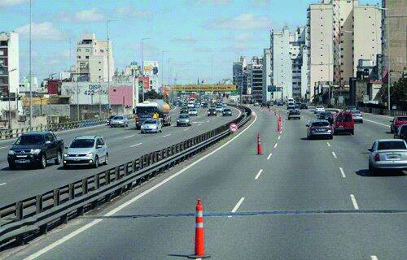

A. Refuerzan el significado de las líneas discontinuas del carril porque es una zona peligrosa.
B. Nada, no son señales de circulación y es ilegal su colocación.
C. La prohibición de sobrepasar la línea imaginaria que las une.
###### ID318

A:: =============================================  
C. La prohibición de sobrepasar la línea imaginaria que las une.

Q:: =============================================  

##### Las señales transitorias señalizan la ejecución de trabajos de construcción y mantenimiento en la vía, o en zonas próximas a las mismas:

• Verdadero.

• Falso.
###### ID319

A:: =============================================  
Verdadero.

Q:: =============================================  

##### La señalización transitoria se encuentra como prioridad normativa sobre los semáforos, si es que modifica el régimen normal de uso de la vía.

• Verdadero.

• Falso.
###### ID320

A:: =============================================  
Verdadero.

Q:: =============================================  

##### ¿Qué tipo de señal es la siguiente imagen?

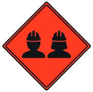

• Reglamentaria.

• Transitoria.

• Informativa.
###### ID321

A:: =============================================  
Transitoria.

Q:: =============================================  

##### Si al conducir un vehículo se encuentra en una intersección con esta señalización intermitente, ¿qué actitud debe tomar?

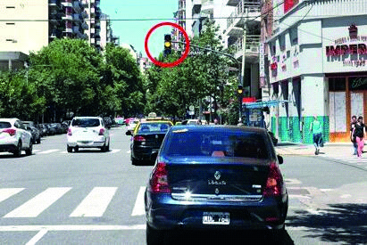

A. Tengo la obligación de detener la marcha y cuando no haya más vehículos circulando por la arteria que cruza, puedo reiniciarla.
B. Al tener prioridad, debo atravesarla rápidamente para no obstaculizar la vía.
C. Efectuar el cruce con máxima precaución.
###### ID322

A:: =============================================  
C. Efectuar el cruce con máxima precaución.

Q:: =============================================  

##### Si al conducir un vehículo se encuentra en una intersección con esta señalización intermitente, ¿qué actitud debe tomar?


A. Detener la marcha y realizar el cruce cuando se tenga la certeza de que no existe riesgo alguno.
B. Al tener prioridad, debo atravesarla rápidamente para no obstaculizar la vía.
C. Extremar precauciones al cruzar sin la necesidad de detenerme.
###### ID323

A:: =============================================  
A. Detener la marcha y realizar el cruce cuando se tenga la certeza de que no existe riesgo alguno.

Q:: =============================================  

##### Frente a esta situación, ¿qué debe hacer el conductor del vehículo señalado con el círculo rojo?


A. Avanzar si es que el vehículo que cruza lo hace lentamente porque la prioridad de paso está dada por la luz verde.
B. No iniciar el cruce, hasta que el otro vehículo haya completado el suyo.
C. Avanzar rápidamente si el vehículo que cruza todavía no llegó a mitad del cruce, de esa manera se deja libre la intersección.
###### ID324

A:: =============================================  
B. No iniciar el cruce, hasta que el otro vehículo haya completado el suyo.

Q:: =============================================  

##### Cuando un semáforo cambia de luz roja a verde, está habilitando a reiniciar la marcha; no obstante ello, ¿qué precauciones se deben adoptar?

A. No iniciar el cruce si no hay espacio para ubicar el vehículo del otro lado sin obstruir la circulación transversal.
B. Permitir, antes de avanzar, que complete el cruce otro vehículo o peatón que ya lo haya iniciado.
C. Ambas respuestas, la A y la B, son correctas.
###### ID325

A:: =============================================  
C. Ambas respuestas, la A y la B, son correctas.

Q:: =============================================  

##### Una indicación puede estar expresada con una señal vertical o con una demarcación horizontal, ya que ambas tienen el mismo significado y orden jerárquico.

• Verdadero.

• Falso.
###### ID326

A:: =============================================  
Verdadero.

Q:: =============================================  

##### ¿Qué indica esta demarcación amarilla en la calzada?


A. Que es un sector destinado a la detención y al estacionamiento de vehículos.
B. Que se debe circular lentamente por su sector central.
C. Que no se debe circular sobre ella.
###### ID327

A:: =============================================  
C. Que no se debe circular sobre ella.

Q:: =============================================  

##### En materia de señalamiento horizontal, ¿qué se entiende por “isleta”?

A. Son las rotondas.
B. Son los espacios reservados para estacionamiento exclusivo de motovehículos.
C. Son las marcas canalizadoras de tránsito. No se puede traspasar o circular sobre ellas.
###### ID328

A:: =============================================  
C. Son las marcas canalizadoras de tránsito. No se puede traspasar o circular sobre ellas.

Q:: =============================================  

##### ¿Qué significa esta demarcación amarilla en la calzada?

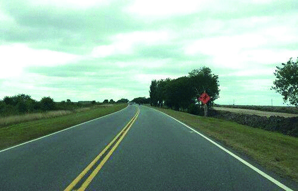

A. Es una señalización que se utiliza únicamente para dividir los carriles de la vía.
B. Indica, para ambos sentidos de circulación, que no debe ser traspasada ni se puede circular sobre ella.
C. Significa que sólo pueden circular vehículos particulares.
###### ID329

A:: =============================================  
B. Indica, para ambos sentidos de circulación, que no debe ser traspasada ni se puede circular sobre ella.

Q:: =============================================  

##### En la siguiente imagen, ¿qué indican las líneas centrales de la calzada señaladas?


A. Que se pueden traspasar.
B. Que está prohibido traspasarlas.
C. Que es una zona de máximo peligro.
###### ID330

A:: =============================================  
A. Que se pueden traspasar.

Q:: =============================================  

##### ¿Cuál es la importancia del color de las señales viales?

A. El color es para llamar la atención al conductor de categoría particular.
B. El color es irrelevante para el conductor particular pero sí para el conductor profesional.
C. El color, además de su forma, brinda información al conductor sobre el trayecto de la vía por la cual circula.
###### ID331

A:: =============================================  
C. El color, además de su forma, brinda información al conductor sobre el trayecto de la vía por la cual circula.

Q:: =============================================  

##### ¿Cuáles son las señales preventivas?

A. Aquellas que advierten la proximidad de una circunstancia o variación de la normalidad de la vía que puede resultar sorpresiva o peligrosa a la circulación.
B. Aquellas que no transmiten órdenes ni previenen sobre irregularidades o riesgos en la vía. Identifican, orientan y hacen referencia a servicios, lugares, etc.
C. Aquellas que transmiten órdenes específicas, de cumplimiento obligatorio en el lugar para el cual están destinadas.
###### ID332

A:: =============================================  
A. Aquellas que advierten la proximidad de una circunstancia o variación de la normalidad de la vía que puede resultar sorpresiva o peligrosa a la circulación.

Q:: =============================================  

##### ¿Qué indican las señales reglamentarias?

A. Advierten la proximidad de una circunstancia o variación de la normalidad de la vía que puede resultar sorpresiva o peligrosa a la circulación.
B. Identifican, orientan y hacen referencia a servicios, lugares, etc.
C. Transmiten órdenes específicas, de cumplimiento obligatorio en el lugar para el cual están destinadas.
###### ID333

A:: =============================================  
C. Transmiten órdenes específicas, de cumplimiento obligatorio en el lugar para el cual están destinadas.

Q:: =============================================  

##### ¿Cuál de estas señales comunica “Prevención”?

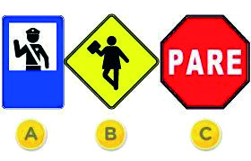

A. La señal A.
B. La señal B.
C. La señal C.
###### ID334

A:: =============================================  
B. La señal B.

Q:: =============================================  

##### ¿De qué color es la cartelería de Permitido Estacionar?

• Azul.

• blanco

• rojo
###### ID335

A:: =============================================  
Azul.

Q:: =============================================  

##### ¿Cuál de estas señales es Reglamentaria?


A. La señal A.
B. La señal B.
C. La señal C.
###### ID336

A:: =============================================  
B. La señal B.

Q:: =============================================  

##### ¿Cuál de estas señales es una señal reglamentaria?

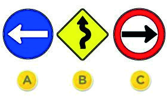

A. La señal A.
B. La señal B.
C. La señal C.
###### ID337

A:: =============================================  
C. La señal C.

Q:: =============================================  

##### ¿Cuál de estas señales es Informativa?

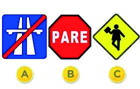

A. La señal A.
B. La señal B.
C. La señal C.
###### ID338

A:: =============================================  
A. La señal A.

Q:: =============================================  

##### Indique qué tipo de señal es la que a continuación se muestra:

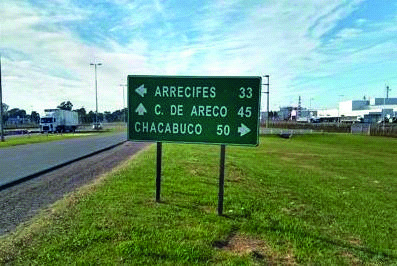

• Preventiva.

• Reglamentaria.

• Informativa.
###### ID339

A:: =============================================  
Informativa.

Q:: =============================================  

##### ¿Cuál de las siguientes imágenes, por forma y color, corresponde a la señal indicativa de una rotonda o pendiente pronunciada?

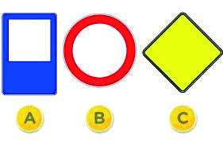

A. Figura A.
B. Figura B.
C. Figura C.
###### ID340

A:: =============================================  
C. Figura C.

Q:: =============================================  

##### ¿Cuál de las siguientes imágenes, por forma y color, corresponde a la señal indicativa de estar próximo a una zona afectada por obras?

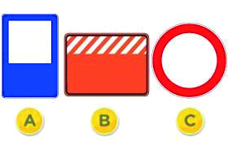

A. Figura A.
B. Figura B.
C. Figura C.
###### ID341

A:: =============================================  
B. Figura B.

Q:: =============================================  

##### Frente a la siguiente situación de emergencia, ¿qué deben hacer los conductores que circulen en su proximidad?


A. Aumentar la velocidad para no ser un obstáculo a este vehículo.
B. Avisar a otros conductores de la presencia de este vehículo, usando repetidamente la bocina.
C. Dar lugar a este vehículo, despejar el carril de emergencias y si fuera necesario detenerse.
###### ID342

A:: =============================================  
C. Dar lugar a este vehículo, despejar el carril de emergencias y si fuera necesario detenerse.

Q:: =============================================  

##### El siguiente símbolo indica que se trata de un carril que debe ser liberado cuando se aproxima un vehículo en emergencia.}


• Verdadero.

• Falso.
###### ID343

A:: =============================================  
Verdadero.

Q:: =============================================  

##### Frente a la siguiente situación de emergencia, ¿hacia qué sector es recomendable que se aparten los vehículos de la imagen para facilitar el paso a la ambulancia?

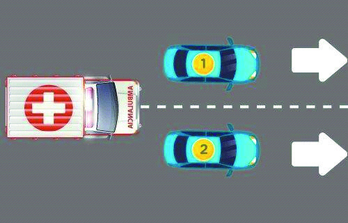

A. Ambos hacia su derecha.
B. El único que debería apartarse es el auto 2 hacia su derecha.
C. El auto 1 hacia su izquierda y el 2 hacia su derecha.
###### ID344

A:: =============================================  
C. El auto 1 hacia su izquierda y el 2 hacia su derecha.

Q:: =============================================  

##### Frente a la siguiente situación de emergencia, ¿hacia qué sector es recomendable que se aparten los vehículos de la imagen para facilitar el paso a la ambulancia?

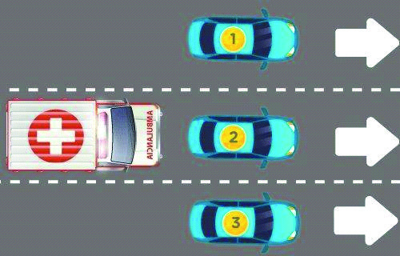

A. El único que debería apartarse es el auto 2 hacia su derecha.
B. Todos hacia su derecha.
C. El auto 1 hacia su izquierda, mientras que el 2 y 3 hacia su derecha.
###### ID345

A:: =============================================  
C. El auto 1 hacia su izquierda, mientras que el 2 y 3 hacia su derecha.

Q:: =============================================  

##### Frente a la siguiente situación de emergencia, ¿qué deben hacer los conductores que circulen en su proximidad?

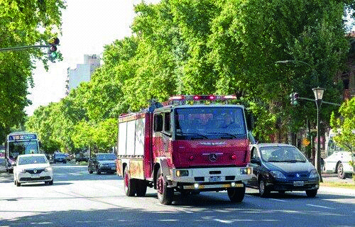

A. Aumentar la velocidad para no ser un obstáculo a este vehículo.
B. Avisar a otros conductores de la presencia de este vehículo, usando repetidamente la bocina.
C. Dar lugar a este vehículo, despejar el carril de emergencias y si fuera necesario detenerse.
###### ID346

A:: =============================================  
C. Dar lugar a este vehículo, despejar el carril de emergencias y si fuera necesario detenerse.

Q:: =============================================  

##### Ud. se encuentra frente a la siguiente situación donde el conductor toca repetidamente la bocina, ¿qué debe hacer si se encuentra conduciendo en su proximidad?


A. Cederle el paso, ya que está indicando que se encuentra en emergencia.
B. Brindar mi colaboración, ya que está indicando que el vehículo tiene un desperfecto mecánico.
C. Alertar a otros conductores, tocando repetidamente la bocina, que ese vehículo cruzará un se
###### ID347

A:: =============================================  
A. Cederle el paso, ya que está indicando que se encuentra en emergencia.

Q:: =============================================  

##### Indique cual es la correcta:

A. Puesto sanitario
B. Emergencias
C. Policía
###### ID348

A:: =============================================  
A. Puesto sanitario

Q:: =============================================  

##### La siguiente señal indica:

A. Detención transporte público.
B. Terminal ómnibus
C. Punto panorámico
###### ID349

A:: =============================================  
B. Terminal ómnibus

Q:: =============================================  

##### La siguiente señal indica:

A. Hotel
B. Hospital
C. Zona de descanso.
###### ID350

A:: =============================================  
A. Hotel

Q:: =============================================  

##### La siguiente señal indica:

A. Plaza
B. Lugar para recreación
C. Campamento
###### ID351

A:: =============================================  
B. Lugar para recreación

Q:: =============================================  

##### La siguiente señal indica:

A. Estación de servicio
B. Bar
C. Restaurant
###### ID352

A:: =============================================  
B. Bar

Q:: =============================================  

##### La siguiente señal indica:

A. Hotel
B. Bar
C. Restaurante
###### ID353

A:: =============================================  
C. Restaurante

Q:: =============================================  

##### La siguiente señal indica:

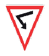

A. curva cerrada
B. camino sinuoso
C. permitido girar
###### ID354

A:: =============================================  
A. curva cerrada

Q:: =============================================  

##### La siguiente señal indica:

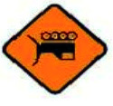

A. Maquinaria especial
B. Hombres trabajando
C. Equipo pesado en la vía
###### ID355

A:: =============================================  
C. Equipo pesado en la vía

Q:: =============================================  

##### La siguiente señal indica:


A. Permitido girar derecha
B. Dirección permitida derecha
C. Circulación obligatoria
###### ID356

A:: =============================================  
A. Permitido girar derecha

Q:: =============================================  

##### La siguiente señal indica:

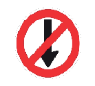

A. No avanzar
B. Contramano
C. Prohibido adelantar
###### ID357

A:: =============================================  
A. No avanzar

Q:: =============================================  

##### La siguiente señal indica:

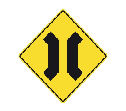

A. Puente angosto
B. Estrechamiento (en sus dos manos)
C. Estrechamiento (en una sola mano)
###### ID358

A:: =============================================  
A. Puente angosto

Q:: =============================================  

##### La siguiente señal indica:


A. Incorporación de tránsito lateral
B. Inicio doble mano
C. Ascenso y descenso.
###### ID359

A:: =============================================  
B. Inicio doble mano

Q:: =============================================  

##### La siguiente señal indica: (Pregunta de carácter eliminatorio)


A. No estacionar
B. No estacionar ni detenerse
C. Prohibición de circular autos.
###### ID360

A:: =============================================  
B. No estacionar ni detenerse

Q:: =============================================  

##### La siguiente señal indica:


A. Paneles de prevención
B. Cruce ferroviario
C. Curva cerrada
###### ID361

A:: =============================================  
A. Paneles de prevención

Q:: =============================================  

##### La siguiente señal indica:

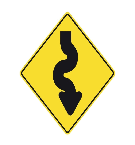

A. camino sinuoso
B. Camino en ascenso
C. Curva en “S”
###### ID362

A:: =============================================  
A. camino sinuoso

Q:: =============================================  

##### La siguiente señal indica:


A. Paso obligatorio
B. Giro obligatorio derecha
C. Sentido circulación (derecha)
###### ID363

A:: =============================================  
C. Sentido circulación (derecha)

Q:: =============================================  

##### La siguiente señal indica:

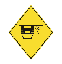

A. Vientos fuertes laterales
B. Derrumbes
C. Proyección de piedras
###### ID364

A:: =============================================  
C. Proyección de piedras

Q:: =============================================  

##### La siguiente señal indica:


A. Puente móvil
B. Inicio de calzada dividida
C. Túnel
###### ID365

A:: =============================================  
B. Inicio de calzada dividida

Q:: =============================================  

##### La siguiente señal indica:

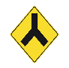

A. incorporación de tránsito lateral
B. encrucijada
C. Doble camino
###### ID366

A:: =============================================  
B. encrucijada

Q:: =============================================  

##### La siguiente señal indica:

A. Puesto sanitario
B. Bomberos
C. Policia
###### ID367

A:: =============================================  
C. Policia

Q:: =============================================  

##### La siguiente señal indica:


A. Detención transporte público.
B. Terminal ómnibus
C. Transporte de emergencias
###### ID368

A:: =============================================  
A. Detención transporte público.

Q:: =============================================  

##### La siguiente señal indica:


A. curva cerrada
B. camino sinuoso
C. permitido girar a la izquierda
###### ID369

A:: =============================================  
C. permitido girar a la izquierda

Q:: =============================================  

##### La siguiente señal indica:


A. camino sinuoso
B. curva común
C. Curva en “S”
###### ID370

A:: =============================================  
C. Curva en “S”

Q:: =============================================  

##### La siguiente señal indica:


A. No estacionar.
B. No estacionar ni detenerse.
C. Prohibición de circular autos.
###### ID371

A:: =============================================  
C. Prohibición de circular autos.

Q:: =============================================  

##### La siguiente señal indica:

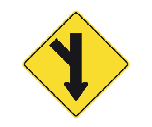

A. Incorporación de tránsito lateral.
B. Inicio doble mano
C. encrucijada
###### ID372

A:: =============================================  
A. Incorporación de tránsito lateral.

Q:: =============================================  

##### La siguiente señal indica:

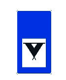

Hotel.

B. Campamento.
C. Punto panorámico.
###### ID373

A:: =============================================  
B. Campamento.

Q:: =============================================  

##### La siguiente señal indica:

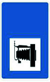

A. Estacionamiento de casas rodantes
B. Campamento
C. Punto panorámico.
###### ID374

A:: =============================================  
C. Punto panorámico.

Q:: =============================================  

##### La siguiente señal indica:


A. Límite de velocidad mínima
B. Límite de velocidad máxima
C. Limitación largo vehículo
###### ID375

A:: =============================================  
A. Límite de velocidad mínima

Q:: =============================================  

##### La siguiente señal indica:


A. Límite de velocidad mínima
B. Límite de velocidad máxima
C. Limitación largo vehículo
###### ID376

A:: =============================================  
B. Límite de velocidad máxima

Q:: =============================================  

##### La siguiente señal indica:

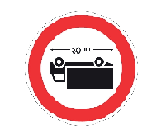

A. Límite de velocidad mínima
B. Límite de velocidad máxima
C. Limitación largo vehículo
###### ID377

A:: =============================================  
C. Limitación largo vehículo

Q:: =============================================  

##### La siguiente señal indica:


A. Escolares
B. Niños
C. Zona de deportes
###### ID378

A:: =============================================  
B. Niños

Q:: =============================================  

##### La siguiente señal indica:


A. Prohibición  de circular camión
B. Prohibición de circular carro de mano
C. Prohibición de circular acoplado
###### ID379

A:: =============================================  
C. Prohibición de circular acoplado

Q:: =============================================  

##### La siguiente señal indica:


A. Prohibición  de circular camión
B. Prohibición de circular carro de mano
C. Prohibición de circular acoplado
###### ID380

A:: =============================================  
B. Prohibición de circular carro de mano

Q:: =============================================  

##### La siguiente señal indica:

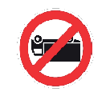

A. Prohibición  de circular camión
B. Prohibición de circular carro de mano
C. Prohibición de circular acoplado
###### ID381

A:: =============================================  
A. Prohibición  de circular camión

Q:: =============================================  

##### La siguiente señal indica:

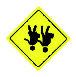

A. Escolares
B. Niños
C. Hombres trabajando
###### ID382

A:: =============================================  
A. Escolares

Q:: =============================================  

##### (Pregunta de carácter eliminatorio) 220) La siguiente señal indica:


A. Zona de montaña
B. Niños
C. Hombres trabajando
###### ID383

A:: =============================================  
C. Hombres trabajando

Q:: =============================================  

##### La siguiente señal indica:

A. Vallas tipo dos
B. Desvío
C. Delineadores
###### ID384

A:: =============================================  
A. Vallas tipo dos

Q:: =============================================  

##### La siguiente señal indica:

A. Vallas
B. Tambores
C. Delineadores
###### ID385

A:: =============================================  
B. Tambores

Q:: =============================================  

##### La siguiente señal indica:

A. Vallas
B. Tambores
C. Delineadores
###### ID386

A:: =============================================  
C. Delineadores

Q:: =============================================  

##### La siguiente señal indica:


A. Ruta panamericana
B. Ruta nacional
C. Ruta provincial
###### ID387

A:: =============================================  
A. Ruta panamericana

Q:: =============================================  

##### La siguiente señal indica: (Pregunta de carácter eliminatorio)


A. Ruta panamericana
B. Ruta nacional
C. Ruta provincial
###### ID388

A:: =============================================  
B. Ruta nacional

Q:: =============================================  

##### La siguiente señal indica:

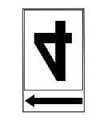

A. Ruta panamericana
B. Ruta nacional
C. Ruta provincial
###### ID389

A:: =============================================  
C. Ruta provincial

Q:: =============================================  

##### La siguiente señal indica:


A. Estación de servicio
B. Gomería
C. Policía
###### ID390

A:: =============================================  
B. Gomería

Q:: =============================================  

##### La siguiente señal indica


A. Limitación de altura
B. Limitación de ancho
C. Limitación de largo de vehículo
###### ID391

A:: =============================================  
A. Limitación de altura

Q:: =============================================  

##### La siguiente señal indica


A. Limitación de altura
B. Limitación de ancho X
C. Limitación de largo de vehículo
###### ID392

A:: =============================================  
B. Limitación de ancho X

Q:: =============================================  

##### La siguiente señal indica

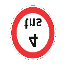

A. Limitación de peso
B. Limitación de peso por eje
C. Limitación de altura
###### ID393

A:: =============================================  
A. Limitación de peso

Q:: =============================================  

##### La siguiente señal indica

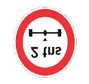

A. Limitación de peso
B. Limitación de peso por eje
C. Limitación de altura
###### ID394

A:: =============================================  
B. Limitación de peso por eje

Q:: =============================================  

##### Las señales reglamentarias son redondas, blancas y con bordes rojos.

• Verdadero.

• Falso.
###### ID395

A:: =============================================  
Verdadero.

Q:: =============================================  

##### Si nos encontramos ante un cuadrado o rectángulo azul o verde se trata de:

A. una señal reglamentaria
B. una señal preventiva
C. una señal de información y orientación
###### ID396

A:: =============================================  
C. una señal de información y orientación

Q:: =============================================  

##### Las señales redondas, blancas y con bordes rojos son señales de prevención.

• Verdadero.

• Falso.
###### ID397

A:: =============================================  
Falso.

Q:: =============================================  

##### Violar o hacer caso omiso a una señal de prevención implica una sanción por parte de la autoridad competente.

• Verdadero.

• Falso.
###### ID398

A:: =============================================  
Falso.

Q:: =============================================  

##### Violar o hacer caso omiso a una señal de información no conlleva a cometer una infracción.

• Verdadero.

• Falso.
###### ID399

A:: =============================================  
Verdadero.

Q:: =============================================  

##### Las señales reglamentarias son normas de cumplimiento obligatorio(Pregunta de carácter eliminatorio)

• Verdadero.

• Falso.
###### ID400

A:: =============================================  
Verdadero.

Q:: =============================================  

##### Las señales informativas nos alertan o advierten una cuestión determinada

• Verdadero.

• Falso.
###### ID401

A:: =============================================  
Falso.

Q:: =============================================  

##### Todas las señales (salvo luces) deben ser retroreflectivas

• Verdadero.

• Falso.
###### ID402

A:: =============================================  
Verdadero.

Q:: =============================================  

##### Las señales reglamentarias son cuadradas con diagonal vertical y amarillas

• Verdadero.

• Falso.
###### ID403

A:: =============================================  
Falso.

Q:: =============================================  

##### Preguntas para todas las clases: Conducción segura En un cruce de dos calles sin semáforo, frente a la siguiente situación, ¿quién tiene prioridad de paso?


• El vehículo A, ya que está circulando por la derecha

• Los vehículos B, ya que son varios los que circulan por esa calle.

• El vehículo A, ya que está saliendo del paso a nivel ferroviario.
###### ID404

A:: =============================================  
El vehículo A, ya que está saliendo del paso a nivel ferroviario.

Q:: =============================================  

##### En un cruce de dos calles sin semáforo, frente a la siguiente situación, ¿quién tiene prioridad de paso?


A. El vehículo A.
B. El vehículo B.
###### ID405

A:: =============================================  
B. El vehículo B.

Q:: =============================================  

##### ¿Quién tiene prioridad de paso en el cruce de estas dos calles?


A. Los vehículos que circulan por la calle A.
B. Los vehículos que circulan por la calle B.
###### ID406

A:: =============================================  
A. Los vehículos que circulan por la calle A.

Q:: =============================================  

##### ¿Qué vehículo tiene prioridad de paso en esta intersección sin semáforo?


A. El vehículo A porque circula por una avenida.
B. El vehículo B porque circula por la derecha.
C. Es indistinto ya que es una esquina sin semáforo.
###### ID407

A:: =============================================  
A. El vehículo A porque circula por una avenida.

Q:: =============================================  

##### Al conducir un vehículo y llegar a esta intersección, ¿cómo debe proceder frente a esta señal?


A. Disminuir un poco la velocidad y mirar que no se acerquen vehículos por la vía a la que se va a incorporar.
B. Reducir la velocidad y detener el vehículo antes de la senda peatonal.
C. Avanzar.
###### ID408

A:: =============================================  
B. Reducir la velocidad y detener el vehículo antes de la senda peatonal.

Q:: =============================================  

##### Como conductor de un vehículo, ¿cómo debe proceder frente a esta señal horizontal?


A. Disminuir un poco la velocidad y mirar que no se acerquen vehículos por la vía a la que se va a incorporar.
B. Reducir la velocidad y detener el vehículo antes de la senda peatonal.
C. Avanzar.
###### ID409

A:: =============================================  
B. Reducir la velocidad y detener el vehículo antes de la senda peatonal.

Q:: =============================================  

##### Estas señales son las únicas que indican que se pierde la prioridad de paso en una bocacalle sin semáforo.


• Verdadero.

• Falso.
###### ID410

A:: =============================================  
Verdadero.

Q:: =============================================  

##### Como norma de carácter general, ¿quién tiene prioridad de paso en una encrucijada sin semáforos?

A. Los vehículos de transporte de pasajero.
B. El vehículo de menor tamaño.
C. El vehículo que se presenta por el lado derecho.
###### ID411

A:: =============================================  
C. El vehículo que se presenta por el lado derecho.

Q:: =============================================  

##### En la siguiente situación, ¿a quién le corresponde la prioridad de paso?


A. Al automóvil.
B. Al colectivo.
C. Es indistinto.
###### ID412

A:: =============================================  
B. Al colectivo.

Q:: =============================================  

##### Frente a esta situación de obstrucción de vía, ¿qué debe hacer el conductor del vehículo señalado?


A. Debe ceder el paso al vehículo que circula en el sentido contrario.
B. Tiene prioridad de paso sobre el otro vehículo.
C. La normativa no establece prioridad de paso ante esta situación.
###### ID413

A:: =============================================  
A. Debe ceder el paso al vehículo que circula en el sentido contrario.

Q:: =============================================  

##### En la siguiente situación, ¿a quién le corresponde la prioridad de paso?


A. Al vehículo A, ya que circula por la derecha.
B. Al vehículo B, ya que circula por una avenida.
C. Es indistinto.
###### ID414

A:: =============================================  
B. Al vehículo B, ya que circula por una avenida.

Q:: =============================================  

##### ¿Quién tiene prioridad de paso en una rotonda?

A. El vehículo que circule por la derecha.
B. El vehículo que pretende acceder a la rotonda.
C. El vehículo que se encuentra dentro de la calzada circular.
###### ID415

A:: =============================================  
C. El vehículo que se encuentra dentro de la calzada circular.

Q:: =============================================  

##### En esta situación, donde hay una calzada circular, ¿quién tiene la prioridad de paso?


A. El vehículo A.
B. El vehículo B.
C. Es indistinto.
###### ID416

A:: =============================================  
B. El vehículo B.

Q:: =============================================  

##### Como norma general, en una arteria de doble circulación, con pendiente pronunciada y con un ancho que no permite la circulación simultánea de dos vehículos, ¿quién tiene la prioridad de paso?

A. El vehículo que desciende.
B. El vehículo que asciende.
C. No hay prioridad, cualquiera de ellos.
###### ID417

A:: =============================================  
B. El vehículo que asciende.

Q:: =============================================  

##### En esta pendiente estrecha, ¿cuál de los dos vehículos tiene prioridad de paso?


A. El vehículo A.
B. El vehículo B.
###### ID418

A:: =============================================  
B. El vehículo B.

Q:: =============================================  

##### ¿Cuándo se debe ceder el paso a los vehículos que desean incorporarse al tránsito desde el lugar donde estaban estacionados o desde un garaje?

A. Siempre, independientemente de cómo se encuentre el tránsito vehicular.
B. Cuando el tránsito se encuentra interrumpido por cualquier razón.
C. Nunca, independientemente de cómo se encuentre el tránsito vehicular.
###### ID419

A:: =============================================  
B. Cuando el tránsito se encuentra interrumpido por cualquier razón.

Q:: =============================================  

##### El vehículo señalizado quiere incorporarse al tránsito, ¿tiene prioridad de paso sobre los otros vehículos que están circulando por esta arteria?


A. No, porque los vehículos de la arteria, a la que se pretende ingresar, están circulando.
B. Sí, porque se encuentra a la derecha.
C. Sí, porque señalizó su maniobra.
###### ID420

A:: =============================================  
A. No, porque los vehículos de la arteria, a la que se pretende ingresar, están circulando.

Q:: =============================================  

##### El vehículo señalizado quiere incorporarse al tránsito, ¿tiene prioridad de paso sobre los otros vehículos que están detenidos en la arteria?


A. No. La prioridad es de los otros vehículos, independientemente si están detenidos o circulando.
B. Sí, porque se encuentra el tránsito detenido y deben cederle el paso.
C. No. La Ley no menciona nada al respecto, sólo se expresa sobre las prioridades en intersecciones no semaforizadas.
###### ID421

A:: =============================================  
B. Sí, porque se encuentra el tránsito detenido y deben cederle el paso.

Q:: =============================================  

##### En la siguiente situación, ¿el vehículo B puede sobrepasar al vehículo A?


A. Sí, salvo que se acerque un vehículo en el sentido contrario.
B. No, ya que está prohibido por la demarcación horizontal.
C. Sí, haciendo las señales de luces correspondientes y si el vehículo que circula en sentido contrario está lejos.
###### ID422

A:: =============================================  
B. No, ya que está prohibido por la demarcación horizontal.

Q:: =============================================  

##### ¿Cuáles de los siguientes vehículos NO se encuentran en infracción?


A. Los vehículos A y B.
B. Los vehículos A y C.
C. Los vehículos B y C.
###### ID423

A:: =============================================  
C. Los vehículos B y C.

Q:: =============================================  

##### El vehículo A pretende cambiar de carril hacia su derecha, ¿cuál de los dos vehículos tiene prioridad?


A. El vehículo A.
B. El vehículo B.
###### ID424

A:: =============================================  
B. El vehículo B.

Q:: =============================================  

##### En este tipo de arteria, ¿quién tiene prioridad cuando se desea realizar un cambio de carril?


A. El vehículo que circula por el carril que se pretende ocupar.
B. El vehículo que realiza el cambio de carril.
C. El vehículo del carril más lento.
###### ID425

A:: =============================================  
A. El vehículo que circula por el carril que se pretende ocupar.

Q:: =============================================  

##### Es obligatorio al finalizar un adelantamiento...

A. Permanecer en el carril ocupado, independientemente de la fluidez del tránsito.
B. Incorporarse al carril derecho, si éste se encuentra libre, de forma gradual y sin obstaculizar la fluidez de tránsito.
C. Incorporarse al carril derecho, aunque ésto implique que otro vehículo deba modificar su velocidad.
###### ID426

A:: =============================================  
B. Incorporarse al carril derecho, si éste se encuentra libre, de forma gradual y sin obstaculizar la fluidez de tránsito.

Q:: =============================================  

##### ¿Cuál de estos carriles es el llamado “”carril de sobrepaso””?


A. Cualquiera de ellos.
B. Sólo el carril señalado como A.
C. Sólo el carril señalado como F.
###### ID427

A:: =============================================  
B. Sólo el carril señalado como A.

Q:: =============================================  

##### El vehículo, que circula por el carril destinado al tránsito lento, no puede abandonarlo para sobrepasar a otro vehículo que transita más lento.

• Verdadero.

• Falso.
###### ID428

A:: =============================================  
Falso.

Q:: =============================================  

##### El conductor del vehículo A quiere volver rápidamente al carril derecho porque ve ante él una situación de peligro, ¿qué debe hacer el conductor del vehículo B?

A. Aumentar la velocidad para que realice la maniobra detrás suyo.
B. Reducir la velocidad para facilitarle el retorno al carril.
C. Tocar bocina y hacer guiño de luces para indicarle que no debe realizar la maniobra.
###### ID429

A:: =============================================  
B. Reducir la velocidad para facilitarle el retorno al carril.

Q:: =============================================  

##### En este tramo de la vía no se puede realizar un sobrepaso


• Verdadero.

• Falso.
###### ID430

A:: =============================================  
Verdadero.

Q:: =============================================  

##### Al advertir que está por ser sobrepasado, ¿cuál debería ser su actitud?

A. Circular por la banquina.
B. Circular por la derecha de la calzada y mantenerse. En el caso de ser necesario, reducir la velocidad.
C. Ambas respuestas, A y B, son correctas.
###### ID431

A:: =============================================  
B. Circular por la derecha de la calzada y mantenerse. En el caso de ser necesario, reducir la velocidad.

Q:: =============================================  

##### ¿Está permitido sobrepasar a otro vehículo en este lugar?


A. Sí, salvo que haya una señal que indique lo contrario.
B. No, está prohibido por normativa.
C. Sólo en el caso de que no perjudique la circulación de otros vehículos.
###### ID432

A:: =============================================  
B. No, está prohibido por normativa.

Q:: =============================================  

##### Cuando varios vehículos circulan encolumnados, ¿cuál de ellos tiene prioridad para realizar el sobrepaso?

A. El que lo intente primero.
B. El último de la fila.
C. El que circula más próximo al vehículo que se desea sobrepasar.
###### ID433

A:: =============================================  
C. El que circula más próximo al vehículo que se desea sobrepasar.

Q:: =============================================  

##### En esta situación, ¿quién tiene prioridad para realizar el sobrepaso al camión?


A. El vehículo A.
B. El vehículo B.
C. El vehículo C.
###### ID434

A:: =============================================  
C. El vehículo C.

Q:: =============================================  

##### Si al llegar a una intersección sin semáforos, se encuentra que el vehículo que está delante suyo está detenido esperando poder doblar hacia la izquierda, ¿qué debe hacer si ud. desea continuar en línea recta?

A. Sobrepasarlo por la derecha de manera segura, colocando luz de giro y observando por los espejos retrovisores.
B. Sobrepaso por la izquierda, colocando la luz de giro y observando por los espejos retrovisores.
C. Tocarle bocina para indicarle que debe seguir.
###### ID435

A:: =============================================  
A. Sobrepasarlo por la derecha de manera segura, colocando luz de giro y observando por los espejos retrovisores.

Q:: =============================================  

##### ¿Se puede traspasar la siguiente señal horizontal?


A. Sí, porque ordena la circulación de carriles e indica que se puede sobrepasar a otro vehículo.
B. Sólo cuando la vía tiene dos carriles por sentido de circulación.
C. No, porque indica prohibición de sobrepaso.
###### ID436

A:: =============================================  
A. Sí, porque ordena la circulación de carriles e indica que se puede sobrepasar a otro vehículo.

Q:: =============================================  

##### Como norma general, ¿dónde está prohibido el sobrepaso de un vehículo?

A. Donde la delimitación de carriles es de trazo continuo.
B. En curvas, encrucijadas, pasos a nivel o puentes.
C. Ambas respuestas, A y B, son correctas.
###### ID437

A:: =============================================  
C. Ambas respuestas, A y B, son correctas.

Q:: =============================================  

##### En un túnel, con ambos sentidos de circulación, ¿está permitido sobrepasar a un vehículo?

A. Sí, cuando no haya señal que lo prohíba.
B. No, ya que está prohibido por normativa.
C. Sí, si hay suficiente visibilidad.
###### ID438

A:: =============================================  
B. No, ya que está prohibido por normativa.

Q:: =============================================  

##### En una vía de doble sentido de circulación, ¿qué deberá comprobar antes de iniciar un sobrepaso?

A. Que el vehículo que antecede, no tenga las luces intermitentes encendidas y que ningún vehículo circule en sentido contrario, mientras dure la maniobra de sobrepaso.
B. Que ningún otro vehículo esté realizando la maniobra de sobrepaso.
C. Ambas respuestas, A y B, son correctas.
###### ID439

A:: =============================================  
C. Ambas respuestas, A y B, son correctas.

Q:: =============================================  

##### En este lugar, ¿está permitido sobrepasar a otro vehículo?


A. Sí, salvo que haya una señal que indique lo contrario.
B. No, está prohibido por normativa.
C. Sólo si no se perjudica la circulación de otros vehículos.
###### ID440

A:: =============================================  
B. No, está prohibido por normativa.

Q:: =============================================  

##### Frente a la demarcación central de la calzada señalada, ¿cuál es la conducta a seguir?


A. Se debe respetar lo que rige con respecto a la línea más próxima; si es continua no traspasarla y si es discontinua está permitido hacerlo.
B. Se debe respetar lo que rige con respecto a la línea más próxima; si es discontinua no traspasarla y si es continua está permitido hacerlo.
C. No debe traspasarse ninguna de ellas.
###### ID441

A:: =============================================  
A. Se debe respetar lo que rige con respecto a la línea más próxima; si es continua no traspasarla y si es discontinua está permitido hacerlo.

Q:: =============================================  

##### ¿Qué indica esta demarcación amarilla en la calzada?


A. Indica que se puede traspasar.
B. Divide sentidos opuestos de circulación e indica que está prohibido traspasarla.
C. Que es una zona que se puede circular sobre ella.
###### ID442

A:: =============================================  
B. Divide sentidos opuestos de circulación e indica que está prohibido traspasarla.

Q:: =============================================  

##### El carril de sobrepaso en una autopista sirve para...

A. Circular por él cuando a la derecha existe otro carril disponible.
B. Circular por él siempre que se conduzca a la mayor velocidad permitida.
C. Realizar maniobras de sobrepaso.
###### ID443

A:: =============================================  
C. Realizar maniobras de sobrepaso.

Q:: =============================================  

##### ¿A qué se denomina “carril de aceleración”?

A. Es el carril de incorporación a una autopista.
B. Es el carril derecho de una autopista.
C. Es el carril izquierdo de una autopista.
###### ID444

A:: =============================================  
A. Es el carril de incorporación a una autopista.

Q:: =============================================  

##### El vehículo señalado con un círculo rojo, ¿circula correctamente?


A. Sí, porque en esta vía las luces deben estar encendidas.
B. Sí, ya que mantiene una distancia prudencial respecto del resto de los vehículos.
C. No, dado que está circulando por la banquina.
###### ID445

A:: =============================================  
C. No, dado que está circulando por la banquina.

Q:: =============================================  

##### Un vehículo podrá circular por la franja paralela a la calzada, indicada en la imagen, sólo cuando el flujo vehicular esté absolutamente congestionado.


• Verdadero.

• Falso.
###### ID446

A:: =============================================  
Falso.

Q:: =============================================  

##### El vehículo señalizado tiene permitido girar a la izquierda en este cruce que no tiene semáforo.


• Verdadero.

• Falso.
###### ID447

A:: =============================================  
Falso.

Q:: =============================================  

##### El vehículo con un círculo de color rojo quería girar a la derecha y, por error continuó en línea recta, de modo que:


A. Puede circular marcha atrás, porque es un tramo corto el que tiene que recorrer, y efectuar el giro.
B. Puede dar la vuelta en U para tomar el sentido contrario y así efectuar el giro programado.
C. Ambas respuestas, A y B, son incorrectas.
###### ID448

A:: =============================================  
C. Ambas respuestas, A y B, son incorrectas.

Q:: =============================================  

##### Según las normas generales, ¿cuál es la velocidad mínima permitida en esta calle?


A. 30 km/h.
B. 40 km/h.
C. 20 km/h.
###### ID449

A:: =============================================  
C. 20 km/h.

Q:: =============================================  

##### Según las normas generales, ¿cuál es la velocidad máxima permitida para un automóvil particular en esta avenida?


A. 40 km/h.
B. 70 km/h.
C. 60 km/h.
###### ID450

A:: =============================================  
C. 60 km/h.

Q:: =============================================  

##### ¿Cuál es la velocidad máxima permitida para un automóvil particular en este tramo de la avenida?


A. 60 km/h.
B. 50 km/h.
C. 40 km/h.
###### ID451

A:: =============================================  
C. 40 km/h.

Q:: =============================================  

##### Al circular por una ruta a la velocidad máxima permitida sólo se está habilitado a superarla en el momento del sobrepaso.

• Verdadero.

• Falso.
###### ID452

A:: =============================================  
Falso.

Q:: =============================================  

##### ¿Cuál es la velocidad máxima permitida en este tramo de calle?


A. 40 km/h.
B. 20 km/h.
C. 30 km/h.
###### ID453

A:: =============================================  
B. 20 km/h.

Q:: =============================================  

##### Al pretender abandonar una autopista o semiautopista, ¿cuándo se debe reducir la velocidad?

A. Poco antes de abandonar la misma.
B. Cuando se haya entrado en el carril de desaceleración.
C. Cuando se ingresa a la nueva vía de circulación.
###### ID454

A:: =============================================  
B. Cuando se haya entrado en el carril de desaceleración.

Q:: =============================================  

##### Según la Ley Nacional N º 24.449, en carácter general, ¿cuál es la velocidad mínima permitida en las semiautopistas?

A. 40 km/h.
B. 50 km/h.
C. 60 km/h.
###### ID455

A:: =============================================  
A. 40 km/h.

Q:: =============================================  

##### ¿Qué se conoce como velocidad precautoria?

A. A la velocidad adecuada a las circunstancias (dentro de los límites establecidos) que permite mantener el total dominio del vehículo sin generar riesgo.
B. La circulación a la velocidad mínima establecida para una vía.
C. La circulación a no más de 30 km/h en calles y de 45 km/h en avenidas.
###### ID456

A:: =============================================  
A. A la velocidad adecuada a las circunstancias (dentro de los límites establecidos) que permite mantener el total dominio del vehículo sin generar riesgo.

Q:: =============================================  

##### Los vehículos que circulan por la siguiente avenida, al llegar a esta bocacalle sin semáforos, ¿cuál es el límite superior de velocidad precautoria que deben respetar?


A. 20 kilómetros por hora.
B. 40 kilómetros por hora.
C. 30 kilómetros por hora.
###### ID457

A:: =============================================  
B. 40 kilómetros por hora.

Q:: =============================================  

##### ¿A qué se denomina “distancia de seguridad”?

A. A la distancia mínima que se debe mantener con el vehículo que circula adelante para tener un mayor margen de reacción y en caso de frenada repentina no se colisione con él.
B. A la distancia que se debe mantener con el vehículo que circula en el carril paralelo, para realizar un sobrepaso seguro.
C. A la distancia que recorre el vehículo desde que el conductor percibe una situación de peligro hasta que acciona el freno.
###### ID458

A:: =============================================  
A. A la distancia mínima que se debe mantener con el vehículo que circula adelante para tener un mayor margen de reacción y en caso de frenada repentina no se colisione con él.

Q:: =============================================  

##### ¿Cuál es la “distancia mínima de seguridad” a la que debe circular el vehículo A con respecto al B?


A. A una diferencia de dos segundos.
B. A una distancia de 2 metros.
C. No existe una determinada. Sólo está prohibido circular inmediatamente detrás, sin dejar distancia.
###### ID459

A:: =============================================  
A. A una diferencia de dos segundos.

Q:: =============================================  

##### ¿A qué se denomina “tiempo de reacción”?

A. Al tiempo que pasa desde que se empieza una maniobra hasta que se termina.
B. Al tiempo que pasa desde que se enciende el vehículo hasta que se empieza a circular.
C. Al tiempo que pasa desde que se advierte una situación de riesgo hasta que se toma una decisión.
###### ID460

A:: =============================================  
C. Al tiempo que pasa desde que se advierte una situación de riesgo hasta que se toma una decisión.

Q:: =============================================  

##### ¿A qué se denomina “distancia de reacción”?

A. A la distancia que recorre un vehículo hasta su detención.
B. A la distancia que debe guardar un vehículo, respecto de otro, para poder maniobrar.
C. A la distancia que recorre un vehículo desde que el conductor percibe un peligro hasta que toma una decisión.
###### ID461

A:: =============================================  
C. A la distancia que recorre un vehículo desde que el conductor percibe un peligro hasta que toma una decisión.

Q:: =============================================  

##### Circular por debajo del límite mínimo de velocidad puede causar incidentes.

• Verdadero.

• Falso.
###### ID462

A:: =============================================  
Verdadero.

Q:: =============================================  

##### ¿Qué relación existe entre la velocidad y el campo visual del conductor?

A. A mayor velocidad, menor campo visual.
B. A menor velocidad, menor campo visual.
C. A mayor velocidad, mayor campo visual.
###### ID463

A:: =============================================  
A. A mayor velocidad, menor campo visual.

Q:: =============================================  

##### Los excesos de velocidad...

A. En la actualidad apenas tienen incidencia en los incidentes, debido a la seguridad de los vehículos.
B. Son responsables de la mayoría de los incidentes solamente en vías de doble sentido.
C. Son responsables de la mayoría de los incidentes fatales cualquiera sea la vía de circulación.
###### ID464

A:: =============================================  
C. Son responsables de la mayoría de los incidentes fatales cualquiera sea la vía de circulación.

Q:: =============================================  

##### Circular a velocidad constante y dentro de los límites establecidos por la Ley, además de minimizar las posibilidades de provocar un siniestro vial, puede optimizar el consumo de combustible en un vehículo.

• Verdadero.

• Falso.
###### ID465

A:: =============================================  
Verdadero.

Q:: =============================================  

##### Circular a mayor velocidad de la precautoria implica que aumenten las posibilidades de que un siniestro vial sea más grave.

• Verdadero.

• Falso.
###### ID466

A:: =============================================  
Verdadero.

Q:: =============================================  

##### ¿Cuál es la manera más adecuada de conducir un vehículo en este tramo de la ruta?


A. Aumentar la velocidad gradualmente antes de ingresar en la curva.
B. Desacelerar antes de ingresar a la curva.
C. Mantener la misma velocidad antes de la curva y acelerar mientras se circula en ella.
###### ID467

A:: =============================================  
B. Desacelerar antes de ingresar a la curva.

Q:: =============================================  

##### Si al circular por ruta, el vehículo sale involuntariamente de la calzada, es recomendable:

A. Usar el freno de mano.
B. Desacelerar (no frenar).
C. Accionar fuertemente el pedal de freno.
###### ID468

A:: =============================================  
B. Desacelerar (no frenar).

Q:: =============================================  

##### Si ve esta señal mientras conduce, usted debe…


A. Reducir la velocidad del vehículo
B. Incrementar la velocidad del vehículo
C. Dar vuelta a la izquierda y después a la derecha
###### ID469

A:: =============================================  
A. Reducir la velocidad del vehículo

Q:: =============================================  

##### Si al circular en ruta se encuentra con esta señal, ¿qué conducta debe seguir?


A. Se debe disminuir la velocidad y prestar atención a la posible aproximación de trenes.
B. Se continúa con la misma velocidad, salvo que se haga efectiva la aproximación del tren.
C. Se indica al resto de los conductores, la precaución sobre la aproximación de trenes, colocando balizas.
###### ID470

A:: =============================================  
A. Se debe disminuir la velocidad y prestar atención a la posible aproximación de trenes.

Q:: =============================================  

##### ¿El vehículo de la imagen se encuentra en infracción?


A. Sí, salvo que el propietario del vehículo sea el mismo que el de la vivienda.
B. No, ya que hay espacio suficiente para el paso del peatón.
C. Ambas respuestas, A y B, son incorrectas.
###### ID471

A:: =============================================  
C. Ambas respuestas, A y B, son incorrectas.

Q:: =============================================  

##### El vehículo con la oblea universal de discapacidad que se muestra en esta imagen, ¿se encuentra en infracción?


A. No, ya que al portar la oblea universal de discapacidad tiene libre estacionamiento y por ello puede estacionar en este lugar.
B. Sí. Todo vehículo tiene prohibido estacionar en este sector ya que pone en riesgo a pasajeros y peatones.
###### ID472

A:: =============================================  
B. Sí. Todo vehículo tiene prohibido estacionar en este sector ya que pone en riesgo a pasajeros y peatones.

Q:: =============================================  

##### ¿Es correcta la detención del vehículo en este sector?


A. Sí, ya que se encuentra con balizas encendidas.
B. Sí, porque sólo está prohibido el estacionamiento.
C. No, ya que tanto la detención como el estacionamiento en este sector se encuentra prohibido.
###### ID473

A:: =============================================  
C. No, ya que tanto la detención como el estacionamiento en este sector se encuentra prohibido.

Q:: =============================================  

##### ¿Qué línea debe tomarse de referencia cuando se detiene o estaciona en proximidad de una esquina?

A. La línea peatonal.
B. La línea imaginaria de prolongación de ochava.
C. La línea de edificación transversal.
###### ID474

A:: =============================================  
B. La línea imaginaria de prolongación de ochava.

Q:: =============================================  

##### Como norma general, frente a esta señal, ¿está permitido detenerse para el ascenso o descenso de pasajeros?


A. No. Está prohibido estacionar y detenerse.
B. Sí. Sólo está prohibido estacionar pero no detenerse.
C. Según la hora en que quiera realizarse la detención.
###### ID475

A:: =============================================  
B. Sí. Sólo está prohibido estacionar pero no detenerse.

Q:: =============================================  

##### Encender las balizas permite detenerse en doble fila por un lapso de tiempo, entre 2 y 5 minutos.

• Verdadero.

• Falso.
###### ID476

A:: =============================================  
Falso.

Q:: =============================================  

##### ¿Está permitida la acción que se presenta en la siguiente imagen?


A. Sí, porque tiene las balizas encendidas y no necesita permanecer más de 5 minutos para que descienda un pasajero.
B. Sí, porque la doble fila está permitida cuando se trata de ascenso y descenso de pasajeros.
C. No, ya que la doble fila está permitida sólo como detención previa a la maniobra de estacionamiento.
###### ID477

A:: =============================================  
C. No, ya que la doble fila está permitida sólo como detención previa a la maniobra de estacionamiento.

Q:: =============================================  

##### ¿Este vehículo se encuentra bien estacionado?


A. Sí. Al no estar el cordón pintado de amarillo, está habilitado a estacionarse y detenerse.
B. Sí. Al no estar el cordón pintado de rojo, está habilitado a estacionarse pero no a detenerse.
C. No, porque debería estar más alejado del cordón (a 20 cm de él).
###### ID478

A:: =============================================  
C. No, porque debería estar más alejado del cordón (a 20 cm de él).

Q:: =============================================  

##### ¿Qué precauciones se deben tener al dejar estacionado un vehículo en esta situación?


A. Orientar las ruedas hacia el cordón de la vereda y dejar la marcha hacia atrás o en posición de estacionamiento en el caso de tener caja automática.
B. Orientar las ruedas hacia el centro de la calzada y dejar la marcha en primera o en posición de estacionamiento en el caso de tener caja automática.
C. Orientar las ruedas paralelas al cordón y sin cambio o en posición de estacionamiento en el caso de tener caja automática.
###### ID479

A:: =============================================  
B. Orientar las ruedas hacia el centro de la calzada y dejar la marcha en primera o en posición de estacionamiento en el caso de tener caja automática.

Q:: =============================================  

##### ¿Qué precauciones se deben tener al dejar estacionado un vehículo en esta situación?


A. Orientar las ruedas hacia el cordón de la vereda y dejar la marcha hacia atrás o en posición de estacionamiento en el caso de tener caja automática.
B. Orientar las ruedas hacia el centro de la calzada y dejar la marcha en primera o en posición de estacionamiento en el caso de tener caja automática.
C. Orientar las ruedas paralelas al cordón y sin cambio o en posición de estacionamiento en el caso de tener caja automática.
###### ID480

A:: =============================================  
A. Orientar las ruedas hacia el cordón de la vereda y dejar la marcha hacia atrás o en posición de estacionamiento en el caso de tener caja automática.

Q:: =============================================  

##### ¿Se está habilitado a detener un vehículo en este lugar?


A. Sí, siempre y cuando no entorpezca la circulación.
B. No, está prohibido estacionar y detenerse por normativa.
C. Si, a menos que haya una señal que lo prohíba expresamente.
###### ID481

A:: =============================================  
B. No, está prohibido estacionar y detenerse por normativa.

Q:: =============================================  

##### ¿Está permitido circular marcha atrás en  Provincia de Buenos Aires?

A. No, salvo que se realice para estacionar, entrar o salir de un garaje (cuando no exista otra posibilidad) o salvar algún obstáculo.
B. Sí, se puede realizar en cualquier ocasión pero el trayecto para circular debe ser de pocos metros. C. Sí, siempre que se realice antes de llegar a la mitad de la cuadra y asegurándose de no poner en riesgo al resto de los vehículos.
###### ID482

A:: =============================================  
A. No, salvo que se realice para estacionar, entrar o salir de un garaje (cuando no exista otra posibilidad) o salvar algún obstáculo.

Q:: =============================================  

##### Cuando un conductor realiza marcha atrás, ¿qué distancia puede recorrer?

A. No debe superar la mitad de una cuadra.
B. No más de 20 metros.
C. El recorrido mínimo e indispensable, siempre que se trate de una maniobra de estacionamiento.
###### ID483

A:: =============================================  
C. El recorrido mínimo e indispensable, siempre que se trate de una maniobra de estacionamiento.

Q:: =============================================  

##### Si el vehículo que lo precede, circula con estas luces intermitentes encendidas, ¿qué podría estar indicando el conductor?


A. Que el vehículo circula lentamente.
B. Que el vehículo próximamente ingresará a un garage o se detendrá.
C. Que el vehículo realizará un giro en la próxima intersección.
###### ID484

A:: =============================================  
B. Que el vehículo próximamente ingresará a un garage o se detendrá.

Q:: =============================================  

##### ¿Qué indica el uso de este tipo de luces?


A. Cuando se utilizan por separado sirven para preanunciar maniobras.
B. Cuando se utilizan a la vez sirven para anunciar situaciones de emergencias o que se está por detener.
C. Ambas respuestas, la A y la B, son correctas.
###### ID485

A:: =============================================  
C. Ambas respuestas, la A y la B, son correctas.

Q:: =============================================  

##### Si el vehículo de la imagen se dispone a ingresar a un garaje, está anticipando su maniobra, utilizando las luces correctas.


• Verdadero.

• Falso.
###### ID486

A:: =============================================  
Verdadero.

Q:: =============================================  

##### Si el vehículo de la imagen se dispone a ingresar a un garaje ubicado a su derecha, está anticipando su maniobra utilizando las luces correctas.


• Verdadero.

• Falso.
###### ID487

A:: =============================================  
Falso.

Q:: =============================================  

##### El ingreso hacia un garaje o estacionamiento, ¿cómo debe ser indicado por el conductor?

A. Con la luz de giro hacia el lado donde se irá a ingresar.
B. Con la luz de giro hacia el lado opuesto donde se irá a ingresar.
C. Con las luces intermitentes (balizas).
###### ID488

A:: =============================================  
C. Con las luces intermitentes (balizas).

Q:: =============================================  

##### ¿Son válidas este tipo de señas?


A. Como acompañamiento al uso de balizas y/o en caso de emergencia.
B. Nunca.
C. Sólo cuando se utilicen en calles.
###### ID489

A:: =============================================  
A. Como acompañamiento al uso de balizas y/o en caso de emergencia.

Q:: =============================================  

##### Si usted está conduciendo y va a girar al llegar a una intersección, debe anticipar su maniobra utilizando la luz de giro correspondiente por lo menos...

A. 20 metros antes de realizar la maniobra.
B. 10 metros antes de realizar la maniobra.
C. 30 metros antes de realizar la maniobra.
###### ID490

A:: =============================================  
C. 30 metros antes de realizar la maniobra.

Q:: =============================================  

##### Para realizar correctamente un giro en una intersección se debe indicar...

A. Tocando bocina.
B. Utilizando la luz de giro del lado correspondiente, al menos 30 metros antes.
C. Utilizando ambos giros, metros antes de llegar a la intersección.
###### ID491

A:: =============================================  
B. Utilizando la luz de giro del lado correspondiente, al menos 30 metros antes.

Q:: =============================================  

##### Circular con la luz alta encendida está prohibido en zonas urbanas.

• Verdadero.

• Falso.
###### ID492

A:: =============================================  
Verdadero.

Q:: =============================================  

##### El vehículo, señalado con un círculo rojo, circula utilizando las luces correctas.


• Verdadero.

• Falso.
###### ID493

A:: =============================================  
Falso.

Q:: =============================================  

##### Al observar las luces de este vehículo, ¿qué significado tienen en cuanto al sentido de circulación?


A. Que está circulando en mí mismo sentido.
B. Que está circulando en el sentido contrario al mío.
C. No indican sentido de circulación sino que está descompuesto.
###### ID494

A:: =============================================  
A. Que está circulando en mí mismo sentido.

Q:: =============================================  

##### ¿Para qué sirven estas luces intermitentes?


A. Para advertir a los demás conductores, frente a malas condiciones climáticas, que el vehículo circula a baja velocidad.
B. Para señalizar y advertir a los demás conductores que el vehículo se encuentra detenido o próximo a una maniobra de detención, estacionamiento o emergencia.
C. Ambas respuestas, A y B, son correctas.
###### ID495

A:: =============================================  
B. Para señalizar y advertir a los demás conductores que el vehículo se encuentra detenido o próximo a una maniobra de detención, estacionamiento o emergencia.

Q:: =============================================  

##### Si al circular por la siguiente arteria, se ve obligado a detener en la banquina, ¿qué luces debe colocar?


A. Luces altas y giro.
B. Luces reglamentarias y balizas.
C. Luces antinieblas.
###### ID496

A:: =============================================  
B. Luces reglamentarias y balizas.

Q:: =============================================  

##### ¿está permitido colocar a un automóvil particular luces adicionales?

A. Está permitido el agregado de dos faros rompeniebla y de hasta dos faros elevados con luces de freno.
B. Sí. Se puede agregar las luces que se deseen ya que cuanto más capacidad de iluminación tenga el vehículo, mejor visibilidad tendrá el conductor.
C. No, está prohibido agregar cualquier tipo de luz adicional. Sólo se podrá reponer las que traiga de fábrica, en caso de destrucción.
###### ID497

A:: =============================================  
A. Está permitido el agregado de dos faros rompeniebla y de hasta dos faros elevados con luces de freno.

Q:: =============================================  

##### ¿Qué significado tiene el color de las luces encendidas que se indican en la imagen?


A. Al estar ubicada en la parte posterior del vehículo, el color blanco es para diferenciarla de las luces de freno, posición y giro.
B. Al ser de color blanco se obtiene mejor visión cuando la maniobra de retroceso se debe realizar de noche o en condiciones de poca visibilidad.
C. Indica el sentido de circulación. La luz blanca significa que el vehículo circula en sentido contrario al del vehículo rojo que está detrás de él.
###### ID498

A:: =============================================  
C. Indica el sentido de circulación. La luz blanca significa que el vehículo circula en sentido contrario al del vehículo rojo que está detrás de él.

Q:: =============================================  

##### El sistema de luces que posee un vehículo, además de iluminar, brinda información que permite la comunicación entre vehículos y también peatones.

• Verdadero.

• Falso.
###### ID499

A:: =============================================  
Verdadero.

Q:: =============================================  

##### ¿A qué se denomina “aquaplaning”?

A. Cuando la cantidad de agua caída en una lluvia es abundante.
B. A la pérdida de adherencia del neumático al piso a causa de la capa de agua acumulada en el pavimento, que es mayor a la cantidad que se puede expulsar a través de los dibujos de los neumáticos.
C. Al estado resbaladizo en el que se encuentra la calzada luego de una llovizna.
###### ID500

A:: =============================================  
B. A la pérdida de adherencia del neumático al piso a causa de la capa de agua acumulada en el pavimento, que es mayor a la cantidad que se puede expulsar a través de los dibujos de los neumáticos.

Q:: =============================================  

##### En cuanto a la velocidad frente a esta situación, ¿qué debería considerar un conductor?


A. Debería circular a la mitad de la velocidad máxima establecida por Ley.
B. Debería adecuar la velocidad de acuerdo a las condiciones climáticas y de dicha vía de circulación.
C. Lo único que debería hacer es respetar es la velocidad máxima de la arteria por la que circula.
###### ID501

A:: =============================================  
B. Debería adecuar la velocidad de acuerdo a las condiciones climáticas y de dicha vía de circulación.

Q:: =============================================  

##### ¿Cómo se define el efecto que ocurre en la siguiente imagen?


• Aquaplaning.

• Off tracking.
###### ID502

A:: =============================================  
Aquaplaning.

Q:: =============================================  

##### Cuando hay agua en el camino, debe reducir su velocidad para evitar…

A. Desgastar las llantas.
B. Sobrecalentar las llantas.
C. El aquaplaning.
###### ID503

A:: =============================================  
C. El aquaplaning.

Q:: =============================================  

##### Si la calzada está mojada y hay charcos, ¿pueden perder eficacia los frenos?

A. No, al contrario, se mejora la adherencia porque los neumáticos se limpian.
B. Sí, porque al mojarse pueden no funcionar eficazmente.
C. No, porque justamente los frenos sirven para contrarrestar los efectos de la calzada resbaladiza.
###### ID504

A:: =============================================  
B. Sí, porque al mojarse pueden no funcionar eficazmente.

Q:: =============================================  

##### Frente a esta condición climática, ¿se deben encender las luces bajas?


A. Sí, siempre que está disminuida la visibilidad.
B. No, porque las luces sólo deben utilizarse por la noche.
C. Sí, pero sólo en rutas.
###### ID505

A:: =============================================  
A. Sí, siempre que está disminuida la visibilidad.

Q:: =============================================  

##### Al conducir por un largo lapso de tiempo y en esta condición climática…


A. Es menos probable que aparezca la fatiga, ya que aumenta la atención.
B. Es necesario descansar con más frecuencia, para evitar la fatiga.
C. No influye en la aparición de fatiga, siempre y cuando se mantenga una velocidad prudente.
###### ID506

A:: =============================================  
B. Es necesario descansar con más frecuencia, para evitar la fatiga.

Q:: =============================================  

##### Bajo esta condición climática, ¿es recomendable aumentar la distancia de seguridad y reducir la velocidad?


A. No, al reducir la velocidad, mayor es la proporción de agua en el asfalto.
B. Sí, con lluvia la adherencia es menor.
C. No. La distancia de seguridad debe ser siempre la misma.
###### ID507

A:: =============================================  
B. Sí, con lluvia la adherencia es menor.

Q:: =============================================  

##### Conducir de noche aumenta el riesgo de sufrir un incidente.

• Verdadero.

• Falso.
###### ID508

A:: =============================================  
Verdadero.

Q:: =============================================  

##### Cuando conduce bajo esta condición climática, ¿a cuánto se debe incrementar la regla de 2 segundos en la distancia de seguridad?


A. A 4 segundos.
B. A 3 segundos.
C. A 5 segundos.
###### ID509

A:: =============================================  
A. A 4 segundos.

Q:: =============================================  

##### Al conducir sobre una calzada en estas condiciones, la distancia de frenado será...


A. Igual que cuando la calzada se encuentra seca.
B. Menor que cuando la calzada se encuentra seca.
C. Mayor que cuando la calzada se encuentra seca.
###### ID510

A:: =============================================  
C. Mayor que cuando la calzada se encuentra seca.

Q:: =============================================  

##### En estas condiciones, ¿una incorrecta regulación de la altura de las luces bajas puede producir encandilamiento?


A. Sí, porque este efecto se produce por cambios bruscos en la intensidad de la luz.
B. No, porque este efecto se produce sólo por el uso de la luz alta.
C. No, porque este efecto se produce en rutas con poca iluminación.
###### ID511

A:: =============================================  
A. Sí, porque este efecto se produce por cambios bruscos en la intensidad de la luz.

Q:: =============================================  

##### ¿Cuál es el límite de velocidad máxima en esta situación?


A. 60 km/h.
B. 80 km/h.
C. 40 km/h.
###### ID512

A:: =============================================  
A. 60 km/h.

Q:: =============================================  

##### Ante la siguiente situación, ¿qué es lo que se recomienda hacer?


A. Utilizar las luces rompeniebla, lo cual es suficiente porque permite ampliar la visibilidad del conductor.
B. Conducir con ambas manos en el volante, reducir la velocidad, aumentar la distancia entre vehículos y utilizar las luces correspondientes del vehículo.
C. Detenerse en la banquina hasta que levante el banco de niebla.
###### ID513

A:: =============================================  
B. Conducir con ambas manos en el volante, reducir la velocidad, aumentar la distancia entre vehículos y utilizar las luces correspondientes del vehículo.

Q:: =============================================  

##### Con estas condiciones climáticas, ¿qué luces debe utilizar para poder circular en esta ruta?


A. Las luces altas, durante todo el recorrido mientras continúe la niebla.
B. Las luces bajas y las rompeniebla (en el caso de tenerlas).
C. Las luces bajas, las rompenieblas (en caso de tenerlas) y las balizas.
###### ID514

A:: =============================================  
B. Las luces bajas y las rompeniebla (en el caso de tenerlas).

Q:: =============================================  

##### ¿En qué caso deberán utilizarse estas luces?


A. Únicamente de noche y por una vía sin asfaltar.
B. Sólo por vías sin banquina.
C. En vías afectadas por niebla, en cualquier horario.
###### ID515

A:: =============================================  
C. En vías afectadas por niebla, en cualquier horario.

Q:: =============================================  

##### Si se encuentra en esta vía bajo estas condiciones climáticas, ¿lo más conveniente es detenerse en la banquina?


A. Sí, cuando el banco de niebla es muy denso.
B. Sí, siempre y cuando se coloquen las luces altas para ser más visibles.
C. No. Si no hay posibilidad de circular, debe alejarse lo más posible de la calzada y de la banquina.
###### ID516

A:: =============================================  
C. No. Si no hay posibilidad de circular, debe alejarse lo más posible de la calzada y de la banquina.

Q:: =============================================  

##### La niebla, como factor de riesgo, produce modificaciones en…

A. El campo visual del conductor, su percepción del entorno, la capacidad lumínica del vehículo y la adherencia de las cubiertas.
B. El campo visual del conductor y la capacidad lumínica del vehículo.
C. Sólo afecta la capacidad lumínica del vehículo.
###### ID517

A:: =============================================  
A. El campo visual del conductor, su percepción del entorno, la capacidad lumínica del vehículo y la adherencia de las cubiertas.

Q:: =============================================  

##### Se deben utilizar balizas mientras se conduce bajo estas condiciones climáticas.


• Verdadero.

• Falso.
###### ID518

A:: =============================================  
Falso.

Q:: =============================================  

##### En condiciones de viento fuerte, es recomendable realizar los sobrepasos de un camión con una diferencia de velocidad no demasiado elevada.

• Verdadero.

• Falso.
###### ID519

A:: =============================================  
Verdadero.

Q:: =============================================  

##### Si ud. circula por la ruta y observa esta situación, debe…


A. Aumentar la velocidad para sobrepasar al animal rápidamente.
B. Usar la bocina para ahuyentar al animal y mantener su velocidad.
C. Reducir la velocidad y si es necesario detenerse.
###### ID520

A:: =============================================  
C. Reducir la velocidad y si es necesario detenerse.

Q:: =============================================  

##### ¿Es seguro conducir con este tipo de calzado?


A. Es indistinto mientras que no resbalen.
B. Sólo puede verse afectada la conducción en viajes largos.
C. No, sólo un calzado sujeto al pie brinda seguridad en la conducción.
###### ID521

A:: =============================================  
C. No, sólo un calzado sujeto al pie brinda seguridad en la conducción.

Q:: =============================================  

##### Si el conductor de un vehículo circula con las balizas encendidas, toca repetidamente la bocina y el acompañante saca el brazo agitando un pañuelo. ¿Qué está indicando?

A. Que el vehículo tiene un desperfecto.
B. Que se encuentra en emergencia, transportando a una persona en grave estado de salud.
C. Ambas respuestas, la A y la B, son correctas.
###### ID522

A:: =============================================  
B. Que se encuentra en emergencia, transportando a una persona en grave estado de salud.

Q:: =============================================  

##### Si al conducir por una autopista advierte que el vehículo presenta una falla grave, pero a pesar de ella puede seguir circulando; ¿qué se recomienda hacer en estos casos?

A. Seguir circulando por la autopista pero por el carril de desaceleración, destinado a los vehículos lentos.
B. Circular por el carril derecho y en la próxima salida abandonar la autopista para llamar al auxilio del vehículo.
C. Continuar a baja velocidad, manteniéndose en el carril, independientemente de cuál fuera.
###### ID523

A:: =============================================  
B. Circular por el carril derecho y en la próxima salida abandonar la autopista para llamar al auxilio del vehículo.

Q:: =============================================  

##### En este tipo de vía, ¿está permitido remolcar con su automóvil particular a otro que se encuentra descompuesto?


A. Sí, ya que es riesgoso que quede detenido pero sólo puede hacerse hasta el lugar más próximo donde pueda quedar inmovilizado.
B. Sí, pero sólo si soy titular de una licencia que autoriza a conducir vehículos con remolque.
C. No, sólo pueden hacerlo los vehículos autorizados a tal fin.
###### ID524

A:: =============================================  
C. No, sólo pueden hacerlo los vehículos autorizados a tal fin.

Q:: =============================================  

##### ¿A qué se denomina conducción preventiva?

A. A controlar el buen funcionamiento del vehículo, los niveles de combustible, aceite e inflado de neumáticos.
B. A adoptar conductas cautelosas al conducir, que consideran la responsabilidad por los actos que se llevan a cabo y a anticipar la conducta de los demás.
C. A realizar cursos viales cada seis meses.
###### ID525

A:: =============================================  
B. A adoptar conductas cautelosas al conducir, que consideran la responsabilidad por los actos que se llevan a cabo y a anticipar la conducta de los demás.

Q:: =============================================  

##### Una conducción preventiva o anticipada prevé que todos podemos cometer errores, a pesar de conocer la normativa y la concientización gubernamental.

• Verdadero.

• Falso.
###### ID526

A:: =============================================  
Verdadero.

Q:: =============================================  

##### ¿A qué se denomina conducción eficiente?

A. A una conducción que disminuya los riesgos de seguridad vial y logre un menor consumo de combustible.
B. A una conducción que logre llegar a destino en el menor tiempo posible.
C. A una conducción que mantenga durante todo el trayecto la misma velocidad.
###### ID527

A:: =============================================  
A. A una conducción que disminuya los riesgos de seguridad vial y logre un menor consumo de combustible.

Q:: =============================================  

##### Seguridad Activa y Pasiva 540) Los dispositivos comprendidos en la Seguridad Pasiva reducen al minimo los daños que se pueden producir cuando acontece un siniestro.

V
F
###### ID528

A:: =============================================  
Respuesta no identificada.

Q:: =============================================  

##### Los dispositivos comprendidos en la Seguridad Pasiva reducen al mínimo los daños que se pueden producir cuando acontece un siniestro.

A. Verdadero.. Falso.:: Respuesta no identificada.

Q:: =============================================  

##### La Seguridad Preventiva es: (Pregunta de carácter eliminatorio)

A. El conjunto de soluciones tecnicas y de los elementos que hacen distendida la vida a bordo del automovil.
B. Los dispositivos que colaboran con la prevencion de siniestros de transito.
C. Los dispositivos que ayudan a disminuir los daños producidos por un siniestro vial.
###### ID529

A:: =============================================  
Respuesta no identificada.

Q:: =============================================  

##### Los cinturones de seguridad son un dispositivo perteneciente a la denominada seguridad pasiva

V
F
###### ID530

A:: =============================================  
Respuesta no identificada.

Q:: =============================================  

##### El casco se incluye dentro de la denominada seguridad preventiva

V
F
###### ID531

A:: =============================================  
Respuesta no identificada.

Q:: =============================================  

##### Las partes elementales de una motocicleta son:

A. Cuadro
B. Cristales
C. Horquilla
D. Frenos
E. Pipa de direccion
F. Airbag
###### ID532

A:: =============================================  
Respuesta no identificada.

Q:: =============================================  

##### Para circular en moto son aptos los casos de uso industrial.

A. No, porque deber ser un casco que cumpla con las normas IRAM.
B. Si, cualquier caso es apto para circular con motocicletas.
###### ID533

A:: =============================================  
Respuesta no identificada.

Q:: =============================================  

##### ¿Los ciclomotores pueden llevar carga y/ o pasajero?

A. Si, siempre y cuando la carga o pasajero no supere los 40 kg.
B. No, en ningun caso
C. Si, en forma irrestricta puede llevar carga y /o pasajero.
###### ID534

A:: =============================================  
Respuesta no identificada.

Q:: =============================================  

##### Cuales de los siguientes elementos comprenden la Seguridad Pasiva de un vehiculo automotor: (Pregunta de carácter eliminatorio)

A. Botiquin
B. Apoya cabezas
C. Cinturon de Seguridad
D. Chasis y carroceria
E. Sistema de suspension
###### ID535

A:: =============================================  
Respuesta no identificada.

Q:: =============================================  

##### PREGUNTAS ESPECÍFICAS SEGÚN CLASE 1) Preguntas para clase de Auto y Camioneta Si los espejos retrovisores de su vehículo están bien orientados, igualmente es posible que se produzcan puntos ciegos cuando observe por los mismos.

• Verdadero.

• Falso.
###### ID536

A:: =============================================  
Verdadero.

Q:: =============================================  

##### ¿Cómo se pueden reducir los puntos ciegos al conducir un vehículo?

A. Acomodar correctamente los espejos retrovisores antes de iniciar la marcha. Mientras se circula, además de revisar los espejos retrovisores, utilizar la visión periférica dando vistazos por encima de los hombros cuando sea necesario.
B. Antes de realizar una maniobra se debe disminuir la velocidad de circulación, colocar la luz de giro y mirar por los espejos realizando un pequeño movimiento corporal hacia adelante para ampliar el ángulo de visión.
C. Ambas respuestas, A y B, son correctas.
###### ID537

A:: =============================================  
C. Ambas respuestas, A y B, son correctas.

Q:: =============================================  

##### ¿A qué se llama “Punto Ciego”?

A. Al área de visión del entorno, a la que el conductor no tiene acceso ya sea de manera directa o porque los espejos retrovisores no la reflejan.
B. Sólo al área de visión que no es cubierta por los espejos retrovisores.
C. Al punto imaginario ubicado en el horizonte de una ruta.
###### ID538

A:: =============================================  
A. Al área de visión del entorno, a la que el conductor no tiene acceso ya sea de manera directa o porque los espejos retrovisores no la reflejan.

Q:: =============================================  

##### Para realizar una conducción segura, ¿cuándo es recomendable verificar la orientación de los espejos retrovisores?

A. Antes de iniciar la marcha.
B. Durante la conducción, para poder hacer una prueba real.
C. Con el vehículo inmovilizado y el conductor fuera del mismo.
###### ID539

A:: =============================================  
A. Antes de iniciar la marcha.

Q:: =============================================  

##### Indique cuál de estas imágenes muestra la manera correcta de colocar el espejo retrovisor:


A. Imagen A.
B. Imagen B.
C. Ambas respuestas, la A y la B, son correctas.
###### ID540

A:: =============================================  
A. Imagen A.

Q:: =============================================  

##### Todos los cristales de un vehículo deben garantizar visibilidad...

A. Solamente de adentro del automóvil hacia afuera.
B. Desde adentro hacia fuera y de afuera hacia adentro del vehículo.
C. El único cristal que debe garantizar plena y total visibilidad es el parabrisas.
###### ID541

A:: =============================================  
B. Desde adentro hacia fuera y de afuera hacia adentro del vehículo.

Q:: =============================================  

##### ¿Qué se entiende por habitáculo?

A. Al espacio a ser ocupado por el conductor y los pasajeros.
B. Al lugar en el cual se transporta el equipaje (Baúl).
C. Comprende a todo el vehículo en general.
###### ID542

A:: =============================================  
A. Al espacio a ser ocupado por el conductor y los pasajeros.

Q:: =============================================  

##### ¿Cómo deben encontrarse los neumáticos para comprobar la correcta presión de aire?

• Fríos.

• Calientes.

• Es indistinto, al ser de caucho se mantienen aislados de la temperatura.
###### ID543

A:: =============================================  
Fríos.

Q:: =============================================  

##### ¿En qué momento es necesario renovar el siguiente elemento de seguridad? Cuando la profundidad del dibujo es menor de…

A. 1,6 mm.
B. 2 mm.
C. 3 mm.
###### ID544

A:: =============================================  
A. 1,6 mm.

Q:: =============================================  

##### ¿Cuál es la correcta presión de los neumáticos de un automóvil particular?


A. 28 lbs.
B. La que indique el manual del usuario de ese automóvil.
C. 30 lbs.
###### ID545

A:: =============================================  
B. La que indique el manual del usuario de ese automóvil.

Q:: =============================================  

##### Si al circular se presenta la siguiente situación, ¿cuál es la acción que se recomienda realizar?


A. Frenar inmediatamente.
B. Desacelerar rápidamente y frenar.
C. Desacelerar lentamente y sujetar el volante.
###### ID546

A:: =============================================  
C. Desacelerar lentamente y sujetar el volante.

Q:: =============================================  

##### Si el sistema de amortiguación delantero de su vehículo se encuentra en mal estado, ¿puede afectar esta anomalía la conducción?

A. No, porque al ser el sistema de suspensión delantero el deteriorado, éste no influirá en la conducción.
B. Sí, puede afectar al correcto control del vehículo.
C. No, porque si se encuentra correctamente la suspensión trasera, ésta asegurará el contacto adecuado de las ruedas con la calzada.
###### ID547

A:: =============================================  
B. Sí, puede afectar al correcto control del vehículo.

Q:: =============================================  

##### Según la Ley N° 24.449, ¿qué ítem enumera los elementos de seguridad obligatorios que se deben llevar en un vehículo?


A. Los elementos A, B y D.
B. Los elementos B, C y D.
C. Los elementos A, D y E.
###### ID548

A:: =============================================  
B. Los elementos B, C y D.

Q:: =============================================  

##### El siguiente elemento de seguridad, está correctamente ubicado.


• Verdadero.

• Falso.
###### ID549

A:: =============================================  
Falso.

Q:: =============================================  

##### El siguiente elemento de seguridad, está correctamente ubicado.


• Verdadero.

• Falso.
###### ID550

A:: =============================================  
Verdadero.

Q:: =============================================  

##### ¿En qué ocasiones se permite el uso de la bocina?

A. Sólo para advertir una situación potencialmente de peligro.
B. Sólo para advertir de un sobrepaso.
C. Ambas respuestas, la A y la B, son incorrectas.
###### ID551

A:: =============================================  
A. Sólo para advertir una situación potencialmente de peligro.

Q:: =============================================  

##### Los objetos sueltos como lentes, celular, llaves o similares resultan muy peligrosos en caso de incidentes o maniobras bruscas, porque pueden ocasionar una lesión grave producto de la energía cinética que poseen.

• Verdadero.

• Falso.
###### ID552

A:: =============================================  
Verdadero.

Q:: =============================================  

##### Al transportar cualquier elemento, éste debe ubicarse de modo que no perturbe la visibilidad, afecte peligrosamente las condiciones aerodinámicas del vehículo, oculte luces o sobresalga de los límites permitidos.

• Verdadero.

• Falso.
###### ID553

A:: =============================================  
Verdadero.

Q:: =============================================  

##### ¿En qué parte del vehículo es conveniente poner el equipaje?

A. Lo más pesado en el fondo del baúl, cerca del centro del auto. Eso ayuda a la estabilidad direccional y al comportamiento en las curvas.
B. Lo más pesado en el techo del vehículo, sujeto con sogas. Eso ayuda al centro de gravedad.
C. Lo más pesado en los asientos traseros (si es que se viaja sin ocupantes en esa zona).
###### ID554

A:: =============================================  
A. Lo más pesado en el fondo del baúl, cerca del centro del auto. Eso ayuda a la estabilidad direccional y al comportamiento en las curvas.

Q:: =============================================  

##### Eso ayuda a la estabilidad direccional. ¿Quién es el responsable frente a la autoridad de control, si uno de los pasajeros del automóvil no lleva puesto el cinturón de seguridad?

A. El tomador del seguro.
B. El pasajero, si es mayor de edad.
C. El conductor.
###### ID555

A:: =============================================  
C. El conductor.

Q:: =============================================  

##### Este elemento de seguridad pasiva sirve para reducir el daño producido a los ocupantes de un vehículo al momento de un siniestro.


• Verdadero.

• Falso.
###### ID556

A:: =============================================  
Verdadero.

Q:: =============================================  

##### Este elemento de seguridad...


A. Permite prescindir del uso del cinturón de seguridad.
B. Complementa el uso del cinturón de seguridad.
C. Es incompatible con el uso del cinturón de seguridad.
###### ID557

A:: =============================================  
B. Complementa el uso del cinturón de seguridad.

Q:: =============================================  

##### Durante un siniestro, si el conductor del vehículo no lleva puesto el cinturón de seguridad, el airbag...

A. Le salvará la vida ya que puede sustituir al cinturón de seguridad.
B. Evitará que sufra lesiones, siempre y cuando el siniestro se produzca a menos de 80 km/h.
C. Puede provocar lesiones graves.
###### ID558

A:: =============================================  
C. Puede provocar lesiones graves.

Q:: =============================================  

##### ¿Es correcta la colocación del dispositivo de retención infantil en este vehículo?


A. Sí, salvo en rutas nacionales.
B. Sí, siempre y cuando esté debidamente ajustado.
C. No, ya que estos dispositivos deben ir colocados en los asientos traseros.
###### ID559

A:: =============================================  
C. No, ya que estos dispositivos deben ir colocados en los asientos traseros.

Q:: =============================================  

##### En la siguiente imagen, ¿es correcta la colocación del dispositivo de retención infantil para un niño de 7 años?


A. Sí, ya que se encuentra bien ajustado y en el asiento trasero.
B. No, ya que la orientación “a contra marcha” de los SRI es sólo para los grupos 0 y 0+ y 1 de SRI según indique su fabricante y este niño supera la edad para esos grupos.
C. Sí, ya que la orientación “a contra marcha” reduce el efecto “latigazo” en caso de un siniestro.
###### ID560

A:: =============================================  
B. No, ya que la orientación “a contra marcha” de los SRI es sólo para los grupos 0 y 0+ y 1 de SRI según indique su fabricante y este niño supera la edad para esos grupos.

Q:: =============================================  

##### ¿Es correcta la manera en que utiliza el Sistema de Retención Infantil (SRI) esta niña?


A. Sí, ya que se encuentra sentada en un SRI, en el asiento trasero.
B. No, ya que la niña debería ubicarse “a contra marcha” para reducir el efecto “latigazo”.
C. No, ya que la niña no utiliza el cinturón de seguridad del SRI.
###### ID561

A:: =============================================  
C. No, ya que la niña no utiliza el cinturón de seguridad del SRI.

Q:: =============================================  

##### El apoyacabeza está correctamente ubicado en función del conductor.


• Verdadero.

• Falso.
###### ID562

A:: =============================================  
Verdadero.

Q:: =============================================  

##### ¿Es obligatoria la utilización de este elemento en todos los asientos del automóvil?


A. Sí. Lo establece la normativa para evitar lesiones graves en la zona cervical.
B. No en todos, para los asientos traseros no cumplen ninguna función.
C. No, ya que no forma parte de la seguridad activa ni pasiva de los vehículos.
###### ID563

A:: =============================================  
A. Sí. Lo establece la normativa para evitar lesiones graves en la zona cervical.

Q:: =============================================  

##### Frente a un siniestro, ¿qué puede evitar este elemento si está correctamente ubicado?


A. Nada en especial, dado que sólo es un elemento de confort.
B. Lesiones en la zona cervical.
C. Lesiones en el tórax.
###### ID564

A:: =============================================  
B. Lesiones en la zona cervical.

Q:: =============================================  

##### ¿Todos los ocupantes del vehículo viajan de manera correcta?


A. Sí, ya que la obligación del uso del cinturón de seguridad alcanza sólo al conductor.
B. Sí, ya que la obligación del uso del cinturón de seguridad alcanza sólo a las personas que se trasladen en los asientos delanteros.
C. No, porque la obligación del uso del cinturón de seguridad es para todas las personas transportadas.
###### ID565

A:: =============================================  
C. No, porque la obligación del uso del cinturón de seguridad es para todas las personas transportadas.

Q:: =============================================  

##### Luego de un largo viaje en ruta, realizó una parada y le faltan muy pocos kilómetros para llegar a destino, ¿es necesario que todos los ocupantes vuelvan a ponerse el cinturón de seguridad?

A. No, sólo es obligatorio para los que se ubiquen en los asientos delanteros.
B. No, porque se está por llegar a destino.
C. Sí, porque su uso es obligatorio para todos los ocupantes.
###### ID566

A:: =============================================  
C. Sí, porque su uso es obligatorio para todos los ocupantes.

Q:: =============================================  

##### ¿Cuál de estas imágenes muestra el uso adecuado del cinturón de seguridad durante el embarazo?


A. Imagen A.
B. Imagen B.
###### ID567

A:: =============================================  
B. Imagen B.

Q:: =============================================  

##### ¿Esta persona tiene el cinturón correctamente colocado?


A. No, porque pasa por el abdomen y debería hacerlo por los huesos de la cadera.
B. No, porque pasa por el abdomen y debería hacerlo por los muslos.
C. Sí, porque pasa por la clavícula y el abdomen.
###### ID568

A:: =============================================  
A. No, porque pasa por el abdomen y debería hacerlo por los huesos de la cadera.

Q:: =============================================  

##### ¿Cuál es la correcta posición del uso de la banda inferior del cinturón de seguridad de tres puntas?


A. Opción A.
B. Opción B.
C. Ambas opciones, A y B, son correctas.
###### ID569

A:: =============================================  
A. Opción A.

Q:: =============================================  

##### Los ocupantes de este vehículo ¿viajan de manera segura?


A. Sí, ya que las personas se encuentran con cinturón de seguridad.
B. No, ya que por normativa no está permitido trasladar mascotas en un automóvil particular.
C. No, ya que las mascotas deben ser transportadas en los asientos traseros sujetos con arnés o sistema de retención correspondiente.
###### ID570

A:: =============================================  
C. No, ya que las mascotas deben ser transportadas en los asientos traseros sujetos con arnés o sistema de retención correspondiente.

Q:: =============================================  

##### Requisitos para automotores El dispositivo de airbag de un vehículo constituye un elemento de seguridad de tipo Activa

• Verdadero.

• Falso.
###### ID571

A:: =============================================  
Falso.

Q:: =============================================  

##### La seguridad Activa consiste

A. Reducir al mínimo los daños que se pueden producir cuando acontece un sienestro.
B. Compone el conjunto de soluciones técnicas y el contenido de los elementos que hacen distendida la vida a bordo del vehículo.
C. Está orientada a evitar al máximo los siniestros viales y comprende el conjunto de todos aquellos elementos que contribuyen a propocionar una mayor eficacia en la conducción garantizando respuestas eficaces.
###### ID572

A:: =============================================  
C. Está orientada a evitar al máximo los siniestros viales y comprende el conjunto de todos aquellos elementos que contribuyen a propocionar una mayor eficacia en la conducción garantizando respuestas eficaces.

Q:: =============================================  

##### La seguridad Pasiva consiste

A. Reducir al mínimo los daños que se pueden producir cuando acontece un sienestro.
B. Compone el conjunto de soluciones técnicas y el contenido de los elementos que hacen distendida la vida a bordo del vehículo.
C. Está orientada a evitar al máximo los siniestros viales y comprende el conjunto de todos aquellos elementos que contribuyen a propocionar una mayor eficacia en la conducción garantizando respuestas eficaces.
###### ID573

A:: =============================================  
A. Reducir al mínimo los daños que se pueden producir cuando acontece un sienestro.

Q:: =============================================  

##### La seguridad Preventiva consiste

A. Reducir al mínimo los daños que se pueden producir cuando acontece un sienestro.
B. Compone el conjunto de soluciones técnicas y el contenido de los elementos que hacen distendida la vida a bordo del vehículo.
C. Está orientada a evitar al máximo los siniestros viales y comprende el conjunto de todos aquellos elementos que contribuyen a propocionar una mayor eficacia en la conducción garantizando respuestas eficaces.
###### ID574

A:: =============================================  
B. Compone el conjunto de soluciones técnicas y el contenido de los elementos que hacen distendida la vida a bordo del vehículo.

Q:: =============================================  

##### Marque con una cruz los elementos de segurdad Activa que se detallan a continuación. (Pueden ser todos, varios o ninguno).

A. airbag
B. Sistema de frenos
C. Sistema de dirección hidráulica.
D. Cinturones de seguridad
E. Sillas porta bebé
###### ID575

A:: =============================================  
C. Sistema de dirección hidráulica.

Q:: =============================================  

##### Definición de Automóvil: el automotor para el transporte de personas de hasta ocho plazas (excluido conductor) con cuatro o más ruedas, y los de tres ruedas que exceda los mil quinientos kg de peso;

• Verdadero.

• Falso.
###### ID576

A:: =============================================  
Falso.

Q:: =============================================  

##### Además de ser trasladados en el asiento trasero del vehículo, deberán ubicarse en el dispositivo de retención infantil correspondiente:

A. los menores de 2 años
B. Los menores de 3 años
C. Los menores de 4 años
###### ID577

A:: =============================================  
C. Los menores de 4 años

Q:: =============================================  

##### Sistema de iluminación 247) Los faros delanteros deben ser:

A. De luz blanca únicamente
B. De luz blanca o amarilla indistintamente
C. De luz amarilla únicamente
###### ID578

A:: =============================================  
B. De luz blanca o amarilla indistintamente

Q:: =============================================  

##### Los faros delanteros:

A. No indican sentido de marcha
B. Sólo indican el sentido de marcha si son amarillas
C. Indican el sentido de marcha
###### ID579

A:: =============================================  
C. Indican el sentido de marcha

Q:: =============================================  

##### Las luces de posición traseras deben ser:

A. De color blanco
B. De color blanco o rojo indistintamente
C. De color rojo
###### ID580

A:: =============================================  
C. De color rojo

Q:: =============================================  

##### La luz de retroceso debe ser:

A. De color amarillo
B. De color blanco
C. De color rojo
###### ID581

A:: =============================================  
B. De color blanco

Q:: =============================================  

##### Marque con una cruz los elementos de segurdad Pasiva que se detallan a continuación. (Pueden ser todos, varios o ninguno).

A. Airbag.
B. Cinturones de seguridad.
C. apoya cabezas
D. asientos
###### ID582

A:: =============================================  
D. asientos

Q:: =============================================  

##### La profundidad del dibujo del neumático debe tener como mínimo

A. 1,4 ml
B. 1,6 ml.
C. 1,8 ml
###### ID583

A:: =============================================  
B. 1,6 ml.

Q:: =============================================  

##### Que es el aquaplanning

A. Es una película de agua que se forma entre las cubiertas y el guardabarros del vehíuclo.
B. Es una película de agua que se forma debajo de las cubiertas.
C. Es una película de agua que se forma por encima de las cubiertas.
###### ID584

A:: =============================================  
B. Es una película de agua que se forma debajo de las cubiertas.

Q:: =============================================  

##### Las señales de demarcación horizontal longitudinales blancas separan las corrientes de tránsito en dirección opuesta.

• Verdadero.

• Falso.
###### ID585

A:: =============================================  
Falso.

Q:: =============================================  

##### Las señales de demarcación horizontal longitudinales blancas delimitan los carriles de ciruclación y tienen carácter permisivo para cambiar de carril.

• Verdadero.

• Falso.
###### ID586

A:: =============================================  
Falso.

Q:: =============================================  

##### Las señales de demarcación horizontal blancas de trazo intermitente delimitan los carriles de ciruclación y tienen carácter prohibitivo para cambiar de carril.

• Verdadero.

• Falso.
###### ID587

A:: =============================================  
Falso.

Q:: =============================================  

##### Otro de los dispositivos de seguridad que tienen los automóviles y son de seguridad preventiva son: Marque con una cruz

A. Equipo de audio.
B. climatización.
C. de visibilidad.
###### ID588

A:: =============================================  
C. de visibilidad.

Q:: =============================================  

##### Existen tres (3) tipos de desgastes de los neumáticos. En el centro, en los talones y el anormal rápido.

• Verdadero.

• Falso.
###### ID589

A:: =============================================  
Falso.

Q:: =============================================  

##### El airbag debe estar ubicado entre el conductor y el volante a una distancia de:

A. 30cm.
B. 25cm.
C. 35cm.
###### ID590

A:: =============================================  
B. 25cm.

Q:: =============================================  

##### En las vías reguladas por semáforos, los vehículos deben:

A. Con luz roja, detenerse antes de la línea marcada a tal efecto o de la senda peatonal, evitando luego cualquier movimiento
B. Con luz roja, detenerse sobre la línea marcada a tal efecto o de la senda peatonal, evitando luego cualquier movimiento.
C. Con luz roja, detenerse antes de la línea marcada a tal efecto o de la senda peatonal, realizando movimientos hasta que se ponga la luz verde.
###### ID591

A:: =============================================  
A. Con luz roja, detenerse antes de la línea marcada a tal efecto o de la senda peatonal, evitando luego cualquier movimiento

Q:: =============================================  

##### Uno de los dispositivos de seguridad que como minimo deben tener los automoviles es:

A. Cierre centralizado de puertas.
B. Paragolpes y guardabarros.
C. Levanta vidrios electronico.
###### ID592

A:: =============================================  
Respuesta no identificada.

Q:: =============================================  

##### Los amortiguadores tienen como función proporcionar seguridad y confort durante la conducción, aportando estabilidad al vehículo.

• Verdadero.

• Falso.
###### ID593

A:: =============================================  
Falso.

Q:: =============================================  

##### Otro de los dispositivos de seguridad que como minimo deben tener los automoviles es:

A. Equipo de audio.
B. Porta equipaje.
C. Sistema motriz de retroceso .
###### ID594

A:: =============================================  
C. Sistema motriz de retroceso .

Q:: =============================================  

##### El uso correcto del apoya cabezas en un vehículo es:

A. Muy abajo, donde la parte saliente quede a la altura del cuello del usuario.
B. Muy atrás en relación con la posición de la cabeza.
C. La distancia entre el apoya cabezas y la nunca del usuario no debe ser mayor a 5 cm.
###### ID595

A:: =============================================  
C. La distancia entre el apoya cabezas y la nunca del usuario no debe ser mayor a 5 cm.

Q:: =============================================  

##### El tiempo apróximado de recuperación por la ingesta de 400 cm3 de bebida alocholica es

A. de 2 a 3 hs.
B. de 2 a 4 hs.
C. de 3 a 5 hs.
###### ID596

A:: =============================================  
B. de 2 a 4 hs.

Q:: =============================================  

##### Con una cantidad mayor a 1 gr/l de alcohol en sangre detectado en controles de alcoholemia se procederá al secuestro del vehículo y se incurrirá en falta grave reteniendo la licencia del conductor.

• Verdadero.

• Falso.
###### ID597

A:: =============================================  
Verdadero.

Q:: =============================================  

##### El mal estado de los amortiguadores de un vehículo produce:

A. Una mayor distancia de frenado y estabilidad.
B. El no desgaste de los neumáticos.
C. Una mayor inestabilidad de la dirección.
###### ID598

A:: =============================================  
A. Una mayor distancia de frenado y estabilidad.

Q:: =============================================  

##### El cinturón de seguridad en los vehículos:

A. Disminuye los riesgos y consecuencias de los siniestros de tránsito.
B. Debe usarse sólo cuando se conduce fuera del ámbito urbano (rutas, autopistas, etc.).
C. Disminuye la posibilidad de incurrir en un siniestro vial.
###### ID599

A:: =============================================  
A. Disminuye los riesgos y consecuencias de los siniestros de tránsito.

Q:: =============================================  

##### ¿Cual es la distancia de seguridad que debe dejarse entre vehiculos al circular en ciudad?

A. 50 mts (3 segundos)
B. 80 mts (4 segundos)
C. 30 mts (2 segundos)
###### ID600

A:: =============================================  
C. 30 mts (2 segundos)

Q:: =============================================  

##### ¿Cuándo un vehículo está “Detenido”?:  (Bahia Blanca)

A. Al momento de carga y descarga de mercaderías, sin movimiento ni conductor a bordo
B. Al momento de ascenso y descenso de pasajeros o carga y descarga de mercadería, sin movimiento pero con su conductor a bordo
C. En cualquier circunstancia, sin movimiento ni conductor a bordo
###### ID601

A:: =============================================  
B. Al momento de ascenso y descenso de pasajeros o carga y descarga de mercadería, sin movimiento pero con su conductor a bordo

Q:: =============================================  

##### Al momento de producirse un sisniestro vial, se deben colocar los triángulos de emergencias a fin de señalizar el sinsiestro a una distancia de

A. 50 mts del vehículo.
B. 60 mts del vehículo.
C. 70 mts del vehículo.
###### ID602

A:: =============================================  
A. 50 mts del vehículo.

Q:: =============================================  

##### Marque cual de los siguientes motivos son causales de siniestros en las rutas. Pueden ser todos, algunos o ninguno.

A. Falta de atención al conducir.
B. Adelantamientos indebidos.
C. Somnolencia del conductor.
###### ID603

A:: =============================================  
C. Somnolencia del conductor.

Q:: =============================================  

##### ¿Puede un vehículo no destinado a remolque, remolcar a otros?

A. Si.
B. No, salvo casos de fuerza mayor.
C. No, en ningún caso.
###### ID604

A:: =============================================  
B. No, salvo casos de fuerza mayor.

Q:: =============================================  

##### La prioridad de paso de un vehículo se pierde:

A. Ante el paso de vehículos de mayor porte.
B. Ante vehículos del servicio público de urgencia, en cumplimiento de su misión.
C. Nunca se pierde.
###### ID605

A:: =============================================  
B. Ante vehículos del servicio público de urgencia, en cumplimiento de su misión.

Q:: =============================================  

##### El titular de una licencia de conducir tiene un plazo de gracia de 60 (sesenta) días para gestionar la renovación de su licencia una vez vencida la misma. En ese lapso de tiempo está en condiciones de renovar pero no de manejar.

• Verdadero.

• Falso.
###### ID606

A:: =============================================  
Falso.

Q:: =============================================  

##### Cuando un automóvil es conducido por un camino con nieve o hielo, ¿cuál es la maniobra correcta que se debe realizar?:

A. Conducir el vehículo con el freno de manos activado, sobrepasando a los demás vehículos.
B. Conducir con regularidad, evitando frenar bruscamente y no sobrepasando a otros vehículos.
C. Conducir a la menor velocidad posible con las balizas encendidas sin sobrepasar a otros.
###### ID607

A:: =============================================  
B. Conducir con regularidad, evitando frenar bruscamente y no sobrepasando a otros vehículos.

Q:: =============================================  

##### ¿Cuál es el grado máximo de alcoholemia permitido para conducir un automóvil?: (Pregunta de carácter eliminatorio)

A. 0,5 gramos por litro de sangre
B. 0,2 gramos por litro de sangre
C. 0,05 gramos por litro de sangre
###### ID608

A:: =============================================  
A. 0,5 gramos por litro de sangre

Q:: =============================================  

##### El uso de enganches sobresalientes:

A. Está permitido en vehículos de carga
B. Está permitido en zonas de baja densidad de tránsito
C. Está prohibido
###### ID609

A:: =============================================  
C. Está prohibido

Q:: =============================================  

##### ¿En qué circunstancia está permitido circular sin respetar distancias prudentes con el vehículo que va adelante?

A. Transitando vías multicarriles
B. En toda circunstancia, si no se trata de vehículos de carga
C. Está prohibido en toda circunstancia
###### ID610

A:: =============================================  
C. Está prohibido en toda circunstancia

Q:: =============================================  

##### Preguntas para camionetas y vehículos de carga 280) Cuáles de estos elementos se considera “carga liviana”?: (Pregunta de carácter eliminatorio)

A. Tirantes de madera
B. Fardos de pasto
C. Vigas metálicas
###### ID611

A:: =============================================  
B. Fardos de pasto

Q:: =============================================  

##### Cual es la longitud máxima de un camión solo?

A. 10 mts.
B. 11 mts.
C. 12 mts.
###### ID612

A:: =============================================  
B. 11 mts.

Q:: =============================================  

##### ¿Cuánto pueden sobresalir de cada lado del vehículo las “cargas livianas” en “zonas urbanas”?:

A. Hasta 50 cm. de cada lado siempre que el total no exceda los 2,60 m. de ancho.
B. Hasta 20 cm. de cada lado siempre que el total no exceda los 2,60 m. de ancho.
C. Hasta 70 cm. de cada lado siempre que el total no exceda los 2,60 m. de ancho.
###### ID613

A:: =============================================  
B. Hasta 20 cm. de cada lado siempre que el total no exceda los 2,60 m. de ancho.

Q:: =============================================  

##### En “zona rural”, ¿cuánto pueden sobresalir de cada lado del vehículo las “cargas livianas”

D. Hasta 20 cm. de cada lado sin exceder el ancho máximo del vehículo
E. Hasta 20 cm. Del lado izquierdo solamente, sin exceder el ancho máximo del vehículo.
F. Hasta 20 cm. del lado derecho solamente, sin exceder el ancho máximo del vehículo.
###### ID614

A:: =============================================  
F. Hasta 20 cm. del lado derecho solamente, sin exceder el ancho máximo del vehículo.

Q:: =============================================  

##### Cuánto pueden exceder de la parte posterior del vehículo las “cargas livianas”?:

A. 0,60 metros como máximo
B. 0,70 metros como máximo
C. 0,80  metros como máximo
###### ID615

A:: =============================================  
B. 0,70 metros como máximo

Q:: =============================================  

##### Definición de Camión: Vehículo automotor para transporte de carga de hasta 3.500 kg. de peso total

• Verdadero.

• Falso.
###### ID616

A:: =============================================  
Verdadero.

Q:: =============================================  

##### Conducir con un acoplado altera sensiblemente las condiciones de conducción

• Verdadero.

• Falso.
###### ID617

A:: =============================================  
Verdadero.

Q:: =============================================  

##### No es necesario que el acoplado tenga luces de posición, freno y giro en su parte trasera.

• Verdadero.

• Falso.
###### ID618

A:: =============================================  
Falso.

Q:: =============================================  

##### (Pregunta de carácter eliminatorio) 288) Deben respetarse las velocidades máximas, ya que de otra manera en una curva el acoplado puede arrastrar el auto.

• Verdadero.

• Falso.
###### ID619

A:: =============================================  
Verdadero.

Q:: =============================================  

##### ¿Cuál es la velocidad máxima permitida en zona rural o ruta pavimentada para camiones?: (Pregunta de carácter eliminatorio)

A. 80 km/h
B. 90 km/h
C. 110 km/h
###### ID620

A:: =============================================  
A. 80 km/h

Q:: =============================================  

##### Conductores profesionales: (Pregunta de carácter eliminatorio)

A. Son los titulares de licencia de conductor de las clases C, D y E.
B. Son los titulares de licencia de conductor de las clases B, C, D y E.
C. Son los titulares de licencia de conductor de las clases C y D.
###### ID621

A:: =============================================  
A. Son los titulares de licencia de conductor de las clases C, D y E.

Q:: =============================================  

##### En autopista, ¿cuál es la velocidad máxima permitida para la circulación de casas rodantes acopladas y camiones?:

A. 80km/h
B. 90 km/h
C. 100 km/h
###### ID622

A:: =============================================  
A. 80km/h

Q:: =============================================  

##### En un acoplado pueden viajar:

A. Un máximo de 2 personas
B. Un máximo de 1 persona
C. Ninguna persona, porque está prohibido
###### ID623

A:: =============================================  
C. Ninguna persona, porque está prohibido

Q:: =============================================  

##### El límite de kilogramos permitidos para un acoplado son:

A. 500 kg
B. 750 kg
C. 1000 Kg
###### ID624

A:: =============================================  
B. 750 kg

Q:: =============================================  

##### En vías de menos de tres carriles por mano, ¿qué distancia deben mantener entre sí los ómnibus y camiones?:

A. Proporcional a la velocidad
B. No menor a cien metros
C. El largo del camión
###### ID625

A:: =============================================  
B. No menor a cien metros

Q:: =============================================  

##### Los límites de velocidad son los mismos para  automóviles y camionetas sin acoplado, que para automóviles y camionetas con acoplado.

• Verdadero.

• Falso.
###### ID626

A:: =============================================  
Falso.

Q:: =============================================  

##### La tara es el peso del vehículo más la carga

• Verdadero.

• Falso.
###### ID627

A:: =============================================  
Falso.

Q:: =============================================  

##### ¿Qué se define como “Peso”?:

A. Al peso del vehículo en kilogramos que se transmite a la calzada.
B. Al peso total del vehículo más los ocupantes, en kilogramos, que se transmite a la calzada.
C. Al peso total del vehículo, más su carga y ocupantes, en kilogramos que se transmite a la calzada .
###### ID628

A:: =============================================  
C. Al peso total del vehículo, más su carga y ocupantes, en kilogramos que se transmite a la calzada .

Q:: =============================================  

##### Un conductor con clases profesionales es inhabilitado. Una vez cumplida la pena de inhabilitación el conductor

A. Recupera inmediatamente las clases profesionales, dado que cumplió la sentencia impuesta.
B. No recupera las clases profesionales pero sí las particulares hasta tanto cumpla el período de antecedentes.
C. No recupera las clases profesionales, tampoco las particulares hasta tanto cumpla el período de antecedentes.
###### ID629

A:: =============================================  
B. No recupera las clases profesionales pero sí las particulares hasta tanto cumpla el período de antecedentes.

Q:: =============================================  

##### ¿ Cual es la tolerancia de alcohol para los conductores?

A. La tolerancia de alcohol es 0 para los conductores de vehículos particulares.
B. La tolerancia de alcohol es 0 para conductores de motos.
C. La tolerancia de alcohol es 0 para conductores de transporte de carga y pasajeros.
###### ID630

A:: =============================================  
C. La tolerancia de alcohol es 0 para conductores de transporte de carga y pasajeros.

Q:: =============================================  

##### (Pregunta de carácter eliminatorio) 300) La siguiente señal indica:


A. Prohibicion de circular camión
B. Prohibicion de circular acoplado
C. Limitacion de largo de vehiculo
###### ID631

A:: =============================================  
B. Prohibicion de circular acoplado

Q:: =============================================  

##### La velocidad mínima para camiones con acoplado en zona rural es:

A. 40 Km/h
B. 50 km/h
C. 60 Km/h
###### ID632

A:: =============================================  
A. 40 Km/h

Q:: =============================================  

##### La lanza que une un acoplado debe ser rígida

• Verdadero.

• Falso.
###### ID633

A:: =============================================  
Verdadero.

Q:: =============================================  

##### En principio, el acople no debe sobresalir de la línea del paragolpes del automóvil.

• Verdadero.

• Falso.
###### ID634

A:: =============================================  
Verdadero.

Q:: =============================================  

##### En semi autopista, ¿Cual es la velocidad maxima permitida para la circulacion de casa rodantes acopladas o camiones?

A. 60 Km
B. 80 km
C. 90 km
###### ID635

A:: =============================================  
B. 80 km

Q:: =============================================  

##### Preguntas para la clase de motos: 305) A los fines legales se entiende por moto de menor potencia al ciclomotor hasta 50cc de cilindrada o 4 kw de potencia en motorización eléctrica.

• Verdadero.

• Falso.
###### ID636

A:: =============================================  
Verdadero.

Q:: =============================================  

##### Para conducir Motocicletas de hasta CIENTO CINCUENTA CENTÍMETROS CÚBICOS (150 cc) de cilindrada u 11 kw de potencia se debe acreditar habilitación previa de DOS (2) años para ciclomotor o poseer antigüedad de manejo en una cilindrada menor de al menos 2 (dos años).

• Verdadero.

• Falso.
###### ID637

A:: =============================================  
Falso.

Q:: =============================================  

##### Para conducir Motocicletas de más de CIENTO CINCUENTA CENTÍMETROS CÚBICOS (150 cc) y hasta TRESCIENTOS CENTÍMETROS CÚBICOS (300 cc) de cilindrada, previamente se debe haber tenido habilitación por tres (3) años para una motocicleta de menor potencia, que no sea ciclomotor.

• Verdadero.

• Falso.
###### ID638

A:: =============================================  
Falso.

Q:: =============================================  

##### ¿ Que constituye el casco?

A. El principal elemento de protección cuando se viaja en moto.
B. Un elemento de seguridad cuyo uso no es obligatorio.
C. Un elemento de seguridad obligatorio para circular sólo en motos de alta cilindrada.
###### ID639

A:: =============================================  
A. El principal elemento de protección cuando se viaja en moto.

Q:: =============================================  

##### Durante la circulación en ciclomotores, motocicletas y triciclos motorizados, el uso de chaleco reflectante es obligatorio:

A. Para el conductor, únicamente
B. Para el conductor y acompañante
C. Sólo para el acompañante.
###### ID640

A:: =============================================  
C. Sólo para el acompañante.

Q:: =============================================  

##### Cascos ¿cuando es obligatorio?

A. El uso de casco es obligatorio para todas las motociletas y motos.
B. El uso de casco es obligatorio para motocicletas de más de 150 cc
C. El uso de casco es obligatorio para motos de más de 300cc.
###### ID641

A:: =============================================  
A. El uso de casco es obligatorio para todas las motociletas y motos.

Q:: =============================================  

##### La función del casco es:

A. Proteger la cabeza.
B. Aislar los ruidos al conducir.
C. Proteger la cabeza, el rostro y los ojos.
###### ID642

A:: =============================================  
C. Proteger la cabeza, el rostro y los ojos.

Q:: =============================================  

##### 1-	El uso de casco para circular en moto es:

a-	Optativo para el conductor y acompañante.
b-	Obligatorio solo para el conductor y optativo para el acompañante.
c-	Obligatorio para el conductor y acompañante.
###### ID643

A:: =============================================  
c-	Obligatorio para el conductor y acompañante.

Q:: =============================================  

##### El casco se incluye dentro de la denominada seguridad preventiva.

A. Verdadero.. Falso.:: B. Falso.::  Marque las partes elementales de una motocicleta

A. cuadro
B. cristales
C. horquilla
D. frenos
E. pipa de dirección
F. airbag
###### ID644

A:: =============================================  
E. pipa de dirección

Q:: =============================================  

##### ¿Cuál  es la velocidad máxima permitida en zona rural o ruta pavimentada para motocicletas, automóviles y camionetas?: (Bahia Blanca)

A. 90 km/h
B. 100 km/h
C. 110 km/h
###### ID645

A:: =============================================  
C. 110 km/h

Q:: =============================================  

##### (Pregunta de carácter eliminatorio) 315) Anteojos:

A. El conductor obligatoriamente debe usar anteojos de seguridad para moto con el fin de evitar el ingreso de basura en sus ojos y el roce del aire.
B. El conductor no necesariamente debe usar anteojos de seguridad para motos.
C. El conductor optativamente puede utilizar anteojos de seguridad para motos.
###### ID646

A:: =============================================  
A. El conductor obligatoriamente debe usar anteojos de seguridad para moto con el fin de evitar el ingreso de basura en sus ojos y el roce del aire.

Q:: =============================================  

##### Toda persona mayor de 21 años de edad puede acceder libremente a la obtención de una clase para motos, sin tener que cumplir requisito de antigüedad de manejo en otra clase.

• Verdadero.

• Falso.
###### ID647

A:: =============================================  
Falso.

Q:: =============================================  

##### Las motos y ciclomotores ¿cuantos acompañantes pueden llevar?

A. Los conductores mayores de edad no pueden llevar acompañantes
B. Pueden llevar un acompañante
C. Las motos pueden llevar un acompañante y los ciclomotores no.
###### ID648

A:: =============================================  
B. Pueden llevar un acompañante

Q:: =============================================  

##### La velocidad máxima permitida para circular en moto en calles de zona urbana es:

A. 30 km/h
B. 35 km/h
C. 40 Km/h
###### ID649

A:: =============================================  
A. 30 km/h

Q:: =============================================  

##### La velocidad máxima permitida para circular con motos en autopista es:

A. La misma que para los automóviles
B. 120 km/h
C. 110 Km/h
###### ID650

A:: =============================================  
A. La misma que para los automóviles

Q:: =============================================  

##### ¿Cuanto peso adicional puede transportar una motocicleta (mas de 50 cc)? (Pregunta de carácter eliminatorio)

A. Hasta 50 kg
B. Hasta 70 kg
C. Hasta 100 kg
D. No puede llevar carga adicional
###### ID651

A:: =============================================  
C. Hasta 100 kg

Q:: =============================================  

##### La siguiente señal indica }


A. Prohibicón conducir motos sin casco
B. Prohibición de circular motos
C. Prohibición tracción a sangre.
###### ID652

A:: =============================================  
B. Prohibición de circular motos

Q:: =============================================  

##### En lluvia la moto se adhiere mejor a la calzada si el neumático conserva el dibujo con toda la superficie

• Verdadero.

• Falso.
###### ID653

A:: =============================================  
Verdadero.

Q:: =============================================  

##### Esta permitido realizar la maniobra conocida como “Willy” sosteniéndose únicamente en la rueda trasera en caso de emergencia y siempre portando casco el conductor.

• Verdadero.

• Falso.
###### ID654

A:: =============================================  
Falso.

Q:: =============================================  

##### (Pregunta de carácter eliminatorio) 324 ) Los que circulen en motocicletas, motos y similares deben usar cascos:

A. De cualquier tipo siempre que proteja bien la cabeza
B. Los que cumplan con las normas reglamentarias
C. De plástico flexible que puede ser abiertos o cerrados
###### ID655

A:: =============================================  
B. Los que cumplan con las normas reglamentarias

Q:: =============================================  

##### No es obligatorio que las motocicletas lleven placa de matrícula

• Verdadero.

• Falso.
###### ID656

A:: =============================================  
Falso.

Q:: =============================================  

##### El dibujo de los neumáticos debe ser igual para las motos que para los ciclomotores. (Deben tener cubiertas con el mismo mínimo de dibujo).

• Verdadero.

• Falso.
###### ID657

A:: =============================================  
Falso.

Q:: =============================================  

##### Esta permitido estacionar motocicletas o motos en la vereda:

A. No. No está permitido por Ley.
B. Sí. Sólo en veredas anchas, pegadas al cordón y siempre que no entorpezca el paso del peatón por la vereda.
C. Sí. Sólo en veredas anchas, pegadas al cordón y siempre que no entorpezca el paso del peatón por la vereda y sólo en determinados horarios.
###### ID658

A:: =============================================  
A. No. No está permitido por Ley.

Q:: =============================================  

##### En la motocicleta la rueda motriz es generalmente la delantera

• Verdadero.

• Falso.
###### ID659

A:: =============================================  
Falso.

Q:: =============================================  

##### Una motocicleta puede llevar carga, la cual no debe superar

A. 40 kg
B. 60 kg
C. 70 kg
###### ID660

A:: =============================================  
A. 40 kg

Q:: =============================================  

##### Cuando el viento desvíe la trayectoria de la moto hay que sujetar firmemente el manubrio y reducir la velocidad

• Verdadero.

• Falso.
###### ID661

A:: =============================================  
Verdadero.

Q:: =============================================  

##### Los conductores y acompañantes de motocicletas, ciclomotores y triciclos motorizados deberán circular con casco reglamentario y chaleco reflectante, los cuales tendrán impreso, en forma legible, el dominio del vehículo que conducen

• Verdadero.

• Falso.
###### ID662

A:: =============================================  
Falso.

Q:: =============================================  

##### ¿Cuales son los juegos de luces que deben llevar las motos según la ley?

A. Intermitentes de emergencias
B. Luces de retroceso
C. Luces de posicion
###### ID663

A:: =============================================  
C. Luces de posicion

Q:: =============================================  

##### ¿Cuales de estos elementos de seguridad son obligatorios para conducir una motocicleta o ciclomotor?

A. Luces de giro
B. Casco reglamentario.
C. Sistema de retroceso.
D. Espejos retrovisores.
###### ID664

A:: =============================================  
D. Espejos retrovisores.

Q:: =============================================  

##### Un ciclomotor es:

A. Motocicleta hasta 50cm cúbicos, que no puede exceder los 50km/h de velocidad.
B. Motocicleta hasta 80cm cúbicos, que no puede exceder los 50km/h de velocidad.
C. Motocicleta hasta 125cm cúbicos, que no puede exceder los 50km/h de velocidad.
###### ID665

A:: =============================================  
A. Motocicleta hasta 50cm cúbicos, que no puede exceder los 50km/h de velocidad.

Q:: =============================================  

##### Para circular en moto son aptos los cascos de uso industrial.

A. No, porque debe ser un casco que cumpla con las normas IRAM.
B. Si, dado que se trata de cascos con altos niveles de protección.
C. Sí. Siempre que el mismo tenga visera.
###### ID666

A:: =============================================  
A. No, porque debe ser un casco que cumpla con las normas IRAM.

Q:: =============================================  

##### ¿Los ciclomotores pueden llevar carga y/o pasajero?

A. Sí, siempre y cuando la carga o pasajero no supere los 40kg.
B. No, en ningún caso.
C. Sí, en forma irrestricta puede llevar carga y/o pasajero.
###### ID667

A:: =============================================  
A. Sí, siempre y cuando la carga o pasajero no supere los 40kg.

Q:: =============================================  

##### El dibujo de los neumáticos para una moto deben ser mínimo de

A. 0,5 mm
B. 1 mm
C. 2 mm
###### ID668

A:: =============================================  
B. 1 mm

Q:: =============================================  

##### El dibujo de los neumáticos para un ciclomotor debe ser mínimo de

A. 0,5 mm
B. 1 mm
C. 2 mm
###### ID669

A:: =============================================  
A. 0,5 mm

Q:: =============================================  

##### 2-	Cuál es el dosaje máximo de alcohol en sangre permitido para conducir…

a-	0.2 gr por litro de sangre.
b-	0.5 gr por litro de sangre.
c-	1.5 gr por litro de sangre.
###### ID670

A:: =============================================  
a-	0.2 gr por litro de sangre.

Q:: =============================================  

##### 3-	Cuál es la cantidad máxima de pasajeros que se pueden transportar…

a-	1 acompañante.
b-	Lo máximo que quepan.
c-	2 acompañantes menores.
###### ID671

A:: =============================================  
a-	1 acompañante.

Q:: =============================================  

##### 4-	La circulación de una motocicleta por la banquina de una autopista:

a-	Está totalmente prohibida.
b-	Solo se podrá realizar cuando se produzcan atascos.
c-	Podrán circular en todo momento y ocasión.
###### ID672

A:: =============================================  
a-	Está totalmente prohibida.

Q:: =============================================  

##### 5-	Ante la presencia de un semáforo con luz roja encendida, Ud. deberá detenerse en:

a-	Delante de la senda peatonal.
b-	 Sobre la senda peatonal.
c-	 Antes de la senda peatonal.
###### ID673

A:: =============================================  
c-	 Antes de la senda peatonal.

Q:: =============================================  

##### 6-	Que elementos de seguridad son esenciales y obligatorios.

a-	Cubiertas con dibujo de 0.5 mm de profundidad.
b-	Chaleco refractante.
c-	 Frenos, amortiguadores, luces.
###### ID674

A:: =============================================  
b-	Chaleco refractante.

Q:: =============================================  

##### 7-	Cuál es la vestimenta adecuada para circular:

a-	Casco blanco y chaleco blanco.
b-	Casco sin visera, chaleco refractante y guantes.
c-	Chaleco reflectante, ropa clara, casco con visera.
###### ID675

A:: =============================================  
c-	Chaleco reflectante, ropa clara, casco con visera.

Q:: =============================================  

##### 8-	Según las últimas estadísticas del observatorio vial de la ANSV, que rango etario con mayor número de lesionados y víctimas fatales?

a-	Adultos mayores a 50 años.
b-	Jóvenes entre 15 – 34 años.
c-	Mujeres de más de 40 años.
###### ID676

A:: =============================================  
b-	Jóvenes entre 15 – 34 años.

Q:: =============================================  

##### 9- A que factor se deben la mayoría de los siniestros viales?

a-	Factor climático.
b-	Factor Humano.
c-	Factor vehicular y/o de estado de la calzada.
###### ID677

A:: =============================================  
b-	Factor Humano.

Q:: =============================================  

##### 10- Que distancia mínima debe mantener un motociclista de un vehículo de mayor porte cuando circulan paralelamente por la misma vía y dirección.

A-	5 metros.
B-	1, 5 metros.
C-	3 metros.
###### ID678

A:: =============================================  
B-	1, 5 metros.

Q:: =============================================  

##### A que distancia como mínimo se debe estacionar en las inmediaciones de hospitales, escuelas u otros servicios públicos?

A-	10 metros
B-	20 metros
C-	30 metros
###### ID679

A:: =============================================  
C-	30 metros

Q:: =============================================  

##### Qué tipo de cobertura de seguro de moto es considerada obligatoria para circular?

A-	Seguro contra terceros
B-	Seguro de responsabilidad civil
C-	Seguro contra terceros completos
###### ID680

A:: =============================================  
A-	Seguro contra terceros

Q:: =============================================  

##### En rotonda, quien tiene prioridad de paso?

A-	El que intenta ingresar.
B-	El que circula por ella.
C-	El que llega primera
###### ID681

A:: =============================================  
B-	El que circula por ella.

Q:: =============================================  

##### La  chapa patente de la moto vehículo, debe estar colocada en:

A-	En el compartimento para guardar objetos.
B-	No es necesario que la porten.
C-	Irá centrada respecto al eje longitudinal medio de la moto.
###### ID682

A:: =============================================  
C-	Irá centrada respecto al eje longitudinal medio de la moto.

Q:: =============================================  

##### Que ley rige en la provincia de Buenos Aires?

A-	Ley 24.449.
B-	Ley 13.927
C-	Ninguna es correcta.
###### ID683

A:: =============================================  
B-	Ley 13.927

Q:: =============================================  

##### Está permitido estacionar moto vehículos sobre la vereda?

A-	Solo si la vereda es ancha.
B-	Únicamente en días no hábiles
C-	No, no está permitido.
###### ID684

A:: =============================================  
Respuesta no identificada.

Q:: =============================================  

##### Que significa la doble línea continua amarilla?

A-	Señalización que sirve para dividir los sentidos de circulación
B-	Indica que no debe ser traspasada
C-	Significa que sólo pueden circular vehículos particulares
###### ID685

A:: =============================================  
B-	Indica que no debe ser traspasada

Q:: =============================================  

##### En túneles, puentes o intersecciones. ¿Está permitido adelantarse a otro vehículo?

A-	No
B-	Depende del clima
C-	Sí, siempre y cuando no circule nadie en sentido contrario
###### ID686

A:: =============================================  
A-	No

Q:: =============================================  

##### Si circula con su motocicleta bajo una intensa lluvia, ¿qué precauciones deberá tomar?

A-	Encender luces altas, incluso en la ciudad.
B-	Circular lo más cerca posible del vehículo cercano, para mayor protección.
C-	Circular a velocidad moderada y si es necesario detener el vehículo
###### ID687

A:: =============================================  
C-	Circular a velocidad moderada y si es necesario detener el vehículo

Q:: =============================================  

##### Preguntas para servicios de urgencia, emergencias y similares 339) Los usuarios de la vía pública, facilitarán la circulación de los vehículos en emergencia, dejando la vía expedita, acercándose al borde derecho lo más posible y deteniendo la marcha en el momento de su paso, sin entorpecer a los restantes para que efectúen las mismas maniobras. En autopistas, semiautopistas y caminos, no es necesario detener el vehículo, siempre que se deje libre el carril correspondiente

• Verdadero.

• Falso.
###### ID688

A:: =============================================  
Verdadero.

Q:: =============================================  

##### Ningún vehículo no autorizado puede usar ni tener señales sonoras no reglamentadas (sirena)

• Verdadero.

• Falso.
###### ID689

A:: =============================================  
Verdadero.

Q:: =============================================  

##### La sirena debe usarse simultáneamente con las balizas distintivas, con la máxima moderación posible y sólo en el caso de una emergencia. (Pregunta de carácter eliminatorio)

• Verdadero.

• Falso.
###### ID690

A:: =============================================  
Verdadero.

Q:: =============================================  

##### Los demás usuarios de la vía pública tienen la opción de tomar todas las medidas necesarias a su alcance para facilitar el avance de los vehículos de emergencia en tales circunstancias

• Verdadero.

• Falso.
###### ID691

A:: =============================================  
Falso.

Q:: =============================================  

##### Los vehículos de los servicios de emergencia pueden, excepcionalmente y en cumplimiento estricto de su misión específica, no respetar las normas referentes a la circulación, velocidad y estacionamiento, si ello les fuera absolutamente imprescindible en la ocasión que se trate siempre y cuando no ocasionen un mal mayor que aquel que intenten resolver

• Verdadero.

• Falso.
###### ID692

A:: =============================================  
Verdadero.

Q:: =============================================  

##### Los vehículos de emergencia tendrán habilitación técnica especial y no excederán los 15 años de antigüedad

• Verdadero.

• Falso.
###### ID693

A:: =============================================  
Verdadero.

Q:: =============================================  

##### Conductores profesionales: (Pregunta de carácter eliminatorio)

A. Son los titulares de licencia de conductor de las clases C, D y E.
B. Son los titulares de licencia de conductor de las clases B, C, D y E.
C. Son los titulares de licencia de conductor de las clases C y D.
###### ID694

A:: =============================================  
A. Son los titulares de licencia de conductor de las clases C, D y E.

Q:: =============================================  

##### Los limites de velocidades máximas:

A. Rigen también para las ambulancias
B. No rigen nunca para las ambulancias
C. No rigen para las ambulancias en estado de emergencia
###### ID695

A:: =============================================  
C. No rigen para las ambulancias en estado de emergencia

Q:: =============================================  

##### ¿Qué vehículos tienen siempre prioridad de paso?:

A. Ambulancias, policía y bomberos, estén o no en servicio
B. Ambulancias, policía, bomberos y transporte de personas
C. Ambulancias, policía y bomberos, con las señales de advertencia reglamentarias activadas
###### ID696

A:: =============================================  
C. Ambulancias, policía y bomberos, con las señales de advertencia reglamentarias activadas

Q:: =============================================  

##### En un cruce de calles la prioridad le corresponde a:

A. Siempre a una ambulancia
B. Siempre a una ambulancia que este circulando en estado de emergencia, independientemente de que lleve sirenas y luces de aviso.
C. Siempre a una ambulancia que este circulando en estado de emergencia con sus correspondientes dispositivos de emergencias encendidos.
###### ID697

A:: =============================================  
C. Siempre a una ambulancia que este circulando en estado de emergencia con sus correspondientes dispositivos de emergencias encendidos.

Q:: =============================================  

##### El conductor de un vehículo de emergencia tiene una tolerancia de alcohol en sangre de 0,2. (Pregunta de carácter eliminatorio)

• Verdadero.

• Falso.
###### ID698

A:: =============================================  
Falso.

Q:: =============================================  

##### Las sirenas no pueden utilizarse conjuntamente con las balizas

• Verdadero.

• Falso.
###### ID699

A:: =============================================  
Falso.

Q:: =============================================  

##### Las balizas no pueden utilizarse conjuntamente con las sirenas

• Verdadero.

• Falso.
###### ID700

A:: =============================================  
Falso.

Q:: =============================================  

##### Maque con una cruz las disposiciones correctas.

D. La tolerancia de alcohol es 0,5 gr/l para los conductores de vehículos particulares
E. La tolerancia de alcohol es 0 para conductores de motos.
F. La tolerancia de alcohol es 0 para conductores de transporte de emergencias.
###### ID701

A:: =============================================  
F. La tolerancia de alcohol es 0 para conductores de transporte de emergencias.

Q:: =============================================  

##### (Pregunta de carácter eliminatorio) 352) Para vehículos destinados al transporte de pasajeros, menores,carga, y emergencias el grado máximo de alcoholemia permitido es:

A. 0,5 gramos por litro de sangre
B. 0,0 gramos por litro de sangre
C. 0,2 gramos por litro de sangre
###### ID702

A:: =============================================  
B. 0,0 gramos por litro de sangre

Q:: =============================================  

##### (Pregunta de carácter eliminatorio) 353) En caso de La conducción por parte de personas no habilitadas para ello sólo puede hacerse:

A. En caso de emergencia
B. En ningún caso
C. En caso de circular acompañado de un mayor habilitado
###### ID703

A:: =============================================  
B. En ningún caso

Q:: =============================================  

##### ¿En qué circunstancia está permitido circular sin respetar distancias prudentes con el vehículo que va adelante?

A. Transitando vías multicarriles.
B. Transitando en vías semáforizadas.
C. Está prohibido en toda circunstancia.
###### ID704

A:: =============================================  
C. Está prohibido en toda circunstancia.

Q:: =============================================  

##### Toda persona aspirante a ser un conductor profesional entre los requisitos, deberá presentar Certificado de antecedentes penales emitido por el organismo de Reincidencia Criminal y Carcelaria, con excepción de:

A. Personal policial, dado que están exceptuados de dicha presentación por ser policías.
B. Personal de bombero, por tratarse de una tarea sin fin de lucro.
C. No hay excepción alguna. Todos deben presentar dicha documentación.
###### ID705

A:: =============================================  
C. No hay excepción alguna. Todos deben presentar dicha documentación.

Q:: =============================================  

##### La edad mínima para acceder a una licencia con clase profesional, en carácter de original, es de 21 años, la edad máxima es:

A. 46 años
B. 65 años
C. No hay restricción alguna respecto a este tema
###### ID706

A:: =============================================  
B. 65 años

Q:: =============================================  

##### En autopistas, además de lo establecido para las vías multicarriles, rigen las siguientes reglas. Marque con una cruz las correctas. (Pueden ser ninguna, más de una o todas).

A. El carril extremo izquierdo se usará para el desplazamiento a la máxima velocidad permitida y maniobras de adelantamiento.
B. No pueden ciruclar peatones, vehículos a tracción a sangre y motos.
C. No se puede estacionar ni detenerse para ascenso y descenso de pasajeros, ni efectuar cargas y descargas de mercaderías, salvo en dársenas construídas para ello
D. Los vehículos remolcados por causa de accidentes, desperfecto mécanico, etc, deben ser remolcados hasta el puesto de peaje más cercano.
###### ID707

A:: =============================================  
C. No se puede estacionar ni detenerse para ascenso y descenso de pasajeros, ni efectuar cargas y descargas de mercaderías, salvo en dársenas construídas para ello

Q:: =============================================  

##### Que es la velocidad precautoria

A. Es la que debe llevarse teneindo en cuenta la salud del conductor, el estado del vehículo y su carga haga que el conductor tenga total dominio sobre el vehículo que conduce.
B. Es la que debe llevarse teneindo en cuenta la salud del conductor, el estado del vehículo y su carga, la visibilidad existente, las conduciones de la vía y el tiempo y densidad del tránsito y no entorpezca la circulacióny haga que el conductor pueda conducir sin presión alguna y en estado de relax y descanso.
C. Es la que debe llevarse teneindo en cuenta la salud del conductor, el estado del vehículo y su carga, la visibilidad existente, las conduciones de la vía y el tiempo y densidad del tránsito y no entorpezca la circulacióny haga que el conductor tenga total dominio sobre el vehículo que conduce.
###### ID708

A:: =============================================  
C. Es la que debe llevarse teneindo en cuenta la salud del conductor, el estado del vehículo y su carga, la visibilidad existente, las conduciones de la vía y el tiempo y densidad del tránsito y no entorpezca la circulacióny haga que el conductor tenga total dominio sobre el vehículo que conduce.

Q:: =============================================  

##### ¿Cuál es la velocidad máxima permitida para microómnibus, ómnibus y casas rodantes motorizadas en autopista?:

A. 90 km/h
B. 100 km/h
C. 110  km/h
###### ID709

A:: =============================================  
B. 100 km/h

Q:: =============================================  

##### En el servicio de transporte urbano regirán las siguientes reglas. Marque con una cruz las correctas. Pueden ser ninguna, algunas o todas.

A. El ascenso y descenso de pasajeros se hará en las paradas establecidas.
B. Cuando no haya parada señalada, el ascenso y descenso se efectuará sobre el costado derecho de la calzada, antes de la encrucijada.
C. Entre las 0:00 hs y las 6 hs del día siguiente y durante tormenta o lluvia, el ascenso y descenso debe hacerse después de la encrucijada que el pasajero requiera, aunque no coincida con la parada establecida.
###### ID710

A:: =============================================  
B. Cuando no haya parada señalada, el ascenso y descenso se efectuará sobre el costado derecho de la calzada, antes de la encrucijada.

Q:: =============================================  

##### Los vehículos de emergencias tendrán habilitación especial y no excederán

A. 10 años de antiguedad
B. 12 años de antiguedad
C. 15 años de antigüedad
###### ID711

A:: =============================================  
C. 15 años de antigüedad

Q:: =============================================  

##### Todo conductor que conduzca con una alcoholemia superior a 500 mg por litro de sangre le corresponde como sanción una multa económica y una inhabilitación para conducir

• Verdadero.

• Falso.
###### ID712

A:: =============================================  
Verdadero.

Q:: =============================================  

##### La negativa del conductor a realizar la prueba de alcoholemia, constituye:

A. Falta grave
B. Falta grave y presunción de alcoholemia positiva
C. No constituye falta por no existir prueba
###### ID713

A:: =============================================  
B. Falta grave y presunción de alcoholemia positiva

Q:: =============================================  

##### Taxis y Remises 364) Cómo deben ubicarse en el vehículo las sillas para bebés de hasta 10 kg. de peso aproximadamente?

A. Enganchadas al respaldo de los asientos traseros
B. Enfrentando al respaldo de los asientos traseros, mirando “hacia atrás”
C. Enganchada al respaldo del asiento trasero, del lado del acompañante
###### ID714

A:: =============================================  
B. Enfrentando al respaldo de los asientos traseros, mirando “hacia atrás”

Q:: =============================================  

##### El conductor de un remise puede levantar pasajeros aunque no hayan solicitado el viaje a la agencia

• Verdadero.

• Falso.
###### ID715

A:: =============================================  
Falso.

Q:: =============================================  

##### La siguiente señal indica:


A. Taxi
B. Detención transporte público
C. Terminal de ómnibus
###### ID716

A:: =============================================  
A. Taxi

Q:: =============================================  

##### Los taxis tienen paradas especiales donde los pasajeros los pueden tomar y allí pueden descansar.

• Verdadero.

• Falso.
###### ID717

A:: =============================================  
Verdadero.

Q:: =============================================  

##### La desinfección del vehículo

A. No debe realizarse si se trata de una unidad cero km.
B. Debe realizarse obligatoriamente portando un cartón de habilitación a tal efecto.
C. Se realiza obligatoriamente en los casos de unidades superiores a los dos años de antigüedad.
###### ID718

A:: =============================================  
B. Debe realizarse obligatoriamente portando un cartón de habilitación a tal efecto.

Q:: =============================================  

##### El conductor de un taxi o remise puede llevar acompañante independientemente que lleve viaje o no, dado que los pasajeros sólo ocupan la parte trasera del vehículo.

• Verdadero.

• Falso.
###### ID719

A:: =============================================  
Falso.

Q:: =============================================  

##### En cada viaje solicitado:

A. se debe realizar obligatoriamente el recorrido más corto
B. es indistinto
C. se realiza el viahe por el camino que solicita el pasajero.
###### ID720

A:: =============================================  
A. se debe realizar obligatoriamente el recorrido más corto

Q:: =============================================  

##### El número de pasajeros a transportar es:

A. No puede axceder la capacidad normal determinada de 5 ocupantes
B. No puede exceder la capacidad normal determinada por los corrajes que posea el vehículo a excepción del conductor.
C. No puede exceder la capacidad normal determinada por los asientos del vehículo
###### ID721

A:: =============================================  
B. No puede exceder la capacidad normal determinada por los corrajes que posea el vehículo a excepción del conductor.

Q:: =============================================  

##### El reloj taxímetro debe ponerse en funcionamiento en cualquier momento del viaje, debido a que eso es potestad del taxista.

• Verdadero.

• Falso.
###### ID722

A:: =============================================  
Falso.

Q:: =============================================  

##### Todo vehículo destinado a la actividad de taxi o remiss debe poseer una habilitación municipal otorgada para tal fin.

• Verdadero.

• Falso.
###### ID723

A:: =============================================  
Verdadero.

Q:: =============================================  

##### Los taxis y remises deben contar con seguro obligatorio que cubra la responsabilidad civil del conductor.

• Verdadero.

• Falso.
###### ID724

A:: =============================================  
Falso.

Q:: =============================================  

##### Para ayudar a una eventual víctima de un paro cardiorespiratorio se deben llevar a cabo los denominados pasos “Cadena de la vida”, que consiste en tomar inmediatamente a la víctimay trasladarla la hospital más cercano.

• Verdadero.

• Falso.
###### ID725

A:: =============================================  
Falso.

Q:: =============================================  

##### Marque con una cruz cual de las siguientes son maniobras básicas de RCP. Pueden ser algunas, todas o ninguna.

A. La víctima debe estar boca abajo y sobre una superficie dura e iniciar de inmediato las maniobras de compresión.
B. Las maniobras de compresión consisten en colocar el talón de una mano y luego la otra mano encima, entrelazando los dedos, en el centro del esternón, entre los pezones.
C. Adoptar una postura erguida, los hombros deben estar alineadosencima del esternónde la víctima, con las manos aplicar presión cargando el peso del cuerpo sobre los brazos rectos de manera que esternón baje 5 cm.
D. Sin interrumpirlas, realizar compresiones a un ritmo rápido y sostenido hasta que llegue la asistencia médica.
###### ID726

A:: =============================================  
D. Sin interrumpirlas, realizar compresiones a un ritmo rápido y sostenido hasta que llegue la asistencia médica.

Q:: =============================================  

##### Todo vehículo de destinado al transporte de personas debe poseer un botiquín de primeros auxulios con los elementos principales y necesarios.

• Verdadero.

• Falso.
###### ID727

A:: =============================================  
Verdadero.

Q:: =============================================  

##### No se puede bajo ningún concepto subir a un taxi o remiss con animales. Está prohibido por normativa.

• Verdadero.

• Falso.
###### ID728

A:: =============================================  
Falso.

Q:: =============================================  

##### (Pregunta de carácter eliminatorio) 6) Vehículos afectados al transporte de cargas 380) La antigüedad máxima permitida por Ley de una unidad destinada al transporte de cargas peligrosas es de

A. 5 años
B. 10 años
C. 15 años
###### ID729

A:: =============================================  
B. 10 años

Q:: =============================================  

##### La antguedad máxima permitida por Ley de una unidad destinada al transporte de cargas es de

A. 10 años
B. 15 años
C. 20 años
###### ID730

A:: =============================================  
C. 20 años

Q:: =============================================  

##### ¿Cuál es el largo máximo permitido para un camión articulado?:

A. 15 mts
B. 18 mts
C. 20 mts
###### ID731

A:: =============================================  
B. 18 mts

Q:: =============================================  

##### Cual es el largo máximo permitido para un camión simple?

A. 13 mts
B. 13,20 mts
C. 13,60 mts
###### ID732

A:: =============================================  
B. 13,20 mts

Q:: =============================================  

##### ¿Cuál es el largo máximo permitido al tren de vehículos formado por unidad tractora con semirremolque (articulado) y acoplado?:

A. 20 mts
B. 20,50 mts
C. 25 mts
###### ID733

A:: =============================================  
B. 20,50 mts

Q:: =============================================  

##### ¿Cuál es el límite máximo de peso total transmitido a la calzada para cualquier formación normal de vehículos?: (Pregunta de carácter eliminatorio)

A. 20 toneladas
B. 30 toneladas
C. 40 toneladas
D. 45 toneladas
###### ID734

A:: =============================================  
D. 45 toneladas

Q:: =============================================  

##### Los vehículos especiales para el transporte de otros vehículos sobre sí no pueden exceder

A. 2 metros de ancho
B. 2,60 metros de ancho
C. 3 metros de ancho
###### ID735

A:: =============================================  
B. 2,60 metros de ancho

Q:: =============================================  

##### Los vehículos especiales para el transporte de otros vehículos sobre sí, tienen las siguientes restricciones. Marque con una cruz las correctas. Pueden ser algunas, todas o ninguna

A. No pueden circular de noche.X
B. No pueden circular con niebla
C. No pueden circular con tormentas. d) No pueden ingresar a ciudades, salvo con autorizaci{on local.
###### ID736

A:: =============================================  
C. No pueden circular con tormentas. d) No pueden ingresar a ciudades, salvo con autorizaci{on local.

Q:: =============================================  

##### Los vehículos que posean cargas invisibles salientes no podrán circular.

• Verdadero.

• Falso.
###### ID737

A:: =============================================  
Falso.

Q:: =============================================  

##### Cómo deben señalizarse las cargas salientes indivisibles?:

A. Con una bandera de color rojo
B. Con una bandera a rayas oblicuas de color rojo y blanco
C. Con una bandera de color blanco
###### ID738

A:: =============================================  
B. Con una bandera a rayas oblicuas de color rojo y blanco

Q:: =============================================  

##### ¿En qué condiciones de visibilidad se pueden transportar cargas indivisibles con salientes?:

A. No hay restricciones en cuanto a la visibilidad
B. Desde la hora “sol sale” hasta la hora “sol se pone” o en lugares perfectamente iluminados
C. No importa la visibilidad, no se puede cirular con cargas salientes
###### ID739

A:: =============================================  
B. Desde la hora “sol sale” hasta la hora “sol se pone” o en lugares perfectamente iluminados

Q:: =============================================  

##### Cuánto pueden exceder de la parte posterior del vehículo las “cargas livianas”?:

A. 0,70 metros como máximo
B. 1 metro como máximo
C. 1,50 metros como máximo
###### ID740

A:: =============================================  
A. 0,70 metros como máximo

Q:: =============================================  

##### El transporte de mercancías peligrosas presenta un tratamiento específico por el riesgo latente que implican las mismas.

• Verdadero.

• Falso.
###### ID741

A:: =============================================  
Verdadero.

Q:: =============================================  

##### El conductor que transporte carga peligrosa no debe permanecer ajeno a la identificación de las mismas.

• Verdadero.

• Falso.
###### ID742

A:: =============================================  
Verdadero.

Q:: =============================================  

##### Se entiende por mercancía peligrosa aquella que siendo imprescindible  para la vida moderna es considerada peligrosa por presentar riesgos para la salud de las personas, la seguridad pública o el medio ambiente.

• Verdadero.

• Falso.
###### ID743

A:: =============================================  
Verdadero.

Q:: =============================================  

##### No será aceptado el ingreso o egreso de mercancías peligrosas al territorio provincial efectuadas conforme a las exigencias establecidas por la Organización Marítima Internacional (OMI) o la Organización para la Aviación Civil Internacional (OACI)

• Verdadero.

• Falso.
###### ID744

A:: =============================================  
Falso.

Q:: =============================================  

##### A los fines del transporte, las mercancías peligrosas estarán colocadas en embalajes o equipamientos marcadas e identificadas que cumplan con los requisitos establecidos en las Recomendaciones de Naciones Unidas para el Transporte de Mercancías Peligrosas

• Verdadero.

• Falso.
###### ID745

A:: =============================================  
Verdadero.

Q:: =============================================  

##### El transporte de mercancías peligrosas sólo puede ser realizado por vehículos y equipamientos (como por ejemplo cisternas y contenedores) cuyas características técnicas y estado de conservación garanticen seguridad compatible con los riesgos correspondientes a las mercancías transportadas, salvo que el conductor asuma la responsabilidad.

• Verdadero.

• Falso.
###### ID746

A:: =============================================  
Falso.

Q:: =============================================  

##### Los vehículos utilizados en el transporte de mercancías peligrosas deben portar un conjunto de equipamientos para situaciones de emergencia conforme a las normas vigentes

• Verdadero.

• Falso.
###### ID747

A:: =============================================  
Verdadero.

Q:: =============================================  

##### Una unidad de transporte cargada con mercancías peligrosas puede circular con más de un remolque, semirremolque o acoplado:

A. En ningún caso
B. Solo en autopistas
C. Solo en zona rural, dependiendo el estado del camino
###### ID748

A:: =============================================  
A. En ningún caso

Q:: =============================================  

##### Está prohibido el transporte en el mismo vehículo o contenedor de mercancías peligrosas con otro tipo de mercadería, o con otro producto peligroso, salvo que hubiere compatibilidad entre las diferentes mercancías transportadas.

• Verdadero.

• Falso.
###### ID749

A:: =============================================  
Verdadero.

Q:: =============================================  

##### vehículo que transporta mercancías peligrosas solamente podrá estacionar:

A. para descanso o pernocte de la tripulación
B. para tramitaciones varias
C. para cualquier acto que el conductor considere necesario
###### ID750

A:: =============================================  
A. para descanso o pernocte de la tripulación

Q:: =============================================  

##### Los conductores de vehículos que transporten mercancías peligrosas, deben poseer además de las habilitaciones exigidas por las normas de tránsito, un certificado de formación profesional expedido por la Dirección Provincial del Transporte o la institución sobre la que ella delegue estas funciones

• Verdadero.

• Falso.
###### ID751

A:: =============================================  
Verdadero.

Q:: =============================================  

##### El conductor, durante el viaje, es responsable por la guarda, conservación y buen uso de los equipamientos y accesorios del vehículo, salvo los exigidos en función de la naturaleza específica de las mercancías transportadas

• Verdadero.

• Falso.
###### ID752

A:: =============================================  
Falso.

Q:: =============================================  

##### Sólo se puede transporrtar  hasta un viajero en las unidades que transportan mercancías peligrosas, además del personal del vehículo

• Verdadero.

• Falso.
###### ID753

A:: =============================================  
Falso.

Q:: =============================================  

##### La siguiente señal indica:


A. gases inflamables
B. cargas peligrosas
C. gases tóxicos
###### ID754

A:: =============================================  
A. gases inflamables

Q:: =============================================  

##### (Pregunta de carácter eliminatorio) 406) La siguiente señal indica:


A. gases inflamables
B. gases no inflamables
C. gases tóxicos
###### ID755

A:: =============================================  
B. gases no inflamables

Q:: =============================================  

##### La siguiente señal indica:


A. gases inflamables
B. gases no inflamables
C. gases tóxicos
###### ID756

A:: =============================================  
C. gases tóxicos

Q:: =============================================  

##### La siguiente señal indica:


A. material radioactivo
B. sustancias tóxicas (venenosas)
C. Sustancias infecciosas
###### ID757

A:: =============================================  
A. material radioactivo

Q:: =============================================  

##### La siguiente señal indica:


A. material radioactivo
B. sustancias tóxicas (venenosas)
C. Sustancias infecciosas
###### ID758

A:: =============================================  
B. sustancias tóxicas (venenosas)

Q:: =============================================  

##### Tractores y maquinaria especial agrícola (en base al anexo de la ley nacional) Definiciones: 410) ¿Qué se entiende por maquinaria agrícola?:

A. Los equipos de transporte de granos o ganado
B. Los equipos utilizados en las tareas agrarias
C. Las unidades de tracción únicamente
###### ID759

A:: =============================================  
B. Los equipos utilizados en las tareas agrarias

Q:: =============================================  

##### ¿Qué se entiende por “unidad tractora “?

A. El vehículo que cumple la función de fraccionar un tren agrícola
B. Los tractores agrícolas
C. Los vehículos guía de los trenes agrícolas
###### ID760

A:: =============================================  
Respuesta no identificada.

Q:: =============================================  

##### (Pregunta de carácter eliminatorio) 421)¿Qué se entiende por “tren”?:

A. Es el vehículo que fracciona las maquinarias agrícolas
B. Es el conjunto formado por el tractor y los acoplados  remolcados
C. Es el conjunto de acoplados excluyendo la unidad tractora
###### ID761

A:: =============================================  
Respuesta no identificada.

Q:: =============================================  

##### Condiciones para la circulación 422)La maquinaria especial debe circular:

A. Durante las 24 horas del día, siempre que esté señalizada
B. Durante las horas de luz solar
C. Durante las 24 horas del día, sin niebla y en forma prudente
###### ID762

A:: =============================================  
Respuesta no identificada.

Q:: =============================================  

##### ¿Qué carril deben ocupar durante la circulación?:

A. El carril derecho
B. El centro de la calzada
C. Cualquier carril, mientras la maquinaria esté debidamente señalizada
###### ID763

A:: =============================================  
Respuesta no identificada.

Q:: =============================================  

##### Durante la circulación, dos trenes, qué distancia deben guardar entre sí?

A. No menos de cien metros (100 m)
B. No menos de doscientos metros (200 m)
C. La distancia debe ser proporcional a la velocidad de circulación
###### ID764

A:: =============================================  
Respuesta no identificada.

Q:: =============================================  

##### Prohibiciones 425)Cuando las condiciones meteorológicas disminuyan la visibilidad:

A. Está prohibido circular con lluvia, nieve o similar
B. Está permitido circular mientras las luces y señales sean las reglamentarias
C. Está permitido circular mientras el pavimento esté seco
###### ID765

A:: =============================================  
Respuesta no identificada.

Q:: =============================================  

##### ¿Dónde está permitido estacionar este tipo de equipamiento?

A. Sobre la banquina
B. Alejado de la banquina
C. Sobre la banquina, siempre que no dificulten la visibilidad a otros conductores
###### ID766

A:: =============================================  
Respuesta no identificada.

Q:: =============================================  

##### ¿En qué circunstancia les está permitido efectuar sobrepasos?:

A. Cuando el vehículo que va delante circula a una marcha demasiado lenta
B. Puede adelantarse circulando por la banquina, con precaución
C. No está permitido adelantarse
###### ID767

A:: =============================================  
Respuesta no identificada.

Q:: =============================================  

##### Requisitos para los equipo Durante la circulación, ¿deben desmontarse las partes salientes de las maquinarias?:

A. Deben desmontarse todas las salientes posibles
B. Mientras estén señalizadas no es necesario desmontarlas
C. Si la circulación es durante horas de luz natural no es necesario desmontarlas
###### ID768

A:: =============================================  
Respuesta no identificada.

Q:: =============================================  

##### La fuerza de arrastre de la unidad tractora, ¿debe ser suficiente para desarrollar qué velocidad mínima?:

A. 50 km. por hora
B. 20 km. por hora
C. 10 km. por hora
###### ID769

A:: =============================================  
Respuesta no identificada.

Q:: =============================================  

##### ¿Cuántos espejos retrovisores debe poseer el tractor?:

A. Uno, sobre el lateral izquierdo
B. Dos, uno de cada lateral
C. Dos, uno lateral y otro al centro
###### ID770

A:: =============================================  
Respuesta no identificada.

Q:: =============================================  

##### La parte posterior del tren, ¿debe contar con paragolpes?:

A. No es necesario si está señalizado
B. Es necesario sólo en camiones
C. Se exige paragolpes
###### ID771

A:: =============================================  
Respuesta no identificada.

Q:: =============================================  

##### Cómo  se debe circular y señalizarse  cuando  la cinta transportadora está al final del tren?

A. Debe colocarse el carrito de combustible o herramientas debajo de la cinta, cumpliendo la función de paragolpes; y sobre éste colocar el cartel de señalamiento
B. Colocando, sobre el fin de la cinta, los carteles de señalamiento, que harán las veces de paragolpes
C. Señalizando con banderas el tope final de la cinta
###### ID772

A:: =============================================  
Respuesta no identificada.

Q:: =============================================  

##### Para evitar desacoples, ¿qué tipo de enganches deben poseer?:

A. Dos enganches rígidos y cadenas de seguridad
B. Un enganche rígido y cadenas de seguridad
C. Cadenas de seguridad, colocadas de modo que no permita desacoples
###### ID773

A:: =============================================  
Respuesta no identificada.

Q:: =============================================  

##### Señalamiento 433)El tractor debe contar:

A. Con las luces reglamentarias, sin agregar otro tipo de iluminación
B. No es obligatorio el uso de luces dado que sólo pueden circular de día
C. Con las luces reglamentarias y una baliza intermitente de color amarillo ámbar
###### ID774

A:: =============================================  
Respuesta no identificada.

Q:: =============================================  

##### La baliza intermitente, debe colocarse para ser vista:

A. Desde adelante
B. Desde adelante y desde atrás
C. Desde atrás
###### ID775

A:: =============================================  
Respuesta no identificada.

Q:: =============================================  

##### ¿Con cuántas banderas debe señalizarse el tren de vehículos y dónde deben estar colocadas?: (Pregunta de carácter eliminatorio)

A. Con cuatro banderas, colocadas adelante y atrás
B. Con dos banderas, colocadas en los laterales
C. Con cuatro banderas, colocadas en los laterales
###### ID776

A:: =============================================  
Respuesta no identificada.

Q:: =============================================  

##### ¿De qué color y medidas deben ser las banderas de señalamiento?:

A. Color rojo, de 0,50 x 0,70m.
B. Color blanco, 0,20 x 0,30 m.
C. A rayas color rojo y blanco, de no menos de 0,50 x 0,70 m
###### ID777

A:: =============================================  
Respuesta no identificada.

Q:: =============================================  

##### Con qué cartelería específica debe señalizarse el último acoplado?:

A. Con un cartel rojo de material reflectante
B. Con un cartel color naranja de material reflectante
C. Con un cartel a rayas rojas y blancas indicando ancho y largo del tren y precaución de sobrepaso
###### ID778

A:: =============================================  
Respuesta no identificada.

Q:: =============================================  

##### En caso que el último acoplado no permita la colocación del cartel, ¿cómo debe ser reemplazado?:

A. Por banderas de color rojo
B. Por dos triángulos de material reflectivo color rojo
C. Por dos banderas y un triángulo reflectivo de color rojo
###### ID779

A:: =============================================  
Respuesta no identificada.

Q:: =============================================  

##### Dimensiones 439)¿Cuál es el ancho máximo permitido para circular este tipo las maquinarias agrícolas en rutas y caminos?:

A. Tres con cincuenta metros (3,50 m)
B. Dos con sesenta metros  (2,60 m)
C. Cuatro con diez metros (4,10 m)
###### ID780

A:: =============================================  
Respuesta no identificada.

Q:: =============================================  

##### ¿Cuál es el largo máximo establecido para cada tren?:

A. Veinte metros con cincuenta (20,50 m)
B. Veinticinco metros con cincuenta (25,50m)
C. )Dieciocho metros (18 m)
###### ID781

A:: =============================================  
Respuesta no identificada.

Q:: =============================================  

##### ¿Cuál es la altura máxima establecida para este tipo de maquinaria?:

A. Cuatro metros con veinte (4,20 m)
B. Cinco metros con treinta (5,30m)
C. No hay objeciones al respecto mientras en la zona de camino no haya obstáculos que impidan la circulación
###### ID782

A:: =============================================  
Respuesta no identificada.

Q:: =============================================  

##### Permisos- Circulación de maquinaria especial 442)¿Cómo debe circular la maquinaria con un ancho de más de 3,50 m.?:

A. Del lado derecho de la calzada y con la señalización reglamentaria
B. Por caminos no pavimentados
C. Transportada sobre carretones con permiso de la autoridad vial
###### ID783

A:: =============================================  
Respuesta no identificada.

Q:: =============================================  

##### ¿Cuál es la velocidad máxima permitida para este tipo de vehículos?:

A. Veinte km/h.
B. Treinta km/h.
C. Cuarenta km/h.
###### ID784

A:: =============================================  
Respuesta no identificada.

Q:: =============================================  

##### Los carretones o vehículos especiales, ¿pueden ser traccionados por cualquier tipo de vehículos?:

A. Por camiones o camionetas
B. Por cualquier vehículo mientras se mantenga la relación peso-potencia
C. Por tractores agrícolas
###### ID785

A:: =============================================  
Respuesta no identificada.

Q:: =============================================  

##### El vehículo especial, debe circular acompañado por otro vehículo?:

A. Únicamente si las condiciones ambientales son adversas (lluvia, niebla, etc)
B. Siempre debe circular acompañado por un vehículo guía
C. Sólo sin carece de señalización, debe acompañarlo el vehículo guía
###### ID786

A:: =============================================  
Respuesta no identificada.

Q:: =============================================  

##### En caso de circular un vehículo especial y un tren agrícola, ¿cuál debe ir delante?:

A. Cualquiera de los dos
B. El vehículo especial y su guía
C. El tren agrícola
###### ID787

A:: =============================================  
Respuesta no identificada.

Q:: =============================================  

##### Durante la circulación, ¿deben mantenerse las distancias reglamentarias entre un vehículo especial y el tren agrícola?:

A. Siempre deben mantener entre sí las distancias reglamentarias durante la circulación
B. Deben mantener distancia durante la circulación sólo en caminos pavimentados
C. No es necesario mantener distancia durante la circulación si pertenecen a un mismo equipo
###### ID788

A:: =============================================  
Respuesta no identificada.

Q:: =============================================  

##### La circulación debe realizarse con luz solar

V
F
###### ID789

A:: =============================================  
Respuesta no identificada.

Q:: =============================================  

##### Está prohibido circular con lluvia, neblina, niebla, nieve, etc., oscurecimiento por tormenta o cuando por cualquier otro fenómeno estuviera disminuida la visibilidad

V
F
###### ID790

A:: =============================================  
Respuesta no identificada.

Q:: =============================================  

##### El tractor no debe poseer luces reglamentarias

• Verdadero.

• Falso.
###### ID791

A:: =============================================  
Falso.

Q:: =============================================  

##### La circulación debe realizarse por el lado derecho de la calzada

• Verdadero.

• Falso.
###### ID792

A:: =============================================  
Verdadero.

Q:: =============================================  

##### Está prohibido efectuar sobrepasos.

• Verdadero.

• Falso.
###### ID793

A:: =============================================  
Verdadero.

Q:: =============================================  

##### la maquinaria especial agrícola podrá agregársele además de una casa rodante hasta dos acoplados con sus accesorios y elementos desmontables, siempre que no supere la longitud máxima permitida en cada caso.

• Verdadero.

• Falso.
###### ID794

A:: =============================================  
Verdadero.

Q:: =============================================  

##### Se entiende por Unidad Tractora al tractor agrícola; camino, camioneta o cosechadora mientras cumplan la función de traccionar el tren.

• Verdadero.

• Falso.
###### ID795

A:: =============================================  
Verdadero.

Q:: =============================================  

##### La velocidad máxima de circulación es de:

A. 20 Km/h
B. 30 Km/h X
C. 40 Km/h
###### ID796

A:: =============================================  
B. 30 Km/h X

Q:: =============================================  

##### La velocidad mínima de circulación es de:

A. 15 Km/h
B. 20 km/h
C. 25 Km/h
###### ID797

A:: =============================================  
B. 20 km/h

Q:: =============================================  

##### El tractor debe contar, además de las luces reglamentarias con UNA ( 1 ) baliza intermitente, de color amarillo ámbar, conforme a la norma respectiva, visible desde atrás y desde adelante

• Verdadero.

• Falso.
###### ID798

A:: =============================================  
Verdadero.

Q:: =============================================  

##### La maquinaria agrícola no debe cumplir con las normas respectivas en cuanto a pesos por eje.

• Verdadero.

• Falso.
###### ID799

A:: =============================================  
Falso.

Q:: =============================================  

##### Preguntas para Camion sin Acoplado y Casas Rodantes Motorizadas. 459)La tara es el peso del vehículo más la carga

• Verdadero.

• Falso.
###### ID800

A:: =============================================  
Falso.

Q:: =============================================  

##### Los vehículos con cargas indivisibles que sobresalgan del mismo en las condiciones permitidas deberán circular a velocidad prudencial

• Verdadero.

• Falso.
###### ID801

A:: =============================================  
Verdadero.

Q:: =============================================  

##### Se entiende por camión al vehículo automotor para transporte de carga de más de 3.500 Kg.

• Verdadero.

• Falso.
###### ID802

A:: =============================================  
Verdadero.

Q:: =============================================  

##### La tolerancia de alcohol en sangre para conductores de transporte de carga es de:

A. 0,5
B. 0,2
C. 0
###### ID803

A:: =============================================  
C. 0

Q:: =============================================  

##### En autopista, ¿cuál es la velocidad máxima permitida para la circulación de casas rodantes acopladas y camiones?:

D. 120 km/h
E. 60 km/h
F. 80 km/h
###### ID804

A:: =============================================  
Respuesta no identificada.

Q:: =============================================  

##### Conductores profesionales: (Pregunta de carácter eliminatorio)

A. Son los titulares de licencia de conductor de las clases C, D y E.
B. Son los titulares de licencia de conductor de las clases B, C, D y E.
C. Son los titulares de licencia de conductor de las clases C y D.
###### ID805

A:: =============================================  
A. Son los titulares de licencia de conductor de las clases C, D y E.

Q:: =============================================  

##### En vías de menos de tres carriles por mano, ¿qué distancia deben mantener entre sí los ómnibus y camiones?:

A. Proporcional a la velocidad
B. No menor a cien metros
C. El largo del camión
###### ID806

A:: =============================================  
Respuesta no identificada.

Q:: =============================================  

##### ¿ Cual es la tolerancia de alcohol para los conductores?

A. La tolerancia de alcohol es 0 para los conductores de vehículos particulares.
B. La tolerancia de alcohol es 0 para conductores de motos.
C. La tolerancia de alcohol es 0 para conductores de transporte de carga y pasajeros.
###### ID807

A:: =============================================  
C. La tolerancia de alcohol es 0 para conductores de transporte de carga y pasajeros.

Q:: =============================================  

##### La descarga del vehículo puede hacerse en cualquier lugar, siempre que no moleste a otras personas

• Verdadero.

• Falso.
###### ID808

A:: =============================================  
Falso.

Q:: =============================================  

##### La presión de los neumáticos varía si el camión se encuentra cargado o no

• Verdadero.

• Falso.
###### ID809

A:: =============================================  
Verdadero.

Q:: =============================================  

##### La velocidad máxima para transporte de carga en calles es

A. 40 Km/h
B. 50 Km/h
C. 60 Km/h
###### ID810

A:: =============================================  
A. 40 Km/h

Q:: =============================================  

##### Los vehículos con cargas indivisibles que sobresalgan del mismo en las condiciones permitidas deberán circular de noche

• Verdadero.

• Falso.
###### ID811

A:: =============================================  
Falso.

Q:: =============================================  

##### ¿Cuál es la velocidad máxima permitida en zona rural o ruta pavimentada para camiones?:

A. 80 km/h
B. 90 km/h
C. 110 km/h
###### ID812

A:: =============================================  
Respuesta no identificada.

Q:: =============================================  

##### La siguiente señal indica:


D. Prohibicion de circular camión
E. Prohibicion de circular acoplado
F. Limitacion de largo de vehiculo
###### ID813

A:: =============================================  
Respuesta no identificada.

Q:: =============================================  

##### Los conductores del Transporte Terrestre deberán llevar consigo la Licencia Provincial Habilitante vigente y en perfecto estado de conservación, durante la prestación del servicio, la que deberá ser exhibida a los inspectores de la Autoridad de Aplicación y autoridades nacionales, provinciales o municipales competentes en materia de transporte o tránsito, cada vez que le sea requerida

• Verdadero.

• Falso.
###### ID814

A:: =============================================  
Verdadero.

Q:: =============================================  

##### Las casas rodantes remolcadas no deben tener el tractor, las dimensiones, pesos, estabilidad y condiciones de seguridad reglamentarias.

• Verdadero.

• Falso.
###### ID815

A:: =============================================  
Falso.

Q:: =============================================  

##### Los vehículos y su carga no deben superar las siguientes dimensiones máximas Ancho:

A. 2,60 mts
B. 2,40 mts
C. 2,20 mts
###### ID816

A:: =============================================  
A. 2,60 mts

Q:: =============================================  

##### Los camiones no pueden tener un largo mayor a 10 mts

• Verdadero.

• Falso.
###### ID817

A:: =============================================  
Falso.

Q:: =============================================  

##### Sobre camión simple y sobre semirremolque se podrán transportar sin permiso cargas indivisibles con saliente trasera de hasta un metro, medido desde el plano vertical que contiene el paragolpes trasero

• Verdadero.

• Falso.
###### ID818

A:: =============================================  
Verdadero.

Q:: =============================================  

##### Los vehículos que tengan saliente podrán circular exclusivamente desde la hora local “sol sale” hasta la hora “sol se pone” o bien por lugares perfectamente iluminados

• Verdadero.

• Falso.
###### ID819

A:: =============================================  
Verdadero.

Q:: =============================================  

##### Preguntas para Camiones con acoplado. 479)La tara es el peso del vehículo más la carga

• Verdadero.

• Falso.
###### ID820

A:: =============================================  
Falso.

Q:: =============================================  

##### Los vehículos con cargas indivisibles que sobresalgan del mismo en las condiciones permitidas deberán circular a velocidad prudencial

• Verdadero.

• Falso.
###### ID821

A:: =============================================  
Verdadero.

Q:: =============================================  

##### Se entiende por camión al vehículo automotor para transporte de carga de más de 3.500 Kg. 482)La tolerancia de alcohol en sangre para conductores de transporte de carga es de:

D. 0,5
E. 0,2
F. 0
###### ID822

A:: =============================================  
F. 0

Q:: =============================================  

##### La descarga del vehículo puede hacerse en cualquier lugar, siempre que no moleste a otras personas

• Verdadero.

• Falso.
###### ID823

A:: =============================================  
Falso.

Q:: =============================================  

##### La presión de los neumáticos varía si el camión se encuentra cargado o no

• Verdadero.

• Falso.
###### ID824

A:: =============================================  
Verdadero.

Q:: =============================================  

##### Los camiones con acoplado no pueden tener un largo mayor a 20 mts

• Verdadero.

• Falso.
###### ID825

A:: =============================================  
Verdadero.

Q:: =============================================  

##### Los acoplados deben tener un sistema de acople para idéntico itinerario y otro de emergencia con dispositivo que lo detenga si se separa.

• Verdadero.

• Falso.
###### ID826

A:: =============================================  
Verdadero.

Q:: =============================================  

##### En vías de menos de tres carriles por mano, ¿qué distancia deben mantener entre sí los ómnibus y camiones?:

A. Proporcional a la velocidad
B. No menor a cien metros
C. El largo del camión
###### ID827

A:: =============================================  
Respuesta no identificada.

Q:: =============================================  

##### Conductores profesionales:

A. Son los titulares de licencia de conductor de las clases C, D y E.
B. Son los titulares de licencia de conductor de las clases B, C, D y E.
C. Son los titulares de licencia de conductor de las clases C y D.
###### ID828

A:: =============================================  
A. Son los titulares de licencia de conductor de las clases C, D y E.

Q:: =============================================  

##### n un acoplado pueden viajar:

D. Un máximo de 2 personas
E. Un máximo de 1 persona
F. Ninguna persona, porque está prohibido
###### ID829

A:: =============================================  
F. Ninguna persona, porque está prohibido

Q:: =============================================  

##### La siguiente señal indica:


G. Prohibicion de circular camión
H. Prohibicion de circular acoplado i)	 Limitacion de largo de vehiculo
###### ID830

A:: =============================================  
Respuesta no identificada.

Q:: =============================================  

##### La siguiente señal indica:


A. Prohibicion de circular camión
B. Prohibicion de circular acoplado
C. Limitacion de largo de vehiculo
###### ID831

A:: =============================================  
Respuesta no identificada.

Q:: =============================================  

##### Conducir con un acoplado altera sensiblemente las condiciones de conducción

• Verdadero.

• Falso.
###### ID832

A:: =============================================  
Verdadero.

Q:: =============================================  

##### No es necesario que el acoplado tenga luces de posición, freno y giro en su parte trasera.

• Verdadero.

• Falso.
###### ID833

A:: =============================================  
Falso.

Q:: =============================================  

##### El vehículo está “Estacionado”: (Bahia Blanca)

A. Cuando se detiene por más tiempo del necesario para captar pasajeros o carga, o cuando tenga el conductor fuera de su puesto
B. Cuando se detiene, si se trata de una emergencia únicamente)
C. Cuando ascienden o descienden pasajeros en paradas habilitadas
###### ID834

A:: =============================================  
Respuesta no identificada.

Q:: =============================================  

##### Sistema de iluminación 495)Los faros delanteros deben ser:

A. De ser luz blanca únicamente
B. De luz blanca o amarilla indistintamente
C. De luz amarilla únicamente
###### ID835

A:: =============================================  
Respuesta no identificada.

Q:: =============================================  

##### Los faros delanteros son obligatorios:

A. Para luces alta y baja
B. Para luz alta únicamente
C. Para luz baja únicamente
###### ID836

A:: =============================================  
Respuesta no identificada.

Q:: =============================================  

##### Las luces de posición delanteras deben ser:

A. De color blanco o amarillo
B. De color blanco únicamente
C. De color rojo
###### ID837

A:: =============================================  
Respuesta no identificada.

Q:: =============================================  

##### Las luces de posición traseras deben ser:

A. De color blanco
B. De color blanco o rojo indistintamente
C. De color rojo
###### ID838

A:: =============================================  
Respuesta no identificada.

Q:: =============================================  

##### Las luces de giro deben ser:

A. Intermitentes, de color amarillo delante y rojo atrás
B. Intermitentes de color amarillo delante y atrás
C. Permanentes de color amarillo delante y rojo atrás
###### ID839

A:: =============================================  
Respuesta no identificada.

Q:: =============================================  

##### Las luces de freno traseras deben ser:

A. De color amarillo
B. De color blanco
C. De color rojo
###### ID840

A:: =============================================  
Respuesta no identificada.

Q:: =============================================  

##### La luz de retroceso debe ser:

A. De color amarillo
B. De color blanco
C. De color rojo
###### ID841

A:: =============================================  
Respuesta no identificada.

Q:: =============================================  

##### Luces adicionales (Bahia Blanca) Los camiones articulados o con acoplado deberán tener como luces adicionales en la parte central superior delantera:

A. Cuatro luces rojas
B. Tres luces verdes
C. Cuatro luces blancas
###### ID842

A:: =============================================  
Respuesta no identificada.

Q:: =============================================  

##### Los camiones articulados o con acoplado deberán tener como luces adicionales en la parte central superior trasera:

A. Tres luces rojas
B. Tres luces verdes
C. Cuatro luces blancas
###### ID843

A:: =============================================  
Respuesta no identificada.

Q:: =============================================  

##### Uso de luces (Bahia Blanca) 504)El uso de luces bajas o alcance medio es obligatorio en zona rural, ruta, carretera autopista o semiautopista:

A. Desde el crepúsculo hasta el alba
B. Durante las 24 horas del día sin importar las condiciones climáticas
C. Durante las 24 horas del día sólo si la visibilidad es escasa
###### ID844

A:: =============================================  
Respuesta no identificada.

Q:: =============================================  

##### El uso de luces altas es obligatorio en zona rural y autopistas:

A. Sólo cuando la luz natural sea insuficiente
B. Las 24 horas del día
C. Desde el crepúsculo hasta el alba
###### ID845

A:: =============================================  
Respuesta no identificada.

Q:: =============================================  

##### Las luces de posición deben permanecer:

A. Encendidas sólo cuando la visibilidad sea insuficiente
B. Siempre encendidas
C. Encendidas sólo en horas nocturnas
###### ID846

A:: =============================================  
Respuesta no identificada.

Q:: =============================================  

##### El destello debe usarse:

A. Para advertir una emergencia en la vía pública
B. En los cruces de vías y para advertir los sobrepasos
C. Únicamente en los cruces de vías
###### ID847

A:: =============================================  
Respuesta no identificada.

Q:: =============================================  

##### Las luces intermitentes de emergencias deben usarse para indicar:

A. Detención temporaria en “doble fila”
B. Detención en peajes, zonas peligrosas o maniobras riesgosas
C. Solamente cuando la detención sea para entrar o salir de estacionamientos
###### ID848

A:: =============================================  
Respuesta no identificada.

Q:: =============================================  

##### Las luces de freno deben encenderse, conforme a sus fines:

A. Solamente si la luz natural es insuficiente
B. Aunque la luz natural sea suficiente
C. Sólo en horas nocturnas
###### ID849

A:: =============================================  
Respuesta no identificada.

Q:: =============================================  

##### Las luces de giro deben encenderse, conforme a sus fines:

A. Aunque la luz natural sea suficiente
B. Sólo en horas nocturnas
C. Sólo en zona urbana sin importar la luz reinante
###### ID850

A:: =============================================  
Respuesta no identificada.

Q:: =============================================  

##### Requisitos para circular en la vía pública 511)Los acoplados y semirremolques, ¿deben circular con las chapas de identificación colocadas?:

A. No es necesario si las porta la unidad tractora
B. Sí , deben circular con las chapas identificatorias colocadas
C. Solamente en rutas o caminos pavimentados
###### ID851

A:: =============================================  
Respuesta no identificada.

Q:: =============================================  

##### Prioridades 512)¿Cómo debe actuar el conductor ante la señal de “PARE”?:

A. Debe detener por completo la marcha, reanudándola una vez que sea seguro
B. Debe aminorar la marcha y continuar sólo si es seguro
C. Debe detener la marcha sólo si cruzan peatones
###### ID852

A:: =============================================  
Respuesta no identificada.

Q:: =============================================  

##### El tiempo de reacción es:

A. El que transcurre desde que se acciona el freno hasta que se detiene el vehículo
B. El que transcurre desde que se percibe el obstáculo hasta que se pone el pie en el freno
C. El que transcurre desde que se percibe el objeto hasta la detención total del vehículo
###### ID853

A:: =============================================  
Respuesta no identificada.

Q:: =============================================  

##### La distancia de frenado es:

A. La distancia recorrida desde que se visualiza el objeto hasta accionar el freno
B. La distancia recorrida desde que se acciona el freno hasta la detención del vehículo
C. La distancia recorrida desde que se visualiza el objeto hasta la detención total del vehículo
###### ID854

A:: =============================================  
Respuesta no identificada.

Q:: =============================================  

##### Vehiculos de servicio de transporte de mas de 8 pasajeros 515)Los vehículos que se destinen al servicio de transporte de pasajeros deben contar  con salidas de emergencia en relación a la cantidad de plazas

• Verdadero.

• Falso.
###### ID855

A:: =============================================  
Verdadero.

Q:: =============================================  

##### Las unidades de transporte urbano de pasajeros que se utilicen en ciudades con alta densidad de transito, deben contar con un equipo especial para el cobro de pasajes, o bien dicha tarea debe estar a cargo de una persona distinta de la que conduce.

• Verdadero.

• Falso.
###### ID856

A:: =============================================  
Verdadero.

Q:: =============================================  

##### Los conductores de transporte de pasajeros pueden realizar tareas de expendio y cobro de boletos

• Verdadero.

• Falso.
###### ID857

A:: =============================================  
Falso.

Q:: =============================================  

##### Los servicios de transporte intercomunal de pasajeros de la Provincia de Buenos Aires, deberán contar con cinturones de seguridad en un todo de acuerdo a lo que determine la Autoridad de Aplicación

• Verdadero.

• Falso.
###### ID858

A:: =============================================  
Verdadero.

Q:: =============================================  

##### En vías de menos de tres carriles por mano, ¿qué distancia deben mantener entre sí los ómnibus y camiones?:

A. Proporcional a la velocidad
B. No menor a cien metros
C. El largo del camión
###### ID859

A:: =============================================  
Respuesta no identificada.

Q:: =============================================  

##### Conductores profesionales:

A. Son los titulares de licencia de conductor de las clases C, D y E.
B. Son los titulares de licencia de conductor de las clases B, C, D y E.
C. Son los titulares de licencia de conductor de las clases C y D.
###### ID860

A:: =============================================  
A. Son los titulares de licencia de conductor de las clases C, D y E.

Q:: =============================================  

##### El límite de largo de los ómnibus es de:

A. 12 mts
B. 14mts
C. 16 mts
###### ID861

A:: =============================================  
B. 14mts

Q:: =============================================  

##### En el servicio de transporte de pasajeros por carretera se brindarán al usuario las instrucciones necesarias para casos de siniestro

• Verdadero.

• Falso.
###### ID862

A:: =============================================  
Verdadero.

Q:: =============================================  

##### La tolerancia de alcohol en sangre para conductores de transporte de pasajeros es 0,2

• Verdadero.

• Falso.
###### ID863

A:: =============================================  
Falso.

Q:: =============================================  

##### Los conductores de vehículos de transporte de más de 8 pasajeros, a los fines legales son conductores profesionales

• Verdadero.

• Falso.
###### ID864

A:: =============================================  
Verdadero.

Q:: =============================================  

##### La velocidad mínima en avenidas para vehículos de transporte de más de 8 pasajeros es:

A. 30 km/h
B. 35 km/h
C. 40 km/h
###### ID865

A:: =============================================  
A. 30 km/h

Q:: =============================================  

##### La velocidad máxima en calles para vehículos de transporte de más de 8 pasajeros es:

A. 30 km/h
B. 40 km/h
C. 50 km/h
###### ID866

A:: =============================================  
B. 40 km/h

Q:: =============================================  

##### El ascenso y descenso de pasajeros debe hacerse en las paradas correspondientes.

• Verdadero.

• Falso.
###### ID867

A:: =============================================  
Verdadero.

Q:: =============================================  

##### La siguiente señal indica:


A. Circulación exclusiva transporte público
B. Transito pesado a la derecha
C. Limitación de largo de vehículo
###### ID868

A:: =============================================  
Respuesta no identificada.

Q:: =============================================  

##### La siguiente señal indica:


A. Estación de servicio
B. Detención transporte público
C. Terminal de ómnibus.
###### ID869

A:: =============================================  
Respuesta no identificada.

Q:: =============================================  

##### En zona rural el servicio de transporte de pasajeros para recoger o dejar a los mismos debe ingresar en la dársena correspondiente, de no existir ésta se detendrá sobre la banquina, utilizando sus luces intermitentes de emergencia

• Verdadero.

• Falso.
###### ID870

A:: =============================================  
Verdadero.

Q:: =============================================  

##### Luces Adicionales: 531)Los vehículos de transporte de pasajeros deberán tener como luces adicionales en la parte superior delantera:

A. Cuatro luces de cualquier color, excluyendo el rojo
B. Tres luces de color verde
C. Tres luces rojas
###### ID871

A:: =============================================  
Respuesta no identificada.

Q:: =============================================  

##### Los vehículos de transporte de pasajeros deberán tener como luces adicionales en la parte superior trasera:

A. Una luz blanca
B. Una luz azul
C. Una luz roja
###### ID872

A:: =============================================  
Respuesta no identificada.

Q:: =============================================  

##### Los vehículos para transporte de menores de 14 años deberán tener como luces adicionales en la parte superior delantera:

A. Cuatro luces rojas
B. Cuatro luces blancas
C. Cuatro luces amarillas
###### ID873

A:: =============================================  
Respuesta no identificada.

Q:: =============================================  

##### Los vehículos para transporte de menores de 14 años deberán tener como luces adicionales en la parte superior trasera:

A. Una luz verde
B. Dos rojas y una amarilla central
C. Una luz amarilla
###### ID874

A:: =============================================  
Respuesta no identificada.

Q:: =============================================  

##### Cuando no haya parada establecida, ¿dónde debe efectuarse el ascenso y descenso de pasajeros?:

A. Sobre el costado derecho de la calzada, después de la encrucijada
B. Sobre el costado de la calzada para donde pretende girar
C. Sobre el costado derecho de la calzada, antes de la encrucijada
###### ID875

A:: =============================================  
Respuesta no identificada.

Q:: =============================================  

##### ¿En qué circunstancias, el pasajero puede requerir el ascenso o descenso fuera de las paradas establecidas?:

A. Cuando se trate de personas con capacidades reducidas
B. Cuando se trate de personal de las fuerzas del orden o seguridad
C. Cuando trasladen equipaje o bultos voluminosos
###### ID876

A:: =============================================  
Respuesta no identificada.

Q:: =============================================  

##### El conductor del transporte de escolares estará habilitado a ello cuando:

A. Posea licencia de conducir clase profesional, como único requisito
B. Pertenecer o ser contratado por el titular del servicio y estar expresamente habilitado
C. Contar con el contrato de servicio, sin importar la clase de licencia
###### ID877

A:: =============================================  
Respuesta no identificada.

Q:: =============================================  

##### ¿Qué cantidad de asientos móviles o provisorios pueden adicionarse en un vehículo destinado a transporte escolar?

A. No más de dos (2) asientos
B. Un asiento solamente
C. No está permitido adicionar asientos móviles o provisorios
###### ID878

A:: =============================================  
Respuesta no identificada.

Q:: =============================================  

##### Los vehículos destinados al transporte de niños o escolares, deben contar con cinturón de segurida:

A. En el asiento del conductor y en la primera fila de los transportados
B. En todos los asiento
C. En el del conductor y acompañante, únicamente
###### ID879

A:: =============================================  
Respuesta no identificada.


---

DECK INFO

TARGET DECK: Licencia::Preguntas::MLDCB - Licencia de conducir buenos aires - multi author

FILE TAGS: #Licencia

Tags:

Reference:

Related:

```dataview
LIST
where file.name = this.file.name
```
